## Gradation and Sieve Analysis

### Definition and Purpose

Gradation refers to the particle-size distribution of an aggregate sample, expressed as the percentage (by mass) of material passing through a series of standard sieves. Sieve analysis (also called mechanical analysis) is the laboratory procedure used to determine this distribution. Gradation controls void content, packing density, workability, strength, permeability, and durability of concrete, asphalt mixtures, and granular bases, making it one of the most fundamental quality-control tests in aggregate engineering.

### Governing Standards

- **ASTM C136 / C136M** — Standard Test Method for Sieve Analysis of Fine and Coarse Aggregates
- **ASTM C117** — Standard Test Method for Materials Finer than 75 µm (No. 200) Sieve in Mineral Aggregates by Washing
- **AASHTO T27** — Sieve Analysis of Fine and Coarse Aggregates (AASHTO equivalent of C136)
- **ASTM D6913** — Particle-Size Distribution of Soils Using Sieve Analysis
- **ASTM C33 / C33M** — Standard Specification for Concrete Aggregates (gradation limits)

### Standard Sieve Series

Sieves are identified either by mesh number (finer sieves) or by opening size in mm/inches (coarser sieves). The U.S. Standard series (ASTM E11) commonly used for aggregates:

| Sieve Designation | Opening Size |
| --- | --- |
| 3 in | 75.0 mm |
| 1½ in | 37.5 mm |
| 1 in | 25.0 mm |
| ¾ in | 19.0 mm |
| ⅜ in | 9.5 mm |
| No. 4 | 4.75 mm |
| No. 8 | 2.36 mm |
| No. 16 | 1.18 mm |
| No. 30 | 600 µm |
| No. 50 | 300 µm |
| No. 100 | 150 µm |
| No. 200 | 75 µm |

Sieves are stacked in descending order of opening size (largest on top, pan at bottom) and mechanically shaken (typically 10 minutes on a sieve shaker) until additional shaking produces negligible further passing (less than 1% change).

### Test Procedure (ASTM C136 Summary)

1. **Sample preparation**: Obtain a representative sample via quartering or a sample splitter; dry to constant mass at 110 ± 5 °C.
2. **Minimum sample mass**: Governed by nominal maximum aggregate size (NMAS) — larger NMAS requires larger sample mass to remain statistically representative.
3. **Washing (if required)**: Per ASTM C117, wash the sample over a No. 200 sieve to remove silt/clay coatings that would otherwise clump and distort results, then re-dry.
4. **Sieving**: Place dried sample on the top sieve of the stack; mechanically shake.
5. **Weighing**: Record the mass retained on each sieve and in the pan.
6. **Calculation**: Determine percent retained, cumulative percent retained, and percent passing for each sieve.
7. **Mass balance check**: Total mass after sieving must be within 0.3% of the original sample mass (ASTM C136 tolerance); larger losses indicate error or degradation during handling.

### Key Calculations

For each sieve $i$:

$$\%\ \text{Retained}_i = \frac{m_i}{m_{total}} \times 100$$


$$\%\ \text{Cumulative Retained}_i = \sum_{j=1}^{i} \%\ \text{Retained}_j$$


$$\%\ \text{Passing}_i = 100 - \%\ \text{Cumulative Retained}_i$$

**Fineness Modulus (FM)** — an index of overall coarseness/fineness, used mainly for fine aggregate:

$$FM = \frac{\sum \text{Cumulative \% Retained on standard sieves (No. 100 through 3 in)}}{100}$$

A higher FM indicates a coarser aggregate. Typical acceptable FM range for concrete fine aggregate per ASTM C33 is 2.3–3.1.

### Gradation Curve

Results are plotted as percent passing (y-axis) versus sieve opening size on a logarithmic scale (x-axis), producing the **gradation curve** or **particle-size distribution curve**.

```mermaid
graph LR
    A["Prepare & dry sample<br/>(ASTM C136)"] --> B["Wash over No. 200 sieve<br/>(ASTM C117, if required)"]
    B --> C["Re-dry sample"]
    C --> D["Stack sieves,<br/>largest to smallest + pan"]
    D --> E["Mechanical shaking<br/>(~10 min)"]
    E --> F["Weigh retained mass<br/>per sieve"]
    F --> G["Compute % retained,<br/>cumulative %, % passing"]
    G --> H["Plot gradation curve<br/>(semi-log)"]
    H --> I["Compare to specification<br/>envelope (e.g., ASTM C33)"]
```



Key shape descriptors derived from the curve:

$$C_u = \frac{D_{60}}{D_{10}}$$


$$C_c = \frac{(D_{30})^2}{D_{10} \times D_{60}}$$

Where $D_{10}$, $D_{30}$, $D_{60}$ are particle sizes at which 10%, 30%, and 60% of the sample (by mass) passes.

- $C_u$ (**coefficient of uniformity**): $C_u > 4$–6 indicates a well-graded material; $C_u$ close to 1 indicates uniform (poorly graded) particle sizes.
- $C_c$ (**coefficient of curvature**): values between 1 and 3 typically indicate well-graded soils/aggregates (per Unified Soil Classification System, ASTM D2487).

### Classification of Gradations

- **Well-graded (dense-graded)**: Continuous distribution across sizes, minimizing void space; produces high density and mechanical interlock. Preferred for base courses and structural concrete.
- **Uniformly graded (poorly graded)**: Particles concentrated in a narrow size range; high void content, poor interlock; used in some drainage or filter applications.
- **Gap-graded**: One or more intermediate sizes are largely absent; can be used intentionally in some architectural or asphalt mixes (e.g., open-graded friction courses) but can cause segregation issues if unintended.
- **Open-graded**: Predominantly single-sized coarse particles with minimal fines, producing high permeability; used in drainage layers, permeable pavements, and some asphalt friction courses.

### Specification Limits — Example (ASTM C33 Fine Aggregate)

| Sieve | % Passing (Range) |
| --- | --- |
| ⅜ in (9.5 mm) | 100 |
| No. 4 (4.75 mm) | 95–100 |
| No. 8 (2.36 mm) | 80–100 |
| No. 16 (1.18 mm) | 50–85 |
| No. 30 (600 µm) | 25–60 |
| No. 50 (300 µm) | 5–30 |
| No. 100 (150 µm) | 0–10 |

[Inference] Exact acceptance ranges may vary slightly across ASTM revisions and regional adoption (e.g., DPWH Blue Book in the Philippines, AASHTO M6/M80); the project specification governing the job should always take precedence over generic tabulated values.

### Nominal Maximum Aggregate Size (NMAS) vs. Maximum Size

- **Maximum size**: The smallest sieve through which 100% of the material passes.
- **Nominal maximum size**: The largest sieve that retains some material, but generally not more than 10–15% (definition varies slightly between ASTM and Superpave usage).

This distinction matters directly for mix design (e.g., selecting minimum concrete cover, minimum slab thickness relative to NMAS, or aggregate-to-cement ratio in Portland cement concrete mix design per ACI 211).

### Practical Example

Given a fine aggregate sample of 500 g, sieve analysis yields the following retained masses:

| Sieve | Mass Retained (g) | % Retained | Cumulative % Retained | % Passing |
| --- | --- | --- | --- | --- |
| No. 4 | 10 | 2.0 | 2.0 | 98.0 |
| No. 8 | 55 | 11.0 | 13.0 | 87.0 |
| No. 16 | 100 | 20.0 | 33.0 | 67.0 |
| No. 30 | 130 | 26.0 | 59.0 | 41.0 |
| No. 50 | 110 | 22.0 | 81.0 | 19.0 |
| No. 100 | 75 | 15.0 | 96.0 | 4.0 |
| Pan | 20 | 4.0 | 100.0 | 0.0 |

**Fineness Modulus**:

$$FM = \frac{2.0 + 13.0 + 33.0 + 59.0 + 81.0 + 96.0}{100} = \frac{284}{100} = 2.84$$

This FM of 2.84 falls within the ASTM C33 acceptable range (2.3–3.1) for fine aggregate in concrete.

### Sieve Analysis Illustration

<svg xmlns="http://www.w3.org/2000/svg" viewBox="0 0 640 320">
<text x="320" y="22" text-anchor="middle" font-size="15" font-weight="bold" fill="#1a1a1a">Sieve Stack Arrangement (svg_diagram)</text>
<g font-family="sans-serif" font-size="12">
<rect x="180" y="45" width="280" height="30" fill="#dbeafe" stroke="#1e3a8a" stroke-width="1.5" />
<text x="200" y="64" fill="#1a1a1a">1 in (25.0 mm) — Coarsest</text>



```
<rect x="180" y="80" width="280" height="30" fill="#bfdbfe" stroke="#1e3a8a" stroke-width="1.5" />
<text x="200" y="99" fill="#1a1a1a">¾ in (19.0 mm)</text>

<rect x="180" y="115" width="280" height="30" fill="#93c5fd" stroke="#1e3a8a" stroke-width="1.5" />
<text x="200" y="134" fill="#1a1a1a">⅜ in (9.5 mm)</text>

<rect x="180" y="150" width="280" height="30" fill="#60a5fa" stroke="#1e3a8a" stroke-width="1.5" />
<text x="205" y="169" fill="#1a1a1a">No. 4 (4.75 mm)</text>

<rect x="180" y="185" width="280" height="30" fill="#3b82f6" stroke="#1e3a8a" stroke-width="1.5" />
<text x="205" y="204" fill="#ffffff">No. 16 (1.18 mm)</text>

<rect x="180" y="220" width="280" height="30" fill="#2563eb" stroke="#1e3a8a" stroke-width="1.5" />
<text x="205" y="239" fill="#ffffff">No. 50 (300 µm)</text>

<rect x="180" y="255" width="280" height="30" fill="#1d4ed8" stroke="#1e3a8a" stroke-width="1.5" />
<text x="205" y="274" fill="#ffffff">No. 200 (75 µm)</text>

<rect x="180" y="290" width="280" height="22" fill="#94a3b8" stroke="#334155" stroke-width="1.5" />
<text x="270" y="305" fill="#1a1a1a">Pan</text>

<line x1="470" y1="45" x2="500" y2="45" stroke="#334155" stroke-width="1.5" />
<line x1="500" y1="45" x2="500" y2="312" stroke="#334155" stroke-width="1.5" />
<line x1="500" y1="312" x2="470" y2="312" stroke="#334155" stroke-width="1.5" />
<text x="510" y="185" font-size="11" fill="#1a1a1a" transform="rotate(90 510 185)" text-anchor="middle">Decreasing opening size ↓</text>
```

</g>
</svg>

### Common Errors and Precautions

- **Overloading sieves**: Excess sample mass per sieve prevents particles from reaching the mesh openings, causing overestimation of retained material.
- **Improper drying**: Residual moisture causes particle clumping, distorting fine-fraction results.
- **Insufficient shaking time**: Understates the amount passing finer sieves.
- **Sieve wear/damage**: Deformed or torn mesh alters effective opening size; sieves should be periodically inspected and calibrated.
- **Sample splitting errors**: Non-representative sampling from bulk stockpiles introduces bias before testing even begins. [Inference — outcome depends on adherence to proper quartering/riffling technique per ASTM C702; results will vary with operator practice.]

### Applications in Civil Engineering

- **Concrete mix design**: Gradation of fine and coarse aggregate directly affects water demand, workability, and paste-to-void ratio (ACI 211.1).
- **Asphalt mix design**: Gradation is central to Superpave and Marshall mix design, influencing air voids, VMA (voids in mineral aggregate), and rutting resistance.
- **Base and subbase courses**: Well-graded aggregates maximize density and load-bearing capacity for pavement structural layers.
- **Filter and drainage design**: Gradation compatibility between filter and base soil (per filter criteria, e.g., Terzaghi's criteria) prevents piping while maintaining permeability.
- **Soil classification**: Gradation curves are a primary input to the Unified Soil Classification System (USCS) and AASHTO soil classification.

**Related Topics**

- Fineness Modulus and Its Use in Mix Proportioning
- Aggregate Grading Requirements per ASTM C33 (Coarse and Fine)
- Nominal Maximum Aggregate Size and Its Effect on Mix Design
- Washing Test for Material Passing No. 200 Sieve (ASTM C117)
- Superpave Gradation Bands and the 0.45 Power Chart
- Unified Soil Classification System (USCS) and Gradation Curves
- Aggregate Sampling Procedures (ASTM C702 / D75)
- Bulking of Fine Aggregate and Moisture Effects on Gradation Testing