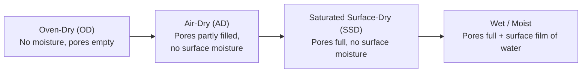

## Specific Gravity, Absorption, and Moisture Content


### Definitions and Significance

These three interrelated properties describe how aggregate particles interact with water, which governs mix proportioning, batch weight corrections, and durability assessment in concrete and asphalt production.

- **Specific gravity (SG)**: The ratio of the mass (or weight) of a given volume of aggregate to the mass of an equal volume of water. Used to compute the volume occupied by aggregate in a mix design.
- **Absorption**: The increase in mass of aggregate due to water penetrating internal pore spaces, expressed as a percentage of oven-dry mass, when the aggregate is brought from oven-dry to saturated surface-dry (SSD) condition.
- **Moisture content**: The amount of free (surface) water present in an aggregate stockpile at a given time, relative to its dry mass, which must be accounted for during batching to maintain the design water-cement ratio.

### Governing Standards

- **ASTM C127** — Specific Gravity and Absorption of Coarse Aggregate
- **ASTM C128** — Specific Gravity and Absorption of Fine Aggregate
- **ASTM C566** — Total Moisture Content of Aggregate by Drying
- **ASTM C70** — Surface Moisture in Fine Aggregate
- **AASHTO T84 / T85** — AASHTO equivalents of C128 / C127

### Moisture Condition States of Aggregate

Aggregate moisture condition is classified into four states, critical for correct water-cement ratio calculation:



- **Oven-dry (OD)**: Fully dried in an oven at 110 ± 5 °C to constant mass; pores are empty.
- **Air-dry (AD)**: Dried at ambient conditions; internal pores partially filled, no surface moisture.
- **Saturated surface-dry (SSD)**: Internal pores are completely filled with water, but no free water exists on the particle surface. This is the reference condition used in most mix-design SG calculations because it represents neither a net absorption nor a net release of mixing water.
- **Wet (moist)**: Pores are saturated and an additional film of surface water is present; this surface water contributes to the mix water and must be subtracted during batch adjustment.

### Types of Specific Gravity

$$G_{sb} \text{ (Bulk SG, oven-dry)} = \frac{W_{OD}}{W_{SSD} - W_{sub}}$$


$$G_{sb,SSD} \text{ (Bulk SG, SSD basis)} = \frac{W_{SSD}}{W_{SSD} - W_{sub}}$$


$$G_{sa} \text{ (Apparent SG)} = \frac{W_{OD}}{W_{OD} - W_{sub}}$$

Where:

- $W_{OD}$ = mass of oven-dry sample
- $W_{SSD}$ = mass of saturated surface-dry sample
- $W_{sub}$ = mass of saturated sample submerged in water (buoyant mass)

**Interpretation**:

- **Bulk specific gravity (oven-dry basis, $G_{sb}$)**: Includes both permeable and impermeable voids in the particle volume; most commonly used for volumetric mix design (e.g., PCC and asphalt).
- **Bulk specific gravity (SSD basis)**: Same volume basis as $G_{sb}$ but based on SSD mass; used when the aggregate is batched in SSD condition.
- **Apparent specific gravity ($G_{sa}$)**: Excludes permeable pore volume, considering only the solid material and impermeable voids; always higher than $G_{sb}$ since it excludes absorbed water volume.

Typical values for normal-weight aggregates range from 2.4 to 2.9; lightweight aggregates are below 2.2; heavyweight aggregates (e.g., magnetite, barite) exceed 3.0.

### Absorption Calculation

$$\text{Absorption} (\%) = \frac{W_{SSD} - W_{OD}}{W_{OD}} \times 100$$

Typical absorption values:

- Normal-weight natural aggregates: 0.5–2%
- Some lightweight or porous aggregates: 5–20%

[Inference] Higher absorption generally correlates with higher porosity and potentially lower freeze-thaw durability, though the relationship is influenced by pore structure (pore size distribution and connectivity), not absorption percentage alone.

### Test Procedure — Coarse Aggregate (ASTM C127)

1. Wash sample to remove dust/fine coatings; soak in water for 24 ± 4 hours.
2. Remove surface moisture with a towel to achieve SSD condition; weigh ($W_{SSD}$).
3. Determine submerged (buoyant) mass in a water-filled container using a wire basket ($W_{sub}$).
4. Oven-dry the sample at 110 ± 5 °C to constant mass; weigh ($W_{OD}$).
5. Apply the SG and absorption formulas above.

### Test Procedure — Fine Aggregate (ASTM C128)

1. Soak sample for 24 ± 4 hours, then spread to air-dry.
2. Perform the **cone test** to verify SSD condition: place moist sand loosely into a metal cone, tamp lightly (25 drops with a tamper), and lift the cone. SSD is confirmed when the sand slumps slightly but retains a peaked shape after removal (a mold that stands perfectly with sharp edges indicates excess surface moisture, while immediate total collapse indicates the sample is too dry).
3. Weigh a specific SSD mass into a pycnometer (volumetric flask), fill with water to a calibration mark, and record mass.
4. Oven-dry the sample and weigh again for $W_{OD}$.
5. Compute SG and absorption using the pycnometer method equations analogous to C127.

$$G_{sb} = \frac{W_{OD}}{V_p - (M_{p+SSD+w} - M_{p+SSD})}$$

Where $V_p$ is pycnometer volume (as calibrated mass of water at test temperature), $M_{p+SSD+w}$ is the mass of pycnometer + SSD sample + water to calibration mark, and $M_{p+SSD}$ is the mass of pycnometer + SSD sample.

### Moisture Content Determination (ASTM C566)

$$\text{Moisture Content} (\%) = \frac{W_{moist} - W_{OD}}{W_{OD}} \times 100$$

This is a field/QC test performed to determine total moisture present in a stockpile sample (surface moisture + absorbed moisture), typically via microwave-oven, hot-plate, or standard-oven drying of a representative sample.

### Free (Surface) Moisture and Batch Water Correction

Free moisture is the portion of total moisture in excess of the SSD condition:

$$\text{Free Moisture} (\%) = \text{Total Moisture Content} (\%) - \text{Absorption} (\%)$$

This value is essential in concrete batching because:

1. **Excess batch water**: If aggregate carries free moisture, it contributes water to the mix beyond the design water-cement ratio; this must be subtracted from the added mixing water.
2. **Aggregate mass correction**: Because stockpile aggregate mass includes free water, the batch weight of aggregate must be adjusted upward to deliver the correct dry mass.

**Batch Water Adjustment Formula**:

$$\text{Adjusted Mixing Water} = \text{Design Water} - \left(\text{Free Moisture}_{coarse} \times W_{coarse,OD}\right) - \left(\text{Free Moisture}_{fine} \times W_{fine,OD}\right)$$

**Batch Aggregate Mass Adjustment**:

$$W_{field} = W_{OD} \times (1 + \text{Total Moisture Content})$$

### Practical Example

A concrete batch plant tests fine aggregate stockpile moisture before a pour:

- Absorption capacity (from ASTM C128, lab test): 1.2%
- Field total moisture content (from ASTM C566, oven-dry test on stockpile sample): 4.5%

$$\text{Free Moisture} = 4.5\% - 1.2\% = 3.3\%$$

If the mix design calls for 600 kg of oven-dry fine aggregate per batch and 180 kg of mixing water:

$$\text{Water Contributed by Aggregate} = 600 \times 0.033 = 19.8 \text{ kg}$$


$$\text{Adjusted Mixing Water} = 180 - 19.8 = 160.2 \text{ kg}$$


$$\text{Field Batch Mass of Aggregate} = 600 \times (1 + 0.045) = 627 \text{ kg}$$

This ensures the water-cement ratio and total aggregate volume in the field match the laboratory mix design intent.

### SSD Cone Test Illustration

<svg xmlns="http://www.w3.org/2000/svg" viewBox="0 0 500 300">
<text x="250" y="22" text-anchor="middle" font-size="15" font-weight="bold" fill="#1a1a1a">Fine Aggregate SSD Cone Test — Slump Patterns (svg_diagram)</text>
<g font-family="sans-serif" font-size="12" fill="#1a1a1a">
<text x="90" y="55" text-anchor="middle" font-weight="bold">Too Wet</text>
<polygon points="60,220 120,220 100,90 80,90" fill="#93c5fd" stroke="#1e3a8a" stroke-width="1.5" />
<text x="90" y="240" text-anchor="middle">Holds sharp<br />cone shape</text>
<text x="90" y="255" text-anchor="middle" font-size="11">(excess surface water)</text>



```
<text x="250" y="55" text-anchor="middle" font-weight="bold">SSD (Correct)</text>
<polygon points="220,220 280,220 260,110 275,220" fill="#86efac" stroke="#166534" stroke-width="1.5" />
<polygon points="220,220 280,220 260,110 245,220" fill="#86efac" stroke="#166534" stroke-width="1.5" />
<path d="M 225 200 Q 250 130 270 200" fill="none" stroke="#166534" stroke-width="2" />
<text x="250" y="240" text-anchor="middle">Slumps, retains</text>
<text x="250" y="255" text-anchor="middle" font-size="11">a peaked shape</text>

<text x="410" y="55" text-anchor="middle" font-weight="bold">Too Dry</text>
<path d="M 380 210 L 440 210 L 430 200 L 390 200 Z" fill="#fca5a5" stroke="#7f1d1d" stroke-width="1.5" />
<text x="410" y="240" text-anchor="middle">Collapses</text>
<text x="410" y="255" text-anchor="middle" font-size="11">(sub-SSD, no cohesion)</text>
```

</g>
</svg>

### Effect of Aggregate Moisture State on Concrete Mix Design

| Moisture State | Effect if Not Corrected |
| --- | --- |
| Oven-dry aggregate batched without adjustment | Aggregate absorbs mix water, reducing effective w/c ratio, potential workability loss |
| Wet aggregate batched without adjustment | Excess free water increases effective w/c ratio, reducing strength and increasing bleeding/segregation risk |
| SSD (reference condition) | No net water exchange; used as design basis in ACI 211.1 mix proportioning |

### Relationship to Durability

- Aggregates with high absorption may be more susceptible to freeze-thaw damage if the pore structure allows water to occupy a large percentage of pore volume before freezing, since ice expansion within saturated pores can generate internal pressure. [Inference — the extent of resulting deterioration depends on pore size distribution, degree of saturation, and the aggregate's tensile strength, not solely on the absorption percentage.]
- Specific gravity variation within a source can indicate the presence of weak, porous, or unsound particles requiring further evaluation (e.g., via soundness testing, ASTM C88).

### Common Errors and Precautions

- **Incomplete surface drying** in SSD determination (coarse aggregate) leads to overestimated SSD mass and skewed absorption values.
- **Over- or under-tamping** in the fine aggregate cone test produces a false SSD read; operator judgment/experience affects repeatability. [Inference — results depend on operator technique consistency, which is a recognized source of variability in this specific test method.]
- **Temperature effects on pycnometer calibration**: Water density varies with temperature; pycnometer volume/mass calibration must correspond to the test temperature.
- **Stockpile segregation**: Moisture content can vary significantly with depth and location in a stockpile (surface vs. core); sampling protocol (ASTM D75) must ensure a representative sample.

### Applications in Civil Engineering

- **Concrete mix design (ACI 211.1)**: SG determines the absolute volume of aggregate in a mix design; absorption and moisture content correct batch quantities.
- **Asphalt mix design (Superpave)**: $G_{sb}$, $G_{sa}$, and effective specific gravity ($G_{se}$) are used to calculate air voids, VMA, and asphalt absorption into aggregate.
- **Quality control at batch plants**: Daily/per-shift moisture testing on stockpiles ensures consistent water-cement ratio across production.
- **Lightweight concrete design**: Because lightweight aggregates have significantly higher absorption, pre-wetting protocols are often required to prevent excessive mix-water loss.

**Related Topics**

- Bulk, Apparent, and Effective Specific Gravity in Asphalt Mix Design
- ACI 211.1 Concrete Mix Proportioning Procedure
- Aggregate Soundness and Durability Testing (ASTM C88)
- Lightweight Aggregate Pre-Wetting Procedures
- Aggregate Sampling Methods for Stockpiles (ASTM D75)
- Effect of Aggregate Moisture on Slump and Workability
- Bulking of Fine Aggregate Due to Surface Moisture