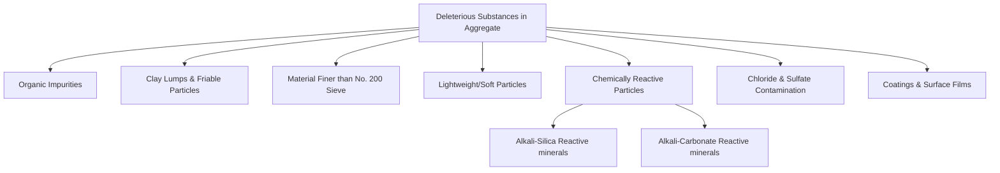

## Deleterious Substances and Soundness


### Definitions and Significance

**Deleterious substances** are harmful materials present in aggregate — either as contaminants or as inherent weak/reactive particle types — that can compromise the strength, durability, workability, or appearance of concrete and asphalt. **Soundness** refers to an aggregate's ability to resist volumetric change and disintegration caused by weathering actions, most critically freeze-thaw cycling and wetting-drying cycling, without excessive degradation. Both properties are assessed to ensure long-term serviceability of the finished construction material, since even aggregates that pass strength and gradation requirements can cause premature failure if contaminated or unsound.

### Governing Standards

- **ASTM C33 / C33M** — Standard Specification for Concrete Aggregates (deleterious substance limits)
- **ASTM C88 / C88M** — Soundness of Aggregates by Use of Sodium Sulfate or Magnesium Sulfate
- **ASTM C142** — Clay Lumps and Friable Particles in Aggregates
- **ASTM C123** — Lightweight Particles in Aggregate
- **ASTM C40** — Organic Impurities in Fine Aggregates for Concrete
- **ASTM C117** — Materials Finer than 75 µm (No. 200) Sieve
- **ASTM C295** — Petrographic Examination of Aggregates for Concrete
- **ASTM C1260 / C1293** — Alkali-Silica Reactivity (accelerated mortar bar / concrete prism)
- **AASHTO T103** — Soundness of Aggregate by Freezing and Thawing

### Categories of Deleterious Substances



**1. Organic impurities** (ASTM C40): Decayed vegetable/humus material in fine aggregate that interferes with cement hydration, retarding setting and reducing strength. Detected via the colorimetric test, comparing sample color against a standard reference color (glass color standards or Gardner color standard solutions) after treatment with sodium hydroxide solution.

**2. Clay lumps and friable particles** (ASTM C142): Soft, weakly cemented particles that break down easily during mixing or under load, creating voids or weak points, and potentially causing pop-outs at the concrete surface. Determined by wet-sieving and manually breaking suspect particles with fingers.

**3. Material finer than the No. 200 sieve (silt/clay fines)** (ASTM C117): Excess fines increase water demand, coat aggregate surfaces (reducing paste-aggregate bond), and can affect workability and finishing.

**4. Lightweight particles** (ASTM C123): Includes coal, lignite, or low-density rock fragments that can cause surface pop-outs, staining, or reduced durability; identified using heavy liquid separation (sink-float method).

**5. Chemically reactive particles**: Certain silica minerals (e.g., opal, chalcedony, strained quartz, some volcanic glasses) react with alkali hydroxides in cement pore solution, producing an expansive gel — **alkali-silica reaction (ASR)**. Certain dolomitic limestones can cause **alkali-carbonate reaction (ACR)**, another expansive mechanism.

**6. Chloride and sulfate contamination**: Chlorides (e.g., from marine-derived or contaminated aggregates) promote corrosion of embedded reinforcing steel; sulfates can react with cement hydration products, causing expansive deterioration.

**7. Surface coatings**: Clay, dust, or mineral films on aggregate surfaces weaken the bond between aggregate and cement paste.

### Typical ASTM C33 Deleterious Substance Limits (Fine Aggregate, Concrete Exposed to Weathering)

| Substance | Maximum Allowable (%, by mass) |
| --- | --- |
| Clay lumps and friable particles | 3.0 |
| Material finer than No. 200 sieve | 3.0 (may be higher for manufactured sand, subject to specification) |
| Coal and lignite | 0.5–1.0 (depending on surface-appearance importance) |

[Inference] These limits vary between concrete exposure classes and specifying agencies (e.g., DPWH, AASHTO, project-specific specifications), so the governing project specification should be consulted for exact acceptance thresholds rather than relying on generic tabulated values.

### Alkali-Silica Reaction (ASR) Mechanism

$$\text{Reactive Silica} + \text{Alkali Hydroxides (NaOH, KOH)} \rightarrow \text{Alkali-Silica Gel}$$

The gel absorbs moisture and expands, generating internal tensile stresses that exceed the tensile capacity of concrete, producing characteristic map/pattern cracking, gel exudation, and expansion-related structural distress. [Inference] Field distress severity depends on reactive mineral content, alkali availability in pore solution, ambient moisture exposure, and structure geometry, not on a single test value alone.

**Detection/testing methods**:

- **ASTM C1260** (accelerated mortar bar test): Fast (16-day) screening test using mortar bars stored in NaOH solution at elevated temperature; expansion beyond a threshold flags potential reactivity.
- **ASTM C1293** (concrete prism test): Longer-duration (up to 1–2 years) test under more realistic conditions, generally considered more representative of field behavior.
- **ASTM C295**: Petrographic examination identifies reactive mineral phases visually/microscopically.

**Mitigation measures**: Use of supplementary cementitious materials (fly ash, slag, silica fume) to reduce available alkalis and pore solution reactivity, use of low-alkali cement, lithium-based admixtures, or blending with non-reactive aggregate sources.

### Soundness Testing (ASTM C88 — Sulfate Soundness Test)

Evaluates resistance to disintegration from repeated wetting-drying and crystallization pressure, simulating freeze-thaw-like weathering without the time/cost of actual freeze-thaw cycling.

**Procedure**:

1. Aggregate sample is separated into specified size fractions.
2. Sample is immersed in a saturated solution of sodium sulfate (Na₂SO₄) or magnesium sulfate (MgSO₄) for a specified period (typically 16–18 hours).
3. Sample is removed, oven-dried, and the cycle is repeated for a specified number of cycles (commonly 5).
4. Salt crystals forming within pore spaces during drying exert internal expansive pressure, simulating the pressure exerted by ice formation during natural freeze-thaw cycling.
5. After completing all cycles, the sample is washed to remove residual salts, dried, and re-sieved.

$$\text{Weighted \% Loss} = \sum \left(\frac{\text{Mass loss on size fraction}}{\text{Original mass of size fraction}} \times \text{Grading factor}\right)$$

**Typical ASTM C33 acceptance limits**:

- Magnesium sulfate: ≤ 18% loss (severe exposure), ≤ 15% (varies by specification)
- Sodium sulfate: ≤ 12% loss (severe exposure), ≤ 10% (varies by specification)

[Inference] Magnesium sulfate solution generally produces more aggressive/higher mass loss results than sodium sulfate on the same material due to differing crystal growth pressures; consequently, the two salts carry different acceptance thresholds in most specifications.

### Freeze-Thaw Soundness (AASHTO T103)

An alternative or supplementary method that directly subjects aggregate samples to a specified number of actual freezing and thawing cycles in water or another prescribed medium, measuring mass loss or degradation directly rather than relying on the sulfate crystallization analog.

### Soundness Test Illustration

<svg xmlns="http://www.w3.org/2000/svg" viewBox="0 0 600 260">
<text x="300" y="22" text-anchor="middle" font-size="15" font-weight="bold" fill="#1a1a1a">Sulfate Soundness Test Cycle (svg_diagram)</text>
<g font-family="sans-serif" font-size="12" fill="#1a1a1a">
<rect x="30" y="60" width="120" height="60" rx="6" fill="#dbeafe" stroke="#1e3a8a" stroke-width="1.5" />
<text x="90" y="85" text-anchor="middle">Immerse in</text>
<text x="90" y="100" text-anchor="middle">Na₂SO₄ / MgSO₄</text>
<text x="90" y="115" text-anchor="middle" font-size="10">(16-18 hrs)</text>



```
<path d="M 150 90 L 190 90" stroke="#334155" stroke-width="2" marker-end="url(#arrow1)" />

<rect x="195" y="60" width="120" height="60" rx="6" fill="#fef9c3" stroke="#854d0e" stroke-width="1.5" />
<text x="255" y="85" text-anchor="middle">Oven-Dry</text>
<text x="255" y="100" text-anchor="middle" font-size="10">Salt crystallizes</text>
<text x="255" y="115" text-anchor="middle" font-size="10">in pores</text>

<path d="M 315 90 L 355 90" stroke="#334155" stroke-width="2" marker-end="url(#arrow1)" />

<rect x="360" y="60" width="120" height="60" rx="6" fill="#fecaca" stroke="#7f1d1d" stroke-width="1.5" />
<text x="420" y="85" text-anchor="middle">Crystal Growth</text>
<text x="420" y="100" text-anchor="middle" font-size="10">Expansive pressure</text>
<text x="420" y="115" text-anchor="middle" font-size="10">weakens particle</text>

<path d="M 420 120 L 420 150 L 90 150 L 90 120" stroke="#334155" stroke-width="2" fill="none" marker-end="url(#arrow1)" />
<text x="255" y="170" text-anchor="middle" font-size="11">Repeat 5 cycles</text>

<rect x="195" y="190" width="210" height="50" rx="6" fill="#dcfce7" stroke="#166534" stroke-width="1.5" />
<text x="300" y="212" text-anchor="middle">Wash, dry, re-sieve →</text>
<text x="300" y="228" text-anchor="middle">compute % mass loss</text>

<path d="M 90 120 L 90 165 L 195 215 L 195 215" stroke="#334155" stroke-width="0" fill="none" />
<path d="M 90 120 L 90 215 L 195 215" stroke="#334155" stroke-width="2" fill="none" marker-end="url(#arrow1)" />

</g>
</svg>

### Other Soundness-Related Indicators

- **Petrographic examination (ASTM C295)**: Microscopic and macroscopic evaluation identifying mineral composition, weathering state, presence of reactive silica, and potential for unsoundness prior to or alongside physical testing.
- **Los Angeles Abrasion (ASTM C131/C535)**: While primarily a toughness/abrasion resistance test, low abrasion resistance often correlates with weaker particles that also tend to be less sound, though the two properties are tested independently.
- **Freeze-thaw durability factor** in hardened concrete (ASTM C666): A downstream, hardened-concrete-level test that reflects both aggregate soundness and concrete mix design/air-entrainment adequacy.

### Practical Example

A quarry submits coarse aggregate for a bridge deck project with a severe freeze-thaw exposure classification. Test results:

- Magnesium sulfate soundness loss: 22%
- Specification limit (severe exposure, MgSO₄): 18%
- Clay lumps and friable particles: 1.8% (limit: 3.0% — passes)
- ASR screening (ASTM C1260) 16-day expansion: 0.08% (limit: typically 0.10% for innocuous behavior — passes)

**Assessment**: The aggregate fails the soundness requirement despite passing clay-lump and ASR screening, and would be rejected or require blending with a more sound aggregate source, since sulfate soundness governs long-term freeze-thaw resistance independently of reactivity or friable-particle content.

### Mitigation and Corrective Measures

- **Aggregate source substitution or blending**: Combining a marginal aggregate with a higher-quality source to bring composite properties within specification.
- **Beneficiation**: Washing to remove excess fines/clay, or air/heavy-media separation to remove lightweight/soft particles.
- **Mix design adjustments**: Air entrainment to accommodate internal freeze-thaw pressure relief (for concrete durability, independent of aggregate soundness itself).
- **Use of supplementary cementitious materials**: To mitigate ASR risk when marginally reactive aggregate must be used.

### Applications in Civil Engineering

- **Aggregate source qualification**: Soundness and deleterious substance testing are typically required before a quarry/pit source is approved for a project.
- **Exposure-class-based specification**: Structures exposed to severe freeze-thaw, deicing chemicals, or marine environments impose stricter deleterious-substance and soundness limits than protected/interior applications.
- **Forensic investigation**: Distress in existing structures (map cracking, pop-outs, gel exudation, scaling) is often traced back to deleterious substances or unsound aggregate through petrographic and soundness testing.
- **Pavement and bridge deck design**: ASR and freeze-thaw soundness are especially critical given prolonged environmental exposure and safety-critical service life expectations.

**Related Topics**

- Alkali-Silica Reaction Mechanisms and Mitigation Strategies
- Petrographic Examination of Aggregates (ASTM C295)
- Los Angeles Abrasion and Aggregate Toughness Testing
- Freeze-Thaw Durability of Hardened Concrete (ASTM C666)
- Air Entrainment in Concrete for Freeze-Thaw Resistance
- Aggregate Source Approval and Quarry Qualification Procedures
- Supplementary Cementitious Materials and ASR Mitigation
- Chloride and Sulfate Contamination Limits in Aggregates