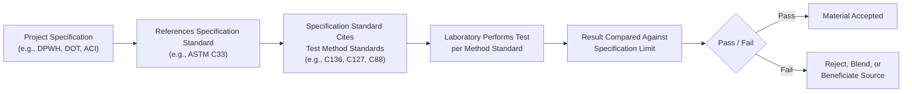
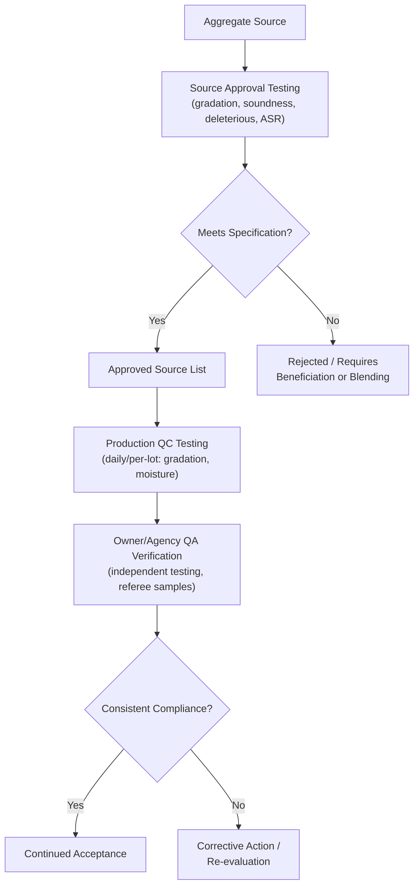

## Aggregate Testing Standards

### Purpose and Scope

Aggregate testing standards provide standardized, repeatable procedures for evaluating the physical, mechanical, and chemical properties of aggregates used in concrete, asphalt, and unbound pavement layers. Standardization ensures that test results are comparable across laboratories, suppliers, and jurisdictions, forming the technical basis for specification compliance, source approval, and quality control/quality assurance (QC/QA) programs throughout a project's lifecycle.

### Major Standards-Development Organizations

- **ASTM International** — Predominant standard in the United States and widely referenced internationally; organized by committee (aggregates fall primarily under Committee C09 — Concrete and Concrete Aggregates, and D04 — Road and Paving Materials).
- **AASHTO** (American Association of State Highway and Transportation Officials) — Standards largely paralleling ASTM but tailored for transportation infrastructure; commonly adopted by U.S. state departments of transportation (DOTs).
- **BS EN** (British Standards / European Norms) — Used across the UK and EU (e.g., BS EN 933 series for geometrical properties, BS EN 1097 series for mechanical/physical properties).
- **ISO** (International Organization for Standardization) — Provides internationally harmonized methods, though ASTM/AASHTO or BS EN standards are often the governing references in national specifications.
- **National/local codes**: Many countries maintain adapted standards or reference international ones directly with regional amendments (e.g., the Philippines' DPWH Standard Specifications reference AASHTO and ASTM methods with local modifications).

### Classification of Aggregate Test Standards by Property Category

```mermaid
graph TD
    A[Aggregate Testing Standards] --> B[Physical/Geometric Properties]
    A --> C[Mechanical Properties]
    A --> D[Durability & Soundness]
    A --> E[Chemical/Deleterious Content]
    A --> F[Specification & Sampling]

    B --> B1["ASTM C136 — Sieve Analysis"]
    B --> B2["ASTM C127/C128 — Specific Gravity & Absorption"]
    B --> B3["ASTM C29 — Bulk Density & Voids"]
    B --> B4["ASTM D4791 — Flat & Elongated Particles"]

    C --> C1["ASTM C131/C535 — LA Abrasion"]
    C --> C2["ASTM C1252 — Uncompacted Void Content (Fine Agg.)"]
    C --> C3["ASTM D5821 — Fractured Particle Count"]

    D --> D1["ASTM C88 — Sulfate Soundness"]
    D --> D2["AASHTO T103 — Freeze-Thaw Soundness"]
    D --> D3["ASTM C666 — Freeze-Thaw of Concrete"]

    E --> E1["ASTM C40 — Organic Impurities"]
    E --> E2["ASTM C142 — Clay Lumps & Friable Particles"]
    E --> E3["ASTM C1260/C1293 — Alkali-Silica Reactivity"]
    E --> E4["ASTM C295 — Petrographic Examination"]

    F --> F1["ASTM C33 — Concrete Aggregate Specification"]
    F --> F2["ASTM D75/C702 — Sampling"]
    F --> F3["ASTM C702 — Reducing Samples to Test Size"]
```

### Core Standards Summary Table

| Standard | Property Measured | Typical Application |
| --- | --- | --- |
| ASTM C136 / AASHTO T27 | Particle-size distribution (gradation) | Mix design, specification compliance |
| ASTM C117 | Material finer than No. 200 sieve | Fines content control |
| ASTM C127 / AASHTO T85 | Specific gravity & absorption (coarse) | Mix design, batch correction |
| ASTM C128 / AASHTO T84 | Specific gravity & absorption (fine) | Mix design, batch correction |
| ASTM C566 | Total moisture content | Field batch water adjustment |
| ASTM C29 | Bulk (unit weight) density and voids | Volume-to-mass conversion, mix yield |
| ASTM C131 / C535 | Los Angeles abrasion resistance | Toughness/degradation resistance |
| ASTM C88 | Sulfate soundness | Weathering/durability resistance |
| ASTM C40 | Organic impurities (fine aggregate) | Cement hydration interference screening |
| ASTM C142 | Clay lumps & friable particles | Weak-particle content |
| ASTM C123 | Lightweight particles | Surface defect/pop-out risk |
| ASTM C1260 / C1293 | Alkali-silica reactivity | ASR risk screening |
| ASTM C295 | Petrographic examination | Mineralogical/qualitative assessment |
| ASTM D4791 | Flat and elongated particles | Shape/particle geometry control (esp. asphalt) |
| ASTM D5821 | Percentage of fractured particles | Crushed-face content for asphalt/base course |
| ASTM C1252 / AASHTO T304 | Uncompacted void content of fine aggregate | Angularity/shape indirect indicator |
| ASTM D75 / AASHTO T2 | Sampling of aggregates | Representative sample collection |
| ASTM C702 | Reducing field samples to testing size | Sample splitting/quartering |
| ASTM C33 / C33M | Concrete aggregate specification (umbrella) | Overall acceptance criteria |
| AASHTO M43 | Standard sizes of coarse aggregate | Size classification |

### Specification Standards vs. Test Method Standards

An important distinction within the standards ecosystem:

- **Test method standards** (e.g., ASTM C136, C127, C88) define *how* to perform a test — apparatus, procedure, calculation, and reporting format — without stating pass/fail criteria.
- **Specification standards** (e.g., ASTM C33, AASHTO M6/M80) define *acceptance criteria* — the numerical limits a material must meet — by referencing the applicable test methods.

This separation allows a single test method to be referenced by multiple specifications (e.g., different agencies may cite ASTM C88 but apply different sulfate-soundness loss limits).

### Standard Referencing Workflow

### AASHTO vs. ASTM — Key Relationship

Many AASHTO standards are technically and procedurally near-identical to their ASTM counterparts, since AASHTO standards were historically derived from or harmonized with ASTM methods for highway/transportation use. Differences, when present, typically involve:

- Minor procedural specifics tailored to pavement/transportation applications
- Different rounding, sample size, or reporting conventions in some cases
- Different specification limits even when citing the same underlying test method

[Inference] Because both organizations periodically revise their standards independently, engineers should verify the specific edition/year referenced by the governing project specification, since procedural details or acceptance limits can change between revisions.

### International Standard Comparison (Illustrative)

| Property | ASTM/AASHTO | BS EN Equivalent |
| --- | --- | --- |
| Particle size distribution | ASTM C136 / AASHTO T27 | BS EN 933-1 |
| Flakiness index | ASTM D4791 (flat/elongated ratio) | BS EN 933-3 |
| Los Angeles abrasion | ASTM C131 | BS EN 1097-2 |
| Specific gravity & absorption | ASTM C127/C128 | BS EN 1097-6 |
| Sulfate soundness | ASTM C88 | BS EN 1367-2 (magnesium sulfate) |

[Inference] While these standards address analogous properties, test procedures, sample conditioning, and index calculations differ enough that direct numerical equivalence between ASTM/AASHTO and BS EN results should not be assumed without a documented correlation, since methodology-driven differences are well recognized in comparative studies of aggregate standards.

### Sampling and Sample Reduction Standards

Reliable testing depends on the integrity of the sample obtained before any test is run:

- **ASTM D75 / AASHTO T2**: Governs how field samples are collected from stockpiles, conveyor belts, or transport units to ensure representativeness (minimizing segregation bias).
- **ASTM C702**: Governs reduction of a larger field sample down to the smaller mass required for a specific test, via mechanical splitting (riffle splitter) or manual quartering.

Improper sampling is a well-recognized source of variability that can invalidate otherwise correctly performed laboratory procedures, since a non-representative sample cannot yield representative results regardless of testing precision.

### Quality Control and Quality Assurance (QC/QA) Framework

- **Source approval testing**: Comprehensive one-time (or periodic) testing to qualify a quarry/pit as an approved material source.
- **Production QC testing**: Ongoing testing performed by the producer/contractor during production (e.g., daily gradation checks, moisture testing per batch).
- **Owner/agency QA testing**: Independent verification testing performed by or on behalf of the owning agency to confirm the producer's QC results, sometimes via split or referee samples.

### Practical Example — Standard Selection for a Project

A highway pavement base-course project in a jurisdiction following AASHTO/DPWH-referenced specifications requires the following test battery for source approval:

| Requirement | Standard | Purpose |
| --- | --- | --- |
| Gradation within specified band | AASHTO T27 | Confirm particle-size distribution suitability |
| LA Abrasion ≤ specified max loss | ASTM C131 | Confirm resistance to degradation under compaction/traffic |
| Sulfate soundness ≤ specified max loss | ASTM C88 | Confirm freeze-thaw/weathering resistance |
| Plasticity index within limit (fines) | AASHTO T90 | Confirm fines are non-plastic or within tolerance |
| Fractured face percentage ≥ specified min | ASTM D5821 | Confirm adequate interlock/shear resistance |

Only after all specified test results fall within the governing specification's acceptance ranges is the source formally approved for supply to the project.

### Common Pitfalls in Standards Application

- **Citing an outdated standard revision**: Test methods are periodically revised; a specification referencing "ASTM C88" without a year may default to the current edition, while contract documents from years prior may reference now-superseded editions with different procedures or limits.
- **Conflating test method and specification limits**: Running a test correctly per its method standard does not by itself indicate compliance — the result must still be checked against the applicable specification standard's numerical limits.
- **Mixing standards from different systems**: Applying an AASHTO acceptance limit to a result obtained under a BS EN test procedure (or vice versa) without a validated correlation can produce a misleading compliance determination.

### Applications in Civil Engineering

- **Design specification writing**: Engineers reference specific standards (by designation and often by year) within project specifications to define acceptable aggregate quality.
- **Material source qualification**: Contractors and suppliers use these standards to demonstrate compliance before a source is approved for project use.
- **Forensic and dispute resolution**: When material-related failures occur, the applicable test standards form the basis for determining whether the supplied aggregate met contractual requirements at the time of testing.
- **Cross-border/international projects**: Understanding the relationship between ASTM/AASHTO and BS EN/ISO systems is necessary when specifications, contractors, or materials originate from different regulatory environments.

**Related Topics**

- ASTM C33 Concrete Aggregate Specification in Detail
- AASHTO Standard Specifications for Transportation Materials
- Sampling and Sample Reduction Procedures (ASTM D75 / C702)
- Los Angeles Abrasion Test Procedure and Interpretation
- Quality Control vs. Quality Assurance in Construction Materials
- BS EN Aggregate Testing Standards Overview
- Source Approval Processes for Aggregate Suppliers
- Standard Revision Tracking and Version Control in Specifications