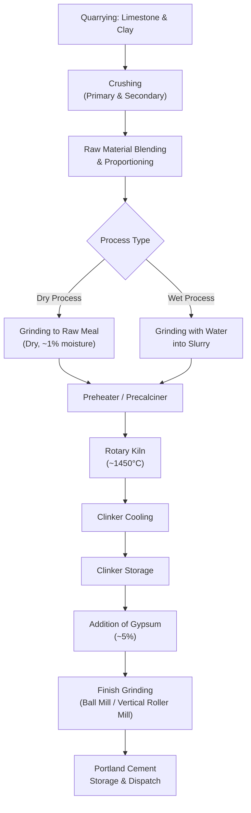

## Portland Cement Manufacturing

### Definition and Overview

Portland cement is a hydraulic binder produced by grinding clinker — a product formed by heating a precisely proportioned mixture of calcareous (lime-rich) and argillaceous (clay/silica-rich) raw materials to partial fusion — together with a small quantity of gypsum. The manufacturing process transforms raw minerals into a reactive powder that hydrates with water to form a hardened, strength-bearing binder matrix, forming the basis of nearly all modern concrete construction.

### Governing Standards

- **ASTM C150 / C150M** — Standard Specification for Portland Cement
- **ASTM C595** — Standard Specification for Blended Hydraulic Cements
- **ASTM C1157** — Performance Specification for Hydraulic Cement
- **EN 197-1** — European cement classification standard
- **ASTM C114** — Standard Test Methods for Chemical Analysis of Hydraulic Cement

### Raw Materials

| Component | Typical Source | Primary Oxide Contribution |
| --- | --- | --- |
| Limestone | Quarried calcium carbonate rock | CaO (lime) |
| Clay / Shale | Argillaceous deposits | SiO₂, Al₂O₃ |
| Iron ore / Mill scale | Iron-bearing minerals or industrial byproduct | Fe₂O₃ |
| Sand / Silica sources | Silica-rich correction material | SiO₂ (as needed) |
| Gypsum | Natural gypsum or synthetic (FGD) gypsum | CaSO₄·2H₂O (added post-clinkering) |

The bulk raw material proportion is approximately 80–85% limestone and 15–20% clay/shale and correction materials, blended to meet target oxide ratios before kiln feed.

### Manufacturing Process Overview

### Process Routes: Dry vs. Wet Process

- **Dry process** (dominant modern method): Raw materials are dried and ground into a fine, dry raw meal before entering the kiln system. Requires significantly less fuel energy per ton of clinker because no water needs to be evaporated in the kiln, making it the standard in nearly all modern cement plants.
- **Wet process** (largely legacy technology): Raw materials are ground with water into a pumpable slurry, which is then fed into a longer rotary kiln where water must first be evaporated before calcination can proceed. This process consumes substantially more fuel per ton of clinker than the dry process and has been phased out in most new plant construction.

[Inference] The choice between routes in older or region-specific plants may reflect historical raw-material moisture content, capital constraints at the time of construction, or local raw material characteristics rather than current best-practice preference, since the dry process is now the recognized energy-efficient standard.

### Stage 1: Quarrying and Crushing

Raw limestone and clay are extracted via blasting or mechanical excavation, then reduced through primary (jaw or gyratory) and secondary (impact or cone) crushers to particle sizes typically below 25 mm, suitable for further grinding and blending.

### Stage 2: Raw Meal Preparation and Proportioning

Crushed materials are proportioned according to target chemical ratios and ground (in a raw mill, typically a ball mill or vertical roller mill) into a fine raw meal or slurry. Proportioning targets specific modulus values used to control clinker mineralogy:

$$\text{Lime Saturation Factor (LSF)} = \frac{100 \times \text{CaO}}{2.8\text{SiO}_2 + 1.2\text{Al}_2\text{O}_3 + 0.65\text{Fe}_2\text{O}_3}$$

$$\text{Silica Ratio (SR)} = \frac{\text{SiO}_2}{\text{Al}_2\text{O}_3 + \text{Fe}_2\text{O}_3}$$

$$\text{Alumina Ratio (AR)} = \frac{\text{Al}_2\text{O}_3}{\text{Fe}_2\text{O}_3}$$

These ratios are controlled within target ranges to achieve the desired balance of clinker phases and to ensure adequate burnability (ease of clinker formation) in the kiln.

### Stage 3: Preheating and Precalcination

In modern dry-process plants, raw meal passes through a multi-stage cyclone preheater tower, where hot kiln exhaust gases progressively heat the meal (to roughly 800–900 °C) before it enters the kiln, and often through a precalciner where a substantial portion of calcination (limestone decomposition) occurs before the material even reaches the rotary kiln itself. This significantly reduces the thermal load on the kiln proper.

$$\text{CaCO}_3 \xrightarrow{\Delta} \text{CaO} + \text{CO}_2 \uparrow$$

### Stage 4: Rotary Kiln — Clinkering

The preheated/precalcined meal enters a large, slightly inclined, rotating cylindrical kiln, where temperatures reach approximately 1450 °C at the burning (sintering) zone. Complex solid-state and partial-liquid-phase reactions occur, forming the four principal clinker minerals:

| Clinker Mineral | Chemical Formula (Cement Chemist Notation) | Approx. Typical Content | Primary Contribution |
| --- | --- | --- | --- |
| Alite (Tricalcium Silicate) | $C_3S$ | 50–70% | Early strength development |
| Belite (Dicalcium Silicate) | $C_2S$ | 15–30% | Later-age strength |
| Tricalcium Aluminate | $C_3A$ | 5–10% | Rapid initial reaction, heat of hydration; sulfate attack susceptibility |
| Tetracalcium Aluminoferrite | $C_4AF$ | 5–15% | Color (grey), minor strength contribution |

(Cement chemist notation: C = CaO, S = SiO₂, A = Al₂O₃, F = Fe₂O₃)

**Simplified key reaction (belite to alite conversion)**:

$$\text{C}_2\text{S} + \text{CaO} \rightarrow \text{C}_3\text{S}$$

This conversion requires sustained high temperature and is central to clinker quality control; incomplete conversion leaves excess free lime, which can cause volumetric instability in hardened concrete.

### Stage 5: Clinker Cooling

Upon exiting the kiln, red-hot clinker (typically 1200–1400 °C) is rapidly cooled — usually with a grate cooler using forced ambient air — to approximately 100–200 °C. Rapid cooling is critical to:

- Preserve the alite phase in a reactive crystalline form (slow cooling allows alite to decompose back toward belite and free lime)
- Recover thermal energy for use elsewhere in the plant (waste heat recovery, preheating combustion air)
- Enable safe downstream handling and storage

### Stage 6: Finish Grinding

Cooled clinker is interground with approximately 3–5% gypsum (calcium sulfate) in a finish mill (typically ball mills, though vertical roller mills and high-pressure grinding rolls are also used in modern plants) to produce the final cement powder.

**Role of gypsum**: Without gypsum, $C_3A$ would react almost instantly with water upon mixing, causing flash set (a rapid, unworkable stiffening of the paste). Gypsum reacts preferentially with $C_3A$ to form ettringite, moderating the reaction rate and allowing normal setting behavior and adequate working time.

$$\text{C}_3\text{A} + 3\text{CaSO}_4 \cdot 2\text{H}_2\text{O} + 26\text{H}_2\text{O} \rightarrow \text{C}_6\text{A}\bar{\text{S}}_3\text{H}_{32} \text{ (ettringite)}$$

Fineness of grinding directly affects reactivity and early strength development, commonly quantified via Blaine specific surface area (ASTM C204) or by sieve residue (e.g., No. 325 sieve, ASTM C430).

### Stage 7: Storage, Quality Testing, and Dispatch

Finished cement is stored in silos, sampled for quality control testing (chemical composition per ASTM C114, physical properties such as setting time per ASTM C191, compressive strength per ASTM C109, and fineness per ASTM C204/C430), and dispatched in bulk or bagged form.

### Portland Cement Types (ASTM C150)

| Type | Designation | Characteristics / Typical Use |
| --- | --- | --- |
| Type I | Normal | General-purpose construction, no special property required |
| Type II | Moderate sulfate resistance | Structures exposed to moderate sulfate soils/groundwater |
| Type III | High early strength | Rapid strength gain (e.g., cold-weather construction, fast-track projects) |
| Type IV | Low heat of hydration | Mass concrete (dams) to minimize thermal cracking |
| Type V | High sulfate resistance | Severe sulfate exposure environments |

[Inference] Type IV cement is comparatively rare in modern practice, since blended cements or supplementary cementitious materials (fly ash, slag) are now commonly used to achieve low-heat behavior in mass concrete applications instead.

### Emissions and Environmental Considerations

Portland cement manufacturing is energy- and carbon-intensive, arising from two primary sources:

1. **Calcination emissions**: The chemical decomposition of limestone releases CO₂ inherently (roughly 60% of total process emissions), independent of fuel type.
2. **Combustion emissions**: Fuel burned to reach and sustain kiln temperatures (roughly 40% of total process emissions).

**Mitigation approaches actively used in the cement industry**:

- Alternative fuels (waste-derived fuels, biomass) to displace fossil fuel combustion
- Blended cements incorporating supplementary cementitious materials (fly ash, slag, natural pozzolans) to reduce clinker factor
- Waste heat recovery for power generation within the plant
- Carbon capture research and pilot implementation at select facilities [Inference — commercial-scale deployment remains limited and technology-dependent as of publicly available industry reporting]

### Practical Example — Clinker Modulus Check

A raw meal sample yields the following oxide analysis (by mass %): CaO = 65%, SiO₂ = 21%, Al₂O₃ = 5.5%, Fe₂O₃ = 3%.

$$LSF = \frac{100 \times 65}{(2.8 \times 21) + (1.2 \times 5.5) + (0.65 \times 3)} = \frac{6500}{58.8 + 6.6 + 1.95} = \frac{6500}{67.35} \approx 96.5$$

An LSF near 95–100 is generally targeted in industry practice for well-burned, high-alite clinker; values significantly above 100 risk free-lime formation (incomplete combination) and burnability difficulty, while values well below typical targets tend to favor higher belite content and reduced early strength. [Inference — exact acceptable LSF ranges vary somewhat by plant, raw material characteristics, and target cement type.]

### Common Manufacturing Issues

- **Free lime (uncombined CaO)**: Indicates incomplete clinkering reaction; excess free lime causes delayed expansion and unsoundness in hardened concrete (tested via ASTM C151 autoclave expansion).
- **Kiln coating/buildup and ring formation**: Can disrupt material flow and thermal profile within the kiln, requiring operational intervention.
- **Raw material variability**: Fluctuation in quarry material composition requires continuous blending/proportioning control (often via X-ray fluorescence, XRF, real-time analysis) to maintain consistent clinker chemistry.
- **Over- or under-grinding at finish mill**: Affects strength development rate and water demand of the final cement.

### Applications and Downstream Relevance

- **Concrete mix design**: Cement type selection (Type I–V or blended equivalents) directly affects strength development rate, heat of hydration, and sulfate resistance in the final concrete.
- **Mass concrete construction**: Low-heat cement selection or blended cement use is critical to control thermal cracking risk in large pours (dams, foundations, mat slabs).
- **Marine and sulfate-exposed structures**: Type II/V cement selection is central to long-term durability against sulfate attack.
- **Sustainable construction**: Blended and performance-based cements (ASTM C595, C1157) are increasingly specified to reduce the embodied carbon footprint of concrete construction.

**Related Topics**

- Hydration Chemistry of Portland Cement (C-S-H Gel Formation)
- Blended and Performance Cements (ASTM C595 / C1157)
- Supplementary Cementitious Materials (Fly Ash, Slag, Silica Fume)
- Heat of Hydration and Mass Concrete Thermal Control
- Sulfate Attack Mechanisms and Resistant Cement Selection
- Cement Fineness Testing (Blaine Method, ASTM C204)
- Setting Time and Soundness Testing of Cement (ASTM C191, C151)
- Carbon Emissions Reduction Strategies in Cement Production