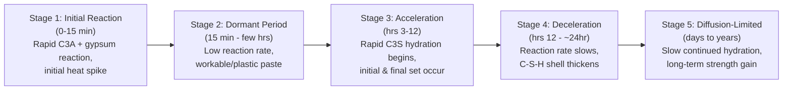

## Cement Chemistry and Hydration Reactions

### Definition and Overview

Cement hydration is the set of chemical reactions occurring when Portland cement clinker minerals react with water, producing hydration products that bind aggregate particles together and develop the strength, stiffness, and durability characteristics of hardened concrete. Understanding hydration chemistry underpins nearly every practical decision in concrete technology — mix design, curing requirements, admixture selection, and durability prediction.

### Governing Standards

- **ASTM C150 / C150M** — Standard Specification for Portland Cement (defines clinker phase composition limits by cement type)
- **ASTM C191** — Standard Test Method for Time of Setting of Hydraulic Cement by Vicat Needle
- **ASTM C109 / C109M** — Compressive Strength of Hydraulic Cement Mortars
- **ASTM C1702** — Standard Test Method for Measurement of Heat of Hydration of Hydraulic Cementitious Materials by Isothermal Calorimetry
- **ASTM C186** — Heat of Hydration of Hydraulic Cement

### Cement Chemist Notation (CCN)

Cement chemistry conventionally uses shorthand oxide notation to simplify complex formulas:

| Notation | Oxide |
| --- | --- |
| C | CaO |
| S | SiO₂ |
| A | Al₂O₃ |
| F | Fe₂O₃ |
| H | H₂O |
| $\bar{S}$ | SO₃ |

### Principal Clinker Phases and Their Hydration Behavior

| Phase | Formula (CCN) | Approx. Content | Hydration Rate | Heat of Hydration | Strength Contribution |
| --- | --- | --- | --- | --- | --- |
| Alite | $C_3S$ | 50–70% | Fast (hours to days) | High | Early strength (1–28 days) |
| Belite | $C_2S$ | 15–30% | Slow (weeks to months) | Low | Later strength (28+ days) |
| Tricalcium Aluminate | $C_3A$ | 5–10% | Very fast (minutes) | Very high | Minimal direct strength; controls setting |
| Ferrite | $C_4AF$ | 5–15% | Moderate | Moderate | Minor strength; contributes to color |

### Hydration Reaction of Alite ($C_3S$)

$$2\text{C}_3\text{S} + 6\text{H} \rightarrow \text{C}_3\text{S}_2\text{H}_3 \text{ (C-S-H gel)} + 3\text{CH (calcium hydroxide)}$$

Alite hydration is the dominant reaction governing early strength gain (first 1–28 days), releasing substantial heat and calcium hydroxide (portlandite) as a byproduct alongside the primary strength-giving calcium-silicate-hydrate (C-S-H) gel.

### Hydration Reaction of Belite ($C_2S$)

$$2\text{C}_2\text{S} + 4\text{H} \rightarrow \text{C}_3\text{S}_2\text{H}_3 \text{ (C-S-H gel)} + \text{CH}$$

Belite produces the same C-S-H gel product as alite but reacts far more slowly, contributing primarily to long-term (28-day and beyond) strength gain with comparatively lower heat release and less calcium hydroxide byproduct per unit mass reacted.

### Hydration Reaction of Tricalcium Aluminate ($C_3A$)

Without sulfate control, $C_3A$ reacts almost instantaneously with water:

$$\text{C}_3\text{A} + 6\text{H} \rightarrow \text{C}_3\text{AH}_6 \text{ (rapid, flash-set-causing reaction)}$$

With gypsum present (as interground during finish milling), the reaction is moderated via ettringite formation:

$$\text{C}_3\text{A} + 3\text{C}\bar{\text{S}}\text{H}_2 + 26\text{H} \rightarrow \text{C}_6\text{A}\bar{\text{S}}_3\text{H}_{32} \text{ (ettringite)}$$

As available gypsum is consumed, remaining $C_3A$ reacts with previously formed ettringite to form monosulfate:

$$2\text{C}_3\text{A} + \text{C}_6\text{A}\bar{\text{S}}_3\text{H}_{32} + 4\text{H} \rightarrow 3\text{C}_4\text{A}\bar{\text{S}}\text{H}_{12} \text{ (monosulfate)}$$

### Hydration Reaction of Ferrite ($C_4AF$)

$$\text{C}_4\text{AF} + 3\text{C}\bar{\text{S}}\text{H}_2 + 21\text{H} \rightarrow \text{C}_6(\text{A,F})\bar{\text{S}}_3\text{H}_{32} \text{ (ettringite, Fe-substituted)} + \text{(A,F)H}_3$$

Ferrite hydration proceeds analogously to aluminate hydration but at a more moderate rate and with lower associated heat release.

### Overall Hydration Product Summary

| Product | Formula (CCN) | Approx. Volume Fraction of Hydrated Paste | Role |
| --- | --- | --- | --- |
| Calcium-Silicate-Hydrate (C-S-H) gel | $C_3S_2H_3$ (variable stoichiometry) | ~50–60% | Primary strength-giving binding phase |
| Calcium Hydroxide (Portlandite) | CH | ~20–25% | Byproduct; contributes to alkalinity/passivation of reinforcing steel, but is itself a weaker, more soluble phase |
| Ettringite / Monosulfate (AFt/AFm phases) | Various sulfoaluminate hydrates | ~15–20% | Sets initial rheology/setting behavior; sulfate attack relevance |
| Unhydrated clinker residue | — | Variable (decreases with time/curing) | Continues reacting as long as water and unreacted clinker coexist |

### Hydration Stages Over Time

**Stage 1 — Initial reaction**: Immediate dissolution and rapid $C_3A$-gypsum reaction upon water contact, producing an initial heat evolution peak.

**Stage 2 — Dormant (induction) period**: Hydration rate drops sharply; the paste remains workable during this period, which is exploited practically for transport, placement, and finishing operations before setting begins.

**Stage 3 — Acceleration period**: Renewed, rapid $C_3S$ hydration begins, generating the main heat evolution peak; initial and final setting (ASTM C191) occur within this stage.

**Stage 4 — Deceleration period**: As hydration products accumulate around unreacted clinker grains, diffusion of water to unreacted cores becomes increasingly rate-limiting, slowing the reaction.

**Stage 5 — Diffusion-controlled (long-term) period**: Hydration continues at a progressively decreasing rate over weeks to years, governed by water diffusion through increasingly thick hydration product layers, contributing to long-term strength gain as long as adequate moisture and unreacted cement remain available.

### Heat of Hydration

Cement hydration is exothermic; cumulative heat release can be measured via isothermal calorimetry (ASTM C1702) or heat-of-solution methods (ASTM C186).

$$Q(t) = Q_{ult} \times \left[1 - e^{-k(t-t_0)^n}\right]$$

Where $Q(t)$ is cumulative heat at time $t$, $Q_{ult}$ is ultimate heat of hydration, and $k$, $n$, $t_0$ are empirically fitted model parameters. [Inference] Specific parameter values depend on cement composition, fineness, temperature, and any admixtures present, so this expression represents a general modeling form rather than a fixed universal equation.

**Practical significance**:

- Mass concrete (dams, thick foundations, mat slabs) generates internal temperature rises that, combined with surface cooling, create thermal gradients and associated cracking risk — a key reason for specifying low-heat cements (Type IV) or supplementary cementitious materials in large pours.
- Cold-weather concreting can benefit from the heat released during hydration to help maintain adequate curing temperature, provided adequate insulation/protection is provided.

### Degree of Hydration and Strength Development

$$\alpha(t) = \frac{\text{mass of cement hydrated at time } t}{\text{total mass of cement}}$$

Strength development broadly correlates with degree of hydration and the resulting reduction in capillary porosity, though the precise strength-porosity relationship depends on water-cement ratio, curing conditions, and cement composition. [Inference] Empirical strength-gain models (e.g., based on maturity method concepts per ASTM C1074) are widely used in practice to estimate in-place strength development but require calibration to the specific mixture and curing history.

### Water-Cement Ratio and Hydration Completeness

$$w/c \geq 0.42 \text{ (approximate stoichiometric requirement for complete hydration of typical Portland cement)}$$

[Inference] The often-cited ~0.42 value represents an approximate chemically required water-cement ratio for theoretically complete hydration of typical Portland cement; actual practical requirements vary somewhat with cement composition and are influenced by the fact that some cement typically remains unhydrated even at higher w/c ratios due to space/diffusion limitations described in Stage 5 above. Below this threshold, self-desiccation can occur, in which insufficient internal water limits the ultimate degree of hydration achievable even under continued moist curing, unless external water is supplied (external curing).

### Role of Calcium Hydroxide (Portlandite)

While C-S-H gel provides the primary mechanical strength, calcium hydroxide serves distinct secondary roles:

- **Alkalinity maintenance**: Contributes to the high pH (typically >12.5) of the pore solution, which is essential for maintaining the passive oxide film that protects embedded reinforcing steel from corrosion.
- **Reactivity with pozzolans**: Serves as a reactant consumed by pozzolanic supplementary cementitious materials (fly ash, silica fume, natural pozzolans), which react with portlandite to form additional C-S-H gel — a mechanism (the pozzolanic reaction) that can improve long-term strength and reduce porosity/permeability.

$$\text{Pozzolan (reactive SiO}_2\text{)} + \text{CH} + \text{H} \rightarrow \text{C-S-H (secondary)}$$

### Practical Example — Interpreting a Calorimetry Curve

An isothermal calorimetry test on a Type I cement paste sample shows:

- A brief initial heat spike within the first 15 minutes (wetting and initial $C_3A$-gypsum reaction)
- A dormant period of low heat flow lasting approximately 2 hours
- A main heat evolution peak at approximately 8 hours, corresponding to the acceleration period and the onset of $C_3S$ hydration
- A gradual decline in heat flow rate over the following 24–72 hours as the paste enters the deceleration and diffusion-controlled stages

**Interpretation**: The timing of the main peak correlates closely with final setting time (ASTM C191); an unusually delayed or suppressed main peak may indicate retarding admixture effects, low ambient temperature, or unusual cement composition, while an early or unusually sharp initial spike may indicate insufficient gypsum optimization relative to $C_3A$ content, risking false-set or flash-set tendencies. [Inference — actual cause requires additional diagnostic testing, such as chemical analysis or mini-slump/setting behavior, to confirm from calorimetry data alone.]

### Factors Influencing Hydration Rate

- **Cement fineness**: Higher specific surface area (finer grinding) increases the rate of early hydration due to greater surface area available for water contact, though it does not necessarily change the ultimate degree of hydration achievable.
- **Curing temperature**: Elevated temperature accelerates hydration kinetics (relevant to the maturity method concept), while low temperature slows hydration and can delay strength development.
- **Water-cement ratio**: Higher w/c generally allows a greater ultimate degree of hydration (more space and water available) but produces a more porous, lower-strength paste structure at a given hydration age.
- **Chemical admixtures**: Retarders delay the onset of the acceleration period (extending the dormant period); accelerators shorten it; superplasticizers primarily affect rheology but can also interact with early hydration kinetics.
- **Supplementary cementitious materials**: Alter both the rate (often slower early reactivity) and nature (pozzolanic secondary C-S-H formation) of the overall hydration process.

### Applications in Civil Engineering

- **Mix design and admixture selection**: Understanding which clinker phase (and hydration stage) is being targeted informs whether a retarder, accelerator, or specific SCM dosage is appropriate for project conditions.
- **Mass concrete thermal control**: Hydration heat prediction directly informs cement type selection, SCM replacement levels, and cooling strategies (e.g., pipe cooling, low-heat mix design) for large pours.
- **Curing specification**: Recognizing the ongoing, long-term nature of hydration (Stage 5) underlies moist-curing duration requirements and the practical basis for extended curing specifications in durability-critical structures.
- **Durability assessment**: The balance between C-S-H, portlandite, and sulfoaluminate phases informs vulnerability to sulfate attack, alkali-silica reaction interactions, and carbonation-induced reinforcement corrosion risk.

**Related Topics**

- Calcium-Silicate-Hydrate (C-S-H) Gel Microstructure
- Heat of Hydration and Mass Concrete Thermal Cracking Control
- Supplementary Cementitious Materials and the Pozzolanic Reaction
- Setting Time Mechanisms and Retarding/Accelerating Admixtures
- Maturity Method for Estimating In-Place Concrete Strength (ASTM C1074)
- Sulfate Attack and Ettringite/Monosulfate Phase Stability
- Self-Desiccation and Internal Curing Techniques
- Carbonation and Reinforcement Corrosion Mechanisms