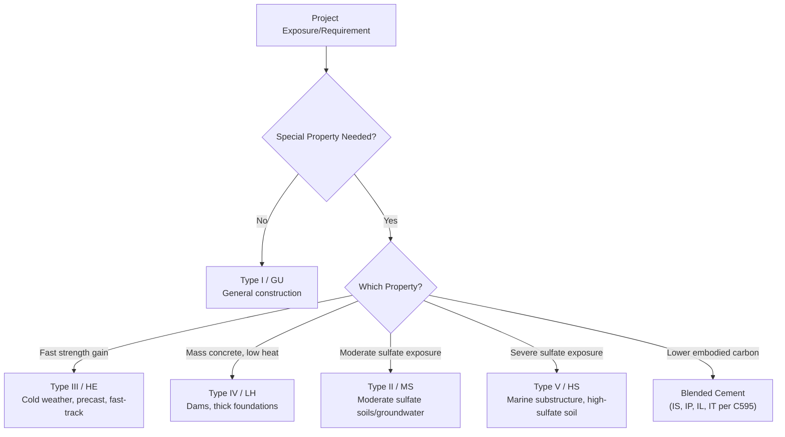

## Types and Classification of Portland Cement

### Overview

Portland cement is classified into distinct types based on chemical composition, physical fineness, and performance characteristics tailored to specific construction requirements — early strength gain, heat of hydration control, or sulfate resistance. Two parallel classification frameworks coexist in modern practice: the traditional **prescriptive** system (defining composition limits, per ASTM C150) and the newer **performance-based** system (defining required properties without mandating composition, per ASTM C1157), alongside a separate framework for **blended hydraulic cements** (ASTM C595) that incorporate supplementary cementitious materials.

### Governing Standards

- **ASTM C150 / C150M** — Standard Specification for Portland Cement (prescriptive, composition-based)
- **ASTM C1157 / C1157M** — Standard Performance Specification for Hydraulic Cement (performance-based)
- **ASTM C595 / C595M** — Standard Specification for Blended Hydraulic Cements
- **AASHTO M85** — AASHTO equivalent of ASTM C150
- **EN 197-1** — European cement classification (CEM I–V system)

### Classification Framework Overview

```mermaid
graph TD
    A[Hydraulic Cement Classification] --> B["ASTM C150<br/>Prescriptive Portland Cement Types"]
    A --> C["ASTM C1157<br/>Performance-Based Types"]
    A --> D["ASTM C595<br/>Blended Hydraulic Cements"]

    B --> B1["Type I — Normal"]
    B --> B2["Type II — Moderate Sulfate Resistance"]
    B --> B3["Type III — High Early Strength"]
    B --> B4["Type IV — Low Heat of Hydration"]
    B --> B5["Type V — High Sulfate Resistance"]

    C --> C1["Type GU — General Use"]
    C --> C2["Type HE — High Early Strength"]
    C --> C3["Type MS — Moderate Sulfate Resistance"]
    C --> C4["Type HS — High Sulfate Resistance"]
    C --> C5["Type MH — Moderate Heat of Hydration"]
    C --> C6["Type LH — Low Heat of Hydration"]

    D --> D1["Type IS — Portland Blast-Furnace Slag Cement"]
    D --> D2["Type IP — Portland-Pozzolan Cement"]
    D --> D3["Type IT — Ternary Blended Cement"]
```

### ASTM C150 — Prescriptive Portland Cement Types

| Type | Name | Key Compositional Feature | Typical Application |
| --- | --- | --- | --- |
| Type I | Normal | No special property requirement; balanced $C_3S/C_2S$ | General construction, pavements, buildings |
| Type II | Moderate Sulfate Resistance | Limited $C_3A$ content (typically ≤8%) | Structures exposed to moderate sulfate soils/groundwater |
| Type III | High Early Strength | Higher $C_3S$ content, finer grinding (higher Blaine fineness) | Cold-weather construction, fast-track/precast work, rapid formwork turnover |
| Type IV | Low Heat of Hydration | Lower $C_3S$ and $C_3A$, higher $C_2S$ | Mass concrete (dams, large foundations) |
| Type V | High Sulfate Resistance | Very low $C_3A$ content (typically ≤5%) | Severe sulfate exposure (marine substructures, sulfate-bearing soils) |

**Compositional relationship summary**:

$$\text{Higher early strength} \propto \text{Higher } C_3S \text{ content and/or finer grinding}$$

$$\text{Higher sulfate resistance} \propto \text{Lower } C_3A \text{ content}$$

$$\text{Lower heat of hydration} \propto \text{Lower } C_3S \text{ and } C_3A\text{, higher } C_2S$$

[Inference] Types Ia, IIa, and IIIa (air-entraining variants of Types I, II, and III) were included in earlier editions of ASTM C150 for factory-interground air-entraining agents; current specification practice more commonly achieves air entrainment via a separate admixture added at the batch plant rather than through these interground variants.

### ASTM C1157 — Performance-Based Hydraulic Cement Types

Rather than prescribing chemical composition limits, ASTM C1157 specifies required physical and performance test results, allowing manufacturers flexibility in formulation (including the potential use of blended/composite compositions) provided the finished product meets the stated performance criteria.

| Type | Name | Performance Requirement Emphasis |
| --- | --- | --- |
| GU | General Use | No special performance property required (roughly analogous to Type I) |
| HE | High Early Strength | Higher strength at early ages (roughly analogous to Type III) |
| MS | Moderate Sulfate Resistance | Limited expansion under sulfate exposure testing (roughly analogous to Type II) |
| HS | High Sulfate Resistance | Stricter expansion limits under sulfate exposure testing (roughly analogous to Type V) |
| MH | Moderate Heat of Hydration | Limited heat of hydration (intermediate performance) |
| LH | Low Heat of Hydration | Strict heat of hydration limits (roughly analogous to Type IV) |

[Inference] The "roughly analogous" relationships noted above reflect similar intended service performance rather than a guaranteed compositional equivalence, since ASTM C1157 explicitly permits varying formulations (including blended compositions) as long as performance criteria are satisfied — meaning two cements of the same C1157 type designation from different manufacturers are not guaranteed to share identical mineralogical composition.

### ASTM C595 — Blended Hydraulic Cements

Blended cements intermix Portland cement clinker (interground or blended after grinding) with supplementary cementitious materials, offering an alternative route to achieving specific performance properties while typically reducing the clinker factor (and associated embodied carbon) of the finished cement.

| Type | Name | Composition |
| --- | --- | --- |
| Type IS | Portland Blast-Furnace Slag Cement | Portland cement + 25–70% ground granulated blast-furnace slag (GGBFS) |
| Type IP | Portland-Pozzolan Cement | Portland cement + 15–40% pozzolan (fly ash, natural pozzolan, or silica fume) |
| Type IT | Ternary Blended Cement | Portland cement + two or more SCMs (e.g., slag + fly ash) in specified proportions |
| Type IL | Portland-Limestone Cement | Portland cement + up to 15% interground limestone |

[Inference] Portland-limestone cement (Type IL) has seen increasing adoption in recent years as a lower-carbon alternative to ordinary Type I/II cement in many markets, though its precise availability and market share vary by region and are subject to ongoing changes; current local supplier data should be consulted for up-to-date availability.

### Physical Property Comparison (Illustrative, Type I vs. Type III)

| Property | Type I (Normal) | Type III (High Early Strength) |
| --- | --- | --- |
| Typical Blaine fineness | ~350–400 m²/kg | ~450–600 m²/kg |
| 1-day compressive strength (mortar cube) | Lower | Significantly higher |
| 28-day compressive strength (mortar cube) | Baseline | Comparable to Type I at 28 days |
| Heat of hydration rate | Moderate | Higher (faster early heat release) |

[Inference] While Type III often achieves comparable or somewhat higher ultimate (28-day) strength relative to Type I due to finer grinding, the primary functional distinction is the rate of early strength gain rather than a guaranteed higher ultimate strength ceiling, since both are subject to normal variability in raw materials and production.

### Selection Criteria by Project Condition

### Practical Example — Type Selection for a Coastal Bridge Substructure

A bridge pier foundation is to be constructed in soil with sulfate concentrations classified as "severe" per ACI 318 exposure category, and the project also specifies a reduced embodied-carbon target.

**Analysis**:

- Severe sulfate exposure would typically direct selection toward Type V (ASTM C150) or Type HS (ASTM C1157) for adequate sulfate resistance.
- The reduced-carbon target suggests considering a blended cement (ASTM C595 Type IP or IT) or supplementing a Type V/HS cement with a sulfate-resistant-compatible SCM (such as certain fly ash or slag combinations), since SCM incorporation can improve both sulfate resistance (through pore refinement and reduced permeability) and reduce the overall clinker factor.

**Resulting selection approach**: A Type V or HS base cement combined with an appropriate percentage of fly ash or slag (verified via sulfate-expansion testing, ASTM C1012, for the specific blend) would commonly satisfy both the durability and sustainability objectives. [Inference — the specific SCM type and replacement percentage require project-specific verification testing, since sulfate-resistance performance of blended combinations depends on the particular SCM source and dosage rather than a universal ratio.]

### International Classification Reference (EN 197-1)

| CEM Type | Description | Approx. Clinker Content |
| --- | --- | --- |
| CEM I | Portland cement | 95–100% |
| CEM II | Portland-composite cement | 65–94% (with various minor additional constituents) |
| CEM III | Blast furnace cement | 5–64% (high slag content) |
| CEM IV | Pozzolanic cement | 45–89% |
| CEM V | Composite cement | 20–64% (slag + pozzolan combination) |

[Inference] Direct designation-to-designation equivalence between the EN 197-1 CEM system and the ASTM C150/C595 system should not be assumed, since the two frameworks use different compositional boundaries, testing methods, and performance criteria; a documented correlation or independent verification is generally needed when substituting one system's product for the other in a specification.

### Common Specification Pitfalls

- **Assuming type equivalence across specification systems**: A Type II (ASTM C150) and Type MS (ASTM C1157) cement are intended for similar service conditions but are not guaranteed to be compositionally identical.
- **Overlooking blended cement compatibility with sulfate-resistance requirements**: Not all SCM combinations improve sulfate resistance equally; verification testing (ASTM C1012) is typically required for specific blends in severe-exposure applications.
- **Selecting Type III without accounting for higher heat of hydration**: While beneficial for early strength, Type III's faster/higher heat release can increase thermal cracking risk in larger-section elements if not accounted for in mix design or curing planning.

### Applications in Civil Engineering

- **General building and pavement construction**: Type I / GU cements serve the majority of standard applications without special exposure conditions.
- **Cold-weather and precast/fast-track construction**: Type III / HE cements accelerate strength gain, reducing formwork cycle times and mitigating early-age freeze risk.
- **Mass concrete structures**: Type IV / LH cements (or blended alternatives) control thermal cracking risk in dams, mat foundations, and other large-volume pours.
- **Marine, sulfate-soil, and wastewater infrastructure**: Type II/V or MS/HS cements (often combined with SCMs) provide long-term durability against sulfate-driven deterioration.
- **Sustainability-driven specification**: Blended cements (ASTM C595) and performance-based specifications (ASTM C1157) support lower embodied-carbon concrete without necessarily sacrificing required performance characteristics.

**Related Topics**

- Sulfate Attack Mechanisms and Resistant Cement Selection (ASTM C1012)
- Supplementary Cementitious Materials: Fly Ash, Slag, and Silica Fume
- Heat of Hydration and Mass Concrete Thermal Control
- Portland-Limestone Cement (Type IL) and Embodied Carbon Reduction
- Cement Fineness and Its Effect on Strength Development (Blaine Method)
- Performance-Based vs. Prescriptive Cement Specifications
- EN 197-1 European Cement Classification System
- ACI 318 Exposure Categories and Durability-Based Mix Design