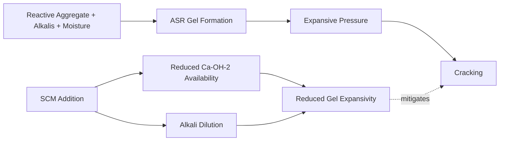

## Supplementary Cementitious Materials

### Definition and Overview

Supplementary Cementitious Materials (SCMs) are inorganic materials that, when used in combination with Portland cement, contribute to the properties of hardened concrete either through hydraulic activity, pozzolanic activity, or both. SCMs are typically industrial by-products or naturally occurring materials incorporated as partial replacements for Portland cement in the concrete mix.

**Key Points**

- SCMs reduce the required clinker content per unit volume of concrete, lowering the carbon footprint of the mix, since clinker production is the primary source of $CO_2$ emissions in cement manufacturing
- They can improve long-term strength, durability, and resistance to chemical attack
- Most SCMs react more slowly than Portland cement, altering early-age strength development and curing requirements
- Classified broadly as pozzolanic, latent hydraulic, or a combination of both

### Classification of SCMs

#### Pozzolanic Materials

Pozzolans contain reactive silica ($SiO_2$) and/or alumina ($Al_2O_3$) that, in the presence of water, react with calcium hydroxide ($Ca(OH)_2$) released during Portland cement hydration to form additional calcium silicate hydrate ($C\text{-}S\text{-}H$) gel. Pozzolans have no significant cementitious value on their own.

$$Ca(OH)_2 + SiO_2 + H_2O \rightarrow C\text{-}S\text{-}H$$

This is known as the **pozzolanic reaction**, and it consumes calcium hydroxide, a comparatively weak and water-soluble hydration product, converting it into additional binding gel.

#### Latent Hydraulic Materials

Latent hydraulic materials possess intrinsic cementitious properties but require an activator (commonly the alkalinity provided by Portland cement hydration) to initiate and sustain hydration at a practical rate. Ground granulated blast-furnace slag (GGBFS) is the primary example.

### Major Types of SCMs

#### Fly Ash

A by-product of pulverized coal combustion in thermal power plants, captured by electrostatic precipitators or baghouses.

- **Class F Fly Ash**: Produced from burning anthracite or bituminous coal; low calcium content (typically <10% CaO); primarily pozzolanic; requires calcium hydroxide from cement hydration to react
- **Class C Fly Ash**: Produced from burning lignite or sub-bituminous coal; higher calcium content (often >20% CaO); exhibits both pozzolanic and some self-cementing (latent hydraulic) properties
- Typical replacement levels: 15–35% by mass of cementitious material (Class F); up to 40% for Class C in some applications
- Spherical particle morphology improves workability ("ball-bearing effect") and reduces water demand

**Example**

A concrete mix designed for mass concrete (e.g., dam construction) may replace 30–50% of Portland cement with Class F fly ash to reduce the heat of hydration and control thermal cracking, given the slower, more distributed heat release of the pozzolanic reaction.

#### Ground Granulated Blast-Furnace Slag (GGBFS)

A by-product of iron production, formed when molten slag from the blast furnace is rapidly quenched (granulated) with water and then ground to cement fineness.

- Latent hydraulic; activated by the alkaline environment of Portland cement hydration
- Typical replacement levels: 25–70% by mass, with high-volume slag concretes (50%+) common in marine and sulfate-exposure environments
- Produces a denser, more refined pore structure, improving resistance to chloride ion penetration and sulfate attack
- Generally lighter in color, producing lighter-colored concrete

#### Silica Fume (Microsilica)

An ultrafine by-product of silicon or ferrosilicon alloy production, consisting of amorphous $SiO_2$ particles roughly 100 times finer than Portland cement particles.

- Highly reactive pozzolan due to extremely high surface area (15,000–25,000 m²/kg)
- Typical replacement levels: 5–10% by mass (higher dosages increase water demand substantially and require superplasticizers)
- Significantly reduces permeability and increases compressive strength; commonly used in high-performance and high-strength concrete
- Requires high-range water reducers (superplasticizers) due to very high water demand from fine particle surface area

#### Natural Pozzolans

Naturally occurring materials with pozzolanic activity, including volcanic ash, calcined clay (metakaolin), and diatomaceous earth.

- **Metakaolin**: Produced by calcining kaolin clay at 650–800°C; highly reactive pozzolan, similar performance benefits to silica fume with better workability characteristics
- Historically used since Roman times (volcanic ash in Roman concrete, e.g., *pozzolana* from Pozzuoli, Italy — the namesake of the term "pozzolan")

#### Rice Husk Ash (RHA)

Produced by controlled combustion of rice husks; contains highly reactive amorphous silica when burned under controlled temperature conditions (typically 500–700°C).

- [Unverified] Reactivity is highly sensitive to burning temperature and duration; amorphous silica converts to less reactive crystalline forms above approximately 800°C
- Primarily used in regions with high agricultural rice production as a locally available, low-cost SCM

### Comparative Properties

| Property | Fly Ash (Class F) | GGBFS | Silica Fume | Metakaolin |
| --- | --- | --- | --- | --- |
| Reaction type | Pozzolanic | Latent hydraulic | Pozzolanic | Pozzolanic |
| Typical replacement | 15–35% | 25–70% | 5–10% | 5–15% |
| Particle fineness | Comparable to cement | Comparable to cement | ~100x finer | Fine |
| Early strength effect | Reduces | Reduces (dose-dependent) | Increases (with superplasticizer) | Increases |
| Water demand | Reduces | Neutral to slight reduction | Increases significantly | Increases |
| Heat of hydration | Reduces | Reduces | Increases (per unit mass reacted) | Increases |

### Mechanisms of Performance Enhancement

#### Pore Refinement

SCM reaction products (secondary $C\text{-}S\text{-}H$) fill capillary pores within the cement paste matrix, reducing the interconnected porosity responsible for fluid and ion ingress. This directly improves resistance to:

- Chloride-induced corrosion of reinforcing steel
- Sulfate attack
- Freeze-thaw related deterioration (when air entrainment is properly maintained)

#### Reduction of Calcium Hydroxide

Since $Ca(OH)_2$ is the most soluble and least durable phase in hydrated cement paste, its conversion into $C\text{-}S\text{-}H$ through pozzolanic reaction reduces susceptibility to:

- Leaching in contact with soft or flowing water
- Acid attack
- Alkali-silica reaction (ASR) mitigation, since SCMs dilute alkali content and reduce available $Ca(OH)_2$ that facilitates the reaction

#### Alkali-Silica Reaction (ASR) Mitigation

### Curing and Construction Implications

- SCM-blended concretes generally require **extended moist curing periods** because pozzolanic and latent hydraulic reactions proceed more slowly than pure Portland cement hydration, particularly at early ages
- Cold weather placement is more sensitive with high-SCM-content mixes due to reduced early heat generation
- Formwork stripping times and time-to-loading may need to be extended based on slower early strength gain, especially with Class F fly ash and high-volume GGBFS mixes
- Finishing operations may require adjusted timing due to altered bleeding characteristics (fly ash tends to reduce bleeding; silica fume nearly eliminates it, increasing plastic shrinkage cracking risk if curing is delayed)

### Standards and Specifications

- **ASTM C618**: Standard specification for coal fly ash and raw or calcined natural pozzolan for use in concrete
- **ASTM C989**: Standard specification for slag cement for use in concrete and mortars
- **ASTM C1240**: Standard specification for silica fume used in cementitious mixtures
- **ASTM C1697**: Standard specification for blended supplementary cementitious materials
- Regional standards (e.g., EN 450-1 for fly ash in Europe, IS 3812 in India) impose comparable but not identical chemical and physical limits

### Practical Mix Design Considerations

**Example**

Consider a marine substructure concrete mix requiring low chloride permeability. A typical proportioning approach:

- Portland cement: 60% of total cementitious material
- GGBFS: 35%
- Silica fume: 5%
- Water-cementitious material ratio ($w/cm$): 0.40
- This combination leverages GGBFS for long-term densification and chloride resistance, with silica fume providing immediate pore refinement and enhanced strength

[Inference] Optimal SCM combinations are frequently determined through trial mixes and performance testing (e.g., rapid chloride permeability test, ASTM C1202) rather than prescriptive formulas alone, since reactivity varies by source and by interaction with specific cement chemistry.

### Environmental and Sustainability Considerations

- Utilizing industrial by-products (fly ash, GGBFS, silica fume) diverts waste from landfills and reduces the embodied carbon of concrete by displacing clinker, which is responsible for the majority of $CO_2$ emissions per ton of Portland cement produced
- Supply constraints are an emerging industry concern: as coal-fired power generation declines in many regions, fly ash availability is decreasing, driving interest in natural pozzolans and calcined clays as substitutes
- [Speculation] Long-term market shifts may increasingly favor calcined clay-limestone cement systems (e.g., LC3 technology) as fly ash and slag supplies diminish, though adoption rates vary significantly by region and regulatory environment

**Related Topics**

- Portland Cement Hydration Chemistry
- Alkali-Silica Reaction and Mitigation Strategies
- High-Performance and High-Strength Concrete Mix Design
- Concrete Durability and Permeability Testing (RCPT, ASTM C1202)
- LC3 (Limestone Calcined Clay Cement) Technology
- Heat of Hydration in Mass Concrete
- Concrete Curing Methods and Requirements
- Sulfate Attack and Resistant Concrete Design