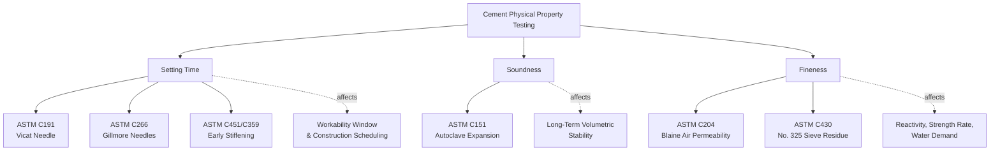

## Setting Time, Soundness, and Fineness Testing


### Overview

These three physical test categories evaluate distinct but interrelated behavioral aspects of hydraulic cement: **setting time** governs the workability window during placement, **soundness** governs long-term volumetric stability of hardened paste, and **fineness** governs reactivity, strength development rate, and water demand. All three are routine acceptance tests for cement quality control and are prerequisites to reliable concrete mix performance.

### Governing Standards

- **ASTM C191** — Standard Test Method for Time of Setting of Hydraulic Cement by Vicat Needle
- **ASTM C266** — Standard Test Method for Time of Setting of Hydraulic-Cement Paste by Gillmore Needles
- **ASTM C451** — Standard Test Method for Early Stiffening of Hydraulic Cement (Paste Method)
- **ASTM C359** — Early Stiffening of Hydraulic Cement (Mortar Method)
- **ASTM C151 / C151M** — Standard Test Method for Autoclave Expansion of Hydraulic Cement
- **ASTM C204** — Standard Test Method for Fineness of Hydraulic Cement by Air-Permeability Apparatus (Blaine method)
- **ASTM C430** — Standard Test Method for Fineness of Hydraulic Cement by the 45-μm (No. 325) Sieve
- **ASTM C115** — Standard Test Method for Fineness of Portland Cement by the Turbidimeter (Wagner method, largely historical)
- **ASTM C150 / C150M** — Standard Specification for Portland Cement (acceptance limits referencing the above test methods)

### Category Relationships



### Setting Time — Vicat Needle Method (ASTM C191)

Setting time defines the transition of cement paste from a plastic, workable state to a rigid, load-bearing state, measured on a standard-consistency cement paste using a calibrated needle apparatus.

**Procedure summary**:

1. Prepare cement paste at "normal consistency" (per ASTM C187), typically requiring a defined penetration depth of a separate consistency plunger.
2. Mold paste into a conical ring specimen.
3. At regular time intervals, lower a 1 mm diameter Vicat needle (under a fixed total load) onto the paste surface and measure penetration depth.

**Initial set**: The time elapsed from initial water-cement contact until the needle penetration is 25 mm or less (i.e., penetrates to within 25 mm of the base) — marking the practical end of the workable placement window.

**Final set**: The time elapsed until the needle makes no visible circular indentation on the paste surface — marking the point at which the paste has developed sufficient rigidity to resist deformation.

**Typical ASTM C150 acceptance limits**:

- Initial set: not less than 45 minutes
- Final set: not more than 375 minutes (6 hours 15 minutes)

[Inference] Actual measured setting times for a given cement vary with temperature, water-cement ratio of the test paste, cement fineness, and $C_3A$/gypsum balance; the ASTM C150 limits represent acceptance boundaries rather than a fixed expected value for all cements.

### Setting Time — Gillmore Needle Method (ASTM C266)

An alternative method using two needles of differing weight and tip diameter:

- **Initial set**: Time until a lighter needle (113.4 g load, 2.12 mm diameter) no longer leaves a visible indentation.
- **Final set**: Time until a heavier needle (453.6 g load, 1.06 mm diameter) no longer leaves a visible indentation.

[Inference] Because the two methods (Vicat and Gillmore) use different apparatus geometries and loading, they are not expected to produce numerically identical setting-time results on the same paste; the specific method referenced by the governing specification should be used consistently for compliance determination.

### Setting Time Curve Illustration

<svg xmlns="http://www.w3.org/2000/svg" viewBox="0 0 560 300">
<text x="280" y="22" text-anchor="middle" font-size="15" font-weight="bold" fill="#1a1a1a">Vicat Penetration vs. Time (svg_diagram)</text>
<g font-family="sans-serif" font-size="12" fill="#1a1a1a">
<line x1="70" y1="250" x2="520" y2="250" stroke="#334155" stroke-width="1.5" />
<line x1="70" y1="250" x2="70" y2="50" stroke="#334155" stroke-width="1.5" />
<text x="280" y="280" text-anchor="middle">Elapsed Time (minutes)</text>
<text x="30" y="150" text-anchor="middle" transform="rotate(-90 30 150)">Penetration (mm)</text>



```
<path d="M 90 70 C 150 75, 220 90, 280 160 C 330 220, 380 245, 430 249 L 500 250" fill="none" stroke="#2563eb" stroke-width="2.5" />

<line x1="70" y1="180" x2="520" y2="180" stroke="#dc2626" stroke-width="1" stroke-dasharray="4,3" />
<text x="500" y="175" text-anchor="end" font-size="11" fill="#dc2626">25 mm (Initial Set threshold)</text>

<circle cx="260" cy="180" r="4" fill="#dc2626" />
<text x="260" y="200" text-anchor="middle" font-size="11" fill="#dc2626">Initial Set</text>

<circle cx="430" cy="249" r="4" fill="#166534" />
<text x="430" y="235" text-anchor="middle" font-size="11" fill="#166534">Final Set<br />(no indentation)</text>

<text x="90" y="65" font-size="10">40 mm (initial)</text>
```

</g>
</svg>

### Factors Influencing Setting Time

- **Gypsum content/optimization**: Insufficient gypsum relative to $C_3A$ content risks flash set (rapid, irreversible stiffening due to uncontrolled $C_3A$ hydration); excessive gypsum can cause false set (a premature, temporary stiffening reversible by continued mixing, related to gypsum dehydration/re-crystallization rather than true hydration).
- **Water-cement ratio**: Lower w/c generally shortens setting time; higher w/c generally extends it.
- **Ambient/paste temperature**: Elevated temperature accelerates hydration kinetics, shortening setting time; low temperature extends it.
- **Cement fineness**: Finer cement generally sets faster due to greater surface area available for early reaction.
- **Admixtures**: Retarding admixtures (e.g., certain lignosulfonates, sugars) extend setting time; accelerating admixtures (e.g., calcium chloride, non-chloride accelerators) shorten it.

### False Set vs. Flash Set

| Characteristic | False Set | Flash Set |
| --- | --- | --- |
| Mechanism | Gypsum dehydration/re-crystallization (physical), or premature ettringite formation | Uncontrolled, rapid $C_3A$-water reaction (chemical) |
| Reversibility | Reversible by continued/extended mixing without additional water | Not reversible by remixing; addition of water may partially restore workability but with strength/quality implications |
| Heat generation | Minimal | Significant, rapid heat release |
| Detection test | ASTM C451 (paste) / ASTM C359 (mortar) | Generally identified during normal setting-time testing (ASTM C191) as an abnormally rapid set |

### Soundness — Autoclave Expansion Test (ASTM C151)

Soundness testing evaluates the potential for delayed, disruptive expansion in hardened cement paste caused by the slow hydration of free (uncombined) lime (CaO) or excess magnesium oxide (MgO, as periclase) that did not fully react during clinker formation.

**Procedure summary**:

1. Prepare a standard cement paste bar specimen and cure under controlled moist conditions.
2. Measure initial specimen length.
3. Place specimen in an autoclave and subject it to elevated pressure and temperature (approximately 216 °C, 2 MPa / ~295 psi) for a specified duration (typically 3 hours), accelerating the hydration of any free lime/periclase present.
4. Measure final specimen length after cooling.

$$\text{Autoclave Expansion} (\%) = \frac{L_f - L_i}{L_i} \times 100$$

**ASTM C150 acceptance limit**: Maximum autoclave expansion of 0.80% for Portland cement.

**Physical basis**: Free CaO and periclase (crystalline MgO) hydrate very slowly at ambient conditions compared to the primary clinker phases; if these unreacted compounds remain in significant quantity within hardened concrete, their delayed hydration produces volumetric expansion (since the hydrated forms, Ca(OH)₂ and Mg(OH)₂, occupy greater volume than the unhydrated oxides) that can occur long after the concrete has hardened and gained strength, potentially causing disruptive cracking, popouts, or map-pattern deterioration. The autoclave test accelerates this slow reaction into a practical laboratory timeframe.

### Fineness — Blaine Air Permeability Method (ASTM C204)

Measures fineness indirectly by determining the specific surface area of cement particles based on the resistance to airflow through a compacted bed of cement.

**Procedure summary**:

1. Compact a known mass of cement into a standard permeability cell to a specified porosity.
2. Draw air through the compacted bed under a manometer-monitored pressure differential.
3. Measure the time required for a given volume of air to pass through the bed.
4. Calculate specific surface area using the Kozeny-Carman relationship, incorporating measured air viscosity, bed porosity, and time.

$$S = \frac{K\sqrt{\epsilon^3}}{\rho(1-\epsilon)\sqrt{\eta T}} \times \text{(calibration constant)}$$

Where $S$ is specific surface area (typically reported in m²/kg), $\epsilon$ is bed porosity, $\rho$ is cement density, $\eta$ is air viscosity, and $T$ is measured flow time. [Inference] This is a simplified representation of the underlying Kozeny-Carman-based calculation; the exact ASTM C204 calculation procedure involves calibration against a reference cement sample of known surface area, and practicing laboratories follow the full standardized calculation and calibration procedure specified in the method.

**Typical values**: Type I Portland cement — approximately 300–400 m²/kg; Type III (high early strength) — approximately 450–600 m²/kg, reflecting its finer grind for faster early reactivity.

### Fineness — No. 325 Sieve Residue Method (ASTM C430)

A simpler, direct method measuring the percentage (by mass) of cement retained on a 45 µm (No. 325) sieve after wet sieving with a specified dispersing procedure, providing a coarse-particle fraction indicator rather than a full specific-surface-area value.

$$\% \text{Residue} = \frac{\text{Mass retained on sieve}}{\text{Original sample mass}} \times 100$$

Lower residue percentages indicate finer cement (fewer coarse particles remaining unsieved). [Inference] This method is generally considered less sensitive to fine-particle-size distribution nuances compared to the Blaine method, since it reports only a single coarse-fraction cutoff rather than a continuous surface-area-based measure, though both remain standard accepted fineness methods under ASTM C150.

### Practical Example — Interpreting Combined Test Results

A cement sample submitted for Type I acceptance testing yields:

| Test | Result | ASTM C150 Limit | Status |
| --- | --- | --- | --- |
| Initial set (Vicat, C191) | 105 minutes | ≥45 minutes | Pass |
| Final set (Vicat, C191) | 285 minutes | ≤375 minutes | Pass |
| Autoclave expansion (C151) | 0.92% | ≤0.80% | **Fail** |
| Blaine fineness (C204) | 365 m²/kg | Within typical Type I range | Pass |

**Assessment**: Despite acceptable setting behavior and fineness, this cement fails the soundness (autoclave expansion) requirement, indicating a likely excess of free lime or periclase from incomplete clinkering or insufficient cooling control. This cement would be rejected for use, since delayed expansion risk in hardened concrete is a durability concern independent of the material's initially acceptable setting and fineness behavior.

### Common Testing Pitfalls

- **Improper standard-consistency paste preparation**: Since setting-time testing is performed on a paste calibrated to normal (standard) consistency, an incorrectly proportioned paste (per ASTM C187) will produce non-representative setting-time results.
- **Temperature control deviations**: Setting time and autoclave tests are sensitive to specified curing/testing temperature; deviations outside the standard's tolerance window can produce results inconsistent with true material performance.
- **Sieve degradation in fineness testing**: Worn or damaged No. 325 sieves can produce artificially low or inconsistent residue readings over repeated use, requiring periodic sieve verification.
- **Blaine apparatus calibration drift**: The air-permeability method's accuracy depends on proper apparatus calibration against a certified reference cement sample; uncalibrated equipment can produce systematically biased fineness values.

### Applications in Civil Engineering

- **Concrete production scheduling**: Setting time results directly inform allowable transport time, placement window, and finishing operation timing for ready-mix concrete.
- **Cement quality control and acceptance**: All three test categories (setting time, soundness, fineness) are routine components of cement mill and receiving-lab QC programs, forming part of the acceptance basis under ASTM C150.
- **Mix design and admixture dosing**: Setting behavior informs retarder/accelerator dosing decisions, particularly in hot- or cold-weather concreting.
- **Forensic investigation**: Delayed expansion, cracking, or popout distress in hardened concrete structures is often traced back to insufficient soundness (excess free lime/periclase) identified retrospectively via petrographic or expansion testing.

**Related Topics**

- Standard Consistency Determination (ASTM C187)
- False Set and Flash Set Diagnosis and Mitigation
- Cement Hydration Chemistry and Clinker Phase Reactivity
- Free Lime and Periclase Formation During Clinkering
- Retarding and Accelerating Admixtures for Setting Time Control
- Compressive Strength Testing of Hydraulic Cement Mortars (ASTM C109)
- Cold-Weather and Hot-Weather Concreting Practices
- Petrographic Investigation of Hardened Concrete Distress