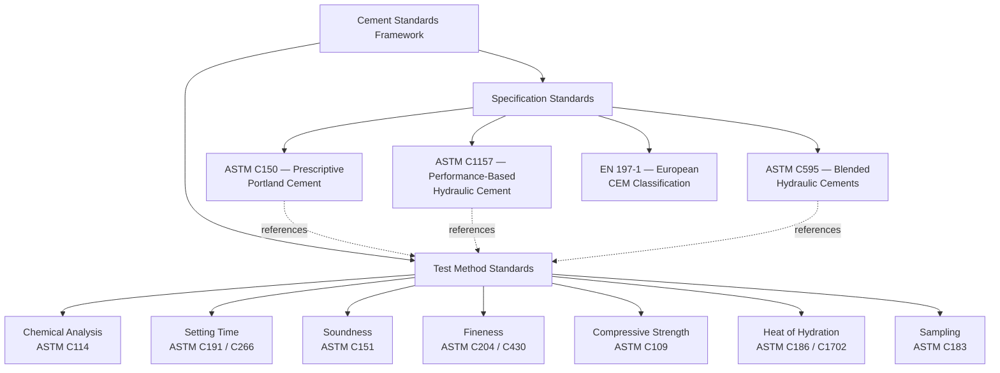
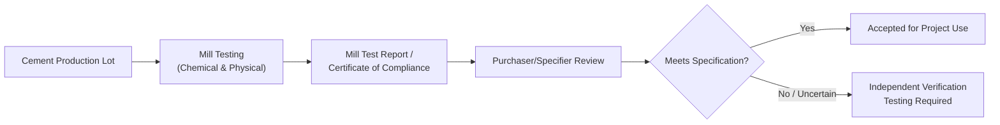

## Cement Standards and Specifications

### Overview

Cement standards and specifications provide the codified framework governing raw material acceptance, chemical composition, physical properties, testing methodology, and performance criteria for hydraulic cements used in construction. These standards enable consistent quality verification across manufacturers, projects, and jurisdictions, forming the contractual and technical basis for cement acceptance on any given project.

### Major Standards-Development Organizations

- **ASTM International** — Primary U.S. reference; cement standards fall principally under Committee C01 (Cement)
- **AASHTO** — Parallel transportation-sector standards, largely harmonized with ASTM equivalents
- **EN (European Norms)** — EN 197 series, the governing framework across the EU and widely referenced internationally
- **ISO** — International Organization for Standardization, providing globally harmonized test methods, though regional standards (ASTM/AASHTO or EN) typically govern actual project specifications
- **National/local codes**: Many countries maintain standards referencing or adapted from ASTM/AASHTO or EN frameworks with local amendments (e.g., Philippine National Standards, PNS, reference ASTM methods with local certification requirements)

### Standards Classification Framework

### Specification vs. Test Method Distinction

As with aggregate standards, a critical distinction exists between:

- **Specification standards** (e.g., ASTM C150, C1157, C595): Define acceptance criteria — numerical limits for chemical composition, physical properties, or performance results.
- **Test method standards** (e.g., ASTM C191, C151, C204): Define *how* to measure a given property, without specifying pass/fail thresholds themselves.

A given test method (e.g., ASTM C151 autoclave expansion) may be referenced by multiple specification standards, each of which may impose the same or different numerical acceptance limits.

### Core ASTM Cement Standards Summary

| Standard | Title/Scope | Category |
| --- | --- | --- |
| ASTM C150 / C150M | Portland Cement (prescriptive types I–V) | Specification |
| ASTM C1157 / C1157M | Performance Hydraulic Cement (GU, HE, MS, HS, MH, LH) | Specification |
| ASTM C595 / C595M | Blended Hydraulic Cements (IS, IP, IL, IT) | Specification |
| ASTM C114 | Chemical Analysis of Hydraulic Cement | Test Method |
| ASTM C183 | Sampling and the Amount of Testing of Hydraulic Cement | Test Method |
| ASTM C187 | Normal (Standard) Consistency of Hydraulic Cement Paste | Test Method |
| ASTM C191 | Time of Setting by Vicat Needle | Test Method |
| ASTM C266 | Time of Setting by Gillmore Needles | Test Method |
| ASTM C151 / C151M | Autoclave Expansion of Hydraulic Cement | Test Method |
| ASTM C204 | Fineness by Air Permeability (Blaine) | Test Method |
| ASTM C430 | Fineness by 45-µm (No. 325) Sieve | Test Method |
| ASTM C109 / C109M | Compressive Strength of Hydraulic Cement Mortars | Test Method |
| ASTM C186 | Heat of Hydration by Heat of Solution | Test Method |
| ASTM C1702 | Heat of Hydration by Isothermal Calorimetry | Test Method |
| ASTM C1012 | Sulfate Resistance (Length Change) | Test Method |
| ASTM C618 | Fly Ash and Natural Pozzolans for Concrete | Specification (SCM) |
| ASTM C989 / C989M | Slag Cement for Concrete and Mortars | Specification (SCM) |
| ASTM C1240 | Silica Fume for Cementitious Mixtures | Specification (SCM) |

### AASHTO Equivalents

| ASTM Standard | AASHTO Equivalent |
| --- | --- |
| ASTM C150 | AASHTO M85 |
| ASTM C595 | AASHTO M240 |
| ASTM C618 | AASHTO M295 |
| ASTM C989 | AASHTO M302 |
| ASTM C1240 | AASHTO M307 |

[Inference] AASHTO and ASTM cement standards are closely harmonized for most transportation applications, though engineers should verify the specific edition/year cited by a governing project specification, since procedural details, acceptance limits, or referenced sub-standards can be revised independently by each organization over time.

### European Standard Framework (EN 197 Series)

| Standard | Scope |
| --- | --- |
| EN 197-1 | Composition, specifications, and conformity criteria for common cements (CEM I–V) |
| EN 197-2 | Conformity evaluation |
| EN 196 (series) | Test methods for cement (analogous to various individual ASTM C1xx methods) |
| EN 206 | Concrete specification, performance, production, and conformity (analogous in role to ACI 318/ASTM C94 combined) |

[Inference] Direct numerical equivalence between EN 197-1 CEM designations and ASTM C150/C595 types should not be assumed without a documented correlation, since the two systems define composition boundaries, strength classes, and testing procedures differently.

### Cement Strength Class System (EN 197-1)

Unlike the ASTM system (which classifies primarily by intended use, e.g., Type I, II, III), the EN system classifies cement partly by standardized 28-day compressive strength class alongside early-strength development rate:

| Strength Class | 28-Day Strength Range (MPa) | Early Strength Descriptor |
| --- | --- | --- |
| 32.5 | 32.5–52.5 | N (normal) or R (rapid) |
| 42.5 | 42.5–62.5 | N or R |
| 52.5 | ≥52.5 | N or R |

[Inference] This strength-class-based system provides a performance-oriented classification structure conceptually distinct from the primarily compositional/end-use-based ASTM C150 type system, though both frameworks aim to communicate similar underlying performance information to specifiers.

### Chemical Composition Requirements (ASTM C150, Illustrative)

| Parameter | Type I | Type II | Type III | Type IV | Type V |
| --- | --- | --- | --- | --- | --- |
| $C_3A$ (max) | No limit | 8% | No limit | 7% | 5% |
| $C_3S + C_3A$ (max, optional) | — | — | — | 58% | — |
| MgO (max) | 6.0% | 6.0% | 6.0% | 6.0% | 6.0% |
| SO₃ (max) | 3.0% | 3.0% | 3.5% | 2.3% | 2.3% |
| Loss on Ignition (max) | 3.0% | 3.0% | 3.0% | 2.5% | 3.0% |

[Inference] These figures represent commonly cited illustrative limits; exact values are subject to periodic revision within specific ASTM C150 editions, so the current edition referenced by the governing project specification should always be consulted for precise compliance determination.

### Sampling and Quality Verification (ASTM C183)

Defines how representative cement samples are obtained — from bulk shipments, silos, or bagged product — for laboratory acceptance testing, addressing sample size, sampling frequency, and handling procedures to avoid contamination or unrepresentative results prior to testing under the various individual test methods.

### Cement Certification and Mill Test Reports

Cement producers typically issue **mill certificates** (mill test reports) documenting chemical composition (per ASTM C114) and physical property test results (per the relevant methods) for each production lot, allowing purchasers/specifiers to verify compliance with the governing specification standard without independently retesting every shipment, though independent verification testing may still be specified for critical projects.

### Practical Example — Specification Cross-Referencing

A project specification states: "Cement shall conform to ASTM C150 Type II, or ASTM C1157 Type MS, at the Contractor's option."

**Interpretation**: This clause permits the contractor to supply either a prescriptively formulated Type II cement (meeting the compositional $C_3A$ limit and associated physical requirements of ASTM C150) or a performance-specified Type MS cement (meeting the sulfate-resistance performance criteria of ASTM C1157, regardless of underlying composition). Both are considered acceptable alternatives under this specification language, reflecting the growing acceptance of performance-based specification as an alternative pathway to traditional prescriptive compliance. [Inference] Whether a given performance-based cement achieves equivalent long-term field performance to a prescriptively compliant cement in all respects is a topic of ongoing industry discussion; project-specific risk tolerance and precedent often inform whether performance-based alternatives are accepted without additional qualification testing.

### Common Specification Pitfalls

- **Citing an ambiguous or outdated standard year**: Referencing "ASTM C150" without a specific edition year can create ambiguity if requirements have changed between editions; well-drafted specifications typically cite the edition current at the time of contract or bid.
- **Mixing specification systems without clear equivalence basis**: Substituting an EN 197-1 CEM-classified cement for an ASTM C150-specified requirement (or vice versa) without documented correlation testing risks unintended non-compliance.
- **Overlooking supplementary specification requirements**: Some project specifications impose additional requirements beyond the base ASTM/AASHTO standard (e.g., low-alkali cement requirements for ASR mitigation, restricted SCM combinations, or additional durability testing) that must be captured alongside the base standard reference.
- **Assuming performance-based and prescriptive types are always interchangeable**: As with ASTM C1157 vs. C150 types noted in earlier discussion, "roughly analogous" performance intent does not guarantee identical composition or behavior across all use conditions.

### Applications in Civil Engineering

- **Project specification drafting**: Engineers reference specific cement standards (with edition year) to define minimum acceptable material quality for a project.
- **Material procurement and supplier qualification**: Contractors and suppliers rely on mill certificates referencing the applicable standards to demonstrate compliance without exhaustive independent testing on every shipment.
- **Durability-critical infrastructure**: Specifications for marine, sulfate-exposed, or ASR-risk projects often layer additional standard references (e.g., low-alkali cement requirements, ASTM C1012 sulfate testing) atop the base cement specification.
- **International and cross-border projects**: Understanding the relationship (and lack of automatic equivalence) between ASTM/AASHTO and EN 197 frameworks is essential when specifications, cement suppliers, or contractors originate from different regulatory environments.
- **Forensic and dispute resolution**: When cement-related quality issues arise, the specific standard edition and referenced test methods in effect at the time of supply form the basis for determining contractual compliance.

**Related Topics**

- ASTM C150 vs. ASTM C1157 — Prescriptive vs. Performance Specification Philosophy
- EN 197-1 European Cement Classification and Strength Classes
- Mill Test Reports and Cement Certification Procedures
- Low-Alkali Cement Requirements for ASR-Risk Projects
- Sampling and Quality Verification of Hydraulic Cement (ASTM C183)
- Blended Cement Specifications (ASTM C595) in Detail
- Chemical Analysis Methods for Hydraulic Cement (ASTM C114)
- International Standard Harmonization in Construction Materials