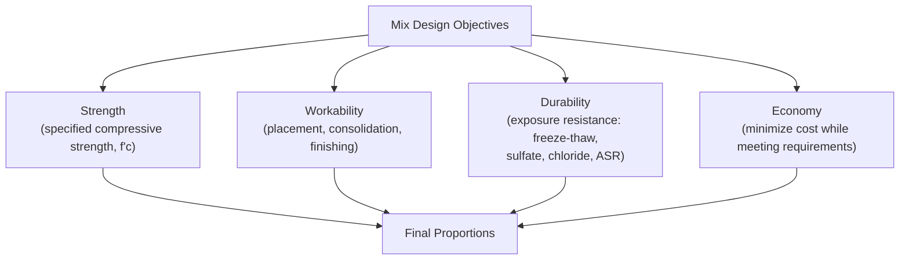
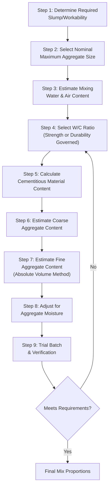

## Mix Design Principles and Methods

### Definition and Overview

Concrete mix design is the systematic process of selecting and proportioning constituent materials — cement, water, fine aggregate, coarse aggregate, supplementary cementitious materials, and admixtures — to achieve specified fresh and hardened concrete properties at the lowest reasonable cost, while satisfying strength, durability, and workability requirements for a given application and exposure condition.

### Governing Standards and Guidelines

- **ACI 211.1** — Standard Practice for Selecting Proportions for Normal, Heavyweight, and Mass Concrete
- **ACI 211.2** — Standard Practice for Selecting Proportions for Structural Lightweight Concrete
- **ACI 318** — Building Code Requirements for Structural Concrete (durability exposure classes, strength requirements)
- **ACI 211.4R** — Guide for Selecting Proportions for High-Strength Concrete
- **ASTM C1602 / C1602M** — Standard Specification for Mixing Water Used in Production of Hydraulic Cement Concrete
- **British/European DOE Method** (Department of Environment method, UK) — Alternative proportioning methodology
- **BS EN 206 / BS 8500** — European concrete specification and conformity framework

### Fundamental Mix Design Objectives

These four objectives frequently compete: increasing strength via lower water-cement ratio may reduce workability; increasing durability-driven cement content may increase cost and heat of hydration risk. Mix design is fundamentally an optimization exercise balancing these considerations for the specific project context.

### The Water-Cement (or Water-Cementitious) Ratio Law

The single most influential parameter in concrete mix design is the water-cement ratio (w/c), governed by Abrams' Law, which establishes an inverse relationship between w/c and compressive strength:

$$f'c = \frac{K_1}{K_2^{(w/c)}}$$

Where $K_1$ and $K_2$ are empirical constants dependent on cement type, age, and curing conditions. [Inference] The exact constants vary by materials and testing conditions, so this relationship is used as a general trend model calibrated with project-specific trial batch data rather than applied with universal fixed constants.

**Practical implication**: For a given set of materials, lower w/c produces higher strength (due to reduced capillary porosity in the hardened paste) but also reduces workability, requiring water-reducing admixtures or increased paste content to maintain adequate slump.

### Mix Design Process — ACI 211.1 Method Overview

### Step 1: Slump and Workability Requirement

Slump (ASTM C143) is selected based on placement method, structural element complexity, and consolidation equipment (e.g., vibration availability), typically ranging from 25–75 mm for pavements to 75–150 mm or higher for heavily reinforced sections or pumped concrete.

### Step 2: Nominal Maximum Aggregate Size (NMAS)

Larger NMAS generally reduces water and cement demand (due to lower total aggregate surface area requiring paste coating) but is constrained by:

- Minimum clear spacing between reinforcing bars
- Minimum cover requirements
- Section thickness (NMAS typically limited to roughly 1/5 of minimum section dimension, or per ACI 318 provisions relating maximum aggregate size to reinforcement clearance)

### Step 3: Mixing Water and Air Content Estimation

ACI 211.1 provides reference tables estimating approximate mixing water requirements (kg/m³ or lb/yd³) based on desired slump and NMAS, along with recommended target air content for various exposure classes (particularly relevant for freeze-thaw exposure, where entrained air provides expansion relief space).

### Step 4: Water-Cementitious Ratio Selection

The w/c ratio is selected as the more restrictive (lower) of two independent criteria:

1. **Strength-based w/c**: Determined from a strength-vs-w/c relationship curve (either from ACI 211.1 reference tables or project-specific trial-batch data), targeting the required average strength $f'_{cr}$ (which includes a statistical margin above the specified strength $f'_c$ to account for expected production variability, per ACI 318).
2. **Durability-based w/c**: Determined from ACI 318 exposure-class tables, which impose maximum w/c limits (and often minimum $f'_c$ requirements) independent of strength considerations, for specific exposure conditions (e.g., freeze-thaw, sulfate exposure, corrosion protection for reinforced concrete in chloride environments).

$$w/c_{selected} = \min(w/c_{strength}, \ w/c_{durability})$$

### Step 5: Cementitious Material Content

$$\text{Cementitious Content} = \frac{\text{Mixing Water (from Step 3)}}{w/c_{selected} \text{ (from Step 4)}}$$

If the calculated cementitious content falls below any specification-mandated minimum cement content (common in durability-driven specifications), the minimum governs instead.

### Step 6: Coarse Aggregate Content

ACI 211.1 provides reference tables giving the recommended volume of dry-rodded coarse aggregate (per unit volume of concrete) as a function of NMAS and fine aggregate fineness modulus, reflecting the empirical observation that optimal coarse aggregate volume for workability is largely independent of cement content or strength level and depends primarily on relative aggregate sizing.

### Step 7: Fine Aggregate Content — Absolute Volume Method

Once cement, water, and coarse aggregate volumes are established, fine aggregate volume fills the remaining volume in the mix:

$$V_{fine\ aggregate} = 1 \ \text{m}^3 - (V_{cement} + V_{water} + V_{coarse\ agg} + V_{air})$$

Where each volume is calculated using the respective material's mass divided by its specific gravity (relative to water density):

$$V_i = \frac{M_i}{G_i \times \rho_{water}}$$

The fine aggregate mass is then back-calculated from this remaining volume and the fine aggregate's bulk specific gravity (SSD basis).

### Step 8: Moisture Correction

As discussed in aggregate moisture testing, batch quantities must be adjusted from oven-dry (design) basis to field (as-received, moist) basis:

$$W_{field,aggregate} = W_{OD} \times (1 + \text{Total Moisture Content})$$

$$\text{Adjusted Mixing Water} = \text{Design Water} - \sum (\text{Free Moisture}_i \times W_{OD,i})$$

### Step 9: Trial Batching

Laboratory or field trial batches verify that the calculated proportions achieve target slump, air content, and (after appropriate curing) compressive strength, with adjustments made iteratively if results deviate from targets.

### Alternative Mix Design Methods

| Method | Region/Origin | Key Distinguishing Approach |
| --- | --- | --- |
| ACI 211.1 (Absolute Volume Method) | United States | Table-based estimation of water, coarse aggregate volume; strength-durability w/c comparison |
| DOE Method | United Kingdom | Free-water/cement ratio approach using strength charts referencing specific cement/aggregate combinations |
| Fuller-Thompson / Ideal Curve Methods | International (theoretical basis) | Optimizes combined aggregate gradation toward a theoretical maximum-density curve |
| Bolomey Method | Continental Europe (historical) | Empirical formula relating water demand to aggregate grading and desired workability |

[Inference] While these methods differ in their specific calculation procedures and reference data sources, all share the same underlying objective of balancing strength, workability, durability, and economy; final selection often depends on regional practice, available reference data, and specification requirements rather than a definitive technical superiority of one method over another for all applications.

### Aggregate Proportioning: Combined Gradation Optimization

For mixes using multiple aggregate fractions (e.g., coarse, intermediate, and fine), combined gradation curves are often compared against theoretical ideal curves (such as the 0.45 power chart used in Superpave asphalt design, or various concrete-specific combined-gradation targets) to minimize void content and optimize paste efficiency:

$$P = 100 \left(\frac{d}{D}\right)^n$$

Where $P$ is cumulative percent passing, $d$ is the sieve size of interest, $D$ is the maximum aggregate size, and $n$ is an exponent (commonly 0.45 in the Fuller-Thompson-derived maximum density model, though other exponents may be referenced in different combined-gradation methodologies).

### Practical Example — Basic Mix Design Calculation

**Given**:

- Required slump: 75–100 mm
- NMAS: 25 mm
- Specified strength $f'_c$: 28 MPa, target $f'_{cr}$: 34 MPa (per ACI 318 statistical margin)
- No special durability exposure (interior, non-freeze-thaw)
- Estimated mixing water (from ACI 211.1 table, non-air-entrained, 25 mm NMAS, 75–100 mm slump): 193 kg/m³
- Selected w/c (from strength curve for target 34 MPa): 0.48
- Coarse aggregate SG: 2.68; Fine aggregate SG: 2.65; Cement SG: 3.15
- Estimated air content: 2% (non-air-entrained, moderate exposure assumed negligible entrapped air beyond typical value)

**Calculation**:

$$\text{Cementitious Content} = \frac{193}{0.48} = 402 \text{ kg/m}^3$$

$$V_{cement} = \frac{402}{3.15 \times 1000} = 0.1276 \text{ m}^3$$

$$V_{water} = \frac{193}{1.0 \times 1000} = 0.1930 \text{ m}^3$$

$$V_{air} = 0.02 \times 1 = 0.0200 \text{ m}^3$$

From ACI 211.1 reference table, dry-rodded coarse aggregate volume fraction for 25 mm NMAS and assumed fine aggregate FM of 2.8 ≈ 0.68 m³ per m³ of concrete (bulk volume basis); converting to mass requires the coarse aggregate's dry-rodded unit weight (assumed 1600 kg/m³ for this example):

$$M_{coarse} = 0.68 \times 1600 = 1088 \text{ kg/m}^3$$

$$V_{coarse} = \frac{1088}{2.68 \times 1000} = 0.4060 \text{ m}^3$$

$$V_{fine} = 1.0 - (0.1276 + 0.1930 + 0.0200 + 0.4060) = 0.2534 \text{ m}^3$$

$$M_{fine} = 0.2534 \times 2.65 \times 1000 = 671 \text{ kg/m}^3$$

**Resulting trial mix proportions (per m³, SSD basis)**:

| Material | Quantity |
| --- | --- |
| Cement | 402 kg |
| Water | 193 kg |
| Coarse Aggregate (SSD) | 1088 kg |
| Fine Aggregate (SSD) | 671 kg |

This trial mix would then be batched and tested for actual slump, air content, and compressive strength, with proportions adjusted iteratively as needed. [Inference] Actual trial-batch results commonly deviate somewhat from calculated targets due to real material variability (specific gravity, gradation, moisture) not perfectly captured by reference-table estimates, which is why ACI 211.1 explicitly treats the calculated proportions as a first trial batch requiring verification rather than a final design.

### Statistical Basis for Target Strength (ACI 318)

$$f'_{cr} = f'_c + 1.34s \quad \text{or} \quad f'_{cr} = f'_c + 2.33s - 3.45 \quad (\text{whichever is greater, when } f'_c > 35 \text{ MPa})$$

Where $s$ is the standard deviation of prior production strength test records (or a specified value when insufficient production history exists). This statistical margin accounts for expected variability in materials, batching, and testing so that the specified strength is achieved with a defined statistical confidence level across production, rather than relying on the average strength alone.

### Common Mix Design Pitfalls

- **Ignoring durability-governed w/c limits**: A mix proportioned purely for strength-based w/c may still fail to meet stricter durability-driven maximum w/c limits for a given exposure class (e.g., freeze-thaw, sulfate, chloride exposure per ACI 318).
- **Neglecting aggregate moisture correction**: Failure to adjust batch water and aggregate mass for field moisture conditions is a common and significant source of field-to-lab strength and workability discrepancies.
- **Overlooking combined aggregate gradation effects**: Individually specification-compliant fine and coarse aggregate gradations can still combine into a poorly graded overall aggregate skeleton if their combined effect is not evaluated.
- **Applying reference-table values without trial-batch verification**: ACI 211.1 tables are explicitly starting points; skipping trial batching risks proceeding with an unverified mix into production.

### Applications in Civil Engineering

- **Structural concrete design**: Mix design directly determines whether specified structural strength requirements (ACI 318) can be reliably achieved in production.
- **Durability-driven infrastructure**: Exposure-class-based w/c and minimum cement content requirements govern mix design for marine, freeze-thaw, and chemically aggressive environments.
- **Mass concrete**: Mix design incorporates low-heat cement/SCM strategies (informed by hydration heat principles) alongside conventional strength/workability criteria.
- **High-performance and high-strength concrete**: Requires extended mix design methodologies (e.g., ACI 211.4R) incorporating silica fume, high-range water reducers, and optimized aggregate packing beyond standard ACI 211.1 assumptions.
- **Ready-mix production quality control**: Mix designs form the baseline formulation against which field trial batches and ongoing production QC testing are compared.

**Related Topics**

- ACI 318 Exposure Classes and Durability-Based Mix Requirements
- Statistical Basis for Target Strength and Standard Deviation Analysis
- Water-Reducing and High-Range Water-Reducing Admixtures
- Combined Aggregate Gradation Optimization (0.45 Power Chart)
- High-Strength and High-Performance Concrete Mix Design (ACI 211.4R)
- Air-Entrained Concrete for Freeze-Thaw Resistance
- Trial Batching and Field Verification Procedures
- Slump Test and Workability Assessment (ASTM C143)