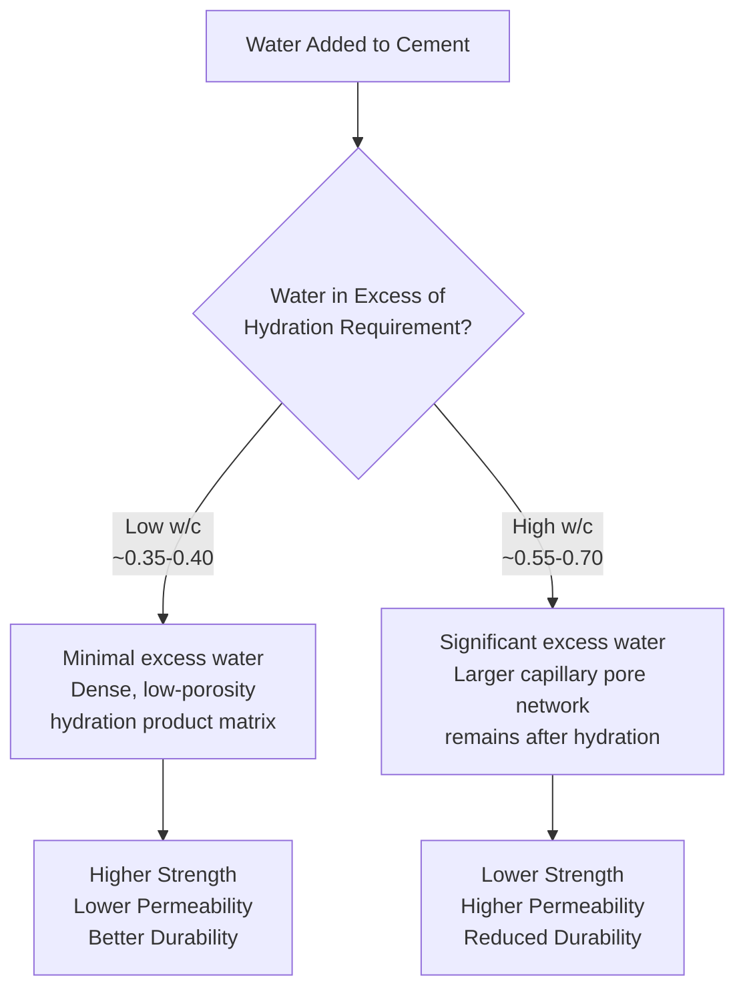
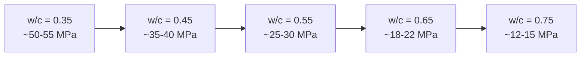

## Water-Cement Ratio and Its Effects

### Definition and Fundamental Significance

The water-cement ratio (w/c), or water-cementitious materials ratio (w/cm) when supplementary cementitious materials are included, is the ratio of the mass of water to the mass of cement (or total cementitious material) in a concrete mixture. It is widely regarded as the single most influential parameter governing hardened concrete properties, controlling the porosity, density, and connectivity of the capillary pore system that develops within the hardened cement paste matrix.

$$w/c = \frac{\text{Mass of Water}}{\text{Mass of Cement}}$$

$$w/cm = \frac{\text{Mass of Water}}{\text{Mass of Cement} + \text{Mass of SCMs}}$$

### Governing Standards and References

- **ACI 318** — Building Code Requirements for Structural Concrete (durability-based w/c limits by exposure class)
- **ACI 211.1** — Standard Practice for Selecting Proportions (strength-based w/c selection)
- **ASTM C1602 / C1602M** — Standard Specification for Mixing Water Used in Production of Hydraulic Cement Concrete
- **ASTM C39 / C39M** — Standard Test Method for Compressive Strength of Cylindrical Concrete Specimens

### Abrams' Water-Cement Ratio Law

Duff Abrams' 1918 empirical relationship established that, for a given set of materials at a given age and curing condition, compressive strength is inversely related to the water-cement ratio:

$$f'c = \frac{K_1}{K_2^{(w/c)}}$$

Where $K_1$ and $K_2$ are empirical constants specific to the particular cement, aggregate, and curing conditions used. [Inference] While the general inverse trend (lower w/c → higher strength) is well established and forms the theoretical basis for strength-based mix design, the specific constants $K_1$ and $K_2$ are not universal and require calibration via trial-batch testing for the specific materials in use on a given project.

### Physical Mechanism — Capillary Porosity

Cement requires approximately 0.22–0.25 by mass of water for complete chemical hydration reactions (chemically combined water), plus an additional amount (approximately 0.15–0.20) to fill the initially water-filled space between hydration product layers (gel pore water). Water beyond this total (roughly a w/c of ~0.40–0.42 for complete hydration under sealed/moist curing conditions) remains as unfilled capillary space if not eventually consumed by continued hydration, and this residual capillary porosity is the principal microstructural factor controlling strength and transport properties.

[Inference] The exact water requirement for complete hydration varies somewhat with cement composition and fineness; the commonly cited ~0.42 figure represents an approximate, widely referenced benchmark rather than a fixed universal value applicable to all cements.

### Effects on Hardened Concrete Properties

| Property | Effect of Decreasing w/c | Underlying Mechanism |
| --- | --- | --- |
| Compressive strength | Increases | Reduced capillary porosity, denser paste matrix |
| Permeability | Decreases | Fewer interconnected capillary pores for fluid/ion transport |
| Chloride ion penetration resistance | Improves | Reduced pore connectivity limits chloride ingress |
| Freeze-thaw durability | Generally improves (with adequate air entrainment) | Lower saturable pore volume reduces internal pressure from ice formation |
| Sulfate attack resistance | Improves | Reduced permeability limits ingress of sulfate ions |
| Carbonation rate | Decreases | Denser matrix slows CO₂ diffusion |
| Drying shrinkage | Complex relationship — often decreases with lower w/c at equal cement content, but higher cement content itself can increase shrinkage | Competing effects of paste volume and capillary water loss |
| Workability (fresh) | Decreases (for a given cement content) | Less water available to lubricate particle movement |

[Inference] The drying shrinkage relationship is more nuanced than a simple direct correlation with w/c alone, since shrinkage depends on total paste volume, aggregate stiffness/volume fraction, and curing history in addition to w/c; a lower w/c mix with a higher overall cement (and thus paste) content does not automatically guarantee lower shrinkage.

### Water-Cement Ratio vs. Compressive Strength — Typical Relationship

[Inference] The specific strength values shown are illustrative approximations for typical Type I Portland cement concrete under standard curing at 28 days; actual strength at a given w/c varies with cement type, aggregate characteristics, admixture use, and curing conditions, so project-specific trial-batch data (per ACI 211.1 procedures) is required for reliable mix design rather than generic strength-vs-w/c charts alone.

### Dual Governance: Strength-Based vs. Durability-Based W/C Selection

As established in mix design practice (ACI 211.1 / ACI 318), the design w/c is governed by whichever of two independent criteria is more restrictive (lower):

$$w/c_{design} = \min(w/c_{strength-required}, \ w/c_{durability-limit})$$

**Strength-based w/c**: Derived from the target average strength $f'_{cr}$ using a strength-vs-w/c curve calibrated to project-specific materials.

**Durability-based w/c**: Imposed by ACI 318 exposure class provisions independent of strength considerations. Representative (illustrative) ACI 318 maximum w/c limits by exposure category:

| Exposure Condition | Typical Maximum w/c (Illustrative) |
| --- | --- |
| Concrete intended to have low permeability when exposed to water | 0.50 |
| Concrete exposed to freezing and thawing in a moist condition | 0.45 |
| Concrete exposed to deicing chemicals | 0.45 |
| Concrete exposed to severe sulfate exposure | 0.45 |
| Concrete requiring corrosion protection of reinforcement in chloride-exposed environments | 0.40 |

[Inference] These figures represent illustrative, commonly cited values consistent with the general structure of ACI 318 exposure-category-based durability provisions; the current edition of ACI 318 in effect for a given project should be consulted directly for the precise, currently applicable numerical limits, since code provisions are periodically revised.

### Effects on Fresh Concrete Properties

- **Workability and slump**: For a fixed cement content, increasing water content increases slump but at the cost of higher w/c and reduced hardened performance; the preferred approach for improving workability without increasing w/c is the use of water-reducing admixtures (which allow slump increase or water reduction at constant w/c).
- **Bleeding**: Higher w/c mixes generally exhibit increased bleeding (upward migration of mix water) due to greater excess water relative to solids' capacity to retain it, which can affect surface finishing quality and create bleed-water channels (a durability concern if they form continuous paths through the section).
- **Segregation potential**: Excessively high w/c increases segregation risk, particularly in mixes with inadequate fine aggregate content or poor overall gradation.

### Relationship to Admixture Use

Water-reducing admixtures allow a reduction in mixing water at constant slump (or an increase in slump at constant water content), effectively enabling lower w/c ratios to be achieved without sacrificing workability:

- **Normal water reducers**: Typically achieve 5–12% water reduction at equivalent slump.
- **Mid-range water reducers**: Typically achieve 12–15% water reduction.
- **High-range water reducers (superplasticizers)**: Can achieve 15–40% water reduction, enabling very low w/c ratios (below 0.35, sometimes below 0.25 in high-performance applications) while maintaining workable, even flowable, consistency.

### Practical Example — Comparing Two Mix Scenarios

**Scenario A**: A pavement mix targets 28 MPa specified strength with no special exposure durability requirement.

- Strength-based w/c (from trial-batch curve): 0.50
- Durability-based w/c limit: Not applicable (no special exposure)
- Governing w/c: 0.50 (strength-governed)

**Scenario B**: The same pavement is now specified for a region with severe deicing salt exposure and freeze-thaw cycling.

- Strength-based w/c: 0.50 (unchanged, same target strength)
- Durability-based w/c limit (deicing/freeze-thaw exposure): 0.45
- Governing w/c: 0.45 (durability-governed, overriding the strength-based value)

**Consequence**: Even though 28 MPa could theoretically be achieved at w/c = 0.50, the durability requirement forces a lower w/c (0.45), which in turn typically requires either increased cementitious content (to maintain the reduced water at the required slump) or the use of water-reducing admixtures to control the incidental strength increase and cost impact that accompanies the durability-driven w/c reduction.

### Curing's Interaction with W/C Effects

The strength and durability benefits theoretically available from a low w/c mix are only fully realized with adequate curing (sufficient moisture and time for hydration to progress and reduce capillary porosity). [Inference] A low-w/c mix that is inadequately cured (e.g., allowed to dry prematurely) may not achieve the full potential strength or permeability reduction associated with its design w/c, since hydration — and the associated pore-refinement process — requires sustained moisture availability, particularly in the near-surface region most exposed to environmental drying.

### Common Misconceptions and Pitfalls

- **"Adding water for workability is harmless if done at the truck before placement"**: Field water addition beyond the design w/c (without corresponding cement addition) directly increases the effective w/c, potentially compromising both strength and durability even if the mix design itself was originally correctly proportioned.
- **Assuming w/c alone determines all durability outcomes**: While w/c is highly influential, other factors (air entrainment for freeze-thaw, SCM incorporation for chloride/sulfate resistance, adequate cover, curing quality) also significantly affect actual field durability performance.
- **Overlooking w/cm vs. w/c distinction in SCM-containing mixes**: When SCMs are present, durability and strength relationships are more accurately correlated with w/cm (total cementitious material) rather than w/c (cement alone), since SCMs contribute to pore-refining hydration products as well.

### Applications in Civil Engineering

- **Structural concrete mix design**: W/c selection is the central design decision balancing target strength against economy and workability constraints.
- **Durability-driven infrastructure**: Exposure-class-based maximum w/c limits (ACI 318) are a primary durability control mechanism for marine, freeze-thaw, deicing-salt, and sulfate-exposed structures.
- **High-performance concrete**: Very low w/c ratios (enabled by high-range water reducers and often silica fume) are central to achieving high-strength and low-permeability performance targets.
- **Quality control on-site**: Field verification that no unauthorized water addition has occurred (e.g., via slump monitoring, w/c calculation checks against batch tickets) is a standard QC practice to protect the integrity of the designed w/c.

**Related Topics**

- Capillary Porosity and Pore Structure Development in Hydrated Cement Paste
- ACI 318 Exposure Classes and Durability-Based Design Requirements
- Water-Reducing and High-Range Water-Reducing Admixtures
- Curing Methods and Their Effect on Hydration and Pore Refinement
- Chloride Permeability and Corrosion Protection of Reinforcement
- High-Performance Concrete Mix Design Strategies
- Statistical Target Strength and Mix Design Trial Batching
- Bleeding and Segregation in Fresh Concrete