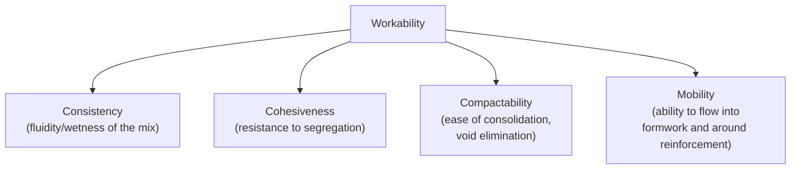
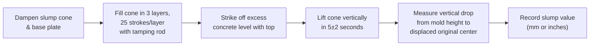

## Workability and Slump Testing


### Definition and Significance

Workability is the property of freshly mixed concrete that determines the ease with which it can be mixed, transported, placed, consolidated, and finished without segregation or excessive bleeding. It is a composite property influenced by consistency, cohesiveness, and compactability, and is not fully captured by any single test — though slump testing remains the most widely used field and laboratory index for assessing consistency as a practical proxy for workability.

### Governing Standards

- **ASTM C143 / C143M** — Standard Test Method for Slump of Hydraulic-Cement Concrete
- **ASTM C1611 / C1611M** — Standard Test Method for Slump Flow of Self-Consolidating Concrete
- **ASTM C1362** — Standard Test Method for Flow of Freshly Mixed Hydraulic Cement Concrete
- **ASTM C124** (historical/withdrawn) — Flow Table Method
- **BS EN 12350-2** — Slump test (European equivalent)
- **BS EN 12350-6** — Compacting factor test (used more commonly in UK/European practice)
- **ASTM C232 / C232M** — Bleeding of Concrete

### Components of Workability



### Factors Affecting Workability

| Factor | Effect on Workability |
| --- | --- |
| Water content | Increasing water generally increases workability (consistency), but at the cost of higher w/c |
| Cement/paste content | Higher paste content improves workability by better lubricating aggregate particles |
| Aggregate shape and texture | Rounded, smooth aggregates improve workability; angular, rough-textured aggregates reduce it |
| Aggregate gradation | Well-graded aggregate improves workability by reducing void content and paste demand |
| Nominal maximum aggregate size | Larger NMAS generally reduces water demand for a given workability level |
| Admixtures (water reducers, superplasticizers) | Improve workability without increasing w/c |
| Air entrainment | Entrained air bubbles act somewhat like small "ball bearings," typically improving workability |
| Temperature | Higher temperatures generally reduce workability retention over time (faster slump loss) |
| Time elapsed since mixing | Workability typically decreases with time due to ongoing hydration and evaporation |

### Slump Test Procedure (ASTM C143)



**Apparatus**: A frustum-shaped metal mold (slump cone), 300 mm height, 200 mm base diameter, 100 mm top diameter; a 16 mm diameter, 600 mm long tamping rod with a rounded end.

**Procedure summary**:

1. Dampen the interior of the mold and place it on a rigid, level, non-absorbent surface.
2. Fill the mold in three layers of approximately equal volume, rodding each layer 25 times with the tamping rod, distributing strokes evenly across the cross-section, with rodding penetrating slightly into the underlying layer.
3. Strike off excess concrete flush with the top of the mold.
4. Immediately (without delay) lift the mold vertically in a steady motion over a period of 5 ± 2 seconds, without lateral or torsional movement.
5. Measure the vertical difference between the height of the mold and the displaced height of the original center of the top surface of the concrete specimen (measured to the nearest 5 mm).

**Timing requirement**: The entire test, from the start of filling to removal of the mold, must be completed within approximately 2.5 minutes to minimize the effect of ongoing slump loss during testing.

### Slump Test Result Patterns

| Slump Pattern | Description | Interpretation |
| --- | --- | --- |
| True slump | Concrete subsides evenly, retaining a roughly symmetric shape | Valid, representative test result |
| Shear slump | One side of the mass shears off and slides down | Indicates a lack of cohesion; test should be repeated with a fresh sample; if shear slump persists, the mix may lack sufficient cohesiveness (often due to harsh gradation or insufficient fines/paste) |
| Collapse slump | Concrete collapses completely | Indicates a very wet, poorly proportioned, or segregating mix; result is not meaningful as a consistency indicator and should be reported as a collapse rather than a numerical slump value |

<svg xmlns="http://www.w3.org/2000/svg" viewBox="0 0 620 260">
<text x="310" y="22" text-anchor="middle" font-size="15" font-weight="bold" fill="#1a1a1a">Slump Test Result Patterns (svg_diagram)</text>
<g font-family="sans-serif" font-size="12" fill="#1a1a1a">
<text x="100" y="55" text-anchor="middle" font-weight="bold">True Slump</text>
<path d="M 50 220 L 150 220 L 130 130 Q 100 110 70 130 Z" fill="#93c5fd" stroke="#1e3a8a" stroke-width="1.5" />
<line x1="30" y1="220" x2="30" y2="90" stroke="#334155" stroke-width="1" stroke-dasharray="3,2" />
<text x="100" y="240" text-anchor="middle" font-size="11">Even, symmetric subsidence</text>



```
<text x="310" y="55" text-anchor="middle" font-weight="bold">Shear Slump</text>
<path d="M 260 220 L 360 220 L 355 160 L 300 140 L 280 200 Z" fill="#fde68a" stroke="#854d0e" stroke-width="1.5" />
<path d="M 280 200 L 300 140" stroke="#7f1d1d" stroke-width="2" stroke-dasharray="4,2" />
<text x="310" y="240" text-anchor="middle" font-size="11">One side shears away</text>

<text x="510" y="55" text-anchor="middle" font-weight="bold">Collapse</text>
<path d="M 460 220 L 570 220 L 555 205 L 475 205 Z" fill="#fca5a5" stroke="#7f1d1d" stroke-width="1.5" />
<text x="510" y="240" text-anchor="middle" font-size="11">Complete collapse,<br />no meaningful measure</text>
```

</g>
</svg>

### Typical Slump Ranges by Application

| Application | Typical Slump Range |
| --- | --- |
| Pavement/slab-on-grade (mechanically vibrated) | 25–75 mm |
| Foundations, footings, mass concrete | 50–100 mm |
| Reinforced beams, columns, walls | 75–150 mm |
| Pumped concrete (typical) | 100–200 mm (or as required by pump/mix design) |
| Self-consolidating concrete (SCC) | Slump flow of 500–800+ mm (measured via slump flow test, not conventional slump) |

[Inference] These ranges represent commonly referenced practice guidance; actual project-specific slump requirements are governed by the applicable mix design, placement method, and project specification rather than fixed universal values, and slump values falling outside these ranges are not inherently unacceptable if consistent with the approved mix design and adequate for the intended placement method.

### Self-Consolidating Concrete (SCC) — Slump Flow Test (ASTM C1611)

For highly flowable SCC mixes that exceed the useful measurement range of the conventional slump test, the slump flow test measures the horizontal spread diameter of the concrete after lifting an inverted slump cone, along with the T50 time (time for the concrete to reach a 500 mm diameter spread), providing indices of both flowability and flow rate relevant to SCC's self-leveling, self-consolidating placement behavior.

### Other Workability Assessment Methods

| Test | Standard | Approach | Typical Use Context |
| --- | --- | --- | --- |
| Compacting factor test | BS EN 12350-6 | Measures the degree of compaction achieved under standardized falling conditions | UK/European practice, low-slump/stiff mixes |
| Vebe consistometer test | ASTM C1170 (for RCC), BS EN 12350-3 | Measures time for a molded specimen to reform under vibration | Roller-compacted concrete (RCC), very stiff/low-slump mixes |
| Flow table test | ASTM C1362 / BS EN 12350-5 | Measures spread diameter after jolting a table-mounted specimen | Self-leveling/flowable mixes, mortar/grout |
| K-slump tester | ASTM C1362 (related) | In-place penetration-based device usable directly in formwork | Rapid field assessment without extracting a sample |

[Inference] No single workability test captures every practical aspect of placeability equally well; test selection depends on the specific mix consistency range and placement method relevant to the project, since low-slump stiff mixes and highly flowable SCC mixes each require different measurement approaches for meaningful, sensitive results.

### Relationship Between Slump and Water-Cement Ratio

While higher water content generally increases slump for a fixed cement/aggregate proportioning, slump is not a direct or complete substitute for w/c as a durability or strength indicator, since:

- Two mixes with identical slump can have different w/c ratios if one uses a water-reducing admixture to achieve the same consistency at lower water content.
- Slump measures consistency at the time of testing, not the mix's long-term hardened performance directly.

This distinction underlies why specifications typically control both slump (fresh property) and w/c (durability/strength-controlling property) independently, rather than relying on slump alone as a comprehensive quality indicator.

### Practical Example — Interpreting a Failed Slump Test

A ready-mix delivery is specified for 100 ± 25 mm slump. Field testing yields:

- Test 1 (as-delivered): Slump measures 40 mm (below specified range); pattern observed is a true (symmetric) slump.
- Field decision: Additional water is requested by the placing crew to increase slump.
- Test 2 (after water addition, within ASTM C94 allowable limits and documented on the batch ticket): Slump measures 95 mm; within specified range.

**Assessment**: If the water addition remained within the maximum water allowed by the approved mix design and ASTM C94 provisions (and was properly documented, since undocumented field water addition can violate the approved mix's w/c and void warranty/compliance), the adjusted batch is acceptable for placement. If the addition exceeded allowable limits, the batch should be rejected or addressed through an alternative correction method (e.g., addition of a water-reducing admixture rather than water, if pre-approved for such correction), since simply adding unauthorized water raises the effective w/c beyond the approved mix design's intended value.

### Common Testing Errors and Precautions

- **Delayed testing**: Slump naturally decreases over time after mixing (slump loss); delayed testing produces an artificially low reading not representative of the concrete's condition at batching.
- **Non-level or non-rigid test surface**: An uneven or flexible base plate can distort slump readings.
- **Inconsistent rodding**: Under- or over-rodding relative to the specified 25 strokes per layer, or uneven stroke distribution, introduces variability into results.
- **Excessive lifting speed or lateral movement**: Rapid, jerky, or non-vertical mold removal can induce an artificial shear or collapse pattern not representative of the mix's true consistency.
- **Testing a non-representative sample**: Sampling per ASTM C172 procedures is required to ensure the tested portion represents the overall batch rather than a segregated or unrepresentative sub-sample.

### Applications in Civil Engineering

- **Field quality control/acceptance**: Slump testing is the most common front-line field test for verifying that delivered concrete matches the approved mix design's intended consistency before placement.
- **Placement method compatibility**: Slump and flow characteristics inform whether a given mix is suitable for pumping, direct chute placement, or specialized methods like tremie placement (underwater concreting) or SCC applications.
- **Batch plant quality control**: Consistency monitoring across production batches helps detect raw material variability (aggregate moisture, gradation shifts) or dosing errors before they affect structural performance.
- **Specification compliance and dispute resolution**: Slump test results, properly documented (including any field water additions per ASTM C94), form part of the quality record used to verify compliance with project specifications.

**Related Topics**

- Self-Consolidating Concrete (SCC) Mix Design and Testing
- Water-Reducing Admixtures and Their Effect on Slump Retention
- ASTM C172 Sampling of Freshly Mixed Concrete
- ASTM C94 Ready-Mixed Concrete Specification and Field Water Addition Limits
- Bleeding and Segregation in Fresh Concrete (ASTM C232)
- Air-Entrained Concrete and Its Effect on Workability
- Pumpability and Placement Method Selection for Concrete
- Roller-Compacted Concrete (RCC) and the Vebe Consistency Test