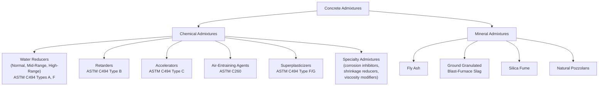
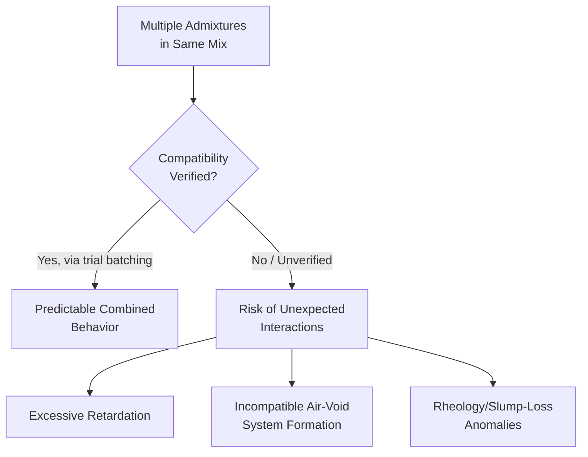

## Chemical and Mineral Admixtures

### Definition and Overview

Admixtures are materials, other than water, aggregate, cement, and fiber reinforcement, added to concrete before or during mixing to modify one or more properties of the fresh or hardened mixture. They are broadly divided into **chemical admixtures** (liquid or soluble compounds added in small dosages to control specific fresh/hardened behaviors) and **mineral admixtures** (finely divided solid materials, largely overlapping with supplementary cementitious materials, that contribute physically and/or chemically to the paste matrix). Admixtures enable performance and economy improvements that would be difficult or impossible to achieve through aggregate/cement/water proportioning alone.

### Governing Standards

- **ASTM C494 / C494M** — Standard Specification for Chemical Admixtures for Concrete (Types A–G)
- **ASTM C260 / C260M** — Standard Specification for Air-Entraining Admixtures for Concrete
- **ASTM C1017 / C1017M** — Standard Specification for Chemical Admixtures for Use in Producing Flowing Concrete
- **ASTM C1602 / C1602M** — Mixing Water Specification (relevant to admixture water contribution accounting)
- **ASTM C618 / C989 / C1240** — Fly ash, slag, and silica fume specifications (mineral admixtures, covered in depth under Supplementary Cementitious Materials)
- **ASTM C494 Type classifications** referenced throughout below

### Chemical Admixture Classification (ASTM C494)

| Type | Designation | Function |
| --- | --- | --- |
| Type A | Water-Reducing | Reduces mixing water requirement at constant workability (typically 5–12%) |
| Type B | Retarding | Delays setting time |
| Type C | Accelerating | Accelerates setting time and/or early strength development |
| Type D | Water-Reducing and Retarding | Combines Type A and Type B functions |
| Type E | Water-Reducing and Accelerating | Combines Type A and Type C functions |
| Type F | Water-Reducing, High Range | Achieves greater water reduction (typically 12–30%+) than Type A |
| Type G | Water-Reducing, High Range, and Retarding | Combines Type F and Type B functions |

### Admixture Category Overview

### Water-Reducing Admixtures (Normal Range, Type A)

Typically based on lignosulfonates or hydroxycarboxylic acids, these disperse cement particles via electrostatic repulsion (adsorbing onto particle surfaces and imparting a like-charge repulsive effect), reducing water demand for a given workability by roughly 5–12%.

**Mechanism (simplified)**: Cement particles tend to flocculate (clump) upon initial contact with water, trapping mix water within the flocs and reducing the water available to provide fluidity. Water-reducing admixtures adsorb onto cement particle surfaces, inducing electrostatic (and/or steric) repulsion that deflocculates the particles, releasing trapped water and improving fluidity at a given water content — or equivalently, allowing water content reduction at constant workability.

### High-Range Water Reducers / Superplasticizers (Type F/G)

Based on sulfonated naphthalene formaldehyde condensates, sulfonated melamine formaldehyde condensates, or (in modern practice) polycarboxylate ether (PCE) polymers, achieving substantially greater water reduction (12–40%) than normal-range water reducers.

**Polycarboxylate ether (PCE) mechanism**: In addition to electrostatic repulsion, PCE-based superplasticizers provide steric hindrance via long polymer side chains extending from the main polymer backbone, physically preventing particle re-flocculation and providing more effective, often longer-lasting dispersion compared to older lignosulfonate or naphthalene-based products.

**Applications**: Enable very low w/c concrete (below 0.35, sometimes below 0.25) while maintaining workable to flowable consistency; essential for high-performance concrete, self-consolidating concrete (SCC), and situations requiring extended pumping distances or congested reinforcement placement.

### Retarding Admixtures (Type B)

Delay the onset of the acceleration period in cement hydration (extending the dormant period), commonly based on sugars, hydroxycarboxylic acids, or certain lignosulfonate-derived compounds.

**Applications**:

- Hot-weather concreting, where elevated ambient temperature would otherwise accelerate setting and reduce workable placement time
- Large or continuous pours requiring extended workability to prevent cold joints between successive concrete lifts
- Situations requiring extended haul/transport time before placement

[Inference] Overdosing a retarder can excessively delay setting, potentially affecting formwork stripping schedules, finishing operations, or in severe cases raising quality concerns about the affected concrete; dosage is typically established through trial batching for the specific project temperature and time constraints rather than a fixed universal dosage.

### Accelerating Admixtures (Type C)

Accelerate setting time and/or early strength development, historically often based on calcium chloride, though non-chloride accelerators (e.g., based on calcium nitrate, calcium formate, or various proprietary formulations) are now widely used, particularly for reinforced concrete where chloride-induced corrosion risk must be avoided.

**Applications**:

- Cold-weather concreting, to offset the naturally slower hydration rate at low temperatures and reduce the risk of early-age freezing damage
- Fast-track construction requiring rapid formwork stripping or early load application
- Emergency repair work requiring rapid strength gain

[Inference] Calcium-chloride-based accelerators are generally avoided or restricted in reinforced concrete due to chloride-induced corrosion risk to embedded steel; non-chloride alternatives are the more common choice where reinforcement is present, subject to project-specific specification requirements.

### Air-Entraining Admixtures (ASTM C260)

Introduce a controlled system of microscopic, discrete, and stable air bubbles (typically 10 µm to 1 mm in diameter) throughout the paste matrix, distinct from the larger, less uniform entrapped air naturally present in unmodified concrete.

**Mechanism and purpose**: The entrained air-void system provides expansion relief space for water within the paste as it freezes, relieving hydraulic pressure that would otherwise develop during freeze-thaw cycling and cause internal cracking/disruption. Air entrainment is the primary and most effective known method for achieving freeze-thaw durability in concrete exposed to cyclic freezing.

**Typical target air content**: 4–8% by volume, depending on exposure severity and nominal maximum aggregate size (smaller NMAS generally requires higher target air content for equivalent protection, per ACI 318 tables).

**Spacing factor concept**: The effectiveness of an air-void system for freeze-thaw protection depends not just on total air content but on the void spacing factor (average distance water must travel to reach a relief void), assessed via petrographic analysis (ASTM C457) — meaning two mixes with identical total air content can have differing freeze-thaw performance if their void size distribution and spacing differ.

### Specialty Chemical Admixtures

| Admixture Type | Function |
| --- | --- |
| Corrosion inhibitors | Reduce reinforcement corrosion rate in chloride-exposed structures (e.g., calcium nitrite-based inhibitors) |
| Shrinkage-reducing admixtures (SRAs) | Reduce drying shrinkage by lowering the surface tension of pore water, reducing capillary tension-induced shrinkage |
| Viscosity-modifying admixtures (VMAs) | Improve segregation resistance, particularly relevant to SCC and underwater/tremie concrete |
| Coloring admixtures (pigments) | Provide architectural color |
| Permeability-reducing admixtures | Reduce water/moisture transport, often for below-grade or water-retaining structures |
| Alkali-silica reaction inhibitors | Mitigate ASR expansion (e.g., lithium-based admixtures) |

### Admixture Interaction and Compatibility Considerations

[Inference] Combining multiple admixtures (e.g., a high-range water reducer with an air-entraining agent and a retarder) can produce interactions not predictable from each admixture's individual behavior alone; trial batching with the specific combination and dosage sequence intended for production use is standard practice to verify compatibility before field application, since admixture chemistry (particularly among different superplasticizer polymer families) can vary between manufacturers and products.

### Dosage and Addition Sequencing

Most chemical admixtures are dosed as a percentage (by mass) of cementitious material content, typically ranging from 0.1% to 2% depending on the specific admixture and desired effect, though manufacturer-specific dosage recommendations and project trial-batch verification govern actual field dosing rather than generic percentages. Addition sequence (e.g., adding a superplasticizer after initial mixing rather than with the initial batch water) can significantly affect dispersion efficiency and slump retention behavior for certain admixture chemistries. [Inference — optimal addition timing is admixture- and mix-specific, established through trial batching rather than a universal rule applicable to all products.]

### Mineral Admixtures — Cross-Reference Summary

Mineral admixtures (fly ash, GGBFS, silica fume, natural pozzolans) function primarily through pozzolanic or latent hydraulic reaction mechanisms and are addressed in comprehensive detail under Supplementary Cementitious Materials; in brief summary relevant to this admixture classification context:

| Mineral Admixture | Primary Contribution |
| --- | --- |
| Fly Ash | Reduced heat of hydration, improved workability, reduced permeability |
| GGBFS | Reduced heat of hydration, improved sulfate/chloride resistance |
| Silica Fume | High strength, very low permeability, requires HRWR for workability |
| Natural Pozzolans/Metakaolin | Pozzolanic reactivity comparable in some respects to fly ash or silica fume depending on source |

### Practical Example — Admixture Selection for Hot-Weather Pumped Concrete

A high-rise building pour requires pumping concrete a significant vertical and horizontal distance in hot-weather conditions (ambient temperature approximately 35 °C), with congested reinforcement in several structural elements.

**Analysis and typical admixture package**:

- **High-range water reducer (Type F or G)**: Enables the flowable consistency needed for pumping and congested-reinforcement placement without increasing w/c.
- **Retarder (Type B, or combined Type G)**: Offsets the naturally accelerated hydration rate from elevated ambient temperature, extending workable placement time and reducing cold-joint risk between pump lifts.
- **Air-entraining agent**: Included if the structure is exposed to freeze-thaw cycling in service (though for many hot-climate high-rise applications without freeze-thaw exposure, air entrainment may not be required — determined by the applicable ACI 318 exposure classification).

**Resulting concept**: A Type G admixture (combined high-range water reduction and retardation) is a common choice for this scenario, since it addresses both the flowability and extended-workability requirements in a single product, subject to trial-batch verification for the specific project materials, temperature, and pumping distance involved.

### Common Pitfalls in Admixture Use

- **Overdosing based on assumed proportionality**: Admixture effects are not always linear with dosage; overdosing certain retarders or water reducers can produce excessive retardation, segregation, or bleeding rather than a proportionally greater beneficial effect.
- **Ignoring temperature sensitivity**: Many admixtures' effects (particularly retarders and accelerators) are temperature-dependent; a dosage validated at one ambient/concrete temperature may not perform identically under different field conditions.
- **Assuming interchangeability between products of the same ASTM C494 type**: Two Type F admixtures from different manufacturers (or different chemical families, e.g., naphthalene-based vs. polycarboxylate-based) are not guaranteed to behave identically at the same dosage; product-specific data sheets and trial batching should guide actual field dosing.
- **Neglecting compatibility testing when combining multiple admixtures**: As noted above, combined admixture use without verification testing risks unexpected interaction effects.

### Applications in Civil Engineering

- **High-performance and high-strength concrete**: Superplasticizers are essential to achieving very low w/c ratios while maintaining workability.
- **Mass concrete**: Retarders help control the timing of heat generation relative to placement sequencing in large, continuous pours.
- **Cold-weather construction**: Accelerators offset naturally slower hydration and reduce early-age freezing risk.
- **Freeze-thaw-exposed infrastructure**: Air-entraining admixtures are essentially mandatory for adequate durability performance in cyclic freezing environments.
- **Pumped and self-consolidating concrete**: High-range water reducers and viscosity-modifying admixtures enable the flow characteristics required for these placement methods.
- **Corrosion-critical structures**: Corrosion inhibitor admixtures supplement (but do not replace) adequate cover, low permeability, and appropriate w/c in protecting reinforcement in aggressive chloride environments.

**Related Topics**

- Air-Void System Analysis and Spacing Factor (ASTM C457)
- Self-Consolidating Concrete (SCC) Admixture Requirements
- Cold-Weather and Hot-Weather Concreting Practices
- Supplementary Cementitious Materials (Fly Ash, Slag, Silica Fume)
- High-Performance Concrete Mix Design Strategies
- Corrosion of Reinforcing Steel and Protective Measures
- Shrinkage-Reducing Admixtures and Drying Shrinkage Control
- Trial Batching and Admixture Compatibility Verification