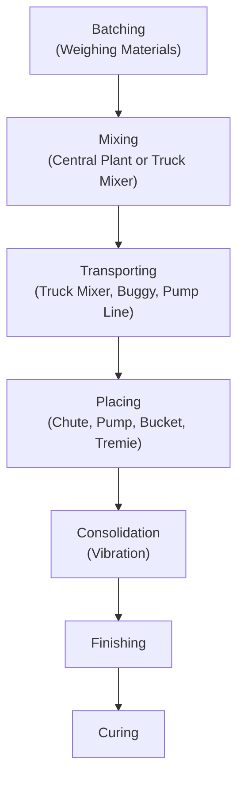
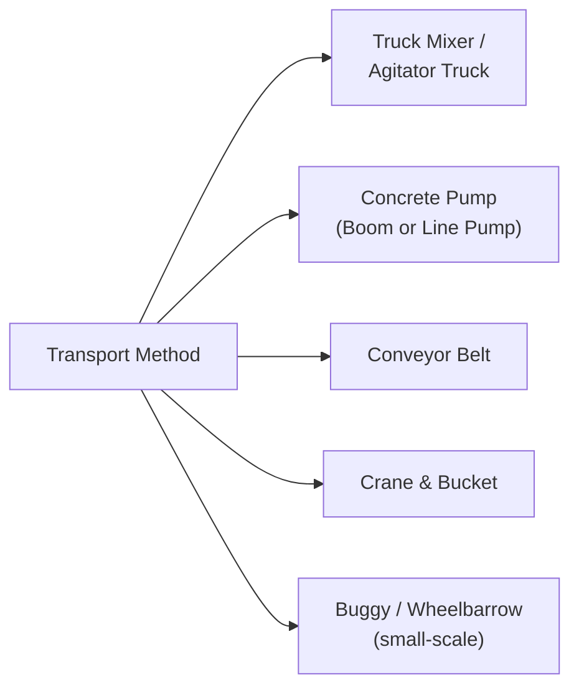
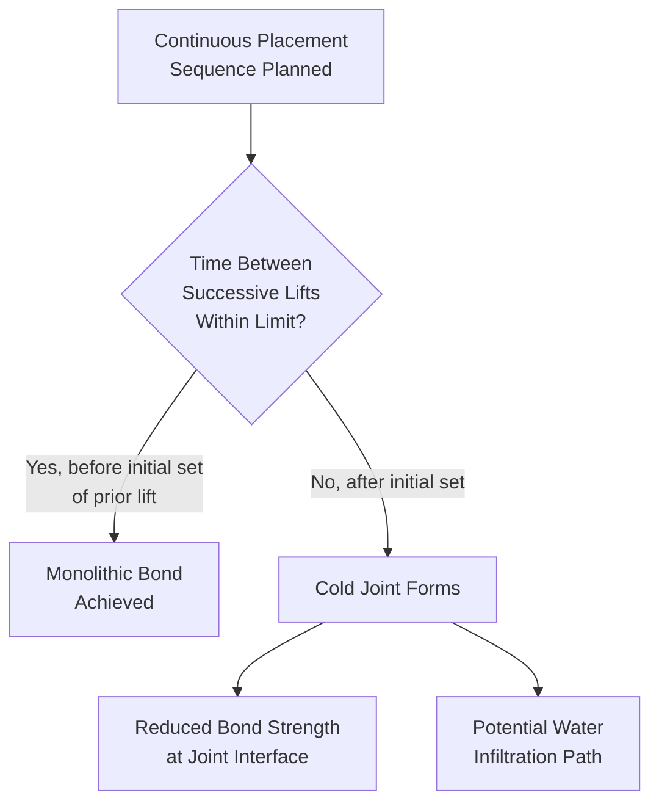

## Batching, Mixing, and Placing

### Overview

Batching, mixing, and placing represent the sequential production and field operations that transform designed mix proportions into in-place concrete. Even a correctly engineered mix design can yield deficient concrete if these operational stages are executed improperly, making process control at each stage as critical to final quality as the mix design itself.

### Governing Standards

- **ASTM C94 / C94M** — Standard Specification for Ready-Mixed Concrete
- **ASTM C172 / C172M** — Standard Practice for Sampling Freshly Mixed Concrete
- **ASTM C1077** — Standard Practice for Agencies Testing Concrete and Concrete Aggregates for Use in Construction and Criteria for Testing Agency Evaluation
- **ACI 304R** — Guide for Measuring, Mixing, Transporting, and Placing Concrete
- **ACI 301** — Specifications for Structural Concrete
- **ACI 305R / ACI 306R** — Hot Weather / Cold Weather Concreting Guides

### Process Flow Overview

### Batching

Batching is the process of measuring and combining the correct proportions of cement, aggregates, water, and admixtures per the approved mix design.

**Batching methods**:

- **Weight batching**: Materials measured by mass using calibrated scales; the preferred and most accurate method for most structural concrete production (ASTM C94 requires weight batching for cementitious materials and aggregates within specified tolerances).
- **Volume batching**: Materials measured by volume; less precise due to bulking effects (particularly relevant for fine aggregate moisture-induced bulking) and is generally limited to smaller-scale or less critical applications.

**ASTM C94 batching tolerances (illustrative)**:

| Material | Typical Tolerance |
| --- | --- |
| Cementitious materials | ±1% of specified mass (for batches ≥30% of scale capacity) |
| Water | ±1% (excluding water contributed by aggregate moisture, computed separately) |
| Aggregates | ±2% of specified mass |
| Admixtures | ±3% of specified dosage |

[Inference] Exact tolerance figures are subject to the specific edition of ASTM C94 governing a project; current editions should be consulted for precise applicable values, since standard revisions periodically refine these tolerances.

**Moisture correction at batching**: As established in aggregate moisture testing, batch water and aggregate mass must be adjusted for measured field moisture content to preserve the intended design w/c and total aggregate volume.

### Mixing

**Central-mixed concrete**: Concrete is fully mixed in a stationary mixer at the batch plant before being discharged into a truck mixer (or agitator) for transport, typically requiring less total mixing/agitation time and providing more consistent uniformity due to controlled plant mixing conditions.

**Truck-mixed (transit-mixed) concrete**: Raw materials are batched into the truck mixer drum, and mixing occurs during transit or upon arrival at the site, using the truck's rotating drum.

**Mixing time and revolutions (ASTM C94)**: Truck mixing typically requires a specified minimum number of drum revolutions at mixing speed (commonly 70–100 revolutions, though specific requirements vary by drum size/type and specification) to achieve uniform consistency, verified via uniformity testing (ASTM C94 Annex/uniformity criteria) when required.

**Mixer uniformity requirements**: ASTM C94 establishes acceptance criteria for mixer performance, including limits on variation in unit weight, air content, slump, and coarse aggregate content between samples taken from different portions of the same batch, ensuring the mixer adequately homogenizes the batch rather than leaving pockets of segregated or under-mixed material.

### Transporting

Transport method selection depends on distance, site access, structural element location (e.g., elevated placements favoring pumping or bucket/crane methods), pour volume, and rate requirements. ASTM C94 establishes maximum allowable elapsed time (or drum revolution limits) between initial batching and complete discharge/placement (commonly referenced as approximately 90 minutes or 300 drum revolutions, whichever occurs first, though specific limits can be adjusted with retarding admixture use or per project specification) to limit the effects of ongoing hydration and slump loss during transport.

**Discharge time/temperature considerations**: Elevated ambient temperatures accelerate hydration and slump loss, often requiring reduced maximum allowable transport time or the use of retarding admixtures/ice-cooled mixing water in hot-weather concreting (per ACI 305R).

### Placing Methods

| Method | Application Context | Key Considerations |
| --- | --- | --- |
| Direct chute discharge | Ground-level or shallow excavation placements accessible to the truck | Limited reach; risk of segregation if concrete free-falls excessive height |
| Concrete pump (boom or line) | Elevated, congested, or remote placements | Pumpability depends on mix design (adequate paste content, gradation); pipeline blockage risk with poorly proportioned mixes |
| Crane and bucket | Elevated or otherwise inaccessible placements, mass concrete | Requires crane availability and coordination; controlled discharge reduces segregation risk |
| Conveyor belt | High-volume, relatively level or gently sloped placements | Segregation risk at belt discharge point and transfer points if not controlled |
| Tremie method | Underwater or drilled-shaft (deep foundation) placements | Concrete placed through a pipe extending below the surface of previously placed concrete to prevent water contact/washout and segregation |
| Pneumatic placement (shotcrete) | Vertical/overhead surfaces, repair work, tunnel linings | Specialized mix design and equipment; addressed in detail under shotcrete-specific topics |

### Free-Fall Height and Segregation Control

Excessive free-fall height during placement can cause segregation, as coarser aggregate particles separate from the mortar fraction due to differing settling velocities during the fall. Common practice guidance suggests limiting free-fall height (commonly cited around 1–1.5 m for typical mixes, though this varies with mix cohesiveness and aggregate characteristics) or using tremie pipes/elephant trunks to control the fall path and minimize segregation in deep placements such as columns or deep walls. [Inference] Specific maximum free-fall height limits vary by project specification, mix cohesiveness, and applicable code/guide provisions rather than a single universal value.

### Placement Sequencing and Cold Joints

Cold joints occur when a time gap between successive concrete placements allows the earlier lift to begin setting before the next lift is placed, preventing proper intermixing and monolithic bond between layers. Placement planning (rate of concrete supply, crew size, formwork/consolidation sequencing) aims to keep successive lift placement within the initial-set timeframe of the previously placed concrete, particularly critical in mass pours or elements requiring monolithic behavior.

### Consolidation (Vibration)

Following placement, concrete must be consolidated to eliminate entrapped air voids and ensure complete filling around reinforcement and formwork, typically via:

- **Internal (immersion) vibrators**: Inserted directly into the fresh concrete at regular intervals and depths, the most common method for structural concrete.
- **Form (external) vibrators**: Attached to formwork exterior, used where internal vibrator access is restricted (e.g., thin sections, heavily congested reinforcement).
- **Surface (screed) vibrators**: Used for slabs and pavements to consolidate the top surface layer.

**Over-vibration risk**: Excessive vibration duration or improper technique can cause segregation (heavier aggregate settling, lighter paste/mortar rising) or excessive bleeding, counterproductive to the consolidation objective. [Inference] Optimal vibration duration depends on mix workability, vibrator frequency/amplitude, and section geometry, so field technique is typically guided by visual cues (cessation of large air bubble release, appearance of a glistening surface film) rather than a fixed universal time value.

### Sampling for Quality Control (ASTM C172)

Representative sampling of freshly mixed concrete for QC testing (slump, air content, unit weight, temperature, strength specimen molding) must follow standardized procedures to ensure the tested sample reflects the actual batch composition rather than a segregated or unrepresentative portion (e.g., avoiding sampling solely from the very beginning or very end of discharge, where segregation is more likely).

### Practical Example — Placement Planning for a Mass Concrete Foundation

A large mat foundation pour (continuous placement required to avoid cold joints across the element) is planned with the following considerations:

- **Total pour volume**: Requires multiple truck deliveries over an extended placement duration.
- **Ambient temperature**: Moderate (approximately 25 °C), with retarding admixture incorporated into the mix design to extend workable time and control the timing of peak hydration heat relative to the placement schedule.
- **Placement method**: Concrete pump with boom, feeding a placement sequence planned to advance across the mat in a manner that keeps each successive placement zone within the initial-set timeframe of adjacent, previously placed concrete.
- **Consolidation**: Internal vibrators used systematically at planned insertion spacing and depth to ensure adequate consolidation throughout the substantial pour depth.

**Assessment**: This combination of admixture selection (retardation to extend the workable window and manage heat timing), placement method (pumping, for the volume and reach required), and sequencing planning (to avoid cold joints across a large, continuous element) reflects standard mass-concrete placement practice; actual mix design and sequencing details would be established via project-specific planning incorporating ACI 304R and 305R/306R guidance as applicable to the specific site conditions. [Inference — specific admixture dosage and sequencing timing require project-specific verification through trial batching and placement rate planning.]

### Common Batching, Mixing, and Placing Errors

- **Unauthorized field water addition**: Adding water beyond ASTM C94 allowable limits (or without proper documentation) at the jobsite compromises the approved mix design's w/c ratio.
- **Exceeding maximum haul/discharge time**: Concrete placed after excessive elapsed time or drum revolutions may exhibit reduced workability, altered air content, and potentially compromised strength/finish quality.
- **Excessive free-fall height causing segregation**: Particularly relevant in deep placements (columns, deep walls) without tremie pipes or elephant trunks to control the fall path.
- **Inadequate consolidation**: Insufficient vibration leaves entrapped air voids (honeycombing), reducing strength and increasing permeability at affected locations.
- **Poor placement sequencing causing cold joints**: Inadequate planning of placement rate relative to available crew, equipment, and concrete supply can create unintended cold joints in elements requiring monolithic behavior.

### Applications in Civil Engineering

- **Ready-mix concrete production**: ASTM C94 governs the contractual and technical framework for ready-mixed concrete supply, batching tolerances, and mixing uniformity requirements.
- **Mass concrete construction**: Placement sequencing and consolidation planning directly affect thermal cracking risk and monolithic structural behavior in large pours.
- **High-rise and pumped concrete construction**: Placement method selection (pumping, bucket, etc.) and mix design compatibility (pumpability) are critical logistics and quality considerations.
- **Underwater and deep foundation construction**: Tremie placement techniques are essential to prevent segregation and water contamination in drilled shafts, slurry walls, and underwater placements.
- **Quality control programs**: Standardized sampling (ASTM C172) and batching/mixing verification (ASTM C94) form the operational backbone of concrete quality assurance on any project.

**Related Topics**

- ASTM C94 Ready-Mixed Concrete Specification in Detail
- Hot-Weather and Cold-Weather Concreting Practices (ACI 305R / 306R)
- Tremie Placement Methods for Underwater and Deep Foundation Concrete
- Consolidation Techniques and Vibrator Selection
- Cold Joint Prevention and Placement Sequencing Planning
- Sampling of Freshly Mixed Concrete (ASTM C172)
- Pumpability and Mix Design Considerations for Pumped Concrete
- Curing Methods and Their Role Following Placement