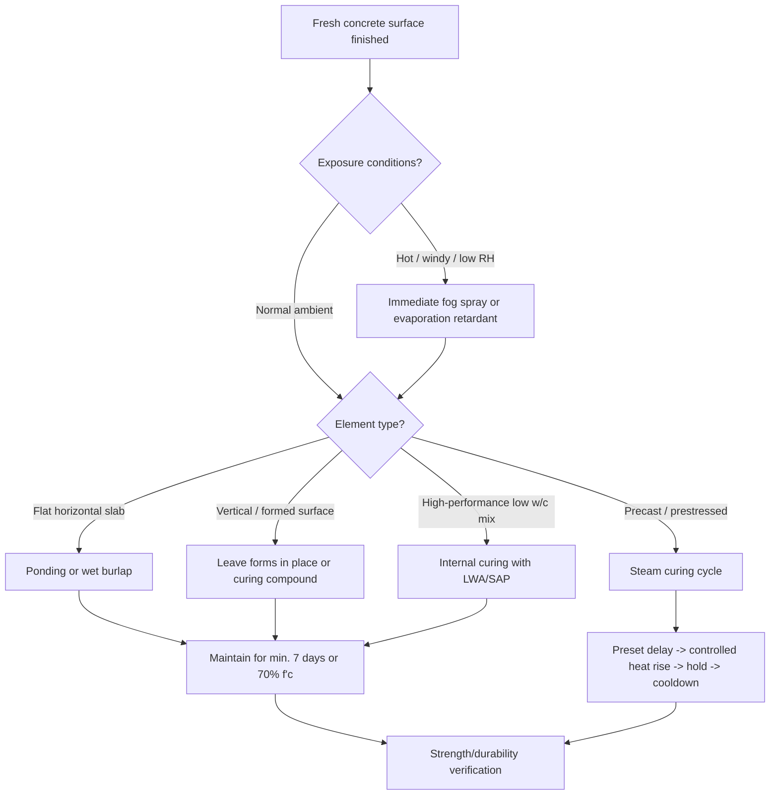

## Curing Methods and Their Influence

### Definition and Purpose

Curing is the process of maintaining adequate moisture content and favorable temperature in concrete for a defined period after placing and finishing, to allow cement hydration to proceed to the extent required for developing target strength and durability. Hydration is a continuous chemical reaction between cement and water; if water is lost to evaporation or the temperature drops outside a favorable range, hydration slows or stops, leaving unhydrated cement particles and a more porous, weaker microstructure.

**Key Points**

- Curing does not "dry" concrete — premature drying is the primary failure mode curing prevents
- Strength gain and permeability reduction both depend on continued hydration, not merely on time elapsed
- The first 3–7 days are the most critical curing window, though extended curing continues to benefit strength and durability for weeks

### Why Curing Matters: The Hydration Link

Cement hydration is governed approximately by the water-cement ratio and the availability of capillary water within the paste. Portland cement requires roughly 0.22–0.25 by mass of water for complete chemical hydration, but typical mixes use water-cement ratios of 0.4–0.6 for workability. This excess water occupies capillary pores that gradually fill with hydration products (primarily calcium silicate hydrate, C-S-H) over time — provided moisture remains available.

If surface moisture evaporates faster than it can be replenished by internal bleed water or external curing water, hydration in the near-surface zone (the "cover concrete" protecting reinforcement) stops early. This produces:

- A weaker, more porous surface layer (reduced compressive and abrasion resistance)
- Increased permeability to water, chlorides, and carbon dioxide, accelerating reinforcement corrosion and carbonation-induced deterioration
- Plastic shrinkage cracking during the first hours, and drying shrinkage cracking later

$$f_c(t) \approx f_{c,28} \left( \frac{t}{a + bt} \right)$$

where $f_c(t)$ is compressive strength at age $t$ (days), and $a$, $b$ are empirical constants depending on cement type (ACI maturity-type strength-gain models). This relationship assumes continuous adequate curing; interrupted curing invalidates the projection. [Inference: exact constants vary by cement type, mix proportions, and curing regime, so this is a generalized form rather than a universal formula.]

### Classification of Curing Methods

#### 1. Water/Moisture Curing Methods

These methods maintain a continuously wet or saturated surface, supplying external water to compensate for evaporation and hydration consumption.

- **Ponding**: Flat surfaces (slabs, pavements) are surrounded by earth or sand berms and flooded with water. Highly effective and provides thermal stabilization but requires level surfaces and larger water volumes.
- **Sprinkling/Fogging**: Continuous or intermittent spraying, common for vertical or irregular surfaces. Requires attention to avoid intermittent wetting-drying cycles, which can be more damaging than no curing at all if not managed.
- **Wet coverings (burlap, cotton mats, sand)**: Absorbent materials are saturated and kept wet, insulating and retaining moisture at the surface. Requires periodic re-wetting.
- **Immersion**: Used for precast elements or specimens (e.g., standard-cured cylinders per ASTM C511), submerged in saturated lime-water tanks at controlled temperature (23 ± 2°C).

#### 2. Moisture-Retaining Cover Methods

- **Plastic sheeting**: Impermeable polyethylene sheets placed over the surface trap the concrete's own bleed water and reduce evaporation. Low-cost and widely used, but can cause surface discoloration/mottling and non-uniform moisture if not sealed at edges.
- **Curing paper**: Reinforced waterproof paper, similar function to plastic sheeting, with better tear resistance.

#### 3. Membrane-Forming Curing Compounds

Liquid compounds (wax-based, resin-based, or chlorinated rubber) sprayed onto the fresh surface that form a continuous membrane, sealing in moisture without requiring water application.

- Governed by ASTM C309 (liquid membrane-forming compounds) and ASTM C1315 (compounds with additional sealing/curing properties for concrete surfaces to receive coatings)
- Applied immediately after finishing (or after formwork removal for vertical surfaces) at specified coverage rates (typically 200 ft²/gal or per manufacturer data)
- Advantages: labor-efficient, no re-wetting cycles, suitable for large pours and remote sites
- Limitations: can interfere with adhesion of subsequent finishes (toppings, coatings, tile) unless a compatible or removable compound is selected; UV degradation over time; less effective than water curing for very low w/c mixes needing internal moisture replenishment

#### 4. Formwork-Based Curing

Leaving formwork in place extends curing time passively by reducing moisture loss through formed surfaces. Effective but limits inspection and delays reuse of forms; often supplemented with wetting of exposed top surfaces.

#### 5. Steam Curing and Accelerated/Thermal Curing

Used predominantly in precast and prestressed concrete production to accelerate early strength gain and enable rapid form turnover.

- **Low-pressure (atmospheric) steam curing**: Cycle typically includes a preset/delay period (2–4 hours before heat application, allowing initial set and preventing delayed ettringite formation risk), a controlled temperature rise (max ~20–22°C/hour), a hold period at peak temperature (typically 60–80°C), and controlled cooldown.
- **High-pressure (autoclave) steam curing**: Used for masonry units and some precast products; involves saturated steam at elevated pressure (up to ~170°C), producing different hydration products (e.g., tobermorite) and enabling very rapid strength development.
- **Risk**: Excessive early heat (>70°C in the first hours) can trigger delayed ettringite formation (DEF), causing expansive internal cracking months to years later. [Unverified: the specific temperature threshold for DEF risk is mix- and cement-source dependent, and thresholds cited in literature vary.]

#### 6. Internal Curing

A newer technique using pre-wetted lightweight aggregate (LWA) or superabsorbent polymers (SAP) incorporated into the mix, acting as internal water reservoirs that release moisture progressively as hydration consumes capillary water.

- Particularly valuable for low w/c (high-performance, high-strength) concretes where external water curing cannot penetrate the dense surface
- Governed conceptually by ACI 308-213 guidance and research from NIST/ACI Committee 231
- Reduces autogenous shrinkage significantly in low w/c systems

### Curing Duration Requirements

Per ACI 308R (Guide to Curing Concrete) and typical code provisions (ACI 318), minimum curing durations are commonly specified as:

| Condition | Typical Minimum Curing Period |
| --- | --- |
| Normal Portland cement, standard exposure | 7 days (or until 70% of $f_c'$ is attained) |
| Cement with supplementary cementitious materials (fly ash, slag) | 10–14 days (slower early hydration) |
| High-early-strength cement (Type III) | 3 days |
| Cold weather concreting | Extended per ACI 306, protection until strength reaches specified thresholds before form/insulation removal |
| Hot weather concreting | Curing initiated immediately after finishing per ACI 305 to counter high evaporation rates |

**Note**: Many specifications now favor a **performance-based** criterion (percentage of specified strength attained, verified by field-cured cylinders or maturity method per ASTM C1074) over a fixed calendar duration.

### Environmental Factors Affecting Curing Efficacy

- **Ambient temperature**: Higher temperatures accelerate early hydration but can also accelerate surface drying and reduce long-term strength/durability ("cross-over effect") if curing water is insufficient
- **Relative humidity and wind speed**: The ACI evaporation rate nomograph (based on concrete temperature, air temperature, relative humidity, and wind velocity) estimates surface water loss rate; when evaporation exceeds approximately 1.0 kg/m²/hr, plastic shrinkage cracking risk becomes high and immediate curing/fog spraying is required
- **Solar radiation**: Direct sun accelerates evaporation and can cause differential curing across a slab

$$E = f(T_c, T_a, RH, V)$$

where $E$ is the evaporation rate, $T_c$ is concrete temperature, $T_a$ is air temperature, $RH$ is relative humidity, and $V$ is wind velocity (per the ACI 305 nomograph, a graphical/empirical relationship rather than a closed-form equation).

### Illustration: Curing Method Decision Flow

### Influence on Mechanical and Durability Properties

**Example**

Two identical slabs cast from the same batch (w/c = 0.45): Slab A is water-cured for 7 days; Slab B is left uncured (no covering, exposed to 30°C, 40% RH, moderate wind). Typical comparative outcomes reported in literature:

- Slab A: ~100% of design 28-day strength; surface permeability (rapid chloride permeability test) in the "low" category
- Slab B: often only 60–70% of design strength at the surface zone; permeability may fall in the "moderate to high" category, and surface crazing/dusting is common

[Inference: precise percentage differences depend on cement type, mix design, and site microclimate; the ranges above reflect commonly cited trends in curing research rather than a fixed universal ratio.]

Effects of inadequate curing include:

- Reduced compressive and flexural strength (most pronounced near the surface, the zone most relevant for abrasion and reinforcement protection)
- Increased drying shrinkage cracking due to rapid moisture loss
- Reduced resistance to freeze-thaw cycling, sulfate attack, and chloride-induced corrosion due to higher capillary porosity
- Surface defects: crazing, dusting, scaling, plastic shrinkage cracks

### Curing in Special Conditions

- **Mass concrete** (dams, thick foundations): Curing strategy shifts toward temperature control rather than moisture retention alone, since heat of hydration in large pours can create damaging internal-to-surface thermal gradients; insulation blankets are often used to slow surface cooling rather than to add moisture
- **Cold weather (ACI 306)**: Concrete must be protected from freezing until it reaches a minimum strength (commonly cited as 3.5 MPa / 500 psi) to resist frost damage to the fresh paste; insulated blankets or heated enclosures combine curing and thermal protection
- **Hot weather (ACI 305)**: Emphasis on minimizing evaporation immediately after finishing, using evaporation retarders, sunshades, windbreaks, and cooled mixing water

### Common Specifications and Standards Reference

| Standard | Scope |
| --- | --- |
| ACI 308R | Guide to Curing Concrete (general methods and durations) |
| ACI 305R | Hot Weather Concreting |
| ACI 306R | Cold Weather Concreting |
| ASTM C309 | Liquid membrane-forming curing compounds |
| ASTM C1315 | Curing compounds for surfaces to receive further treatments |
| ASTM C511 | Standard curing rooms and water storage tanks for specimens |
| ASTM C1074 | Maturity method for estimating in-place strength |

### Common Pitfalls

- Applying curing compound over bleed water still present on the surface, trapping it and weakening the surface layer
- Intermittent wet-dry cycling from irregular sprinkling, which can be worse than a single controlled drying event due to repeated shrink-swell stress
- Removing formwork too early in cold weather, exposing green concrete to freezing before adequate strength is reached
- Assuming curing compound eliminates the need for any additional protection in extreme hot/windy conditions

**Related Topics**

- Water-Cement Ratio and Its Effect on Strength and Durability
- Plastic and Drying Shrinkage Cracking Mechanisms
- Hot and Cold Weather Concreting Practices (ACI 305/306)
- Supplementary Cementitious Materials and Hydration Kinetics
- Concrete Durability: Permeability, Carbonation, and Chloride Ingress
- Maturity Method and In-Place Strength Estimation (ASTM C1074)
- Mass Concrete Thermal Control and Heat of Hydration Management