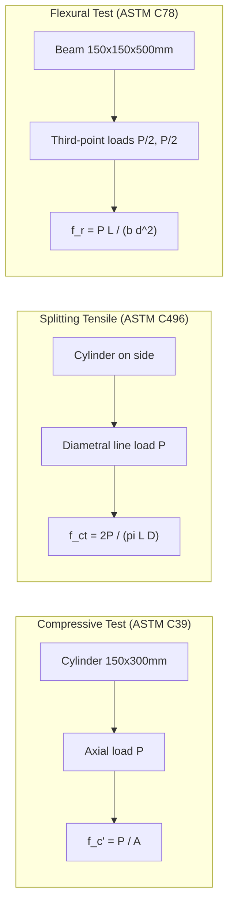

## Compressive, Tensile, and Flexural Strength

### Overview

Concrete's mechanical strength is characterized through three principal test modes — compressive, tensile (direct or split), and flexural — each measuring a different aspect of the material's response to load. Concrete is inherently strong in compression but weak in tension (typically 8–12% of its compressive strength), a fundamental asymmetry that governs virtually every structural design decision involving reinforcement.

**Key Points**

- Compressive strength ($f_c'$) is the primary design parameter and quality control metric worldwide
- Tensile strength governs cracking behavior and is critical for pavement, shrinkage, and shear design
- Flexural strength (modulus of rupture) is specifically relevant to unreinforced or lightly reinforced flexural members such as pavements and slabs-on-grade
- All three properties are correlated but not interchangeable — each is measured with a distinct test geometry and loading mode

### Compressive Strength

#### Definition and Significance

Compressive strength is the maximum resistance of a concrete specimen to axial compressive loading, expressed as stress at failure. It is the benchmark property used in mix design, structural design (via $f_c'$ in ACI 318 or $f_{ck}$ in Eurocode 2), and quality acceptance testing.

$$f_c' = \frac{P}{A}$$

where $P$ is the maximum applied load at failure and $A$ is the cross-sectional area of the specimen.

#### Standard Test Methods

- **ASTM C39 / AASHTO T22**: Compressive strength of cylindrical concrete specimens (standard: 150 mm × 300 mm or 100 mm × 200 mm cylinders), tested at a controlled loading rate (0.15–0.35 MPa/s)
- **BS EN 12390-3**: Cube specimens (150 mm or 100 mm cubes), standard in UK/European practice — cube strengths are numerically higher than cylinder strengths for the same concrete (cylinder strength ≈ 0.8 × cube strength, though the ratio varies with strength level)
- Specimens are typically tested at 7 and 28 days, with 28 days as the standard reference age for $f_c'$

#### Factors Influencing Compressive Strength

- **Water-cement ratio**: The dominant factor; strength decreases as w/c increases, following the general Abrams' Law relationship
- **Aggregate properties**: Maximum size, shape (angular vs. rounded), surface texture, and strength of the aggregate itself
- **Curing**: As discussed in curing methods, inadequate curing significantly reduces achievable strength
- **Age**: Strength continues to increase beyond 28 days as hydration progresses, though at a diminishing rate
- **Air content**: Entrained air for freeze-thaw resistance reduces compressive strength (approximately 5% strength reduction per 1% air content, as a general rule of thumb)
- **Cement type and supplementary cementitious materials**: Fly ash, slag, and silica fume alter strength development rates and ultimate strength

$$f_c' \approx \frac{K_1}{K_2^{(w/c)}}$$

Abrams' Law (empirical form), where $K_1$ and $K_2$ are constants depending on materials, age, and curing condition. [Inference: this is a simplified empirical model; actual strength-w/c relationships in modern mixes with admixtures and SCMs deviate from the classical Abrams curve.]

#### Typical Compressive Strength Classes

| Class | $f_c'$ (MPa) | Typical Application |
| --- | --- | --- |
| Low strength | 10–17 | Mass concrete, non-structural fill |
| Normal strength | 20–40 | General structural (buildings, bridges) |
| High strength | 40–100 | High-rise columns, prestressed elements |
| Ultra-high performance | 100–200+ | Specialized precast, UHPC applications |

### Tensile Strength

#### Direct Tensile Strength

Rarely tested directly due to specimen gripping difficulties and stress concentration issues at the grips, which frequently cause premature failure unrelated to the material's true tensile capacity. When performed, it uses dog-bone or dumbbell-shaped specimens under axial pull.

#### Splitting Tensile Strength (Indirect Tension)

The most common practical method for evaluating tensile behavior, governed by **ASTM C496 / AASHTO T198**.

- A cylindrical specimen (same geometry as compression cylinders) is loaded along a diametral line through packing strips, inducing a nearly uniform tensile stress across the vertical diametral plane until splitting failure occurs

$$f_{ct} = \frac{2P}{\pi L D}$$

where $f_{ct}$ is splitting tensile strength, $P$ is maximum applied load, $L$ is specimen length, and $D$ is specimen diameter.

- Typical relationship to compressive strength (empirical, ACI 318 commentary):

$$f_{ct} \approx 0.56\sqrt{f_c'} \text{ (MPa)}$$

[Inference: coefficient varies by aggregate type and mix — commonly cited ranges are 0.5–0.6 for normal-weight concrete; this is an empirical correlation, not a fundamental material law.]

#### Significance of Tensile Strength

- Governs cracking under restrained shrinkage and thermal movement
- Directly relevant to shear capacity of concrete (shear strength derives substantially from tensile capacity across potential crack planes)
- Critical for design of pavements, where load-induced tensile stresses at the slab underside/top govern fatigue cracking

### Flexural Strength (Modulus of Rupture)

#### Definition

Flexural strength, or modulus of rupture ($f_r$ or MR), is the maximum tensile stress at the extreme fiber of an unreinforced concrete beam at the point of failure under bending, computed using elastic beam theory even though concrete's actual stress-strain response is nonlinear near failure.

#### Standard Test Methods

- **ASTM C78 / AASHTO T97**: Third-point loading — a simply supported beam (typically 150 mm × 150 mm × 500 mm) is loaded at two points, each located at one-third of the span, producing a constant-moment (zero shear) region in the middle third
- **ASTM C293**: Center-point (third-point alternative) loading — single load applied at midspan; generally yields slightly higher (less conservative) MR values than third-point loading because it tests a smaller volume of extreme-fiber material at peak stress

For third-point loading with fracture within the middle third:

$$f_r = \frac{PL}{bd^2}$$

For center-point loading:

$$f_r = \frac{3PL}{2bd^2}$$

where $P$ is maximum applied load, $L$ is span length, $b$ is specimen width, and $d$ is specimen depth. If fracture occurs outside the middle third in third-point loading, a modified formula accounting for the fracture location ($a$, distance from support to nearest fracture line) is used:

$$f_r = \frac{3Pa}{bd^2}$$

#### Relationship to Compressive Strength

$$f_r \approx 0.62\sqrt{f_c'} \text{ to } 0.7\sqrt{f_c'} \text{ (MPa, normal-weight concrete)}$$

ACI 318 commonly adopts:

$$f_r = 0.62\lambda\sqrt{f_c'}$$

where $\lambda$ is a modification factor for lightweight concrete (1.0 for normal-weight, 0.75–0.85 for lightweight concretes depending on aggregate composition).

**Example**

For a normal-weight concrete with $f_c' = 30$ MPa:

- Estimated splitting tensile strength: $f_{ct} \approx 0.56\sqrt{30} \approx 3.07$ MPa
- Estimated modulus of rupture: $f_r \approx 0.62\sqrt{30} \approx 3.40$ MPa
- Ratio $f_r/f_c'$: approximately 0.11 (consistent with the general observation that tensile-mode strengths are roughly 10–15% of compressive strength)

[Inference: these are estimation formulas for design purposes; actual tested values on a given mix may deviate meaningfully from predictions, especially with SCMs or unusual aggregates, and direct testing is recommended for critical applications.]

### Comparative Summary

| Property | Test Standard | Loading Mode | Typical Magnitude (relative to $f_c'$) | Primary Use |
| --- | --- | --- | --- | --- |
| Compressive | ASTM C39 | Uniaxial compression | 100% (reference) | Structural design, QC |
| Splitting Tensile | ASTM C496 | Diametral compression → indirect tension | ~8–12% | Shear design correlation, cracking assessment |
| Flexural (MR) | ASTM C78/C293 | Third/center-point bending | ~10–15% | Pavement design, plain concrete slabs |

### Illustration: Test Configurations

Stress distribution across a flexural beam cross-section at the extreme fiber (svg_diagram):

<svg xmlns="http://www.w3.org/2000/svg" viewBox="0 0 500 260" font-family="Arial, sans-serif">
<text x="250" y="20" font-size="14" text-anchor="middle" font-weight="bold">Flexural Stress Distribution (svg_diagram)</text>
<line x1="80" y1="50" x2="80" y2="200" stroke="#333" stroke-width="2" />
<line x1="80" y1="50" x2="420" y2="50" stroke="#333" stroke-width="2" />
<line x1="80" y1="200" x2="420" y2="200" stroke="#333" stroke-width="2" />
<line x1="420" y1="50" x2="420" y2="200" stroke="#333" stroke-width="2" />
<line x1="80" y1="125" x2="420" y2="125" stroke="#999" stroke-width="1" stroke-dasharray="4,4" />
<text x="430" y="129" font-size="11">N.A.</text>
<polygon points="250,50 250,122 420,90" fill="#c0392b" opacity="0.4" />
<polygon points="250,128 250,200 420,160" fill="#2980b9" opacity="0.4" />
<text x="440" y="65" font-size="11" fill="#c0392b">Compression (top)</text>
<text x="440" y="185" font-size="11" fill="#2980b9">Tension (bottom, f_r)</text>
<line x1="250" y1="45" x2="250" y2="205" stroke="#666" stroke-width="1" stroke-dasharray="2,2" />
<text x="230" y="220" font-size="11">Mid-span section</text>
<text x="150" y="235" font-size="10" fill="#555">Crack initiates at bottom fiber when tensile stress reaches f_r</text>
</svg>

### Behavioral Notes and Design Implications

- Because concrete's tensile capacity is low and variable, reinforced concrete design assumes concrete carries negligible tension post-cracking, transferring tensile forces entirely to reinforcing steel
- Flexural strength (MR) is used directly in rigid pavement thickness design (e.g., PCA and AASHTO pavement design methods), since pavement slabs behave as unreinforced (or minimally reinforced) flexural members
- Splitting tensile strength correlates well with shear friction and dowel action behavior in reinforced members and is used in some shear design provisions
- All correlation formulas between $f_c'$, $f_{ct}$, and $f_r$ are empirical approximations; behavior may vary meaningfully with aggregate mineralogy, paste-aggregate bond quality, and the presence of SCMs — direct testing is preferred over formula-based estimation for critical or non-standard mixes

**Related Topics**

- Water-Cement Ratio and Abrams' Law
- Curing Methods and Their Influence
- Modulus of Elasticity and Stress-Strain Behavior of Concrete
- Shear Design and the Role of Concrete Tensile Capacity
- Rigid Pavement Design Using Modulus of Rupture
- Statistical Quality Control of Concrete Strength (ACI 214)
- High-Strength and Ultra-High-Performance Concrete (UHPC)