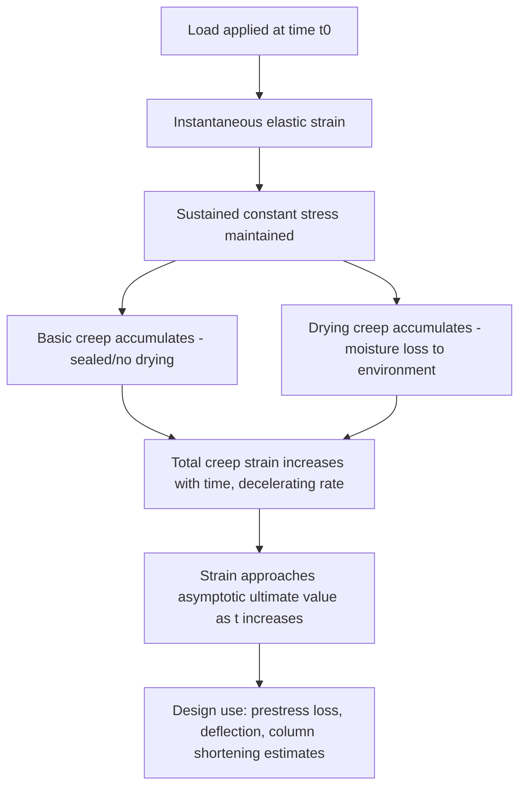

## Modulus of Elasticity and Creep

### Overview

Modulus of elasticity and creep are time-dependent and load-dependent deformation properties of hardened concrete that govern serviceability behavior — deflections, prestress losses, and long-term structural response — as distinct from strength properties, which govern ultimate capacity. Both properties are essential inputs for structural analysis, particularly in prestressed concrete, tall buildings, and long-span structures where deformation control is often more critical than strength.

**Key Points**

- Modulus of elasticity ($E_c$) describes the instantaneous stress-strain relationship under short-term loading
- Creep describes the time-dependent increase in strain under sustained (long-term) constant stress
- Both properties are strongly influenced by aggregate stiffness, paste content, and moisture conditions
- Creep and shrinkage together account for the majority of long-term prestress losses in prestressed concrete members

### Modulus of Elasticity

#### Definition and Physical Basis

The modulus of elasticity is the ratio of applied stress to resulting strain within the range where concrete behaves approximately linearly-elastically — typically up to about 40–50% of $f_c'$. Beyond this range, the stress-strain curve becomes increasingly nonlinear due to microcracking at the aggregate-paste interface.

$$E_c = \frac{\sigma}{\varepsilon}$$

Because concrete's actual stress-strain curve is curvilinear even at low stress, several definitions of $E_c$ exist:

- **Initial tangent modulus**: Slope of the stress-strain curve at the origin
- **Tangent modulus**: Slope at any specified stress level
- **Secant modulus**: Slope of the line from the origin to a specified point on the curve (commonly at 40% of $f_c'$) — this is the standard definition used in most codes and testing (ASTM C469)

#### Standard Test Method

**ASTM C469 / AASHTO T198**: Static modulus of elasticity and Poisson's ratio, using compressometer/extensometer instrumentation on a standard cylinder under compressive loading, measuring strain at successive stress increments up to approximately 40% of ultimate load.

#### Empirical Estimation Formulas

Because direct testing is time-consuming, empirical formulas relating $E_c$ to $f_c'$ and unit weight are widely used for design:

**ACI 318 (normal-weight and lightweight concrete):**

$$E_c = 0.043 \, w_c^{1.5} \sqrt{f_c'} \quad \text{(MPa, } w_c \text{ in kg/m}^3\text{)}$$

or in US customary units:

$$E_c = 33 \, w_c^{1.5} \sqrt{f_c'} \quad \text{(psi, } w_c \text{ in lb/ft}^3\text{)}$$

**Simplified form for normal-weight concrete** ($w_c \approx 2320$ kg/m³):

$$E_c = 4700\sqrt{f_c'} \quad \text{(MPa)}$$

**Eurocode 2:**

$$E_{cm} = 22 \left(\frac{f_{cm}}{10}\right)^{0.3} \quad \text{(GPa, } f_{cm} \text{ in MPa)}$$

[Inference: these are code-based empirical approximations calibrated against typical regional aggregates; actual measured $E_c$ for a given mix can deviate by ±20% or more from formula predictions, particularly with unusual aggregate types such as lightweight or high-stiffness basalt aggregates.]

**Example**

For normal-weight concrete with $f_c' = 35$ MPa and $w_c = 2400$ kg/m³:

$$E_c = 0.043 \times 2400^{1.5} \times \sqrt{35} \approx 0.043 \times 117576 \times 5.92 \approx 29{,}940 \text{ MPa} \approx 30 \text{ GPa}$$

#### Factors Influencing Modulus of Elasticity

- **Aggregate stiffness and volume fraction**: The dominant factor — aggregate typically occupies 60–75% of concrete volume and its own modulus strongly influences composite $E_c$; stiffer aggregates (basalt, granite) yield higher $E_c$ than softer ones (some limestones, lightweight aggregates)
- **Compressive strength**: Higher $f_c'$ generally correlates with higher $E_c$, though the relationship is less than proportional (roughly $E_c \propto \sqrt{f_c'}$)
- **Unit weight**: Lightweight concretes have proportionally lower $E_c$ for the same $f_c'$ due to lower-stiffness aggregate and the $w_c^{1.5}$ term in empirical formulas
- **Moisture condition**: Saturated specimens typically show slightly different (often somewhat lower) apparent modulus than dry specimens due to internal pore pressure effects
- **Age**: $E_c$ increases with age similarly to strength, though generally at a somewhat different rate than $f_c'$ itself

### Creep

#### Definition and Mechanism

Creep is the time-dependent increase in strain under sustained constant stress, occurring in addition to the instantaneous elastic strain at loading. It arises primarily from the internal movement and redistribution of adsorbed water within the calcium silicate hydrate (C-S-H) gel structure, along with microstructural rearrangement within the cement paste — the aggregate itself is essentially non-creeping and acts as a restraint on paste creep.

$$\varepsilon_{total}(t) = \varepsilon_{elastic} + \varepsilon_{creep}(t) + \varepsilon_{shrinkage}(t)$$

The **specific creep** and **creep coefficient** are the two standard ways of expressing creep magnitude:

$$\phi(t) = \frac{\varepsilon_{creep}(t)}{\varepsilon_{elastic}}$$

where $\phi(t)$ is the creep coefficient at time $t$, typically ranging from 1.5 to 4.0 for ultimate (long-term) values under normal conditions. [Inference: the specific ultimate value depends heavily on mix proportions, curing history, and environmental exposure, so this range is indicative rather than a fixed material constant.]

#### Types of Creep

- **Basic creep**: Occurs under sustained load with no moisture exchange with the environment (sealed/mass concrete conditions)
- **Drying creep (Pickett effect)**: Additional creep observed in specimens simultaneously drying and under load, exceeding the sum of basic creep and free shrinkage measured separately — attributed to stress-induced acceleration of moisture diffusion and microcracking

#### Factors Influencing Creep

- **Water-cement ratio**: Higher w/c increases creep due to greater paste porosity and lower restraint capacity
- **Aggregate volume and stiffness**: Higher aggregate content and stiffer aggregate reduce creep by providing greater internal restraint against paste deformation
- **Age at loading**: Concrete loaded at an early age exhibits substantially higher creep than concrete loaded after extended curing, since hydration is less complete and the paste structure is less developed
- **Relative humidity**: Lower ambient RH increases creep (drying creep component) — concrete stored at very high RH or underwater shows predominantly basic creep only
- **Member size (volume-to-surface ratio)**: Larger members creep less per unit stress because internal drying is slower and more restrained
- **Applied stress level**: Creep is approximately proportional to stress up to about 40–50% of $f_c'$ (linear creep range); at higher sustained stress levels, creep becomes nonlinear and can lead to accelerated, potentially unstable deformation

#### Prediction Models

Several empirical/semi-empirical models are used in design practice to predict creep (and shrinkage) over time:

- **ACI 209**: Widely used in North American practice, expresses creep coefficient development as a hyperbolic function of time since loading
- **CEB-FIP Model Code (fib Model Code 2010)**: Incorporates relative humidity, member notional size, cement type, and age at loading
- **B3/B4 Model (Bažant)**: More mechanistically detailed, incorporating basic and drying creep separately with solidification theory concepts

$$\phi(t, t_0) = \phi_u \left[ \frac{(t - t_0)^{0.6}}{10 + (t-t_0)^{0.6}} \right]$$

(ACI 209 form, where $\phi_u$ is ultimate creep coefficient, $t_0$ is age at loading, and $t - t_0$ is duration under load in days.) [Inference: this specific functional form and exponent are as published in ACI 209R; refined/updated versions and alternative models may use different formulations, and behavior may vary with actual site-specific materials and environment.]

#### Consequences of Creep in Structural Design

- **Prestress losses**: Creep of concrete under sustained prestressing force is one of the primary long-term loss mechanisms in pretensioned and post-tensioned members, alongside shrinkage and steel relaxation
- **Long-term deflection**: Creep causes deflections in flexural members to increase substantially beyond initial elastic deflection — ACI 318 commonly applies a multiplier (e.g., factor $\xi$ for sustained load duration, combined with compression reinforcement ratio) to estimate additional long-term deflection
- **Column shortening**: In tall buildings, differential creep (and shrinkage) between columns with different stress levels or concrete ages can cause differential shortening, inducing secondary stresses in connected floor framing
- **Stress redistribution**: In statically indeterminate structures and composite construction, creep redistributes stresses over time between concrete and other materials (e.g., steel reinforcement, in prestressed sections) as concrete's effective stiffness under sustained load decreases

### Illustration: Total Strain Development Under Sustained Load

Typical strain-time curve components under sustained load (svg_diagram):

<svg xmlns="http://www.w3.org/2000/svg" viewBox="0 0 520 300" font-family="Arial, sans-serif">
<text x="260" y="20" font-size="14" text-anchor="middle" font-weight="bold">Strain vs. Time Under Sustained Load (svg_diagram)</text>
<line x1="60" y1="250" x2="480" y2="250" stroke="#333" stroke-width="2" />
<line x1="60" y1="250" x2="60" y2="40" stroke="#333" stroke-width="2" />
<text x="470" y="270" font-size="11">Time</text>
<text x="20" y="45" font-size="11">Strain</text>
<line x1="60" y1="250" x2="60" y2="180" stroke="#c0392b" stroke-width="3" />
<text x="65" y="215" font-size="10" fill="#c0392b">Elastic strain (instant)</text>
<path d="M 60 180 C 150 120, 250 90, 340 75 S 450 65, 480 62" stroke="#2980b9" stroke-width="3" fill="none" />
<text x="330" y="90" font-size="10" fill="#2980b9">Creep strain (time-dependent)</text>
<line x1="60" y1="180" x2="480" y2="180" stroke="#999" stroke-width="1" stroke-dasharray="3,3" />
<text x="400" y="175" font-size="10" fill="#666">Elastic reference level</text>
<line x1="480" y1="62" x2="480" y2="250" stroke="#999" stroke-width="1" stroke-dasharray="2,2" />
<text x="400" y="55" font-size="10" fill="#555">Approaches ultimate value asymptotically</text>
</svg>

### Comparative Summary

| Property | Nature | Test Standard | Primary Design Use |
| --- | --- | --- | --- |
| Modulus of Elasticity | Instantaneous, load-dependent | ASTM C469 | Elastic deflection, stiffness in analysis |
| Creep | Time-dependent, sustained-load-dependent | ASTM C512 (creep of concrete in compression) | Prestress loss, long-term deflection, column shortening |

### Behavioral Notes

- $E_c$ estimation formulas embedded in codes are calibrated on regionally typical aggregates; behavior may vary meaningfully with local materials, and direct ASTM C469 testing is recommended for precision-critical applications (e.g., long-span or tall structures)
- Creep prediction models are inherently approximate given the complexity of moisture transport and microstructural mechanisms involved; actual field creep can differ from model predictions due to environmental variability, so monitoring (e.g., strain gauges in critical members) is often used to validate assumptions in major structures [Unverified: the degree of deviation is highly project- and environment-specific and cannot be generalized with a single figure]

**Related Topics**

- Compressive, Tensile, and Flexural Strength
- Drying and Autogenous Shrinkage of Concrete
- Prestress Losses in Prestressed Concrete
- Long-Term Deflection of Reinforced Concrete Members
- Column Shortening in Tall Building Design
- Stress-Strain Behavior and Nonlinear Constitutive Models for Concrete
- Curing Methods and Their Influence