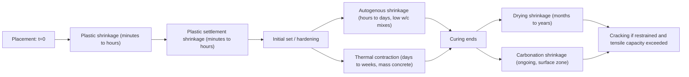

## Shrinkage and Cracking Mechanisms

### Overview

Shrinkage is the reduction in volume of concrete over time, occurring independently of externally applied load, driven primarily by moisture loss and internal chemical/physical processes within the cement paste. When shrinkage is restrained — by reinforcement, adjoining structural elements, subgrade friction, or internal differential strain — it induces tensile stresses that, once exceeding the concrete's tensile capacity, produce cracking. Understanding the distinct shrinkage mechanisms is essential for crack control detailing, joint spacing, and material selection.

**Key Points**

- Shrinkage itself does not cause cracking — restraint against shrinkage does
- Different shrinkage types occur on vastly different timescales, from minutes (plastic shrinkage) to years (drying shrinkage)
- Crack control relies on managing the magnitude of shrinkage, the degree of restraint, and the tensile capacity/reinforcement provided, not on eliminating shrinkage entirely

### Classification of Shrinkage Types

#### 1. Plastic Shrinkage

Occurs in the first few hours after placing, while concrete is still in a plastic (unhardened) state, caused by rapid loss of surface moisture through evaporation exceeding the rate of bleed water rising to the surface.

- Governed by the ACI 305 evaporation rate nomograph (function of concrete temperature, air temperature, relative humidity, and wind velocity)
- Critical threshold commonly cited: evaporation rate exceeding approximately 1.0 kg/m²/hr signals high risk of plastic shrinkage cracking
- Manifests as shallow, irregular, map-like or parallel cracks on exposed surfaces, typically appearing within 30 minutes to 6 hours after finishing
- Mitigated by fog spraying, evaporation retardants, windbreaks, sunshades, and immediate curing initiation (directly linked to curing methods covered previously)

#### 2. Plastic Settlement Shrinkage

Occurs when solid particles (cement, aggregate) settle under gravity while the concrete is still plastic, and bleed water rises to the surface. Where settlement is locally restrained — by reinforcing bars, formwork irregularities, or embedded items — differential settlement produces cracks or voids.

- Typically manifests as cracks following the line of top reinforcing bars ("settlement cracking over rebar")
- Influenced by bleeding characteristics of the mix, cover depth, and bar spacing/diameter
- Mitigated by revibration (within the still-plastic window), reduced bleeding (air entrainment, appropriate mix design), adequate cover

#### 3. Autogenous Shrinkage

A chemical shrinkage phenomenon occurring during cement hydration, independent of moisture exchange with the environment, resulting from the volume of hydration products being less than the combined volume of the original cement and water (self-desiccation within sealed conditions).

- Relatively small in normal-strength, normal w/c concretes (often negligible in practical terms)
- Becomes significant in low water-cement ratio concretes (w/c < 0.40), particularly high-performance and high-strength concrete, where limited free water is rapidly consumed by hydration, causing internal relative humidity to drop and inducing self-desiccation shrinkage
- Mitigated through internal curing techniques (pre-wetted lightweight aggregate or superabsorbent polymers), as covered under curing methods

#### 4. Drying Shrinkage

The dominant long-term shrinkage mechanism in most conventional concrete, resulting from the loss of physically adsorbed and capillary water from the hardened cement paste to the surrounding environment after initial curing ends.

- Develops over months to years; approximately 15–30% of ultimate drying shrinkage typically occurs within the first month after curing, with the majority developing over 1–5 years [Inference: exact timeline fractions vary by mix, member size, and environmental exposure]
- Not fully reversible — a portion of drying shrinkage strain is irrecoverable even upon subsequent re-wetting

$$\varepsilon_{sh}(t) = \varepsilon_{sh,u} \left[ \frac{(t - t_c)}{f + (t - t_c)} \right]$$

(ACI 209 form, where $\varepsilon_{sh,u}$ is ultimate shrinkage strain, $t_c$ is age at end of curing, $t - t_c$ is time since curing ended, and $f$ is a constant depending on member size and curing duration.)

#### 5. Carbonation Shrinkage

Occurs when atmospheric $CO_2$ reacts with calcium hydroxide (and to some extent C-S-H) in the cement paste to form calcium carbonate, accompanied by a small additional volumetric contraction, concentrated near exposed surfaces.

$$Ca(OH)_2 + CO_2 \rightarrow CaCO_3 + H_2O$$

- Generally small in magnitude compared to drying shrinkage but occurs concurrently with carbonation-related durability concerns (loss of passivation protection for embedded reinforcement)
- More pronounced at intermediate relative humidity (approximately 50–70% RH), where both $CO_2$ diffusion and moisture for the reaction are simultaneously available

#### 6. Thermal Shrinkage (Contraction)

Contraction resulting from cooling after the temperature rise caused by the heat of hydration, particularly significant in mass concrete elements (thick foundations, dams) where heat dissipates slowly, creating substantial temperature differentials between the core and surface.

$$\varepsilon_{thermal} = \alpha \times \Delta T$$

where $\alpha$ is the coefficient of thermal expansion (typically $9$–$12 \times 10^{-6}/°C$ for normal-weight concrete) and $\Delta T$ is the temperature change.

- Differential cooling between a hot core and cooler surface induces surface tensile stress, potentially causing thermal cracking if the temperature differential exceeds a critical threshold (often cited around 20°C differential as a general control target, though this varies with concrete properties and restraint) [Unverified: precise critical differential is mix- and restraint-condition-specific]

### Restraint and Crack Formation

Shrinkage alone, if entirely unrestrained, produces only dimensional change without stress. Cracking requires **restraint**, which may be:

- **External restraint**: Adjoining structural elements, foundations, or subgrade friction preventing free contraction of a slab or wall
- **Internal restraint**: Differential shrinkage within a single element (e.g., a drying surface layer restrained by a still-moist core), or restraint from embedded reinforcement

When restrained shrinkage strain generates tensile stress exceeding the concrete's tensile strength (as discussed in tensile and flexural strength), cracking occurs.

$$\sigma_{induced} = E_c \times \varepsilon_{restrained}$$

Cracking risk factors combine as:

$$\text{Cracking Risk} \propto \frac{\text{Shrinkage Magnitude} \times \text{Degree of Restraint} \times E_c}{f_{ct}}$$

[Inference: this proportionality is a conceptual framework used in crack-control literature rather than a codified formula; actual cracking depends additionally on creep relaxation of induced stress over time, which reduces effective stress below the instantaneous elastic prediction.]

Notably, **creep relaxation** partially offsets shrinkage-induced stress, since sustained tensile stress in restrained concrete relaxes over time due to the same mechanisms that produce compressive creep — meaning actual cracking risk is lower than a purely elastic calculation would suggest.

### Illustration: Shrinkage Mechanism Timeline

Restrained shrinkage crack formation in a slab-on-grade (svg_diagram):

<svg xmlns="http://www.w3.org/2000/svg" viewBox="0 0 520 260" font-family="Arial, sans-serif">
<text x="260" y="20" font-size="14" text-anchor="middle" font-weight="bold">Restrained Shrinkage Cracking (svg_diagram)</text>
<rect x="60" y="100" width="400" height="40" fill="#d5d8dc" stroke="#333" stroke-width="2" />
<text x="260" y="95" font-size="11" text-anchor="middle">Concrete slab</text>
<pattern id="hatch" width="8" height="8" patternTransform="rotate(45)" patternUnits="userSpaceOnUse">
<line x1="0" y1="0" x2="0" y2="8" stroke="#7f8c8d" stroke-width="2" />
</pattern>
<rect x="60" y="140" width="400" height="20" fill="url(#hatch)" />
<text x="260" y="175" font-size="11" text-anchor="middle">Subgrade (frictional restraint)</text>
<line x1="90" y1="100" x2="90" y2="60" stroke="#e67e22" stroke-width="2" marker-end="url(#arrow)" />
<line x1="430" y1="100" x2="430" y2="60" stroke="#e67e22" stroke-width="2" marker-end="url(#arrow)" />
<text x="90" y="55" font-size="10" fill="#e67e22" text-anchor="middle">Shrinkage strain</text>
<text x="430" y="55" font-size="10" fill="#e67e22" text-anchor="middle">(inward pull)</text>
<line x1="260" y1="100" x2="260" y2="140" stroke="#c0392b" stroke-width="3" />
<line x1="256" y1="105" x2="264" y2="115" stroke="#c0392b" stroke-width="2" />
<line x1="264" y1="115" x2="256" y2="125" stroke="#c0392b" stroke-width="2" />
<text x="270" y="130" font-size="10" fill="#c0392b">Crack (restraint-induced)</text>
</svg>

### Crack Control Strategies

**Example**

A concrete pavement slab, unrestrained thermally but subject to subgrade friction restraint during drying shrinkage, is controlled through:

- **Contraction (control) joints**: Sawcut or formed joints at regular intervals (typically 24–36 times the slab thickness in inches, per common pavement guidance) to induce cracking at predetermined, controlled locations rather than randomly
- **Reinforcement (shrinkage and temperature steel)**: Distributes shrinkage strain across many fine cracks rather than allowing a single wide crack, per ACI 318 minimum shrinkage/temperature reinforcement ratios
- **Reduced water content and paste volume**: Lower w/c and lower cement paste content reduce total shrinkage magnitude, since aggregate (which does not shrink) provides internal restraint against paste shrinkage
- **Shrinkage-reducing admixtures (SRAs)**: Chemical admixtures that reduce the surface tension of pore water, lowering capillary stress and reducing drying shrinkage magnitude
- **Fiber reinforcement**: Synthetic or steel micro-fibers control plastic shrinkage cracking by bridging micro-cracks before they can propagate

### Comparative Summary

| Shrinkage Type | Timing | Primary Driver | Typical Magnitude | Key Mitigation |
| --- | --- | --- | --- | --- |
| Plastic | Minutes–hours (before set) | Surface evaporation | Highly variable, weather-dependent | Fog spray, evaporation retardant, wind protection |
| Plastic settlement | Minutes–hours (before set) | Particle settlement, restraint by rebar | Localized, minor | Revibration, adequate cover |
| Autogenous | Hours–days | Self-desiccation (hydration) | Small (normal w/c); significant (low w/c) | Internal curing (LWA, SAP) |
| Drying | Months–years | Moisture loss to environment | ~400–800 microstrain (typical) | Low w/c, curing, SRAs, joints |
| Carbonation | Ongoing (surface) | $CO_2$ reaction with $Ca(OH)_2$ | Small, surface-concentrated | Adequate cover, low permeability |
| Thermal | Days–weeks (mass concrete) | Heat of hydration dissipation | Depends on $\Delta T$ | Temperature control, insulation, mix design |

[Inference: the drying shrinkage magnitude range cited (~400–800 microstrain) reflects commonly reported values for normal structural concrete in literature; actual values are highly mix- and environment-specific and unverified for any particular project without direct testing per ASTM C157.]

### Behavioral Notes

- Standard laboratory shrinkage testing (ASTM C157, length change of hardened concrete) measures unrestrained shrinkage under controlled conditions; actual field shrinkage and cracking behavior depend additionally on restraint conditions, member geometry, and environmental exposure that differ from standardized lab conditions
- Creep relaxation of shrinkage-induced tensile stress is a well-established phenomenon, but the degree of relaxation in a specific structure may vary and is not typically quantified with high precision in routine design practice

**Related Topics**

- Curing Methods and Their Influence
- Compressive, Tensile, and Flexural Strength
- Modulus of Elasticity and Creep
- Reinforcement Detailing for Crack Control (Shrinkage and Temperature Steel)
- Joint Design and Spacing in Concrete Pavements and Slabs
- Carbonation and Reinforcement Corrosion Mechanisms
- Mass Concrete Thermal Control and Heat of Hydration Management