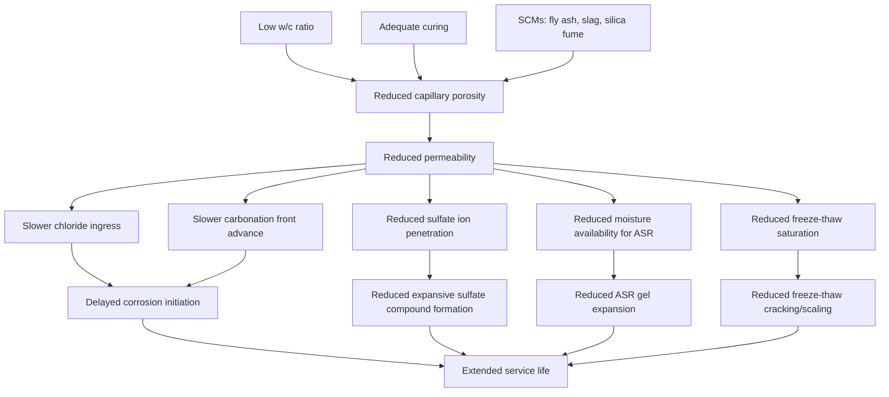

## Permeability and Durability Mechanisms

### Overview

Permeability is the property governing the rate at which fluids (water, gases, and dissolved ionic species) move through concrete's pore structure. It is arguably the single most important property controlling long-term durability, since nearly all deterioration mechanisms — corrosion, sulfate attack, freeze-thaw damage, alkali-silica reaction, and carbonation — require the ingress of water and/or aggressive agents to progress. Strength and permeability are correlated but not equivalent; a mix can achieve target strength while remaining relatively permeable if not specifically designed and cured for durability.

**Key Points**

- Permeability is controlled primarily by the capillary pore structure of the cement paste, which is itself governed by water-cement ratio and degree of hydration
- Low permeability is achieved through low w/c, adequate curing, and pore-refining supplementary cementitious materials (SCMs)
- Most durability mechanisms are transport-limited processes — reducing permeability slows virtually all deterioration mechanisms simultaneously

### Concrete Pore Structure and Transport Mechanisms

#### Pore Structure Classification

- **Gel pores**: Extremely fine pores within the C-S-H structure itself (roughly 0.5–10 nm), too small to significantly contribute to fluid transport
- **Capillary pores**: Larger pores (10 nm–10 µm) representing original water-filled space not occupied by hydration products; the dominant pathway for fluid and ionic transport
- **Entrained/entrapped air voids**: Larger voids (10 µm–1 mm), intentionally introduced (entrained) for freeze-thaw resistance or unintentionally present (entrapped) from inadequate consolidation

As hydration progresses, capillary pores become increasingly segmented and discontinuous, reducing permeability — this is why permeability drops sharply with continued curing (see curing methods) and lower w/c ratios.

#### Modes of Transport

| Mechanism | Driving Force | Relevance |
| --- | --- | --- |
| Permeability (bulk flow) | Hydraulic pressure gradient | Water penetration under head (e.g., water-retaining structures) |
| Diffusion | Concentration gradient | Chloride ion ingress, $CO_2$ ingress (carbonation) |
| Absorption/Sorptivity | Capillary suction | Near-surface moisture ingress in unsaturated concrete (most common real-world exposure) |
| Migration | Electrical potential gradient | Accelerated test methods (e.g., rapid chloride permeability test) |

$$q = -k \frac{dh}{dx}$$

Darcy's Law for bulk permeability, where $q$ is flow rate per unit area, $k$ is the coefficient of permeability, and $dh/dx$ is the hydraulic gradient. In practice, most real-world concrete durability problems are governed by diffusion and capillary sorption rather than bulk (Darcy) flow, since concrete structures are rarely subjected to sustained hydraulic head except in specific applications (tanks, dams, tunnels).

### Key Factors Controlling Permeability

- **Water-cement ratio**: The single most influential factor — permeability can decrease by one to two orders of magnitude as w/c decreases from 0.6 to 0.35, due to the reduced volume and connectivity of capillary pores
- **Degree of hydration / curing**: Extended moist curing progressively disconnects capillary pore networks; inadequately cured concrete remains substantially more permeable regardless of design w/c
- **Supplementary cementitious materials**: Fly ash, slag, and especially silica fume refine the pore structure through pozzolanic reaction, consuming calcium hydroxide and producing additional C-S-H that blocks capillary pathways — silica fume is particularly effective due to its extremely fine particle size
- **Aggregate-paste interfacial transition zone (ITZ)**: A more porous zone typically 20–50 µm wide surrounding aggregate particles, often the preferential pathway for fluid transport; SCMs and lower w/c also improve ITZ density
- **Cracking**: Even fine cracks dramatically increase effective permeability by providing direct pathways bypassing the bulk paste microstructure, linking this topic directly to shrinkage and cracking mechanisms

### Standard Test Methods

- **ASTM C1202 (Rapid Chloride Permeability Test / RCPT)**: Measures total electrical charge passed through a saturated specimen under applied voltage over 6 hours; used as an indirect indicator of chloride ion penetrability (technically measures ionic conductivity, not permeability directly, but strongly correlated with it)

| Charge Passed (Coulombs) | Chloride Ion Penetrability |
| --- | --- |
| > 4000 | High |
| 2000–4000 | Moderate |
| 1000–2000 | Low |
| 100–1000 | Very Low |
| < 100 | Negligible |

- **ASTM C1543 / AASHTO T259**: Ponding test for chloride penetration, measuring actual chloride profile depth over extended exposure
- **ASTM C1585**: Standard test for rate of water absorption (sorptivity) of concrete
- **ASTM C1556**: Apparent chloride diffusion coefficient via bulk diffusion testing
- **DIN 1048 / water penetration under pressure test**: Common in European practice for direct hydraulic permeability assessment

### Major Durability Mechanisms Governed by Permeability

#### 1. Reinforcement Corrosion

The most economically significant durability issue in reinforced concrete. Steel reinforcement is naturally protected by a passive oxide film formed in concrete's highly alkaline pore solution (pH ~12.5–13.5). Corrosion initiates when this passivation is broken down by either:

- **Chloride-induced corrosion**: Chloride ions (from deicing salts or marine exposure) penetrate to the reinforcement and locally break down the passive film once a critical chloride threshold concentration is reached at the bar surface
- **Carbonation-induced corrosion**: $CO_2$ diffuses into the concrete and reacts with $Ca(OH)_2$, progressively lowering pore solution pH; once the carbonation front reaches the reinforcement depth, the passive film is no longer stable

Once corrosion initiates, expansive iron oxide corrosion products (occupying up to 6× the volume of the original steel) generate internal tensile stress, leading to cracking, delamination, and spalling of the concrete cover.

$$t_{life} = t_{initiation} + t_{propagation}$$

(Tuutti model of corrosion service life), where $t_{initiation}$ is the time for chlorides/carbonation to reach the reinforcement and depassivate it, and $t_{propagation}$ is the time from depassivation to unacceptable damage (cracking/spalling). Low permeability primarily extends $t_{initiation}$.

#### 2. Sulfate Attack

Sulfate ions (from soil, groundwater, or seawater) penetrate concrete and react with hydration products (primarily calcium aluminate hydrates and calcium hydroxide), forming expansive compounds such as ettringite and gypsum, causing internal expansion, cracking, and strength loss.

- Mitigated by sulfate-resisting cement (Type V / low $C_3A$ content), low w/c, and low permeability limiting sulfate ion ingress rate
- Governed by ACI 318 exposure category provisions and ASTM C150 cement type selection

#### 3. Alkali-Silica Reaction (ASR)

A reaction between reactive silica minerals in certain aggregates and alkali hydroxides in the pore solution, forming an expansive gel that absorbs water and swells, causing internal cracking (often characteristic map/pattern cracking).

- Requires three simultaneous conditions: reactive aggregate, sufficient alkali content, and adequate moisture — permeability influences the moisture availability component
- Mitigated by aggregate reactivity testing (ASTM C1260, C1293), low-alkali cement, and SCMs (which reduce both alkalinity and permeability)

#### 4. Freeze-Thaw Damage

Water within the capillary pore system expands approximately 9% upon freezing; in saturated concrete without adequate air-void relief space, this expansion generates internal hydraulic pressure that can cause cracking and surface scaling over repeated freeze-thaw cycles.

- Primary mitigation is air entrainment (ASTM C260 admixtures), providing closely spaced small air voids (spacing factor typically < 200 µm per ASTM C457) that relieve pressure by giving freezing water space to expand into
- Lower permeability reduces the degree of saturation achievable, also improving freeze-thaw resistance independent of air entrainment

#### 5. Efflorescence and Leaching

Movement of water through concrete can dissolve and transport soluble calcium hydroxide to the surface, where it reacts with atmospheric $CO_2$ to form visible white calcium carbonate deposits (efflorescence) — primarily an aesthetic issue but indicative of ongoing moisture transport pathways.

### Illustration: Durability Mechanism Interdependencies

Chloride ingress and corrosion initiation timeline (svg_diagram):

<svg xmlns="http://www.w3.org/2000/svg" viewBox="0 0 540 260" font-family="Arial, sans-serif">
<text x="270" y="20" font-size="14" text-anchor="middle" font-weight="bold">Corrosion Service Life Model (svg_diagram)</text>
<line x1="60" y1="200" x2="500" y2="200" stroke="#333" stroke-width="2" />
<line x1="60" y1="200" x2="60" y2="50" stroke="#333" stroke-width="2" />
<text x="500" y="220" font-size="11">Time</text>
<text x="20" y="55" font-size="11">Damage</text>
<line x1="60" y1="200" x2="250" y2="200" stroke="#27ae60" stroke-width="3" />
<text x="120" y="190" font-size="10" fill="#27ae60">Initiation phase (Cl- diffusion to rebar)</text>
<path d="M 250 200 C 300 195, 350 170, 400 120 S 460 70, 480 55" stroke="#c0392b" stroke-width="3" fill="none" />
<text x="330" y="150" font-size="10" fill="#c0392b">Propagation phase (corrosion, cracking, spalling)</text>
<line x1="250" y1="200" x2="250" y2="50" stroke="#999" stroke-width="1" stroke-dasharray="3,3" />
<text x="215" y="45" font-size="10">Depassivation</text>
<line x1="480" y1="200" x2="480" y2="50" stroke="#999" stroke-width="1" stroke-dasharray="3,3" />
<text x="440" y="45" font-size="10">Unacceptable damage</text>
</svg>

### Design and Specification Strategies for Durable Concrete

**Example**

For a bridge deck in a marine/deicing salt environment (severe exposure), a durability-oriented specification might require:

- Maximum w/c ratio: 0.40 (per ACI 318 exposure category for corrosion protection)
- Minimum SCM replacement: 20–30% fly ash or 6–10% silica fume for chloride diffusion resistance
- Minimum concrete cover: 50–65 mm over reinforcement (per ACI 318 / AASHTO LRFD)
- RCPT limit: < 1500–2000 Coulombs at 28 or 56 days
- Air content: 5–8% for freeze-thaw exposure regions
- Extended curing: minimum 7–14 days moist curing given SCM presence

[Inference: exact numerical thresholds vary by governing code, agency specification, and specific exposure classification — the values above are representative of common North American severe-exposure practice rather than a universal standard.]

### Comparative Summary of Durability Mechanisms

| Mechanism | Aggressive Agent | Transport Mode | Primary Mitigation |
| --- | --- | --- | --- |
| Corrosion (chloride) | Cl⁻ ions | Diffusion, sorption | Low w/c, cover depth, SCMs, corrosion inhibitors |
| Corrosion (carbonation) | $CO_2$ | Diffusion (gas phase) | Low permeability, adequate cover, SCM balance |
| Sulfate attack | $SO_4^{2-}$ ions | Diffusion, capillary | Sulfate-resisting cement, low w/c |
| ASR | Alkali hydroxides + reactive silica | Internal (moisture-dependent) | Non-reactive aggregate, low-alkali cement, SCMs |
| Freeze-thaw | Water (freezing) | Saturation-dependent | Air entrainment, low permeability |

### Behavioral Notes

- RCPT (ASTM C1202) is widely used but technically measures electrical conductivity, which correlates with but does not directly equal chloride permeability; conductive constituents (e.g., certain SCMs, admixtures) can affect readings independent of actual pore structure, so results should be interpreted with this limitation in mind
- Service life prediction models (e.g., Tuutti model, Fick's law diffusion-based chloride models) are simplifications of complex, multi-mechanism transport processes; actual field performance may vary from model predictions due to cracking, construction quality variability, and non-uniform exposure conditions

**Related Topics**

- Curing Methods and Their Influence
- Shrinkage and Cracking Mechanisms
- Supplementary Cementitious Materials (Fly Ash, Slag, Silica Fume)
- Reinforcement Corrosion and Cathodic Protection Systems
- Concrete Cover and Exposure Classification (ACI 318 / AASHTO)
- Alkali-Silica Reaction Testing and Aggregate Reactivity
- Air Entrainment and Freeze-Thaw Resistance Design