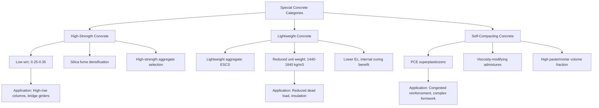

## Special Concretes: High-Strength, Lightweight, Self-Compacting

### Overview

Special concretes are engineered mixes that depart from conventional normal-weight, normal-strength concrete to achieve specific performance targets — exceptional strength, reduced density, or enhanced flowability — through modified mix proportioning, specialized materials, or admixture technology. High-strength concrete (HSC), lightweight concrete (LWC), and self-compacting concrete (SCC) represent three distinct but sometimes overlapping categories, each addressing different structural or constructability challenges.

**Key Points**

- HSC is defined by compressive strength threshold, achieved primarily through very low w/c and SCM optimization
- LWC is defined by reduced unit weight, achieved through porous lightweight aggregates or air-void systems
- SCC is defined by fresh-state flow behavior, achieved through chemical admixture technology and mix proportioning, independent of final hardened strength or density
- All three categories require adjustments to standard testing, design, and construction practices relative to conventional concrete

### High-Strength Concrete (HSC)

#### Definition and Classification

High-strength concrete is generally defined as concrete with a specified compressive strength ($f_c'$) exceeding approximately 40–50 MPa (6,000–7,250 psi), though the threshold is relative and has increased over decades as technology has advanced. Ultra-high-performance concrete (UHPC) represents a further category, typically exceeding 120–150 MPa.

| Category | Typical $f_c'$ Range |
| --- | --- |
| Normal strength | 20–40 MPa |
| High strength | 40–100 MPa |
| Very high strength | 100–150 MPa |
| Ultra-high performance (UHPC) | 150–250+ MPa |

#### Mix Design Principles

- **Very low water-cement ratio**: Typically 0.25–0.35, sometimes below 0.20 for UHPC, requiring high-range water-reducing admixtures (superplasticizers) to maintain workability at such low water content
- **Silica fume**: Extremely fine pozzolanic material (particle size ~100× smaller than cement) that densifies the paste microstructure and the aggregate-paste interfacial transition zone, contributing disproportionately to strength gain relative to its replacement percentage (typically 5–10% by mass of cementitious material)
- **High cementitious content**: Often 400–550 kg/m³ or more, sometimes combined with fly ash or slag for both strength and durability optimization
- **Aggregate selection**: Aggregate strength becomes a limiting factor at high paste strength levels — softer aggregates (some limestones, weathered gravels) may fail before the paste, so denser, stronger aggregates (granite, trap rock, quartzite) are preferred; maximum aggregate size is often reduced (9.5–12.5 mm) to minimize the ITZ weak zone and improve paste-aggregate stress transfer
- **Fiber reinforcement (for UHPC)**: Steel or synthetic microfibers (1–3% by volume) provide post-cracking ductility, since the very dense, brittle matrix would otherwise fail suddenly

$$f_c' \propto \frac{1}{(w/c)^n}$$

Modified Abrams-type relationship; at very low w/c, the exponent $n$ and overall relationship become increasingly sensitive to silica fume dosage, superplasticizer compatibility, and curing quality. [Inference: at HSC/UHPC w/c levels, empirical strength-w/c formulas calibrated for normal-strength concrete lose accuracy, and mix-specific trial batching is standard practice rather than formula-based prediction.]

#### Construction and Testing Considerations

- **Heat of hydration**: High cementitious content generates substantial heat, requiring thermal control measures in mass sections similar to mass concrete practice
- **Testing modifications**: Standard testing machines and neoprene pad caps may be inadequate at very high loads; sulfur mortar capping or high-strength unbonded neoprene caps and higher-capacity testing frames (ASTM C39 modifications) are often required
- **Reduced ductility**: Higher-strength concrete exhibits a steeper, more brittle stress-strain descending branch, influencing structural design assumptions (e.g., ACI 318 provisions for equivalent rectangular stress block parameters vary with $f_c'$ above 28 MPa)
- **Increased autogenous shrinkage**: As discussed under shrinkage mechanisms, low w/c HSC mixes are prone to significant autogenous shrinkage, often requiring internal curing measures

#### Applications

High-rise building columns (reducing member cross-section for a given load, preserving floor area), long-span prestressed bridge girders, offshore platforms, and precast elements requiring rapid strength gain for form reuse.

### Lightweight Concrete (LWC)

#### Definition and Classification

Lightweight concrete achieves reduced unit weight (typically 1440–1840 kg/m³, compared to ~2400 kg/m³ for normal-weight concrete) primarily by replacing normal-density aggregate with lightweight aggregate (LWA) or by introducing a cellular air-void structure.

| Category | Method | Typical Unit Weight |
| --- | --- | --- |
| Structural lightweight | Lightweight coarse/fine aggregate | 1440–1840 kg/m³ |
| Lightweight (fill/insulating) | Highly porous aggregate or high air content | 300–1440 kg/m³ |
| Cellular/foamed concrete | Preformed foam or gas-forming agents, no coarse aggregate | 400–1600 kg/m³ |

#### Lightweight Aggregate Types

- **Expanded shale, clay, or slate (ESCS)**: Produced by rotary kiln expansion, creating a porous, vesicular internal structure with a fused, relatively impermeable outer shell — the most common structural LWA
- **Expanded slag or fly ash (sintered)**: By-product-based lightweight aggregates
- **Natural lightweight aggregates**: Pumice, scoria, volcanic materials (less common in modern structural applications due to variability)
- **Perlite and vermiculite**: Used for insulating/non-structural lightweight concrete, not structural applications, due to very low strength contribution

#### Key Property Differences from Normal-Weight Concrete

- **Modulus of elasticity**: Significantly lower for a given $f_c'$ due to the lower stiffness of the porous aggregate — governed by the $w_c^{1.5}$ term in ACI 318's $E_c$ formula (as discussed under modulus of elasticity), requiring a lightweight modification factor $\lambda$ (typically 0.75–0.85) applied to tensile/shear strength provisions in design codes
- **Internal curing effect**: Pre-wetted (soaked) lightweight aggregate acts as an internal water reservoir, releasing absorbed water progressively during hydration — this is the same principle underlying dedicated internal curing technology using LWA fines
- **Thermal properties**: Lower thermal conductivity provides improved insulation value, beneficial for building envelope applications
- **Fire resistance**: Generally superior to normal-weight concrete due to lower thermal conductivity and the aggregate's pre-expanded (already thermally stable) structure
- **Reduced density benefits**: Lower self-weight reduces foundation loads, seismic mass (reducing seismic design forces), and dead load on long-span members — historically significant in high-rise construction and ship/barge construction (lightweight concrete ships were built in both World Wars)

#### Design Considerations

- Shear strength provisions in ACI 318 apply the $\lambda$ factor to account for the generally lower splitting tensile strength of LWC relative to normal-weight concrete at equivalent $f_c'$
- Higher water absorption of LWA requires careful mix design accounting for aggregate moisture state (pre-soaked vs. dry) to control workability and avoid mix water miscalculation
- Pumping lightweight concrete requires attention to aggregate degradation and moisture loss under pump pressure

### Self-Compacting Concrete (SCC)

#### Definition and Fresh-State Requirements

Self-compacting concrete (also called self-consolidating concrete) is a highly flowable concrete that consolidates under its own weight without mechanical vibration, fully filling formwork and encapsulating reinforcement even in congested sections, while maintaining resistance to segregation and bleeding.

#### Key Fresh Property Requirements

| Property | Test Method | Typical Target |
| --- | --- | --- |
| Filling ability (flowability) | Slump flow test (ASTM C1611) | 550–850 mm spread |
| Passing ability | J-Ring test (ASTM C1621) | Minimal blocking, J-Ring difference < 25 mm |
| Segregation resistance | Column segregation test, Visual Stability Index (VSI) | VSI ≤ 1 (highly stable) |
| Viscosity | V-funnel test, T50 slump flow time | T50 typically 2–5 seconds |

#### Mix Design Principles

- **High-range water-reducing admixtures (superplasticizers)**: Polycarboxylate ether (PCE)-based superplasticizers are standard, providing high water reduction and flow retention without segregation
- **Viscosity-modifying admixtures (VMAs)**: Used to increase mix cohesion and stability, preventing segregation and bleeding despite high flowability — particularly important when aggregate grading or paste content alone is insufficient to ensure stability
- **Increased fine content and paste volume**: Higher proportion of fines (cement, SCMs, sometimes limestone filler) and paste relative to coarse aggregate improves flow and reduces blocking risk around reinforcement
- **Reduced coarse aggregate maximum size**: Often limited to 12.5–20 mm to reduce blocking potential in congested reinforcement

$$\text{Paste Volume} + \text{Mortar Volume} \gg \text{Conventional Concrete Proportions}$$

SCC mix proportioning shifts substantially toward paste and mortar fractions relative to conventional vibrated concrete, which is the fundamental proportioning distinction enabling self-consolidation. [Inference: exact proportioning targets are highly mix- and materials-specific; SCC mix design is typically developed through iterative trial batching against the fresh-property test suite above rather than a single universal formula.]

#### Construction Advantages and Considerations

- **Advantages**: Eliminates vibration labor and noise, improves surface finish quality, enables placement in heavily congested reinforcement or complex formwork geometries, reduces placement time, improves consolidation consistency (reducing honeycombing risk)
- **Formwork pressure**: SCC behaves essentially as a fluid during placement, generating near-hydrostatic formwork pressure over the full height of the pour (unlike conventional concrete, where internal friction and partial consolidation reduce pressure with height) — formwork must be designed accordingly
- **Segregation risk**: Despite design intent, improper mix proportioning, excessive water addition on-site, or inadequate VMA dosage can lead to aggregate segregation or surface bleeding, requiring more rigorous fresh-property quality control than conventional concrete
- **Hardened properties**: When properly proportioned, SCC's hardened mechanical and durability properties are comparable to conventionally vibrated concrete of the same strength grade — SCC is a fresh-property innovation, not inherently a strength or durability enhancement

### Illustration: Special Concrete Category Comparison

Category comparison across key parameters (svg_diagram):

<svg xmlns="http://www.w3.org/2000/svg" viewBox="0 0 560 280" font-family="Arial, sans-serif">
<text x="280" y="20" font-size="14" text-anchor="middle" font-weight="bold">Special Concrete Trade-off Comparison (svg_diagram)</text>
<line x1="80" y1="240" x2="500" y2="240" stroke="#333" stroke-width="2" />
<line x1="80" y1="240" x2="80" y2="50" stroke="#333" stroke-width="2" />
<text x="20" y="55" font-size="10">Relative</text>
<text x="20" y="68" font-size="10">Value</text>
<text x="460" y="260" font-size="11">Category</text>
<rect x="120" y="70" width="50" height="170" fill="#c0392b" opacity="0.6" />
<text x="145" y="260" font-size="10" text-anchor="middle">HSC</text>
<text x="145" y="65" font-size="9" text-anchor="middle">Strength</text>
<rect x="220" y="150" width="50" height="90" fill="#2980b9" opacity="0.6" />
<text x="245" y="260" font-size="10" text-anchor="middle">LWC</text>
<text x="245" y="145" font-size="9" text-anchor="middle">Density (low)</text>
<rect x="320" y="100" width="50" height="140" fill="#27ae60" opacity="0.6" />
<text x="345" y="260" font-size="10" text-anchor="middle">SCC</text>
<text x="345" y="95" font-size="9" text-anchor="middle">Flowability</text>
<rect x="420" y="190" width="50" height="50" fill="#8e44ad" opacity="0.6" />
<text x="445" y="260" font-size="10" text-anchor="middle">Normal</text>
<text x="445" y="185" font-size="9" text-anchor="middle">Baseline</text>
</svg>

### Comparative Summary

| Property | High-Strength Concrete | Lightweight Concrete | Self-Compacting Concrete |
| --- | --- | --- | --- |
| Defining characteristic | $f_c' > 40$–50 MPa | Unit weight 1440–1840 kg/m³ | Flows and consolidates without vibration |
| Key material | Silica fume, superplasticizer | Lightweight aggregate | PCE superplasticizer, VMA |
| Key test | ASTM C39 (modified capping) | Unit weight (ASTM C567) | Slump flow (ASTM C1611) |
| Primary benefit | Reduced member size, higher capacity | Reduced dead load, insulation | Improved constructability, finish quality |
| Key challenge | Brittleness, autogenous shrinkage | Lower $E_c$, absorption control | Segregation control, formwork pressure |

### Behavioral Notes

- Strength, lightweight, and self-compacting characteristics are not mutually exclusive — high-strength self-compacting concrete and lightweight self-compacting concrete are both established combined categories in current practice, since flowability (SCC) is a fresh-state proportioning approach independent of the hardened-state strength or density category
- Performance of any special concrete category is highly formulation-specific; behavior described here reflects general, well-documented trends, but the properties of a specific mix should be verified through trial batching and standard testing rather than assumed from category alone

**Related Topics**

- Compressive, Tensile, and Flexural Strength
- Modulus of Elasticity and Creep
- Shrinkage and Cracking Mechanisms
- Permeability and Durability Mechanisms
- Superplasticizers and Chemical Admixture Technology
- Fiber-Reinforced Concrete and UHPC Design Principles
- Fresh Concrete Testing Methods (Slump, Flow, Air Content)