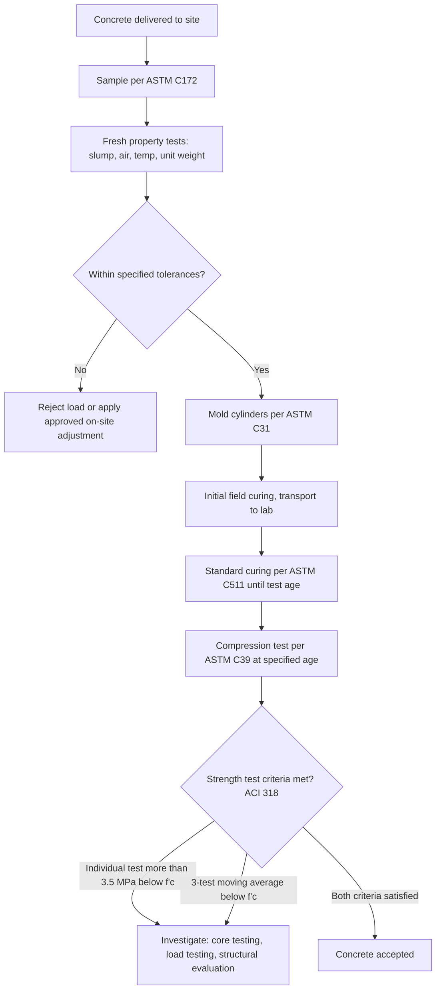

## Quality Control and Acceptance Testing

### Overview

Quality control (QC) and acceptance testing form the statistical and procedural framework by which concrete production is monitored during construction and by which the owner/engineer determines whether delivered concrete meets specified requirements. Because concrete strength and other properties exhibit inherent variability — from batch to batch, truck to truck, and specimen to specimen — acceptance is governed by statistical criteria rather than a requirement that every single test result exceed the specified value.

**Key Points**

- Concrete acceptance is fundamentally statistical: individual low test results do not automatically constitute non-conformance
- QC (producer-side, real-time monitoring) is distinct from acceptance testing (owner/engineer-side, contractual conformance)
- ACI 214 provides the statistical framework; ACI 318 and ASTM C94 provide the acceptance criteria applied in practice
- Sampling and specimen preparation procedure is as critical to valid results as the testing itself — improper sampling invalidates statistical conclusions regardless of testing precision

### Sampling Procedures

#### ASTM C172: Standard Practice for Sampling Freshly Mixed Concrete

- Samples must be representative of the entire batch, typically composited from at least two portions taken at different points during discharge (not from the very beginning or very end of discharge, where segregation and water/aggregate variation are more likely)
- Sample must be tested within specified time limits (fresh property tests generally within 15 minutes of sampling completion, per referenced standards) to avoid slump loss or air content change affecting results
- A single sample for strength acceptance testing must be sufficient to mold at least the number of specimens required by the acceptance criteria (typically a minimum of two cylinders per test age per ACI 318)

#### Frequency Requirements (ACI 318 / ASTM C94 Typical Provisions)

- Minimum one strength test per 115 m³ (150 yd³) of concrete, or per day's pour of a given mix design, whichever results in more frequent testing — exact frequency requirements are project/code-specific
- At least one strength test per each class of concrete each day it is placed, regardless of volume
- Additional testing frequency increases for critical structural elements or where variability concerns arise

### Fresh Concrete Testing (Field QC)

| Test | Standard | Purpose | Typical Acceptance Criterion |
| --- | --- | --- | --- |
| Slump | ASTM C143 | Workability/consistency check | Within specified tolerance (e.g., ±25 mm of target) |
| Air content (pressure method) | ASTM C231 | Verify entrained air for freeze-thaw exposure | Within specified range (e.g., 5–8% ± 1.5%) |
| Air content (volumetric method) | ASTM C173 | Alternative for lightweight aggregate mixes | Same as above |
| Unit weight (density) | ASTM C138 | Verify yield and mix proportioning | Within tolerance of design unit weight |
| Concrete temperature | ASTM C1064 | Hot/cold weather compliance | Within code limits (e.g., 10–32°C typical range, tighter in extreme weather provisions) |
| Chloride content | ASTM C1218 | Verify chloride limits for reinforced concrete | Below specified maximum (exposure-class dependent) |

**Example**

A ready-mix truck arrives at a site with a specified slump of 100 ± 25 mm. Field testing per ASTM C143 yields 150 mm — outside tolerance. The QC technician may reject the load, or the producer may add a small, pre-approved dose of water or high-range water reducer at the site (within mix design allowances) and re-test, since exceeding the upper slump tolerance without corrective action risks segregation and reduced strength/durability upon placement.

### Hardened Concrete Strength Testing

#### Specimen Preparation and Curing

- **ASTM C31**: Standard practice for making and curing concrete test specimens in the field — specimens are cast in molds (typically 150×300 mm or 100×200 mm cylinders), consolidated by rodding or vibration depending on slump, and initially cured at the job site (protected from temperature extremes and moisture loss) before transport to a laboratory
- **ASTM C511**: Governs standard moist-curing room conditions (23 ± 2°C, ≥95% relative humidity or saturated limewater immersion) for laboratory curing until test age
- **Field-cured specimens**: Additional specimens cured under job-site conditions (rather than standard lab conditions) are sometimes required to assess in-place strength development for decisions such as formwork removal timing or post-tensioning

#### Compression Testing and Acceptance Criteria (ASTM C39)

Standard acceptance testing uses the average of two (or more) cylinders from the same sample, tested at the specified age (typically 28 days), as a single "strength test" result. ACI 318 defines concrete as acceptable when both of the following statistical criteria are satisfied:

1. **No single strength test result falls more than 3.5 MPa (500 psi) below** $f_c'$ (for $f_c' \leq 35$ MPa), or more than $0.10 f_c'$ below $f_c'$ (for $f_c' > 35$ MPa)
2. **The average of any three consecutive strength tests equals or exceeds** $f_c'$

$$\bar{X}_{3} \geq f_c' \quad \text{AND} \quad X_{i} \geq f_c' - 3.5 \text{ MPa (or } 0.10f_c'\text{)}$$

where $\bar{X}_3$ is the moving average of any three consecutive strength tests and $X_i$ is any individual strength test result.

[Inference: the specific numerical thresholds (3.5 MPa / 500 psi, 10%) are as specified in ACI 318; some project specifications or other national codes apply modified or additional criteria, so the governing project specification should always be checked directly.]

### Statistical Basis of Acceptance (ACI 214)

#### Why Statistical Acceptance Is Used

Concrete strength results follow an approximately normal (Gaussian) distribution due to the combined effects of material variability (cement, aggregate, water), production variability (batching, mixing), and testing variability (specimen preparation, curing, testing procedure). Because of this inherent scatter, requiring every single test to exceed $f_c'$ would require designing the mix to a mean strength far higher than necessary, wasting material and cost.

$$f_{cr}' = f_c' + z\sigma$$

Required average (target) strength for mix design, where $f_{cr}'$ is the required average strength the mix must be designed to achieve, $z$ is a statistical factor corresponding to the acceptable probability of a low test (commonly $z \approx 1.34$–$2.33$ depending on the specific ACI 318 provision applied), and $\sigma$ is the standard deviation of the production's strength test history.

#### Standard Deviation and Coefficient of Variation

$$\sigma = \sqrt{\frac{\sum (x_i - \bar{x})^2}{n-1}}$$

$$V = \frac{\sigma}{\bar{x}} \times 100\%$$

where $V$ is the coefficient of variation, used to classify production quality control level:

| Coefficient of Variation (V) | Quality Control Level |
| --- | --- |
| < 10% | Excellent |
| 10–15% | Good |
| 15–20% | Fair |
| > 20% | Poor |

[Inference: these classification bands originate from ACI 214 guidance and represent general industry benchmarks; specific project specifications may define quality thresholds differently.]

When a producer lacks sufficient historical test record (per ACI 318, typically at least 30 consecutive tests, or 15–29 with an applied modification factor) to establish a reliable standard deviation, code-specified conservative margins are applied instead (e.g., adding a larger fixed margin to $f_c'$ for mix design purposes until adequate production history is established).

### Illustration: Acceptance Testing Workflow

Strength test scatter and acceptance envelope (svg_diagram):

<svg xmlns="http://www.w3.org/2000/svg" viewBox="0 0 540 280" font-family="Arial, sans-serif">
<text x="270" y="20" font-size="14" text-anchor="middle" font-weight="bold">Strength Test Acceptance Criteria (svg_diagram)</text>
<line x1="60" y1="230" x2="500" y2="230" stroke="#333" stroke-width="2" />
<line x1="60" y1="230" x2="60" y2="40" stroke="#333" stroke-width="2" />
<text x="480" y="250" font-size="11">Test sequence</text>
<text x="15" y="45" font-size="11">Strength</text>
<line x1="60" y1="130" x2="500" y2="130" stroke="#27ae60" stroke-width="2" stroke-dasharray="6,3" />
<text x="440" y="122" font-size="10" fill="#27ae60">Specified f'c</text>
<line x1="60" y1="170" x2="500" y2="170" stroke="#e67e22" stroke-width="2" stroke-dasharray="6,3" />
<text x="420" y="185" font-size="10" fill="#e67e22">f'c minus 3.5 MPa (individual test floor)</text>
<circle cx="100" cy="115" r="5" fill="#2980b9" />
<circle cx="150" cy="140" r="5" fill="#2980b9" />
<circle cx="200" cy="105" r="5" fill="#2980b9" />
<circle cx="250" cy="160" r="5" fill="#c0392b" />
<text x="235" y="180" font-size="9" fill="#c0392b">Below floor - flag</text>
<circle cx="300" cy="120" r="5" fill="#2980b9" />
<circle cx="350" cy="100" r="5" fill="#2980b9" />
<circle cx="400" cy="135" r="5" fill="#2980b9" />
<circle cx="450" cy="110" r="5" fill="#2980b9" />
</svg>

### Investigation of Low Strength Results

When acceptance criteria are not satisfied, ACI 318 and ACI 214.4 provide a structured investigation path rather than automatic rejection of the structure:

- **Step 1 — Review testing procedure**: Verify sampling, specimen preparation, curing, and testing followed standard procedures correctly (a surprisingly common cause of apparent low results is improper field curing or capping, not actual low in-place concrete strength)
- **Step 2 — Core testing (ASTM C42)**: Drilled cores taken directly from the in-place structure provide a more direct assessment of actual in-place strength; ACI 318 core acceptance criteria (average of three cores ≥ 85% of $f_c'$, with no single core below 75%) are more lenient than cylinder criteria, recognizing that in-place strength is inherently somewhat below standard-cured cylinder strength due to differences in consolidation, curing, and moisture condition
- **Step 3 — Non-destructive testing**: Rebound hammer (ASTM C805), ultrasonic pulse velocity (ASTM C597), or maturity method correlation (ASTM C1074) may supplement core data, though these are generally used as comparative/screening tools rather than definitive acceptance criteria on their own
- **Step 4 — Structural analysis and/or load testing**: If core results remain inconclusive or below criteria, structural engineering evaluation of actual demand-to-capacity ratios, or full-scale load testing (ACI 318 Chapter 27 / ACI 437) of the affected structure may be performed before deciding on acceptance, remediation, or removal

### Comparative Summary: QC vs. Acceptance Testing

| Aspect | Quality Control (QC) | Acceptance Testing |
| --- | --- | --- |
| Performed by | Concrete producer / contractor | Owner's testing agency / engineer of record |
| Purpose | Real-time process monitoring, adjustment | Contractual conformance determination |
| Typical tests | Slump, air content, batch weights, moisture | 28-day compressive strength, specified fresh tests |
| Frequency | Continuous / every batch or truck | Per specified statistical sampling frequency |
| Consequence of failure | Internal process adjustment | Investigation, rejection, or structural evaluation |

### Behavioral Notes

- Statistical acceptance criteria assume a sufficiently large, representative sample size and properly randomized sampling; a small number of tests on a small project may not provide statistically reliable conclusions, and engineering judgment plays a larger role in such cases
- Core testing results can be affected by moisture condition at time of test, core diameter-to-aggregate-size ratio, and drilling damage; ASTM C42 includes correction factors and procedural requirements to minimize these effects, but results may still vary from true in-place strength depending on execution quality

**Related Topics**

- Compressive, Tensile, and Flexural Strength
- Statistical Quality Control Methods (ACI 214)
- Concrete Mix Design and Fresh Properties
- Non-Destructive Testing Methods for Concrete
- Core Testing and In-Place Strength Evaluation
- Curing Methods and Their Influence
- Permeability and Durability Mechanisms