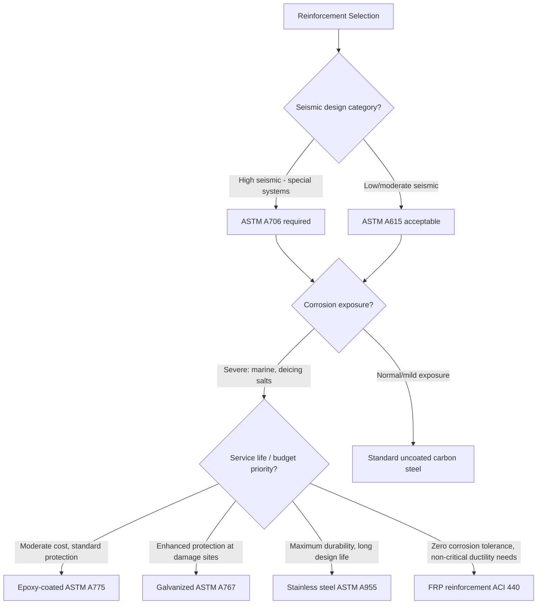

## Reinforcing Bar Types and Grades

### Overview

Reinforcing steel bars (rebar) provide the tensile capacity that concrete inherently lacks, working compositely with concrete's compressive strength to form reinforced concrete. Bar type and grade selection governs yield strength, ductility, corrosion resistance, weldability, and bond behavior — all of which directly affect structural design assumptions, detailing requirements, and long-term durability performance.

**Key Points**

- Grade designation refers to minimum specified yield strength, not ultimate strength or bar size
- Deformation patterns (ribs) on bar surfaces are standardized to ensure adequate mechanical bond with surrounding concrete
- Material type (carbon steel, epoxy-coated, galvanized, stainless, or fiber-reinforced polymer) is selected primarily based on corrosion exposure conditions
- Grade selection interacts directly with ductility requirements, particularly in seismic design, where excessive yield strength or inadequate elongation can be undesirable

### Standard Bar Designations and Sizing

#### US Customary (ASTM A615/A706) Bar Sizes

Bars are designated by a number corresponding to their diameter in eighths of an inch (approximately, for smaller sizes).

| Bar Size | Diameter (mm) | Diameter (in) | Cross-Sectional Area (mm²) | Nominal Weight (kg/m) |
| --- | --- | --- | --- | --- |
| #3 | 9.5 | 0.375 | 71 | 0.560 |
| #4 | 12.7 | 0.500 | 129 | 0.994 |
| #5 | 15.9 | 0.625 | 200 | 1.552 |
| #6 | 19.1 | 0.750 | 284 | 2.235 |
| #7 | 22.2 | 0.875 | 387 | 3.042 |
| #8 | 25.4 | 1.000 | 510 | 3.973 |
| #9 | 28.7 | 1.128 | 645 | 5.060 |
| #10 | 32.3 | 1.270 | 819 | 6.404 |
| #11 | 35.8 | 1.410 | 1006 | 7.907 |
| #14 | 43.0 | 1.693 | 1452 | 11.38 |
| #18 | 57.3 | 2.257 | 2581 | 20.24 |

#### Metric/Soft-Metric Designations (ASTM A615M)

Metric bar designations (e.g., #10M, #13M, #16M, #19M, #22M, #25M, #29M, #32M, #36M, #43M, #57M) correspond directly to the same physical bars as their US customary counterparts, with the number approximating the diameter in millimeters — these are "soft conversion" designations rather than distinct bar products.

### Bar Grades and Mechanical Properties

Grade designation indicates the minimum specified yield strength in ksi (US) or MPa (metric).

| Grade (US) | Yield Strength $f_y$ | Ultimate Tensile Strength $f_u$ | Typical Elongation | Common Use |
| --- | --- | --- | --- | --- |
| Grade 40 (280) | 280 MPa (40 ksi) | 420 MPa (60 ksi) min | ~11–12% | Smaller sizes, lighter structures |
| Grade 60 (420) | 420 MPa (60 ksi) | 620 MPa (90 ksi) min | ~9% | Most common; standard structural reinforcement |
| Grade 75 (520) | 520 MPa (75 ksi) | 690 MPa (100 ksi) min | ~7% | Reduced congestion, higher-capacity applications |
| Grade 80 (550) | 550 MPa (80 ksi) | 725 MPa (100 ksi) min | ~7% | High-strength applications (ASTM A706 for seismic) |
| Grade 100 (690) | 690 MPa (100 ksi) | 830 MPa (120 ksi) min | ~6–7% | High-strength, emerging in modern codes |

[Inference: exact minimum elongation and ultimate strength values vary slightly by bar size within a given grade and by specific ASTM specification edition; the values above represent commonly cited typical minimums rather than universal constants across all editions.]

$$\varepsilon_y = \frac{f_y}{E_s}$$

where $\varepsilon_y$ is yield strain and $E_s$ is the modulus of elasticity of steel, conventionally taken as 200,000 MPa (29,000,000 psi) for design purposes regardless of grade — a key distinguishing feature from concrete, where $E_c$ varies substantially with strength.

### Bar Material Specifications (ASTM Standards)

#### ASTM A615: Standard Specification for Deformed and Plain Carbon-Steel Bars

The most widely used specification for conventional (non-seismic) reinforcing steel, covering Grades 40, 60, 75, 80, and 100, made from carbon steel (often including recycled scrap steel content). Does not include mandatory chemical composition limits beyond basic carbon steel requirements, and does not guarantee weldability without special precautions.

#### ASTM A706: Standard Specification for Deformed and Plain Low-Alloy Steel Bars for Concrete Reinforcement

Specifically developed for applications requiring controlled ductility, weldability, and predictable strength — most notably seismic design. Key distinguishing features:

- **Controlled chemical composition**: Limits on carbon equivalent to ensure weldability without special preheat procedures
- **Maximum actual yield strength limit**: Unlike A615, which specifies only a minimum yield, A706 limits the maximum actual yield strength (e.g., Grade 60 must have actual yield between 420–540 MPa), ensuring predictable overstrength ratios critical for capacity design in seismic detailing
- **Minimum ratio of actual ultimate to actual yield strength**: Typically requiring $f_u/f_y \geq 1.25$, ensuring adequate strain-hardening capacity and ductile behavior before rupture — essential for plastic hinge formation in seismic-resistant structures
- Required by most modern building codes (e.g., ACI 318 Chapter 20, and by reference in ASCE 7/IBC) for special moment frames and other seismic force-resisting systems in high seismic design categories

#### ASTM A996: Standard Specification for Rail-Steel and Axle-Steel Deformed Bars

Bars re-rolled from used rail or axle steel; generally exhibits lower and less predictable ductility than virgin steel bars from A615/A706, with restrictions on use in some seismic and critical applications.

### Corrosion-Resistant Bar Types

#### Epoxy-Coated Reinforcement (ASTM A775 / A934)

Conventional carbon steel bars coated with a fusion-bonded epoxy layer (typically 175–300 µm thick) to physically isolate the steel from chloride and moisture ingress, delaying corrosion initiation.

- Requires careful handling to avoid coating damage (holidays/defects) during transport, placement, and consolidation, since damaged coating areas can become localized corrosion sites, potentially with accelerated corrosion at coating breaks due to differential aeration effects
- Widely used in bridge decks and marine structures exposed to deicing salts or chlorides

#### Galvanized Reinforcement (ASTM A767)

Bars hot-dip galvanized with a zinc coating, providing sacrificial (cathodic) protection — the zinc corrodes preferentially, protecting the underlying steel even at minor coating defects, unlike epoxy coating which relies purely on physical barrier protection.

#### Stainless Steel Reinforcement (ASTM A955)

Bars produced from stainless steel alloys (commonly Type 304, 316, or duplex grades), offering the highest corrosion resistance among standard bar types, at substantially higher material cost.

- Used in the most severe/critical exposure applications (marine splash zones, structures with very long design service life requirements) where the higher initial cost is justified by eliminating future corrosion-related maintenance/repair
- Different mechanical properties (e.g., generally no sharply defined yield point, requiring 0.2% offset yield determination) compared to carbon steel

#### Fiber-Reinforced Polymer (FRP) Reinforcement (ASTM D7957 for GFRP)

Non-metallic reinforcement made from glass, carbon, or aramid fibers embedded in a polymer resin matrix, immune to electrochemical corrosion entirely.

- Linear elastic behavior to failure (no yield plateau), requiring different design approaches than conventional ductile steel reinforcement (ACI 440 provides specific design guidance)
- Lower modulus of elasticity (particularly GFRP, roughly 40,000–55,000 MPa) compared to steel, affecting crack width and deflection design considerations
- Used in applications where electrochemical corrosion is the dominant durability concern and where the resulting non-ductile failure mode is acceptable within the design context (e.g., some non-seismic applications, MSE wall facings, some bridge deck applications)

### Deformation Patterns and Bond Requirements

Deformed bars feature ribs (transverse and sometimes longitudinal) meeting minimum spacing, height, and gap requirements per ASTM A615/A706, which mechanically interlock with surrounding concrete to develop bond strength beyond simple chemical adhesion and friction.

$$\tau_{bond} = f(\text{rib geometry, concrete strength, cover, bar spacing})$$

Bond behavior directly determines required development length and splice length calculations in structural design (ACI 318 Chapter 25), which fall outside this bar-properties topic but depend directly on the deformation pattern and bar surface condition covered here.

### Illustration: Bar Grade and Type Selection Framework

Bar designation and rib geometry (svg_diagram):

<svg xmlns="http://www.w3.org/2000/svg" viewBox="0 0 500 220" font-family="Arial, sans-serif">
<text x="250" y="20" font-size="14" text-anchor="middle" font-weight="bold">Deformed Bar Geometry (svg_diagram)</text>
<line x1="80" y1="110" x2="420" y2="110" stroke="#333" stroke-width="8" />
<g stroke="#333" stroke-width="4">
<line x1="100" y1="95" x2="90" y2="125" />
<line x1="130" y1="95" x2="120" y2="125" />
<line x1="160" y1="95" x2="150" y2="125" />
<line x1="190" y1="95" x2="180" y2="125" />
<line x1="220" y1="95" x2="210" y2="125" />
<line x1="250" y1="95" x2="240" y2="125" />
<line x1="280" y1="95" x2="270" y2="125" />
<line x1="310" y1="95" x2="300" y2="125" />
<line x1="340" y1="95" x2="330" y2="125" />
<line x1="370" y1="95" x2="360" y2="125" />
<line x1="400" y1="95" x2="390" y2="125" />
</g>
<line x1="150" y1="140" x2="180" y2="140" stroke="#666" stroke-width="1" />
<text x="165" y="155" font-size="10" text-anchor="middle">Rib spacing</text>
<line x1="80" y1="170" x2="80" y2="190" stroke="#666" stroke-width="1" />
<line x1="420" y1="170" x2="420" y2="190" stroke="#666" stroke-width="1" />
<line x1="80" y1="180" x2="420" y2="180" stroke="#666" stroke-width="1" marker-start="url(#a1)" marker-end="url(#a2)" />
<text x="250" y="195" font-size="10" text-anchor="middle">Nominal bar diameter (core, excluding ribs)</text>
</svg>

### Comparative Summary

| Bar Type | Standard | Key Characteristic | Primary Application |
| --- | --- | --- | --- |
| Carbon steel | ASTM A615 | Minimum yield only, no weldability guarantee | General structural, non-seismic |
| Low-alloy steel | ASTM A706 | Controlled yield range, weldable, ductile | Seismic force-resisting systems |
| Rail/axle steel | ASTM A996 | Re-rolled, variable ductility | Limited/non-critical applications |
| Epoxy-coated | ASTM A775 | Physical barrier coating | Bridge decks, chloride exposure |
| Galvanized | ASTM A767 | Sacrificial zinc coating | Marine, moderate-severe exposure |
| Stainless steel | ASTM A955 | Alloy corrosion resistance | Critical/long-service-life structures |
| FRP (GFRP/CFRP) | ACI 440 / ASTM D7957 | Non-metallic, non-corroding | Non-ductile-tolerant, high-corrosion applications |

### Behavioral Notes

- Actual yield strength of A615 bars can exceed the specified minimum by a substantial, unpredictable margin (overstrength), which is why A706 is specifically required where capacity-design seismic principles depend on predictable relative strength between yielding and non-yielding elements
- FRP reinforcement's linear-elastic-to-failure behavior means structural members reinforced with FRP do not exhibit the ductile warning behavior (visible deflection, wide cracking) associated with steel-reinforced member failure; design codes account for this through different safety factor approaches rather than relying on ductility-based reserve capacity

**Related Topics**

- Compressive, Tensile, and Flexural Strength
- Bond, Development Length, and Splice Design
- Seismic Design and Capacity-Based Detailing Principles
- Prestressing Steel Types and Properties
- Concrete Cover and Exposure Classification
- Fiber-Reinforced Polymer (FRP) Structural Design (ACI 440)
- Permeability and Durability Mechanisms