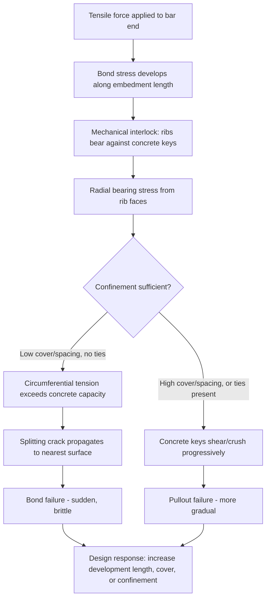

## Bond and Development Length Concepts

### Overview

Bond is the interaction between reinforcing steel and surrounding concrete that allows tensile (or compressive) force to transfer between the two materials, enabling them to act compositely. Development length is the embedded length of reinforcement required to develop a specified stress (typically the yield strength) in the bar through bond, without the bar pulling out or the surrounding concrete splitting. Without adequate bond and development, reinforcement cannot be relied upon to reach its design capacity regardless of the bar's own material strength.

**Key Points**

- Bond stress transfers force between steel and concrete along the bar's embedded length — it is not a single localized connection point
- Development length is fundamentally a function of the concrete's tensile/splitting capacity around the bar, not the bar's own strength
- Bond failure typically manifests as either pullout (crushing of concrete keys between ribs) or splitting (radial cracking of surrounding concrete) — splitting is more common in practice at typical cover and spacing
- Development length requirements interact directly with bar type (from reinforcing bar types and grades), cover, spacing, and confinement

### Bond Mechanism

#### Components of Bond Resistance

- **Chemical adhesion**: Weak chemical bond between cement paste and steel surface, contributing minimally to total bond capacity and lost almost immediately upon any relative slip
- **Friction**: Resistance from surface roughness and the radial pressure from concrete shrinkage around the bar, contributing modestly to total capacity
- **Mechanical interlock (bearing)**: The dominant bond mechanism in deformed bars — concrete "keys" form between the transverse ribs (as covered in reinforcing bar deformation patterns), bearing directly against the rib faces and transferring force through direct compression of the concrete keys against the rib

$$\tau_{bond} = \frac{T}{\pi d_b l_d}$$

Average bond stress, where $T$ is the tensile force in the bar, $d_b$ is the nominal bar diameter, and $l_d$ is the embedded (development) length. This represents an average value; actual bond stress distribution along the embedment length is non-uniform, typically concentrated near the loaded end and decreasing toward the free end, particularly as slip develops.

#### Bond Failure Modes

- **Pullout failure**: The concrete keys between ribs shear off or crush, and the bar slips relative to the surrounding concrete without significant radial cracking — this mode is generally associated with well-confined concrete (heavy cover, close stirrup spacing, or when the bar is deeply embedded relative to cover)
- **Splitting failure**: The radial bearing stresses from the ribs against the concrete keys generate circumferential tensile stress in the surrounding concrete; when this tensile stress reaches the concrete's tensile capacity, radial cracks propagate outward from the bar to the nearest free surface (concrete cover), causing sudden bond failure — this is the more common and design-governing failure mode in typical reinforced concrete construction with normal cover

### Development Length Concept and Governing Equation

#### Basic Development Length Requirement

Development length ($l_d$) is the minimum embedment length required for a bar to develop its full yield strength ($f_y$) through bond before the concrete's capacity is exceeded. If a bar is embedded less than $l_d$ and subjected to a force requiring full yield, bond (splitting or pullout) failure occurs before the bar yields.

**ACI 318 Simplified Development Length for Deformed Bars in Tension** (representative simplified form, actual code equation includes multiple modification factors):

$$l_d = \left( \frac{f_y \psi_t \psi_e \psi_s}{1.1 \lambda \sqrt{f_c'} \left(\frac{c_b + K_{tr}}{d_b}\right)} \right) d_b$$

where:

- $f_y$ = specified yield strength of reinforcement
- $\psi_t$ = casting position factor (top bars with more than 300 mm of fresh concrete cast below have reduced bond due to bleed water/air accumulation beneath the bar)
- $\psi_e$ = epoxy coating factor (epoxy-coated bars have reduced bond due to the coating reducing friction/adhesion)
- $\psi_s$ = bar size factor (larger bars generally require proportionally longer development length)
- $\lambda$ = lightweight concrete modification factor
- $f_c'$ = specified compressive strength of concrete
- $c_b$ = smaller of the distance from bar center to nearest concrete surface, or one-half the center-to-center bar spacing (representing the governing cover/spacing condition for splitting)
- $K_{tr}$ = transverse reinforcement index, accounting for confinement provided by stirrups/ties crossing the potential splitting plane
- $d_b$ = nominal bar diameter

[Inference: this is a representative simplified form consistent with ACI 318's confinement-based development length provisions; the code's exact equation, factor definitions, and applicable limits have been revised across editions, so the current governing code edition should always be consulted directly for design.]

#### Key Relationships Embedded in the Equation

- **Development length is directly proportional to $f_y$**: Higher-grade bars require proportionally longer development length to develop their (higher) yield force, all else equal — a key trade-off when considering Grade 80 or Grade 100 bars for congestion reduction
- **Development length is inversely proportional to $\sqrt{f_c'}$**: Higher concrete strength (higher tensile/splitting capacity) reduces required development length
- **Development length is inversely proportional to $(c_b + K_{tr})/d_b$**: Greater cover, wider bar spacing, or more transverse confinement steel all reduce required development length by resisting splitting more effectively; this ratio is capped in ACI 318 (typically at 2.5) reflecting that beyond a certain confinement level, pullout rather than splitting becomes the governing failure mode and further confinement provides no additional benefit

### Modification Factors in Practice

| Factor | Condition | Typical Effect |
| --- | --- | --- |
| $\psi_t$ (top bar) | > 300 mm fresh concrete below bar | Increases $l_d$ by factor of 1.3 |
| $\psi_e$ (epoxy coating) | Epoxy-coated bar, cover < 3$d_b$ or spacing < 6$d_b$ | Increases $l_d$ by factor of up to 1.5 |
| $\psi_e$ (epoxy coating) | Epoxy-coated bar, other cases | Increases $l_d$ by factor of 1.2 |
| $\psi_s$ (bar size) | #6 bars and smaller | Reduction factor of 0.8 applied |
| $\psi_s$ (bar size) | #7 bars and larger | Factor of 1.0 (no reduction) |
| Combined $\psi_t \psi_e$ | Both top bar and epoxy-coated | Product need not exceed 1.7 (code-specified cap) |

[Inference: these specific factor values reflect ACI 318 provisions as commonly published; exact values and applicability conditions should be verified against the current adopted code edition for any specific design.]

### Development Length in Compression

Bars developed in compression require shorter development length than tension bars, since compression bars benefit from direct end bearing in addition to bond, and are not subject to splitting from the same tensile mechanism (compression does not induce the same radial tension around ribs in the same way as tension bar pullout resistance):

$$l_{dc} = \left(\frac{0.24 f_y}{\lambda\sqrt{f_c'}}\right) d_b \geq 0.043 f_y d_b$$

(representative ACI 318 compression development length form, subject to a minimum absolute floor and various modification factors for confinement/excess reinforcement).

### Standard Hooks and Hooked Bar Development

When straight embedment length is insufficient (common at discontinuous ends, such as beam-column joints or simple supports), standard hooks (90° or 180°) are used to achieve required anchorage within a shorter overall length, since the hook bend and extension provide additional mechanical anchorage beyond straight bond alone.

$$l_{dh} = \left(\frac{f_y \psi_e \psi_c \psi_r}{23\lambda\sqrt{f_c'}}\right) d_b$$

(representative simplified form; $\psi_c$ is a concrete cover factor and $\psi_r$ is a confining reinforcement factor for hooked bars specifically) — governed by minimum hook geometry requirements (bend diameter and extension length) specified in ACI 318 Chapter 25, which vary by bar size to ensure the concrete inside the bend does not crush under the bearing stress from the hook.

### Splices as an Extension of Development Length Concepts

Where reinforcement continuity is required beyond available bar lengths (or at construction joints), lap splices transfer force between two bars through the surrounding concrete over a specified lap length, conceptually similar to development length but requiring modification since two bars (rather than one bar anchored into a mass of concrete) share the load path:

- **Tension lap splices**: Classified as Class A (lap length = $1.0 \, l_d$) or Class B (lap length = $1.3 \, l_d$) depending on the fraction of bars spliced at a given location and the ratio of provided-to-required reinforcement area, reflecting a more conservative requirement when splice conditions are less favorable (e.g., all bars spliced at the same location)
- **Mechanical and welded splices**: Provide full or partial force transfer through mechanical couplers or welding rather than relying on concrete bond, often required at locations with high force demand or where space constraints preclude adequate lap length (this connects to reinforcing bar type selection, since ASTM A706 bars are specifically suited to welded splice applications due to controlled weldable chemistry)

### Illustration: Bond Stress Distribution and Splitting Mechanism

Splitting crack pattern around a deformed bar in cross-section (svg_diagram):

<svg xmlns="http://www.w3.org/2000/svg" viewBox="0 0 480 260" font-family="Arial, sans-serif">
<text x="240" y="20" font-size="14" text-anchor="middle" font-weight="bold">Bond Splitting Failure Cross-Section (svg_diagram)</text>
<rect x="60" y="60" width="360" height="160" fill="#ecf0f1" stroke="#333" stroke-width="2" />
<circle cx="180" cy="140" r="18" fill="#7f8c8d" stroke="#333" stroke-width="2" />
<circle cx="300" cy="140" r="18" fill="#7f8c8d" stroke="#333" stroke-width="2" />
<text x="180" y="145" font-size="9" text-anchor="middle" fill="#fff">Bar</text>
<text x="300" y="145" font-size="9" text-anchor="middle" fill="#fff">Bar</text>
<line x1="180" y1="122" x2="180" y2="65" stroke="#c0392b" stroke-width="2" stroke-dasharray="4,2" />
<line x1="180" y1="158" x2="180" y2="215" stroke="#c0392b" stroke-width="2" stroke-dasharray="4,2" />
<line x1="300" y1="122" x2="300" y2="65" stroke="#c0392b" stroke-width="2" stroke-dasharray="4,2" />
<line x1="300" y1="158" x2="300" y2="215" stroke="#c0392b" stroke-width="2" stroke-dasharray="4,2" />
<line x1="162" y1="140" x2="120" y2="140" stroke="#c0392b" stroke-width="2" stroke-dasharray="4,2" />
<line x1="318" y1="140" x2="360" y2="140" stroke="#c0392b" stroke-width="2" stroke-dasharray="4,2" />
<text x="180" y="240" font-size="10" text-anchor="middle">c_b = cover (governs if smaller than half-spacing)</text>
<line x1="198" y1="140" x2="240" y2="140" stroke="#666" stroke-width="1" marker-end="url(#ar)" />
<text x="240" y="135" font-size="9">Half bar spacing</text>
</svg>

### Comparative Summary

| Concept | Governing Failure Mode | Key Influencing Factors | Code Reference |
| --- | --- | --- | --- |
| Straight bar development (tension) | Splitting (typical) or pullout | $f_y$, $f_c'$, cover, spacing, confinement, casting position, coating | ACI 318 Ch. 25 |
| Bar development (compression) | Bearing/crushing, less splitting-prone | $f_y$, $f_c'$ | ACI 318 Ch. 25 |
| Hooked bar development | Bearing crushing inside hook bend | Bend diameter, cover, confining ties | ACI 318 Ch. 25 |
| Lap splices | Same as straight development, shared load path | Splice classification (A/B), percent spliced | ACI 318 Ch. 25 |

### Behavioral Notes

- Development length equations in codes are empirically calibrated (based on extensive pullout and beam-anchorage test databases) rather than derived from first-principles elasticity alone; actual bond behavior in a specific structure may vary from code-predicted values due to concrete consolidation quality, actual in-place cover, and construction tolerances
- Top-bar effect (reduced bond for horizontally cast bars with substantial fresh concrete below) is well-documented and is attributed to water gain and entrapped air migrating upward beneath the bar during consolidation and bleeding, but the precise magnitude of the effect can vary with mix workability, consolidation method, and pour depth

**Related Topics**

- Reinforcing Bar Types and Grades
- Compressive, Tensile, and Flexural Strength
- Concrete Cover and Exposure Classification
- Lap Splices, Mechanical Couplers, and Welded Connections
- Seismic Design and Capacity-Based Detailing Principles
- Permeability and Durability Mechanisms
- Beam-Column Joint Design and Anchorage Detailing