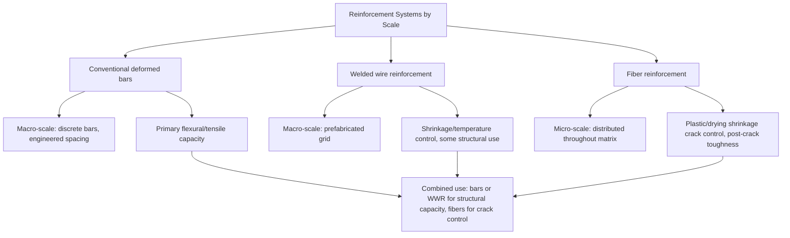

## Welded Wire and Fiber Reinforcement

### Overview

Welded wire reinforcement (WWR) and fiber reinforcement represent two alternative approaches to providing tensile capacity and crack control in concrete, distinct from conventional deformed reinforcing bars. WWR uses a prefabricated grid of wires joined at intersections to provide distributed, precisely spaced reinforcement, while fiber reinforcement disperses short discrete fibers throughout the concrete matrix itself, providing reinforcement at a fundamentally different (micro) scale than either bars or wire mesh.

**Key Points**

- WWR provides discrete, engineered reinforcement with precise spacing, primarily replacing conventional bar reinforcement in slabs, pavements, and precast elements
- Fiber reinforcement provides distributed micro-reinforcement primarily for crack control and post-cracking toughness, not as a full substitute for primary flexural/tensile reinforcement in most applications
- The two systems are frequently used together (fibers for crack control, WWR or bars for primary structural reinforcement) rather than being mutually exclusive alternatives
- Both interact directly with the shrinkage and cracking mechanisms and bond/development length concepts covered previously

### Welded Wire Reinforcement (WWR)

#### Definition and Manufacturing

Welded wire reinforcement consists of cold-drawn steel wires arranged in a rectangular (or occasionally other) grid pattern, with each intersection electrically resistance-welded to form a rigid, dimensionally stable mat or roll.

- **ASTM A1064**: Standard specification for carbon-steel wire and welded wire reinforcement, plain and deformed, for concrete — the current governing US standard (having consolidated and superseded several older separate specifications for plain wire, deformed wire, and welded wire fabric)
- Manufactured in both **sheet form** (flat, for larger wire sizes and structural applications) and **roll form** (coiled, typically for lighter gauge, temperature/shrinkage reinforcement applications like slabs-on-grade)

#### Wire Designation System

Wires are designated by a letter (W for plain/smooth wire, D for deformed wire) followed by a number indicating the cross-sectional area in hundredths of a square inch.

| Designation | Wire Type | Cross-Sectional Area (mm²) | Approx. Diameter (mm) |
| --- | --- | --- | --- |
| W1.4 | Plain | 9.0 | 3.4 |
| W2.9 | Plain | 18.7 | 4.9 |
| W4.0 | Plain | 25.8 | 5.7 |
| D4.0 | Deformed | 25.8 | 5.7 |
| W5.5 | Plain | 35.5 | 6.7 |
| D8.0 | Deformed | 51.6 | 8.1 |

A typical WWR sheet callout, e.g., "6x6 – W2.9xW2.9," indicates 150 mm × 150 mm (6 in × 6 in) grid spacing with W2.9 wire in both directions.

#### Mechanical Properties

- **ASTM A1064 minimum yield strength**: 450 MPa (65 ksi) for as-drawn wire, though this can vary between plain and deformed wire specifications and is generally higher than conventional Grade 60 deformed bar due to the cold-working (strain hardening) inherent in wire drawing
- **Reduced ductility relative to hot-rolled bar**: Cold-drawn wire generally exhibits lower elongation at fracture than hot-rolled deformed bar of comparable strength, since cold working consumes some of the material's inherent ductility reserve — a consideration in applications requiring significant post-yield deformation capacity

#### Bond Behavior

- **Plain wire (W-series)**: Relies primarily on the welded cross-wires for anchorage rather than surface deformation, since plain wire itself has minimal mechanical interlock capacity — development is therefore governed by different code provisions than deformed bar, crediting the welded intersections as mechanical anchor points
- **Deformed wire (D-series)**: Includes surface deformations similar in principle to deformed bar ribs, providing bond through mechanical interlock in addition to welded cross-wire anchorage

$$l_d \text{ (WWR)} = f(\text{wire spacing, cross-wire location, wire size, } f_y, f_c')$$

Development length provisions for WWR (ACI 318 Chapter 25) explicitly account for the presence and location of welded cross-wires within the development length, since a cross-wire located within the required embedment can substantially reduce the straight-wire length otherwise needed. [Inference: exact reduction credit for cross-wire anchorage is code-edition-specific; the current adopted code should be consulted for precise design values.]

#### Applications

- **Slabs-on-grade**: The most common application, primarily for shrinkage and temperature crack control rather than structural flexural reinforcement — precise, consistent spacing simplifies placement compared to individually tied bars
- **Precast concrete**: Widely used in precast wall panels, pipe, and other manufactured products where the dimensional consistency and installation speed of prefabricated mats offer significant production efficiency
- **Pavement**: Continuously reinforced concrete pavement (CRCP) and jointed reinforced pavement sometimes use WWR for distributed reinforcement
- **Shotcrete/precast wall systems**: Common due to ease of handling and consistent coverage in spray-applied applications

#### Placement Considerations

- **Proper positioning is critical**: WWR is frequently mis-placed too low in slabs during construction (sinking to the bottom during placement, or simply laid on the subgrade rather than supported at the correct height), which defeats its intended function for shrinkage/temperature crack control near the top surface — this is a widely documented and persistent field quality issue rather than a design limitation
- **Lap splice requirements**: Overlapping sheets/rolls must maintain minimum overlap (typically at least one full grid spacing plus a specified minimum, per ACI 318) to ensure continuity of reinforcement across the splice

### Fiber Reinforcement

#### Definition and Purpose

Fiber-reinforced concrete (FRC) incorporates short, discrete fibers (typically 20–60 mm long) uniformly distributed throughout the concrete mix, primarily to control plastic and drying shrinkage cracking, improve post-cracking toughness and residual strength, and enhance impact/abrasion resistance — distinct in function from continuous reinforcement (bars, WWR), which primarily provides tensile capacity at the macro/structural scale.

#### Fiber Types and Standards

| Fiber Type | Standard | Primary Function | Typical Dosage |
| --- | --- | --- | --- |
| Synthetic microfibers (polypropylene, nylon) | ASTM C1116 | Plastic shrinkage crack control | 0.9–1.8 kg/m³ (low volume) |
| Synthetic macrofibers | ASTM C1116 | Post-crack toughness, some structural contribution | 3–9 kg/m³ |
| Steel fibers | ASTM A820 / ASTM C1116 | Structural toughness, shear, impact resistance | 20–60 kg/m³ (0.25–1.0% by volume) |
| Glass fibers (AR-glass) | — | Thin-section precast (GFRC panels) | Application-specific |
| Natural/cellulose fibers | — | Sustainable/low-cost applications, limited structural role | Application-specific |

#### Mechanism of Action

Fibers act as crack-bridging elements at the micro-crack scale: as microcracks initiate within the paste (from plastic shrinkage, drying shrinkage, or early load-induced stress), fibers bridging the crack faces continue to carry tensile stress across the crack, resisting crack widening and propagation. This differs fundamentally from continuous bar reinforcement, which primarily resists crack widening at already-formed, larger cracks through direct tensile force transfer across the crack plane at discrete bar locations.

$$\sigma_{residual}(w) = f(\text{fiber type, dosage, aspect ratio, bond, crack width } w)$$

Post-cracking residual strength (a key FRC performance metric, tested per ASTM C1609 for flexural toughness) depends on fiber pullout/bond behavior across increasing crack widths, distinct from the pre-cracking elastic flexural strength (modulus of rupture) covered in the flexural strength topic.

#### Performance Testing

- **ASTM C1609**: Standard test for flexural performance of fiber-reinforced concrete, measuring load-deflection behavior including post-crack residual strength at specified deflections — provides the primary quantitative basis for structural fiber design credit
- **ASTM C1550**: Round panel test, an alternative method using a round, simply-supported panel loaded at its center, often preferred for shotcrete/tunnel lining applications due to its multi-directional crack pattern being more representative of field conditions
- **ASTM C1116**: Standard specification for fiber-reinforced concrete, covering fiber material requirements and classification

#### Structural vs. Non-Structural Fiber Use

- **Non-structural (temperature/shrinkage) use**: Low-dosage synthetic microfibers are widely used purely for plastic shrinkage crack control, without any structural design credit taken for the fibers — this is the most common FRC application, essentially a workability/durability enhancement rather than a structural design element
- **Structural use**: Higher-dosage steel or synthetic macrofibers can, in some code frameworks (e.g., ACI 318 permits fiber-reinforced concrete to replace minimum shear reinforcement under specific conditions, and ACI 544 provides broader design guidance), be credited with structural capacity — this requires demonstrated residual strength performance (via ASTM C1609 or similar) and is subject to more rigorous qualification than non-structural fiber use

[Inference: the specific conditions under which codes permit fibers to replace conventional shear reinforcement are narrowly defined and continue to evolve across code editions; project-specific code compliance verification is essential before relying on fibers for structural capacity.]

### Illustration: Reinforcement Scale Comparison

Fiber crack-bridging mechanism at micro-crack scale (svg_diagram):

<svg xmlns="http://www.w3.org/2000/svg" viewBox="0 0 500 240" font-family="Arial, sans-serif">
<text x="250" y="20" font-size="14" text-anchor="middle" font-weight="bold">Fiber Crack-Bridging Mechanism (svg_diagram)</text>
<rect x="60" y="60" width="180" height="120" fill="#ecf0f1" stroke="#333" stroke-width="2" />
<rect x="260" y="60" width="180" height="120" fill="#ecf0f1" stroke="#333" stroke-width="2" />
<line x1="240" y1="60" x2="260" y2="180" stroke="#c0392b" stroke-width="3" />
<line x1="90" y1="90" x2="150" y2="100" stroke="#2980b9" stroke-width="3" />
<line x1="120" y1="140" x2="190" y2="130" stroke="#2980b9" stroke-width="3" />
<line x1="80" y1="160" x2="140" y2="170" stroke="#2980b9" stroke-width="3" />
<line x1="150" y1="100" x2="270" y2="95" stroke="#2980b9" stroke-width="3" stroke-dasharray="0" />
<line x1="190" y1="130" x2="310" y2="125" stroke="#2980b9" stroke-width="3" />
<text x="250" y="200" font-size="10" text-anchor="middle" fill="#c0392b">Micro-crack</text>
<text x="250" y="215" font-size="10" text-anchor="middle" fill="#2980b9">Fibers bridging crack, carrying residual tension</text>
</svg>

### Comparative Summary

| System | Scale | Primary Function | Governing Standard | Design Credit |
| --- | --- | --- | --- | --- |
| Welded wire reinforcement | Macro (grid) | Distributed reinforcement, shrinkage/temperature | ASTM A1064 | Full structural credit possible (as designed) |
| Structural macrofibers | Micro (dispersed) | Post-crack toughness, limited shear credit | ASTM A820, ACI 544, ASTM C1609 | Conditional, code-specific structural credit |
| Non-structural microfibers | Micro (dispersed) | Plastic shrinkage crack control | ASTM C1116 | No structural credit (workability/durability role) |

### Behavioral Notes

- Fiber performance varies substantially with fiber geometry (straight, hooked-end, crimped, twisted), aspect ratio, and dosage; residual strength values from ASTM C1609 testing on one fiber product/dosage cannot be assumed applicable to a different fiber type without independent testing
- WWR mis-placement in slabs (settling to the bottom of the pour) is a widely observed field construction issue rather than a material or design deficiency; correct chair/support height specification and inspection during placement are the primary controls against this failure mode

**Related Topics**

- Reinforcing Bar Types and Grades
- Bond and Development Length Concepts
- Shrinkage and Cracking Mechanisms
- Fiber-Reinforced Concrete and UHPC Design Principles
- Shotcrete and Sprayed Concrete Applications
- Slab-on-Grade Design and Joint Detailing
- Compressive, Tensile, and Flexural Strength