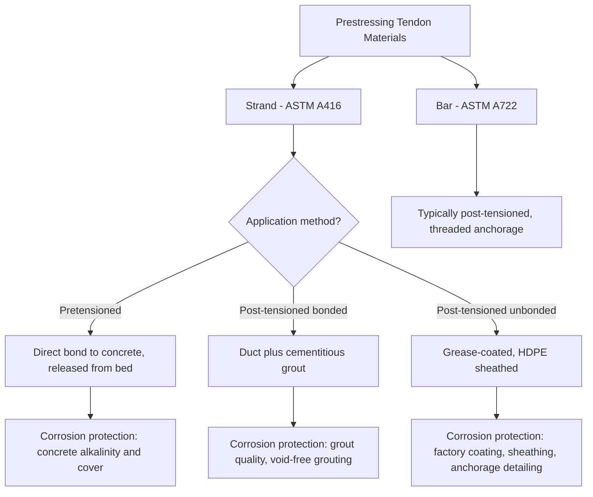

## Prestressing Strand and Tendon Materials

### Overview

Prestressing strand and tendon materials are the high-strength steel elements used to impart a deliberate, permanent compressive stress into concrete before service loads are applied, counteracting tensile stresses that would otherwise cause cracking. Unlike conventional reinforcing bar (covered in reinforcing bar types and grades), prestressing steel is engineered for very high tensile strength combined with the low relaxation characteristics necessary to maintain effective prestress force over decades of service life.

**Key Points**

- Prestressing steel operates at initial stress levels (typically 70–80% of ultimate strength) far higher than conventional reinforcement, requiring materials with minimal long-term relaxation
- Strand (multi-wire helical construction) is the dominant tendon material for both pretensioned and post-tensioned applications; bars are used in specific post-tensioning contexts
- Low-relaxation strand has effectively become the industry standard, superseding older stress-relieved strand due to significantly reduced long-term prestress loss
- Corrosion protection strategy differs fundamentally between pretensioned (bond-protected, embedded directly in concrete) and post-tensioned (duct/grout or grease/sheathing protected) systems

### Prestressing Strand

#### Construction and Standard Specification

**ASTM A416**: Standard specification for uncoated seven-wire steel strand for prestressed concrete — the governing US specification for the vast majority of pretensioning and post-tensioning strand applications.

- **Seven-wire construction**: One straight center wire surrounded by six helically wound outer wires, cold-drawn to high strength and then helically stranded together — this geometry provides both high strength and adequate surface texture (from the helical wire pattern) for bond development in pretensioned applications
- **Cold drawing process**: Wire is drawn through progressively smaller dies to develop strength through cold working (strain hardening), followed by a stress-relieving heat treatment to relieve residual stresses and stabilize mechanical properties

#### Strand Grades and Sizes

| Grade | Ultimate Tensile Strength $f_{pu}$ | Common Application |
| --- | --- | --- |
| Grade 250 | 1725 MPa (250 ksi) | Older/legacy applications, largely superseded |
| Grade 270 | 1860 MPa (270 ksi) | Current industry standard, vast majority of applications |

| Strand Diameter | Nominal Area (mm²) | Breaking Strength, Grade 270 (kN) |
| --- | --- | --- |
| 9.5 mm (3/8 in) | 51.6 | 96.5 |
| 11.1 mm (7/16 in) | 69.7 | 130.0 |
| 12.7 mm (1/2 in) | 98.7 | 183.7 |
| 12.7 mm (1/2 in) Special | 104.8 | 197.5 |
| 15.2 mm (0.6 in) | 140.0 | 260.7 |

[Inference: exact nominal area and breaking strength values can vary slightly between manufacturers within ASTM A416 tolerances; values shown reflect commonly published nominal figures for design reference.]

#### Stress-Relieved vs. Low-Relaxation Strand

- **Stress-relieved strand**: The original strand type, thermally treated primarily to relieve residual stresses from cold drawing; exhibits relatively higher long-term relaxation loss (gradual reduction in stress under constant strain over time) — largely phased out of current practice
- **Low-relaxation strand**: Produced with an additional controlled thermo-mechanical treatment (stabilizing process) during manufacture, dramatically reducing long-term relaxation loss compared to stress-relieved strand — now the overwhelmingly dominant strand type specified in current practice, effectively the de facto industry standard

$$\Delta f_{pR} = f_{pi} \left(\frac{\log(24t)}{K}\right)\left(\frac{f_{pi}}{f_{py}} - 0.55\right)$$

Representative relaxation loss formula form (per PCI/ACI design guidance), where $\Delta f_{pR}$ is stress loss due to relaxation, $f_{pi}$ is initial prestress, $t$ is time in hours, $K$ is a constant differing between stress-relieved (K≈10) and low-relaxation (K≈45) strand, and $f_{py}$ is yield strength. [Inference: this represents a widely referenced relaxation prediction form; specific coefficients and applicable ranges vary somewhat between different published models (e.g., PCI Design Handbook vs. other references), and manufacturer-specific relaxation data should govern final design where available.]

#### Mechanical Property Requirements

- **Minimum elongation at rupture**: Typically 3.5% minimum for Grade 270 low-relaxation strand over a specified gauge length, reflecting the reduced (but still adequate for design purposes) ductility inherent to cold-drawn, high-strength strand relative to conventional mild reinforcing steel
- **Modulus of elasticity**: Typically taken as approximately 197,000 MPa (28,500 ksi) for strand design purposes — notably lower than the 200,000 MPa conventionally used for mild reinforcing bar, reflecting the helical wire geometry's effect on the composite stress-strain response of the stranded assembly compared to a solid round bar
- **1% and 0.2% offset yield**: Because prestressing strand does not exhibit a sharply defined yield plateau (unlike mild steel), yield strength is defined by an offset method — commonly the load at 1% total elongation (or occasionally 0.2% permanent offset), typically specified as approximately 90% of $f_{pu}$ for low-relaxation strand

### Prestressing Bars

**ASTM A722**: Standard specification for high-strength steel bars for prestressed concrete — an alternative tendon material to strand, typically used in specific post-tensioning applications.

- Available in Type I (plain, smooth) and Type II (deformed, with a continuous thread-like rolled deformation pattern enabling direct threaded coupling and anchorage)
- Typical grades: Grade 150 (1035 MPa / 150 ksi ultimate strength) is the most common
- Applications: Often used for post-tensioning of shorter tendons, ground anchors, tie-back systems, and applications benefiting from bar's straightforward coupling/anchorage via threaded connections rather than strand's wedge-anchor system
- Generally exhibits lower relaxation than stress-relieved strand due to differing manufacturing (typically hot-rolled and subsequently cold-worked/stretched rather than cold-drawn wire stranding), though specific relaxation behavior depends on the manufacturing process employed

### Corrosion Protection Systems

#### Pretensioned Strand

In pretensioned members (strand tensioned before concrete placement, then bond-transferred to the hardened concrete upon release), the strand is directly embedded in and bonded to the surrounding concrete, relying on the concrete's own alkalinity and cover (as discussed under permeability and durability mechanisms) for corrosion protection — essentially the same protective mechanism as conventional reinforcing bar, though the consequences of corrosion-induced section loss are more severe given the strand's role in maintaining critical prestress force.

#### Post-Tensioned Tendons: Bonded Systems

- Strand is installed within a metal or plastic duct cast into the concrete member, stressed after the concrete has gained sufficient strength, then the duct is filled with cementitious grout
- The grout serves the dual function of bonding the strand to the surrounding concrete (enabling composite structural behavior after grouting) and providing an alkaline, corrosion-protective environment around the strand within the duct
- **Grouting quality is critical**: Incomplete grouting (voids) has historically been identified as a significant durability concern in some bonded post-tensioning applications, since voids create locations where moisture can accumulate around unprotected strand — leading to enhanced grouting specifications, procedures, and inspection requirements (e.g., PTI M55.1 grouting specification) in current practice

#### Post-Tensioned Tendons: Unbonded Systems

- Individual strands are factory-coated with corrosion-inhibiting grease (or wax) and encased in a continuous plastic (typically high-density polyethylene, HDPE) sheathing extrusion, remaining permanently unbonded to the surrounding concrete after stressing
- Widely used in building slab post-tensioning (common in parking structures, residential/commercial slabs) due to construction simplicity — no grouting operation required, and the strand can move freely within its sheathing (relying entirely on end anchorages to transfer force, rather than bond along the tendon length)
- Anchorage zone protection (encapsulation of the anchor hardware itself, which is a potential corrosion entry point) has become an increasingly emphasized detail in current specifications, since the anchorage — not the sheathed tendon length itself — represents the primary vulnerability in a properly executed unbonded system

### Anchorage Systems

- **Pretensioning**: Strand is anchored at the ends of the pretensioning bed (external abutments) during the tensioning and concrete curing process; once concrete achieves adequate strength, strand is cut/released, and force transfers to the concrete entirely through bond over a "transfer length" near each member end
- **Post-tensioning wedge anchorage**: The dominant anchorage method for strand tendons, using a conical anchor body and multi-part wedges that grip the strand through a wedging (friction-increasing) action as tensile force is applied — the strand's helical outer wire geometry assists wedge grip
- **Post-tensioning bar anchorage**: Typically a threaded nut bearing against an anchor plate, taking advantage of the bar's continuous thread-like deformation pattern (ASTM A722 Type II)

### Illustration: Tendon System Classification

Seven-wire strand cross-section and stress-relaxation comparison (svg_diagram):

<svg xmlns="http://www.w3.org/2000/svg" viewBox="0 0 520 260" font-family="Arial, sans-serif">
<text x="260" y="20" font-size="14" text-anchor="middle" font-weight="bold">Strand Cross-Section and Relaxation Behavior (svg_diagram)</text>
<circle cx="130" cy="130" r="55" fill="none" stroke="#ccc" stroke-width="1" />
<circle cx="130" cy="130" r="14" fill="#7f8c8d" />
<circle cx="130" cy="86" r="13" fill="#95a5a6" />
<circle cx="168" cy="108" r="13" fill="#95a5a6" />
<circle cx="168" cy="152" r="13" fill="#95a5a6" />
<circle cx="130" cy="174" r="13" fill="#95a5a6" />
<circle cx="92" cy="152" r="13" fill="#95a5a6" />
<circle cx="92" cy="108" r="13" fill="#95a5a6" />
<text x="130" y="220" font-size="10" text-anchor="middle">Seven-wire strand (1 center + 6 helical)</text>
<line x1="260" y1="230" x2="500" y2="230" stroke="#333" stroke-width="2" />
<line x1="260" y1="230" x2="260" y2="50" stroke="#333" stroke-width="2" />
<text x="480" y="248" font-size="10">Time (log scale)</text>
<text x="220" y="55" font-size="10">Stress loss</text>
<path d="M 260 60 Q 320 90, 380 100 T 500 105" stroke="#c0392b" stroke-width="2" fill="none" />
<text x="380" y="95" font-size="9" fill="#c0392b">Stress-relieved</text>
<path d="M 260 60 Q 320 68, 380 72 T 500 74" stroke="#2980b9" stroke-width="2" fill="none" />
<text x="380" y="65" font-size="9" fill="#2980b9">Low-relaxation</text>
</svg>

### Comparative Summary

| Property | Strand (ASTM A416, Grade 270 LR) | Bar (ASTM A722, Grade 150) |
| --- | --- | --- |
| Ultimate strength | 1860 MPa | 1035 MPa |
| Modulus of elasticity | ~197,000 MPa | ~200,000 MPa (typical, bar behaves closer to solid section) |
| Anchorage method | Wedge anchor | Threaded nut/plate |
| Typical application | Pretensioning, most post-tensioning | Post-tensioning (shorter tendons, ground anchors) |
| Relaxation | Low (low-relaxation type standard) | Generally low, process-dependent |

### Behavioral Notes

- Relaxation loss prediction formulas are empirically calibrated and represent expected long-term behavior under laboratory-controlled sustained stress; actual field relaxation may be influenced by temperature variation and stress history, and manufacturer-certified relaxation test data is generally preferred over generic formula predictions for critical, long-span, or unusually sensitive prestressed applications
- Grouting-related durability concerns in bonded post-tensioning are well-documented in industry literature and have driven substantial specification improvements (e.g., PTI grouting specifications); the historical prevalence of the issue does not indicate that properly executed modern grouted systems carry comparable risk, since detection and prevention practices have evolved significantly

**Related Topics**

- Reinforcing Bar Types and Grades
- Bond and Development Length Concepts
- Modulus of Elasticity and Creep
- Prestress Losses in Prestressed Concrete
- Post-Tensioning Anchorage Zone Design
- Permeability and Durability Mechanisms
- Pretensioned vs. Post-Tensioned Member Design Principles