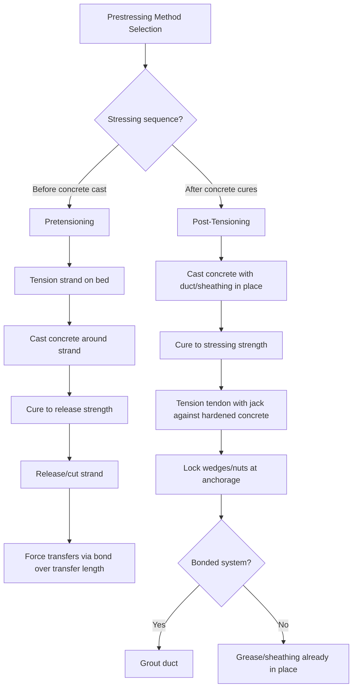

## Pretensioning and Post-Tensioning Systems

### Overview

Pretensioning and post-tensioning are the two fundamental methods for applying prestress force to concrete members, distinguished primarily by the sequence in which the tendon is stressed relative to concrete placement and hardening. Both methods achieve the same underlying objective — inducing beneficial compressive stress in concrete before service loading — but differ substantially in construction sequencing, force transfer mechanism, applicable member types, and typical production settings.

**Key Points**

- Pretensioning stresses tendons before concrete placement, transferring force through bond upon release; predominantly a plant/precast process
- Post-tensioning stresses tendons after concrete has hardened, transferring force through end anchorages; used in both plant-cast and cast-in-place construction
- The distinction directly affects tendon profile capability, applicable member types, and construction site requirements
- Both methods build directly on the strand/tendon material properties, corrosion protection systems, and anchorage concepts covered in prestressing strand and tendon materials

### Pretensioning Systems

#### Process Sequence

1. **Strand tensioning**: Prestressing strand is threaded through a long-line casting bed and tensioned to the specified initial stress (typically 70–75% of $f_{pu}$) using hydraulic jacks, anchored at fixed abutments at each end of the bed
2. **Formwork and reinforcement placement**: Mild reinforcement (stirrups, additional bars) is placed, and formwork for the member(s) is installed around the tensioned strand
3. **Concrete placement and curing**: Concrete is cast around the tensioned strand and cured (often using accelerated/steam curing, as discussed under curing methods, to achieve required release strength quickly and maximize casting bed turnover)
4. **Strand release (detensioning)**: Once concrete achieves the specified minimum release strength (verified via companion cylinder testing), strand is cut or gradually released from the end abutments, transferring the prestress force from the strand into the concrete through bond
5. **Member cutting**: For long-line production (multiple members cast end-to-end on a single bed), individual members are saw-cut to length after release

#### Force Transfer Mechanism

Force transfers from strand to concrete entirely through bond over a finite length near each free end of the member, called the **transfer length**:

$$L_t \approx \frac{f_{se} d_b}{3}$$

(Representative simplified relationship per AASHTO/ACI guidance, where $f_{se}$ is effective prestress after losses and $d_b$ is strand diameter; actual transfer length prediction formulas in codes include additional empirical coefficients.) [Inference: transfer length is influenced by strand surface condition, concrete strength at release, and release method (gradual vs. sudden), so the simplified formula shown represents a general design approximation rather than a precise universal value — actual measured transfer lengths in research literature show meaningful scatter around code-predicted values.]

Within the transfer length, prestress force builds up progressively from zero (at the free end) to the full effective prestress value; sections within this zone must be checked for reduced available prestress in shear and flexural capacity calculations.

#### Tendon Profile Limitations

- Pretensioned strand is typically held in a straight profile along the casting bed, since draping (harping) strand to a curved or deflected profile requires additional hold-down and hold-up hardware at the casting bed
- **Harped (draped) strand**: Some pretensioned members (particularly bridge girders) use hold-down devices at one or more points along the bed to create a bent/draped profile, raising strand near member ends (reducing top fiber tension at supports) while keeping strand low at midspan (maximizing effective eccentricity for positive moment) — a compromise that provides some profile flexibility without full post-tensioning duct complexity
- Compared to post-tensioning, pretensioning offers less flexibility in achieving complex, continuously varying tendon profiles (such as parabolic profiles that precisely track the moment diagram along a continuous multi-span member)

#### Typical Applications

Precast/prestressed bridge girders (I-girders, bulb-tees, box beams), precast double-tees and hollow-core slabs for building floor/roof systems, precast piles, and railroad ties — applications well-suited to controlled plant production with reusable casting beds and standardized cross-sections.

### Post-Tensioning Systems

#### Process Sequence

1. **Concrete placement with duct/sheathing installed**: Concrete is cast around pre-installed ducts (bonded systems) or sheathed strand (unbonded systems), positioned at the desired tendon profile using chairs and supports
2. **Concrete curing to stressing strength**: Concrete must reach a specified minimum strength (verified by testing, as covered under quality control and acceptance testing) before stressing operations begin, to resist the substantial local bearing stresses at anchorage zones
3. **Tendon stressing**: Strand or bar is tensioned using hydraulic jacks reacting against the hardened concrete itself (through the anchorage hardware), pulling the tendon to the specified force while directly compressing the concrete member
4. **Anchorage locking**: Once target force is achieved, wedges (strand) or nuts (bar) lock the tendon force into the permanent anchorage hardware, and the jack is removed
5. **Grouting (bonded systems only)**: For bonded post-tensioning, cementitious grout is subsequently pumped into the duct to fill the void around the strand, bonding the tendon to the surrounding concrete and providing corrosion protection

#### Force Transfer Mechanism

Unlike pretensioning's gradual bond-transfer over a length, post-tensioning transfers the entire tendon force at discrete **anchorage zones** at member ends (or intermediate locations for multi-segment tendons), creating a concentrated force introduction that requires specific local design attention:

- **Local zone**: Immediate vicinity of the anchorage hardware, requiring confinement reinforcement (spirals or grids) to resist very high local bearing stresses directly behind the anchor plate
- **General zone**: The broader region where concentrated anchorage force spreads out and becomes a more uniform stress distribution across the member's full cross-section (following St. Venant's principle), requiring "bursting" and "spalling" reinforcement to resist transverse tensile stresses that develop during this force spreading process

$$T_{burst} = 0.25 \sum P_{jack} \left(1 - \frac{a}{h}\right)$$

Representative simplified bursting force estimation (per AASHTO/ACI anchorage zone design provisions), where $P_{jack}$ is the tendon jacking force, $a$ is anchorage plate dimension, and $h$ is the member depth at the anchorage. [Inference: this is a simplified representative form; actual anchorage zone design in current codes typically involves more detailed strut-and-tie modeling or code-specific empirical procedures for complex anchorage configurations.]

#### Tendon Profile Flexibility

Post-tensioning ducts can be installed in continuously curved (typically parabolic) profiles precisely matching the shape of the bending moment diagram along a member — providing maximum structural efficiency by maintaining optimal eccentricity at every section, a significant advantage over pretensioning's more limited straight/harped profile options.

$$e(x) = e_{max}\left[1 - \left(\frac{2x}{L}\right)^2\right]$$

Representative parabolic tendon eccentricity profile, where $e(x)$ is eccentricity at distance $x$ from midspan and $e_{max}$ is maximum eccentricity at midspan, illustrating the type of continuously varying profile achievable with post-tensioning duct placement.

#### Typical Applications

- **Cast-in-place slabs**: Unbonded post-tensioning is extensively used in building floor slabs (particularly parking structures and residential/commercial construction) to achieve longer spans and thinner slabs than conventionally reinforced concrete
- **Bridge construction**: Segmental bridge construction (both precast segmental and cast-in-place balanced cantilever methods) relies heavily on post-tensioning to join and stress precast or cast-in-place segments together, since these methods do not use a continuous casting bed
- **Continuous/spliced girders**: Post-tensioning applied after erection of precast pretensioned girder segments, creating continuity over supports for multi-span efficiency beyond what simple-span pretensioned girders alone provide
- **Nuclear containment structures, tanks, and other specialized applications**: Circumferential post-tensioning of cylindrical structures for containment/liquid retention

### Comparative Analysis

| Aspect | Pretensioning | Post-Tensioning |
| --- | --- | --- |
| Stressing sequence | Before concrete placement | After concrete hardens |
| Force transfer | Bond, over transfer length | Discrete anchorage zones |
| Typical setting | Precast plant (casting bed) | Cast-in-place or precast, on-site or plant |
| Tendon profile | Straight or simple harped | Continuously variable (parabolic, draped) |
| Anchorage hardware | Not required in final product (bond-transferred) | Required permanently (anchor plates, wedges) |
| Corrosion protection | Concrete cover/alkalinity | Grout (bonded) or grease/sheathing (unbonded) |
| Continuity over spans | Limited (requires supplemental post-tensioning or splicing for continuity) | Readily achieved via continuous duct/tendon layout |
| Typical span range | Efficient for simple spans (girders, planks) | Efficient for longer/continuous spans, complex geometries |

### Combined Systems

Many modern bridge and building applications use both methods together: precast girders are pretensioned in the plant for the primary simple-span dead/live load capacity, then supplemented with **continuity post-tensioning** applied after erection to achieve structural continuity over intermediate supports — combining the production efficiency of pretensioning with the continuity/profile advantages of post-tensioning.

### Illustration: Process Comparison

Force transfer zones: pretensioning vs. post-tensioning (svg_diagram):

<svg xmlns="http://www.w3.org/2000/svg" viewBox="0 0 540 280" font-family="Arial, sans-serif">
<text x="270" y="20" font-size="14" text-anchor="middle" font-weight="bold">Force Transfer: Pretensioning vs Post-Tensioning (svg_diagram)</text>
<text x="270" y="45" font-size="12" text-anchor="middle" font-weight="bold">Pretensioned Member</text>
<rect x="60" y="55" width="420" height="40" fill="#d5d8dc" stroke="#333" stroke-width="2" />
<line x1="60" y1="75" x2="480" y2="75" stroke="#7f8c8d" stroke-width="3" />
<rect x="60" y="55" width="60" height="40" fill="#e67e22" opacity="0.4" />
<rect x="420" y="55" width="60" height="40" fill="#e67e22" opacity="0.4" />
<text x="90" y="110" font-size="9" text-anchor="middle">Transfer length</text>
<text x="450" y="110" font-size="9" text-anchor="middle">Transfer length</text>
<text x="270" y="110" font-size="9" text-anchor="middle">Full effective prestress (bond-developed)</text>
<text x="270" y="150" font-size="12" text-anchor="middle" font-weight="bold">Post-Tensioned Member</text>
<rect x="60" y="160" width="420" height="40" fill="#d5d8dc" stroke="#333" stroke-width="2" />
<path d="M 70 195 Q 270 165, 470 195" stroke="#7f8c8d" stroke-width="3" fill="none" />
<rect x="55" y="160" width="15" height="40" fill="#c0392b" />
<rect x="470" y="160" width="15" height="40" fill="#c0392b" />
<text x="62" y="215" font-size="9" text-anchor="middle">Anchor</text>
<text x="478" y="215" font-size="9" text-anchor="middle">Anchor</text>
<text x="270" y="230" font-size="9" text-anchor="middle">Full force at discrete anchorage zones; parabolic duct profile</text>
</svg>

### Behavioral Notes

- Transfer length and anchorage zone stress prediction formulas are empirically calibrated design approximations; actual behavior can vary with release method (sudden cutting vs. gradual detensioning), concrete strength at time of stressing, and anchorage hardware specifics, so code-specified minimum values and safety factors should govern design rather than idealized formula outputs alone
- The choice between pretensioning and post-tensioning for a given project is typically driven by practical factors (availability of precast plant capacity, site access for on-site stressing equipment, required span/continuity, and project schedule) at least as much as by pure structural efficiency considerations [Inference: this reflects general industry practice observation rather than a codified selection rule]

**Related Topics**

- Prestressing Strand and Tendon Materials
- Prestress Losses in Prestressed Concrete
- Post-Tensioning Anchorage Zone Design
- Bond and Development Length Concepts
- Segmental Bridge Construction Methods
- Curing Methods and Their Influence
- Quality Control and Acceptance Testing