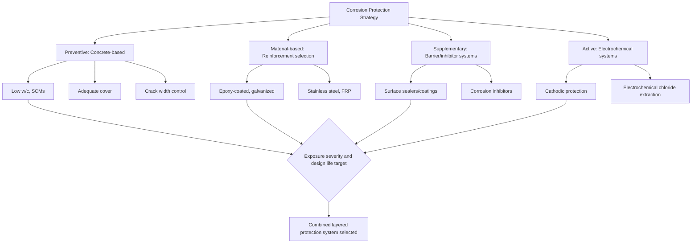

## Corrosion Protection of Reinforcement

### Overview

Corrosion of embedded reinforcement is the leading cause of premature deterioration in reinforced and prestressed concrete structures worldwide, and protecting reinforcement from corrosion requires a layered strategy spanning material selection, concrete mix design, detailing, and supplementary protective systems. This topic consolidates and extends the corrosion-related concepts introduced under permeability and durability mechanisms and prestressing strand and tendon materials into a unified protection framework covering both passive (preventive) and active (intervention) approaches.

**Key Points**

- Corrosion protection strategies fall into two categories: those that maintain the concrete's natural passivating environment (preventive) and those that provide independent protection when passivation cannot be assured (supplementary)
- Chloride-induced and carbonation-induced corrosion require different protection emphases despite sharing the same underlying electrochemical mechanism
- No single protection measure is universally sufficient for severe exposure; current practice typically combines multiple layered strategies
- Protection system selection should be matched to exposure severity and required design service life, since higher-performing systems carry higher initial cost

### The Corrosion Mechanism (Brief Recap)

Steel reinforcement is protected in sound concrete by a thin, tightly adherent passive oxide film that forms and is maintained in concrete's highly alkaline pore solution (pH ~12.5–13.5). Corrosion requires depassivation, which occurs when:

- **Chloride ions** reach a critical threshold concentration at the bar surface, locally disrupting the passive film (pitting-type initiation)
- **Carbonation** progressively lowers pore solution pH as atmospheric $CO_2$ reacts with calcium hydroxide, eventually destabilizing the passive film once the carbonation front reaches reinforcement depth

Once depassivated, an electrochemical cell forms (anodic and cathodic sites on the steel surface, with the pore solution acting as electrolyte), and corrosion proceeds, producing expansive iron oxide products that crack and spall the concrete cover.

### Strategy Category 1: Concrete-Based Protection (Preventive)

#### Low Permeability Mix Design

As detailed under permeability and durability mechanisms, reducing water-cement ratio and incorporating supplementary cementitious materials (fly ash, slag, silica fume) slows the rate of chloride diffusion and carbonation front advance, directly extending the corrosion initiation period ($t_{initiation}$ in the Tuutti model).

#### Adequate Concrete Cover

Cover depth is the physical distance chlorides or the carbonation front must travel before reaching reinforcement, and is one of the most cost-effective corrosion protection measures available since it requires no special materials — only adequate detailing and construction quality control.

$$t_{initiation} \propto \frac{c^2}{D_{app}}$$

Simplified relationship (derived conceptually from Fick's second law diffusion solutions) where $c$ is cover depth and $D_{app}$ is the apparent diffusion coefficient of the concrete — illustrating that initiation time increases with the **square** of cover depth, making cover a particularly powerful (though not unlimited) protective variable.

| Exposure Category (ACI 318) | Typical Minimum Cover |
| --- | --- |
| Not exposed to weather or in contact with ground | 20–40 mm (member-type dependent) |
| Exposed to weather or in contact with ground | 40–50 mm |
| Cast against and permanently in contact with ground | 75 mm |
| Severe marine/chloride exposure (agency-specific, e.g., bridge decks) | 50–75+ mm |

[Inference: exact minimum cover requirements vary by member type, bar size, and specific code/agency (ACI 318 vs. AASHTO LRFD vs. project-specific specifications); the governing code and project specification should be consulted directly.]

#### Crack Control

As covered under shrinkage and cracking mechanisms, cracks provide direct, accelerated pathways for chloride and moisture ingress, effectively bypassing the protective function of cover and low permeability. Crack width limitation (through appropriate reinforcement detailing and spacing per ACI 318 or similar) is therefore a corrosion protection measure in its own right, not merely a serviceability/aesthetic concern.

### Strategy Category 2: Reinforcement-Based Protection (Material Selection)

As introduced under reinforcing bar types and grades, several corrosion-resistant reinforcement material options exist, ranked here by increasing (and increasingly costly) protection level:

| Material | Protection Mechanism | Relative Cost | Typical Application |
| --- | --- | --- | --- |
| Epoxy-coated (ASTM A775) | Physical barrier | Moderate premium | Bridge decks, moderate-severe exposure |
| Galvanized (ASTM A767) | Sacrificial (cathodic) + barrier | Moderate-high premium | Marine, moderate-severe exposure |
| Stainless steel (ASTM A955) | Alloy passivation resistance | High premium | Critical/very long service life structures |
| FRP (ACI 440) | Non-metallic, immune to electrochemical corrosion | High premium | Non-ductile-tolerant, extreme corrosion exposure |

Each option carries distinct handling, bond, and design implications (discussed in reinforcing bar types and grades) that must be weighed alongside pure corrosion resistance performance.

### Strategy Category 3: Supplementary Barrier Systems

#### Surface Sealers and Coatings

Applied to the exterior concrete surface after curing, penetrating sealers (silanes, siloxanes) or film-forming coatings reduce moisture and chloride ingress by treating the concrete surface itself as an additional barrier layer beyond the bulk mix design.

- **Penetrating sealers**: Chemically react with or physically penetrate the surface pore structure, creating a hydrophobic (water-repellent) zone near the surface while still allowing water vapor transmission (breathability) — commonly used on bridge decks and parking structures subject to deicing salts
- **Film-forming coatings**: Create a continuous surface membrane providing a more complete barrier but potentially trapping moisture within the concrete if vapor transmission is significantly restricted, requiring careful product selection matched to exposure and substrate moisture conditions

#### Corrosion Inhibitors

Chemical admixtures added to the concrete mix or applied topically, intended to interfere with the electrochemical corrosion process itself rather than solely blocking transport of aggressive agents.

- **Calcium nitrite-based inhibitors**: The most widely documented and used inhibitor type, functioning by reacting preferentially with ferrous ions at anodic sites to reinforce/stabilize the passive film, effectively raising the chloride threshold required to initiate corrosion
- **Organic/migrating corrosion inhibitors (MCIs)**: Applied topically to existing structures or incorporated in new construction, intended to migrate through the concrete pore structure to reach the reinforcement surface and provide a protective molecular film
- Effectiveness of inhibitors is dosage-dependent and can be reduced or negated if dosage is insufficient relative to the chloride exposure level expected over the design service life [Unverified: specific inhibitor performance varies significantly by product formulation and exposure condition, and manufacturer-specific test data should be consulted for design reliance]

### Strategy Category 4: Active/Electrochemical Protection

#### Cathodic Protection (CP)

An electrochemical technique that directly suppresses the corrosion reaction by making the reinforcement the cathode of an electrochemical cell (rather than allowing localized anodic corrosion sites to form), typically applied to existing structures already experiencing or at risk of corrosion, though it can also be designed into new construction for maximum service life assurance.

- **Impressed current cathodic protection (ICCP)**: An external DC power source drives current from an installed anode system (conductive coatings, mesh, or discrete anodes) through the concrete to the reinforcement, continuously suppressing corrosion; requires ongoing power supply and monitoring/maintenance
- **Galvanic (sacrificial) cathodic protection**: Uses a more electrochemically active metal (typically zinc-based anodes) connected to the reinforcement, which corrodes preferentially and sacrificially protects the steel without requiring an external power source, though with a finite anode service life requiring eventual replacement
- Requires specialized design (current distribution analysis) and ongoing monitoring to verify continued effective protection level (typically via reference electrode potential measurements) throughout the system's service life

#### Electrochemical Chloride Extraction (ECE)

A rehabilitation technique using temporary impressed current (higher current density than CP, applied for a limited duration) to electrochemically migrate chloride ions out of the concrete and away from the reinforcement, intended as a one-time (or periodically repeated) treatment rather than a continuous protection system like CP.

### Corrosion Monitoring and Condition Assessment

- **Half-cell potential mapping (ASTM C876)**: Measures electrical potential between reinforcement and a reference electrode at the concrete surface, providing a probabilistic indication of corrosion activity likelihood across a structure's surface (more negative potentials generally correlate with higher corrosion probability, though interpretation requires care and is not a direct corrosion rate measurement)
- **Concrete resistivity testing**: Lower electrical resistivity generally correlates with higher corrosion rate potential (once depassivated) since resistivity affects the ease of ionic current flow between anodic and cathodic sites
- **Linear polarization resistance (LPR)**: A more direct, quantitative corrosion rate measurement technique, used in both laboratory and specialized field monitoring applications

### Illustration: Layered Corrosion Protection Strategy

Corrosion cell and protection intervention points (svg_diagram):

<svg xmlns="http://www.w3.org/2000/svg" viewBox="0 0 540 260" font-family="Arial, sans-serif">
<text x="270" y="20" font-size="14" text-anchor="middle" font-weight="bold">Corrosion Cell and Protection Points (svg_diagram)</text>
<rect x="80" y="60" width="380" height="140" fill="#ecf0f1" stroke="#333" stroke-width="2" />
<text x="270" y="55" font-size="10" text-anchor="middle">Concrete cover zone</text>
<line x1="80" y1="180" x2="460" y2="180" stroke="#7f8c8d" stroke-width="8" />
<text x="270" y="220" font-size="10" text-anchor="middle">Reinforcing steel</text>
<circle cx="180" cy="180" r="6" fill="#c0392b" />
<text x="180" y="165" font-size="9" fill="#c0392b" text-anchor="middle">Anode (corroding)</text>
<circle cx="360" cy="180" r="6" fill="#2980b9" />
<text x="360" y="165" font-size="9" fill="#2980b9" text-anchor="middle">Cathode</text>
<line x1="100" y1="65" x2="100" y2="175" stroke="#e67e22" stroke-width="3" stroke-dasharray="4,2" />
<text x="60" y="70" font-size="9" fill="#e67e22">Cl- ingress</text>
<line x1="440" y1="65" x2="440" y2="175" stroke="#27ae60" stroke-width="3" stroke-dasharray="4,2" />
<text x="450" y="70" font-size="9" fill="#27ae60">CO2 ingress</text>
<text x="270" y="240" font-size="9" text-anchor="middle" fill="#555">Interventions: cover (transport path), low permeability (rate), coating (barrier), CP (electrochemical)</text>
</svg>

### Comparative Summary

| Strategy | Timing | Cost Level | Key Limitation |
| --- | --- | --- | --- |
| Low permeability mix/curing | New construction | Low-moderate | Requires quality control diligence |
| Adequate cover | New construction (design/detailing) | Low | Practical limits from member geometry |
| Coated/alloy reinforcement | New construction | Moderate-high | No benefit for existing structures |
| Surface sealers | New or existing | Low-moderate | Requires reapplication over service life |
| Corrosion inhibitors | New construction (admixture) | Moderate | Dosage-dependent effectiveness |
| Cathodic protection | Existing (rehabilitation) or new | High | Requires ongoing monitoring/maintenance |

### Behavioral Notes

- Half-cell potential mapping results are probabilistic indicators of corrosion activity likelihood, not direct measurements of corrosion rate or remaining service life; interpretation guidelines (per ASTM C876) provide general likelihood ranges, but results should be considered alongside other condition assessment data rather than in isolation
- The relative cost-effectiveness of different protection strategies depends heavily on project-specific factors (exposure severity, required service life, access for future maintenance/inspection); no single strategy is universally optimal, and current practice for critical/severe-exposure structures typically layers multiple approaches rather than relying on any one measure alone

**Related Topics**

- Permeability and Durability Mechanisms
- Reinforcing Bar Types and Grades
- Shrinkage and Cracking Mechanisms
- Prestressing Strand and Tendon Materials
- Concrete Cover and Exposure Classification
- Structural Rehabilitation and Repair Methods
- Quality Control and Acceptance Testing