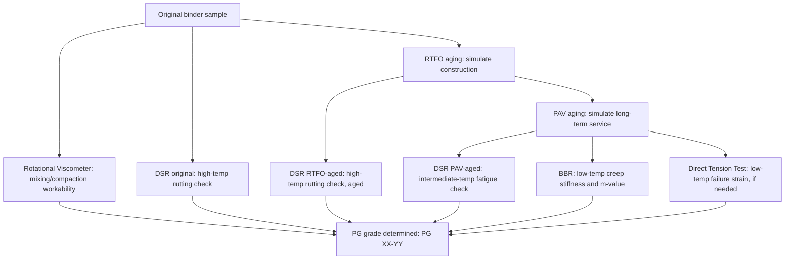

## Asphalt Binder Sources and Properties

### Overview

Asphalt binder (bitumen) is the thermoplastic, viscoelastic material that binds mineral aggregate together in asphalt concrete pavements, providing adhesion, flexibility, and waterproofing. Unlike Portland cement, which hydrates chemically to form a rigid matrix, asphalt binder is a physical material whose engineering behavior is fundamentally temperature- and time-dependent, transitioning between near-liquid, viscoelastic, and brittle-solid states across the range of temperatures a pavement experiences over its service life.

**Key Points**

- Asphalt binder is a complex hydrocarbon mixture, not a single chemical compound, and its properties vary with crude source and refining process
- Performance is inherently temperature- and loading-rate-dependent, requiring specialized characterization approaches distinct from concrete's largely temperature-independent strength testing
- The Superpave Performance Grade (PG) system is the current dominant classification framework in North American practice, superseding older penetration and viscosity grading systems
- Binder modification (polymers, additives) is widely used to extend the usable temperature range and improve specific performance characteristics

### Sources of Asphalt Binder

#### Natural Asphalt Deposits

- **Trinidad Lake Asphalt**: A natural asphalt deposit in Trinidad, historically significant and still used as a specialty additive in some modern mixes for its natural mineral filler content and specific rheological properties
- **Rock asphalt**: Naturally occurring asphalt-impregnated limestone or sandstone deposits, historically used directly as a paving material in some regions
- Natural deposits represent a minor fraction of current global asphalt binder supply, with petroleum refining being overwhelmingly dominant

#### Petroleum-Derived Asphalt (Refinery Bitumen)

The vast majority of asphalt binder used in modern paving is a byproduct of the petroleum refining process, specifically the residuum remaining after distillation removes lighter fractions (gasoline, diesel, lubricating oils) from crude oil.

- **Vacuum distillation**: The primary production method, using reduced pressure to separate heavier fractions at lower temperatures than atmospheric distillation would require, avoiding thermal cracking of the residuum
- **Crude source variability**: Asphalt properties (chemical composition, temperature susceptibility, aging characteristics) vary depending on the source crude oil, since different crude oils contain different proportions of the asphaltene, resin, and oil fractions that make up bitumen's chemical structure — this is a key reason why binder from different refineries or crude sources, even when graded to the same specification, can exhibit somewhat different field performance characteristics
- **Air-blown (oxidized) asphalt**: Produced by blowing air through heated asphalt residuum, increasing viscosity and softening point through partial oxidation — historically used for roofing and industrial applications more than paving, since the process alters temperature susceptibility characteristics in ways not always favorable for paving performance

### Chemical Composition

Asphalt binder is broadly composed of two chemical fraction classes, conventionally separated for characterization purposes:

- **Asphaltenes**: High molecular weight, polar, complex ring-structure molecules; generally solid or semi-solid at room temperature, contributing to binder stiffness, viscosity, and elastic behavior — asphaltene content and dispersion state significantly influence binder rheology
- **Maltenes**: The lower molecular weight fraction, further subdivided into **resins** (polar, contribute to asphaltene dispersion/solvation and adhesion properties) and **oils** (saturates and aromatics, non-polar, contribute to the fluid/plasticizing component of the binder)

The colloidal structure of asphalt — asphaltene micelles dispersed within and solvated by the maltene fraction (resins and oils) — governs much of its complex viscoelastic behavior, though this compositional/structural characterization is used more for understanding general behavior trends than as a direct, routine specification/acceptance parameter in current practice. [Inference: the precise relationship between detailed chemical composition and field performance remains an active research area, and current specification practice (Superpave PG grading) relies primarily on direct performance-related physical testing rather than compositional analysis for acceptance purposes.]

### Viscoelastic Behavior

Asphalt binder's defining engineering characteristic is its viscoelastic nature — behaving as a viscous fluid at high temperatures/slow loading rates and as an elastic (or brittle) solid at low temperatures/fast loading rates, with a broad intermediate range exhibiting combined viscous and elastic response.

$$G^* = \frac{\tau_{max}}{\gamma_{max}}$$

Complex shear modulus, where $G^*$ characterizes the binder's total resistance to shear deformation under oscillatory loading (measured via the Dynamic Shear Rheometer, DSR), $\tau_{max}$ is peak shear stress, and $\gamma_{max}$ is peak shear strain.

$$G^* = G' + iG''$$

where $G'$ (storage modulus) represents the elastic (recoverable) component of response and $G''$ (loss modulus) represents the viscous (dissipated) component; the phase angle $\delta$ between stress and strain waveforms indicates the relative balance of elastic vs. viscous behavior:

$$\tan(\delta) = \frac{G''}{G'}$$

A phase angle approaching 0° indicates predominantly elastic behavior; approaching 90° indicates predominantly viscous behavior. This temperature- and frequency-dependent balance directly underlies both high-temperature rutting susceptibility (viscous flow) and low-temperature cracking susceptibility (brittle elastic response), which are addressed by the Superpave grading parameters below.

### Traditional Grading Systems (Historical Context)

- **Penetration grading (ASTM D5)**: Measures the depth (in tenths of a millimeter) that a standard needle penetrates a binder sample under specified load, time, and temperature (typically 25°C, 100g, 5 seconds) — provides a single-temperature empirical consistency measure, with grades such as 60-70 or 85-100 penetration
- **Viscosity grading (ASTM D2171)**: Classifies binder by absolute viscosity at 60°C (a temperature representative of typical pavement surface temperature under summer conditions), providing somewhat better correlation to high-temperature performance than penetration grading, with grades such as AC-10, AC-20, AC-30
- Both traditional systems are now largely superseded in North American practice by Superpave PG grading, though they remain referenced in some specifications, historical pavement records, and certain international practices

### Superpave Performance Grade (PG) System

#### Grading Philosophy

Developed through the Strategic Highway Research Program (SHRP), the Superpave PG system directly ties binder grade to the actual pavement temperature environment and expected distress mechanisms, rather than relying on empirical consistency measures at arbitrary reference temperatures.

#### PG Grade Designation

A PG grade is expressed as **PG XX-YY**, where XX is the average 7-day maximum pavement design temperature (°C) the binder is expected to resist without excessive rutting, and YY is the minimum pavement design temperature (°C) the binder is expected to resist without low-temperature cracking (expressed as a negative number).

$$\text{Example: PG 64-22}$$

indicates a binder suitable for a maximum 7-day average pavement temperature of 64°C and a minimum design temperature of -22°C.

#### Key Superpave Test Parameters

| Test | Equipment | Parameter Measured | Purpose |
| --- | --- | --- | --- |
| Rotational Viscometer (RV) | Brookfield viscometer | Viscosity at 135°C | Ensures binder is pumpable/workable at mixing/compaction temperatures |
| Dynamic Shear Rheometer (DSR), original binder | DSR | $G^*/\sin(\delta)$ | High-temperature rutting resistance (minimum threshold specified) |
| Rolling Thin-Film Oven (RTFO) | RTFO oven | Simulates short-term aging during mixing/construction | Conditions binder before further high-temp DSR testing |
| DSR, RTFO-aged | DSR | $G^*/\sin(\delta)$ | High-temperature rutting resistance after simulated construction aging |
| Pressure Aging Vessel (PAV) | PAV chamber | Simulates long-term in-service oxidative aging | Conditions binder before intermediate/low-temperature testing |
| DSR, PAV-aged | DSR | $G^* \times \sin(\delta)$ | Intermediate-temperature fatigue cracking resistance (maximum threshold specified) |
| Bending Beam Rheometer (BBR) | BBR | Creep stiffness $S$ and $m$-value | Low-temperature thermal cracking resistance |
| Direct Tension Test (DTT) | Tensile testing apparatus | Failure strain | Low-temperature cracking resistance for stiffer binders where BBR alone may be insufficient |

$$G^*/\sin(\delta) \geq 1.0 \text{ kPa (unaged)}, \geq 2.2 \text{ kPa (RTFO-aged)}$$

Rutting parameter minimum thresholds (representative Superpave specification values at the binder's high-temperature grade), where higher $G^*/\sin(\delta)$ indicates greater resistance to permanent (viscous flow) deformation at high service temperatures.

$$G^* \times \sin(\delta) \leq 5000 \text{ kPa}$$

Fatigue cracking parameter maximum threshold (at the intermediate grading temperature, PAV-aged), where lower values indicate reduced susceptibility to load-associated fatigue cracking.

$$S(60s) \leq 300 \text{ MPa}, \quad m\text{-value} \geq 0.300$$

Low-temperature creep stiffness and relaxation rate thresholds (BBR test), where lower stiffness and higher m-value (rate of stress relaxation) both indicate improved resistance to low-temperature thermal cracking.

[Inference: the specific numerical thresholds shown represent standard AASHTO M320/Superpave specification values as commonly published; exact values, grade bumping provisions, and testing temperature grids can vary by specification edition and are periodically revised, so the current governing specification should be consulted for design/acceptance purposes.]

### Aging Behavior

Asphalt binder undergoes progressive chemical and physical aging (oxidative hardening, loss of volatile components) throughout its service life, fundamentally affecting long-term pavement performance:

- **Short-term aging**: Occurs during hot mixing, transport, and compaction, primarily due to volatilization of lighter oil fractions and oxidation at elevated mixing temperatures — simulated in the laboratory by the RTFO test
- **Long-term aging**: Occurs progressively over years of in-service exposure to oxygen, UV radiation, and temperature cycling, causing binder to become progressively stiffer and more brittle over time — simulated in the laboratory by the PAV test, which subjects RTFO-aged binder to elevated pressure and temperature over an extended duration to accelerate oxidative hardening

Aging is a primary driver of long-term pavement distress, since progressively stiffening (increasingly brittle) binder becomes more susceptible to both fatigue and low-temperature thermal cracking as a pavement ages, independent of additional traffic loading effects.

### Illustration: Binder Characterization Workflow

Viscoelastic response and PG grading temperature ranges (svg_diagram):

<svg xmlns="http://www.w3.org/2000/svg" viewBox="0 0 540 260" font-family="Arial, sans-serif">
<text x="270" y="20" font-size="14" text-anchor="middle" font-weight="bold">Binder Behavior Across Temperature Range (svg_diagram)</text>
<line x1="60" y1="200" x2="500" y2="200" stroke="#333" stroke-width="2" />
<line x1="60" y1="200" x2="60" y2="50" stroke="#333" stroke-width="2" />
<text x="480" y="220" font-size="10">Temperature</text>
<text x="15" y="55" font-size="10">Stiffness</text>
<path d="M 80 60 C 200 90, 350 160, 480 185" stroke="#2980b9" stroke-width="3" fill="none" />
<rect x="80" y="30" width="90" height="20" fill="#c0392b" opacity="0.3" />
<text x="125" y="44" font-size="9" text-anchor="middle">Low temp: BBR, DTT (cracking risk)</text>
<rect x="250" y="30" width="100" height="20" fill="#f39c12" opacity="0.3" />
<text x="300" y="44" font-size="9" text-anchor="middle">Intermediate: DSR fatigue check</text>
<rect x="410" y="30" width="90" height="20" fill="#27ae60" opacity="0.3" />
<text x="455" y="44" font-size="9" text-anchor="middle">High temp: DSR rutting check</text>
</svg>

### Comparative Summary

| Aspect | Traditional Grading (Penetration/Viscosity) | Superpave PG Grading |
| --- | --- | --- |
| Basis | Empirical consistency at fixed reference temperature | Direct performance testing at climate-specific temperatures |
| Temperature range considered | Single/limited reference points | Full service temperature range (high, intermediate, low) |
| Aging accounted for | Limited | Explicit (RTFO short-term, PAV long-term) |
| Distress mechanisms addressed | Indirect/empirical correlation | Direct: rutting, fatigue, thermal cracking |

### Behavioral Notes

- Binder from different crude sources or refineries, even when meeting the same PG grade specification, can exhibit different chemical composition and may show different field performance nuances (e.g., aging susceptibility, compatibility with certain modifiers) not fully captured by PG grading alone — this is a recognized limitation motivating ongoing research into supplementary/multiple stress creep recovery (MSCR) and other advanced characterization methods
- PG grading temperatures are typically selected with a reliability margin (e.g., 98% reliability level) above/below the statistically expected extreme pavement temperatures for a given location, rather than the absolute historical extreme, reflecting a risk-based design approach rather than an absolute guarantee against any conceivable temperature event

**Related Topics**

- Asphalt Mix Design (Superpave/Marshall Methods)
- Polymer-Modified Asphalt Binders
- Multiple Stress Creep Recovery (MSCR) Testing
- Aggregate Properties for Asphalt Mixtures
- Pavement Distress Mechanisms: Rutting, Fatigue, Thermal Cracking
- Hot Mix Asphalt Production and Compaction
- Recycled Asphalt Pavement (RAP) and Sustainable Binder Practices