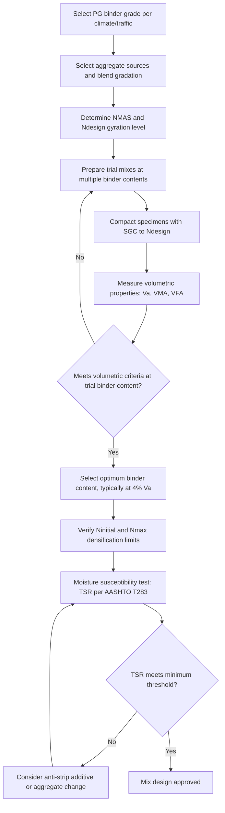

## Asphalt Mix Design Methods

### Overview

Asphalt mix design is the systematic process of proportioning aggregate and asphalt binder to produce a hot mix asphalt (HMA) or warm mix asphalt (WMA) that satisfies volumetric, strength, and durability requirements for its intended traffic and climate conditions. Unlike concrete mix design's primary focus on water-cement ratio, asphalt mix design centers on achieving an optimal balance between binder content, aggregate gradation, and compacted air void structure — since asphalt mixture performance depends fundamentally on volumetric proportions rather than a chemical hydration reaction.

**Key Points**

- Volumetric analysis (air voids, voids in mineral aggregate, voids filled with asphalt) is the central organizing framework for all major mix design methods
- The Marshall method (empirical, stability-based) has been substantially superseded by the Superpave method (volumetric and performance-based) in North American practice, though Marshall remains used in some regions internationally
- Optimum binder content is determined as a balance: enough binder for durability and workability, but not so much that the mix becomes unstable (rutting-prone) or bleeds
- Aggregate gradation and binder content interact directly — mix design cannot optimize one without simultaneously considering the other

### Volumetric Concepts (Foundational to All Methods)

#### Key Volumetric Parameters

- **Air Voids (Va)**: The percentage of the total compacted mix volume occupied by air, critical because too few air voids risk rutting and bleeding (excess binder squeezed to the surface under traffic), while too many air voids increase permeability, accelerate binder aging/oxidation, and reduce durability
- **Voids in Mineral Aggregate (VMA)**: The volume of the compacted mix not occupied by aggregate particles (i.e., the space available for binder plus air voids), expressed as a percentage of total mix volume — a critical parameter because adequate VMA ensures enough space for a durable film of binder to coat aggregate particles, independent of the specific air void target
- **Voids Filled with Asphalt (VFA)**: The percentage of the VMA that is filled with binder (as opposed to air), calculated as:

$$VFA = \frac{VMA - V_a}{VMA} \times 100$$

- **Effective binder content**: The portion of total binder that coats aggregate and contributes to the mix matrix, distinct from binder absorbed into porous aggregate (which does not contribute to the effective binder film)

$$G_{mm} = \frac{W_s + W_b}{\frac{W_s}{G_{se}} + \frac{W_b}{G_b}}$$

Maximum theoretical specific gravity (Rice test, ASTM D2041), representing the specific gravity of the mix with zero air voids, where $W_s$ and $W_b$ are weights of aggregate and binder, and $G_{se}$ and $G_b$ are effective specific gravity of aggregate and specific gravity of binder respectively — this value serves as the reference against which compacted mix density (and therefore air void content) is calculated.

$$V_a = \left(1 - \frac{G_{mb}}{G_{mm}}\right) \times 100$$

where $G_{mb}$ is the bulk specific gravity of the compacted mix (measured per ASTM D2726 or similar) and $G_{mm}$ is the maximum theoretical specific gravity.

### Marshall Mix Design Method

#### Background and Testing Procedure

Developed originally by Bruce Marshall in the 1940s and standardized through ASTM D6927, the Marshall method uses an empirical stability/flow test on impact-compacted specimens, historically the dominant US mix design method before Superpave's adoption.

- **Specimen compaction**: Cylindrical specimens (101.6 mm / 4 in diameter) are compacted using a standardized drop-hammer (Marshall hammer), typically applying 35, 50, or 75 blows per face depending on expected traffic level
- **Stability and flow testing**: Compacted specimens are heated to a standard test temperature (60°C) and loaded diametrally at a constant rate until failure, measuring:
  - **Marshall Stability**: Maximum load resistance (kN), an empirical strength indicator
  - **Marshall Flow**: Deformation (in units of 0.25 mm) at maximum load, indicating mix flexibility/plastic deformation tendency

#### Mix Design Process

1. Trial mixes are prepared at several binder contents (typically spanning a range around an estimated optimum, in 0.5% increments)
2. Specimens are compacted and tested for stability, flow, and volumetric properties ($V_a$, VMA, VFA) at each trial binder content
3. Results are plotted against binder content, and optimum binder content is selected based on specified criteria (commonly the binder content corresponding to a target air void level, typically 4%, cross-checked against minimum stability and acceptable flow range requirements)

| Traffic Level | Typical Min. Stability (kN) | Typical Flow Range (0.25mm units) | Typical Compaction Blows |
| --- | --- | --- | --- |
| Light | 3.3 | 8–18 | 35 |
| Medium | 5.3 | 8–16 | 50 |
| Heavy | 8.0 | 8–14 | 75 |

[Inference: specific numerical criteria vary by agency specification and have been revised over decades of use; the values shown represent commonly referenced historical Marshall criteria rather than a single universal current standard.]

#### Limitations

- Empirical stability/flow measurements do not directly correlate to fundamental engineering properties (strength, stiffness) in a mechanistic sense, limiting the method's ability to predict actual field performance under varying traffic and climate conditions
- Impact compaction (hammer blows) does not closely replicate actual field compaction (roller) densification mechanics, potentially producing different internal aggregate structure than field-compacted mix
- These limitations were primary motivations for developing the Superpave method through the Strategic Highway Research Program (SHRP)

### Superpave Mix Design Method

#### Background

Developed under SHRP in the early 1990s, Superpave (Superior Performing Asphalt Pavements) introduced a volumetric-based design approach combined with the Performance Grade (PG) binder classification system (covered under asphalt binder sources and properties), aiming to directly link mix design to expected climate and traffic performance rather than relying on empirical stability testing alone.

#### Aggregate Gradation Requirements

- **Control points**: Superpave specifies gradation control points (maximum/minimum percent passing) at several key sieve sizes, within which the aggregate gradation curve must fall
- **Restricted zone**: An earlier Superpave provision recommending gradations avoid passing through a specific "restricted zone" near the middle of the gradation curve (associated with concerns about excessive natural sand content reducing mix stability) — this provision has been relaxed or removed in more recent specification updates, reflecting evolving understanding that gradations through the restricted zone can still perform acceptably provided other volumetric and performance criteria are met [Unverified: current applicability of the restricted zone provision varies by agency and specification edition]
- **Nominal Maximum Aggregate Size (NMAS)**: The Superpave gradation and design criteria set (compaction requirements, VMA targets) are referenced to the NMAS, defined as one sieve size larger than the first sieve retaining more than 10% of material

#### Superpave Gyratory Compactor (SGC)

The Superpave method's central innovation compaction-wise, using a gyratory compaction mechanism intended to better simulate field roller compaction densification behavior than Marshall's impact hammer:

- Specimens are compacted under a constant vertical pressure (600 kPa) while the mold is gyrated at a small angle (1.16°) and constant rotational speed (30 revolutions per minute)
- Specimen height is continuously monitored during gyration, allowing calculation of density (and therefore air voids) at any number of gyrations — enabling direct evaluation of compaction behavior throughout the densification process, not just at a single endpoint
- **Design gyration levels**: Three gyration levels are specified based on traffic level and climate — $N_{initial}$ (a low gyration count, checked to ensure the mix does not compact too easily, which could indicate tender/unstable mix behavior during construction), $N_{design}$ (the design gyration level at which target air voids, typically 4%, must be achieved), and $N_{maximum}$ (a higher gyration count, checked to ensure the mix does not densify excessively under simulated extended traffic, which would indicate rutting susceptibility)

| Traffic Level (ESALs, million) | Typical $N_{design}$ |
| --- | --- |
| < 0.3 | 50 |
| 0.3 – 3 | 75 |
| 3 – 30 | 100 |
| > 30 | 100–125 |

[Inference: specific $N_{design}$ values have been revised across Superpave specification editions since original SHRP implementation; current AASHTO M323 or agency-specific values should be verified for design use.]

#### Volumetric Criteria

| Property | Typical Requirement |
| --- | --- |
| Air voids at $N_{design}$ | 4.0% (target) |
| VMA (minimum, NMAS-dependent) | 11–15% depending on aggregate size |
| VFA (range) | 65–78% (traffic-level dependent) |
| Dust-to-binder ratio | 0.6–1.2 |

#### Moisture Susceptibility Testing

- **AASHTO T283 (Tensile Strength Ratio, TSR)**: Compares the indirect tensile strength of moisture-conditioned specimens (subjected to vacuum saturation and freeze-thaw cycling) against unconditioned specimens, with a minimum TSR (typically 80%) required to demonstrate adequate resistance to moisture-induced stripping (loss of adhesion between binder and aggregate)

### Comparative Analysis: Marshall vs. Superpave

| Aspect | Marshall Method | Superpave Method |
| --- | --- | --- |
| Compaction method | Impact hammer | Gyratory compactor |
| Primary performance indicator | Stability/flow (empirical) | Volumetric properties + PG binder grade |
| Binder grading system | Penetration/viscosity (traditional) | Performance Grade (PG) |
| Compaction realism | Lower correlation to field densification | Higher correlation to field densification |
| Current status (North America) | Largely superseded | Dominant current method |
| International use | Still used in various countries | Increasingly adopted globally |

### Illustration: Mix Design Process Flow

Volumetric relationships in compacted asphalt mixture (svg_diagram):

<svg xmlns="http://www.w3.org/2000/svg" viewBox="0 0 480 280" font-family="Arial, sans-serif">
<text x="240" y="20" font-size="14" text-anchor="middle" font-weight="bold">Asphalt Mixture Volumetric Composition (svg_diagram)</text>
<rect x="150" y="50" width="120" height="200" fill="none" stroke="#333" stroke-width="2" />
<rect x="150" y="50" width="120" height="30" fill="#ecf0f1" stroke="#333" stroke-width="1" />
<text x="210" y="70" font-size="10" text-anchor="middle">Air Voids (Va)</text>
<rect x="150" y="80" width="120" height="40" fill="#f39c12" opacity="0.6" stroke="#333" stroke-width="1" />
<text x="210" y="103" font-size="10" text-anchor="middle">Effective Binder</text>
<rect x="150" y="120" width="120" height="20" fill="#7f8c8d" opacity="0.4" stroke="#333" stroke-width="1" />
<text x="210" y="134" font-size="9" text-anchor="middle">Absorbed Binder</text>
<rect x="150" y="140" width="120" height="110" fill="#bdc3c7" stroke="#333" stroke-width="1" />
<text x="210" y="198" font-size="10" text-anchor="middle">Aggregate</text>
<line x1="290" y1="50" x2="320" y2="50" stroke="#666" stroke-width="1" />
<line x1="290" y1="120" x2="320" y2="120" stroke="#666" stroke-width="1" />
<line x1="300" y1="50" x2="300" y2="120" stroke="#666" stroke-width="1" />
<text x="330" y="88" font-size="9">VMA (Va + effective binder)</text>
<line x1="80" y1="80" x2="110" y2="80" stroke="#666" stroke-width="1" />
<line x1="80" y1="120" x2="110" y2="120" stroke="#666" stroke-width="1" />
<text x="30" y="103" font-size="9">VFA zone</text>
</svg>

### Behavioral Notes

- Superpave's volumetric design approach does not itself directly guarantee field rutting or cracking performance; it is a design/mix proportioning framework that, combined with appropriate PG binder selection and adequate construction quality control (density verification during paving), is associated with improved field performance relative to older empirical methods — but actual field performance still depends on construction execution and traffic/climate factors outside the mix design process itself
- $N_{design}$ gyration levels and volumetric criteria tables have been revised multiple times since Superpave's original implementation as accumulated field performance data has refined understanding of appropriate design parameters; current governing agency specifications (which may adopt AASHTO provisions with local modifications) should always be the basis for actual design work rather than historical values alone

**Related Topics**

- Asphalt Binder Sources and Properties
- Aggregate Properties for Asphalt Mixtures
- Moisture Damage and Stripping in Asphalt Pavements
- Hot Mix Asphalt Production and Compaction
- Pavement Distress Mechanisms: Rutting, Fatigue, Thermal Cracking
- Recycled Asphalt Pavement (RAP) and Sustainable Binder Practices
- Rigid vs. Flexible Pavement Design Principles