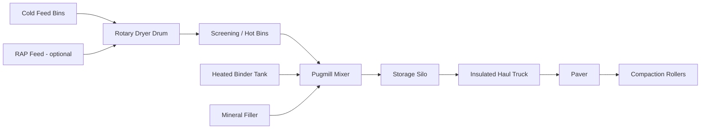

## Hot Mix and Warm Mix Asphalt Production

### Overview and Definitions

Hot Mix Asphalt (HMA) is a composite paving material produced by heating asphalt binder (bitumen) and aggregate to a high temperature, then combining them to produce a homogeneous, coatable mixture. HMA typically has production and mixing temperatures ranging from $140$ to $180°C$, depending on binder grade.

Warm Mix Asphalt (WMA) refers to a family of technologies that allow asphalt mixtures to be produced and compacted at lower temperatures than conventional HMA, typically $20$ to $40°C$ lower, often in the range of $100$ to $140°C$. WMA achieves comparable workability and compaction to HMA at reduced thermal input through chemical, organic, or foaming additives that temporarily reduce binder viscosity or increase mix workability during construction.

Both processes fall under the broader category of plant-mixed asphalt production, distinguished primarily by production temperature, energy consumption, and emissions profile.

### Key Points

- HMA remains the dominant global paving technology due to established performance history and mature specifications.
- WMA was developed primarily to reduce energy consumption, greenhouse gas emissions, and fume/odor exposure at the plant and paving site.
- The core material components (aggregate, binder, mineral filler, sometimes RAP/RAS) are the same for both processes; the differentiator is the production temperature and the mechanism enabling lower-temperature workability.
- Both processes require precise temperature control to prevent binder oxidation (aging), inadequate aggregate coating, or moisture-related stripping.

### Materials Used in Asphalt Mixtures

**Aggregates**

Aggregates constitute approximately $90$ to $95\%$ of the mixture by mass. They must satisfy gradation, durability, and shape requirements per standards such as AASHTO M323 or Superpave specifications. Typical properties evaluated:

- Los Angeles (LA) Abrasion resistance
- Soundness (sulfate soundness test)
- Flat and elongated particle content
- Fine aggregate angularity
- Coarse aggregate angularity

**Asphalt Binder**

The binder (bitumen) acts as the adhesive and viscoelastic component, typically $4$ to $7\%$ by mass of the total mix. Binders are graded using the Superpave Performance Grade (PG) system, denoted PG XX-YY, where XX is the average seven-day maximum pavement design temperature and YY is the minimum pavement design temperature, both in °C.

**Mineral Filler**

Fine material passing the $0.075\ mm$ (No. 200) sieve, such as baghouse fines or hydrated lime, used to fill voids and stiffen the mastic (binder-filler mixture).

**Reclaimed Asphalt Pavement (RAP) and Reclaimed Asphalt Shingles (RAS)**

Recycled materials incorporated to reduce virgin material consumption. RAP content typically ranges from $15$ to $40\%$ depending on mix design and specification limits; higher RAP percentages require binder grade adjustment to compensate for aged, stiffer recycled binder.

### Hot Mix Asphalt (HMA) Production Process

**1. Aggregate Stockpiling and Cold Feed**

Aggregates are stored in separate stockpiles by size fraction and fed via cold feed bins in proportions dictated by the job mix formula (JMF).

**2. Drying and Heating**

Aggregates pass through a rotary dryer drum, typically heated by a burner fueled by natural gas, propane, or fuel oil, to remove moisture and raise aggregate temperature to $150$–$180°C$. This is the most energy-intensive step in production.

**3. Screening and Hot Bin Storage (Batch Plants)**

In batch plants, dried aggregate is elevated and screened into hot bins by size before being weighed into a batch in the pugmill (mixing chamber).

**4. Binder Heating and Addition**

Asphalt binder is stored in heated tanks (typically $150$–$165°C$) and metered into the mixing chamber based on the target asphalt content from the JMF.

**5. Mixing**

Aggregate and binder are mixed for a specified duration (typically $30$–$45$ seconds in batch plants) to achieve complete aggregate coating. Continuous (drum) plants mix aggregate and binder concurrently within the drying drum or a separate mixing zone.

**6. Storage and Transport**

Finished HMA is stored in insulated silos (temperature loss should not exceed a few degrees per hour) and transported to the paving site in insulated, tarped trucks to minimize heat loss before compaction.

**7. Paving and Compaction**

HMA must be compacted while sufficiently hot to achieve target density, typically before the mix cools below $85$–$100°C$, since binder viscosity increases sharply as temperature drops, reducing compactability.

### Warm Mix Asphalt (WMA) Technologies

WMA technologies are generally categorized into three mechanisms:

**1. Organic/Wax Additives**

Additives such as Fischer-Tropsch wax or montan wax are blended into the binder. These additives melt at a specific temperature (often around $100$–$120°C$), reducing binder viscosity above their melting point and re-solidifying upon cooling to contribute stiffness to the final pavement.

**2. Chemical Additives**

Surfactant-based packages that improve aggregate coating and workability at lower temperatures without significantly altering binder viscosity. These often also function as anti-strip agents, improving moisture resistance.

**3. Foaming Technologies**

Water is introduced into hot binder (either directly or via water-bearing additives like zeolites) causing rapid expansion (foaming) of the binder, temporarily increasing its volume and reducing effective viscosity, which improves aggregate coating at lower temperatures.

- **Water-based foaming**: Small quantities of water (typically $1$ to $2\%$ by binder mass) are injected directly into the binder line through a specialized nozzle system just before mixing.
- **Water-bearing additive foaming**: Synthetic zeolites (hydrothermal crystalline aluminosilicates) containing structural water are added to the mix; the zeolite releases water gradually as it heats, producing controlled, sustained foaming.

**Comparison Table (Descriptive)**

| Technology Type | Example Products | Mechanism | Typical Temp. Reduction |
| --- | --- | --- | --- |
| Organic Additive | Sasobit | Wax melting/crystallization | $20$–$30°C$ |
| Chemical Additive | Evotherm | Surfactant/coating aid | $20$–$35°C$ |
| Water-based Foaming | WAM-Foam, Double Barrel Green | Direct water injection | $30$–$40°C$ |
| Water-bearing Additive | Aspha-min, Advera | Zeolite dehydration | $20$–$30°C$ |

### WMA Production Process Modifications

The core plant configuration for WMA is largely identical to HMA plants, with targeted modifications:

- **Burner and dryer control**: Set points are lowered to achieve reduced aggregate discharge temperature.
- **Additive delivery system**: Batch plants and drum plants are retrofitted with metering pumps, injection nozzles, or zeolite feed systems positioned at the pugmill or drum mixing zone.
- **Binder line modification**: For foaming technologies, expansion chambers and water injection nozzles are installed directly on the binder feed line.
- **Moisture control**: Since WMA operates at lower temperatures, residual aggregate moisture is a greater concern; drying must still achieve near-complete moisture removal despite the lower thermal input, or stripping and moisture damage risk increases. [Inference: the degree of risk is mix- and climate-dependent and may vary by regional specification]

### Advantages of WMA over HMA

- **Energy savings**: Reduced fuel consumption at the dryer burner, commonly cited in the range of $20$ to $35\%$ reduction depending on the technology and temperature differential achieved. [Unverified: exact savings depend on plant type, fuel source, and baseline temperature]
- **Reduced emissions**: Lower combustion temperatures reduce $CO_2$, $NO_x$, $SO_2$, and volatile organic compound (VOC) emissions at the plant.
- **Improved worker conditions**: Reduced fume and odor exposure for plant and paving crew personnel.
- **Extended haul distances and paving windows**: Lower production temperature narrows the temperature differential to ambient conditions, which can, in some cases, extend the time available for compaction before the mix cools below workable temperature. [Inference: this benefit depends on ambient conditions and mix-specific cooling curves]
- **Potential for higher RAP incorporation**: Some WMA technologies facilitate use of higher percentages of RAP by improving coating of aged, stiff recycled binder at lower temperatures.
- **Earlier opening to traffic in cold weather paving**: Reduced temperature differential can improve compaction outcomes during marginal weather paving.

### Challenges and Limitations of WMA

- **Moisture susceptibility**: Lower production temperatures increase risk of incomplete aggregate drying, which can lead to stripping (loss of binder-aggregate adhesion) if not properly controlled; anti-strip additives or hydrated lime are frequently specified as mitigation.
- **Long-term field performance data**: Although WMA has been used for over two decades in various markets, comparative long-term rutting and cracking performance relative to HMA continues to be studied by transportation agencies. [Unverified: performance parity claims vary by study, climate, and traffic loading conditions]
- **Additive cost**: Chemical and wax additives add incremental material cost per ton, which must be weighed against fuel savings.
- **Compaction behavior differences**: Some WMA mixes exhibit different compaction curves than HMA, requiring adjusted roller patterns or compaction temperature windows established through trial sections.

### Mix Design Considerations

Both HMA and WMA are typically designed using the **Superpave volumetric mix design method**, targeting:

- Air voids: typically $4\%$ at design number of gyrations ($N_{design}$)
- Voids in Mineral Aggregate (VMA): minimum values per NMAS (nominal maximum aggregate size)
- Voids Filled with Asphalt (VFA): typically $65$–$78\%$ range depending on traffic level
- Dust-to-binder ratio: typically $0.6$–$1.2$

For WMA, mix design procedures often require additional considerations:

- Conditioning and mixing temperatures in the laboratory are adjusted to reflect the intended field production temperature.
- Moisture sensitivity testing (e.g., AASHTO T283, Tensile Strength Ratio) is emphasized more heavily due to the increased stripping risk at lower temperatures.

$$TSR = \frac{S_{wet}}{S_{dry}} \times 100$$

where $S_{wet}$ is the tensile strength of moisture-conditioned specimens and $S_{dry}$ is the tensile strength of unconditioned (dry) specimens, both typically measured in $kPa$.

### Temperature-Viscosity Relationship

Binder workability is governed by the temperature-viscosity relationship, often represented by the ASTM D341 viscosity-temperature chart, where the mixing temperature range corresponds to a target binder viscosity of $0.17 \pm 0.02\ Pa\cdot s$, and compaction temperature corresponds to $0.28 \pm 0.03\ Pa\cdot s$. WMA technologies effectively shift the temperature required to reach these target viscosities downward, or alter the rheology so lower viscosities are achievable without matching the equivalent HMA temperature.

<svg xmlns="http://www.w3.org/2000/svg" viewBox="0 0 640 420" font-family="Arial, sans-serif">
<text x="320" y="24" text-anchor="middle" font-size="15" font-weight="bold" fill="#1a1a1a">Binder Viscosity vs. Temperature: HMA vs WMA (svg_diagram)</text>
<line x1="70" y1="360" x2="600" y2="360" stroke="#333" stroke-width="1.5" />
<line x1="70" y1="360" x2="70" y2="50" stroke="#333" stroke-width="1.5" />
<text x="335" y="395" text-anchor="middle" font-size="12" fill="#333">Temperature (°C)</text>
<text x="25" y="205" text-anchor="middle" font-size="12" fill="#333" transform="rotate(-90 25 205)">Viscosity (Pa·s)</text>
<text x="90" y="375" font-size="11" fill="#555">100</text>
<text x="230" y="375" font-size="11" fill="#555">130</text>
<text x="370" y="375" font-size="11" fill="#555">150</text>
<text x="510" y="375" font-size="11" fill="#555">170</text>
<path d="M 90 90 Q 250 180 370 280 Q 480 340 560 355" stroke="#c0392b" stroke-width="2.5" fill="none" />
<path d="M 90 130 Q 220 220 340 300 Q 450 345 560 358" stroke="#2980b9" stroke-width="2.5" fill="none" />
<line x1="440" y1="50" x2="440" y2="360" stroke="#999" stroke-dasharray="4,4" />
<line x1="290" y1="50" x2="290" y2="360" stroke="#999" stroke-dasharray="4,4" />
<text x="440" y="45" text-anchor="middle" font-size="11" fill="#555">HMA Mix Temp</text>
<text x="290" y="45" text-anchor="middle" font-size="11" fill="#555">WMA Mix Temp</text>
<rect x="420" y="60" width="14" height="14" fill="#c0392b" />
<text x="440" y="72" font-size="11" fill="#333">Conventional Binder</text>
<rect x="420" y="80" width="14" height="14" fill="#2980b9" />
<text x="440" y="92" font-size="11" fill="#333">WMA-Modified Binder</text>
</svg>

### Environmental and Regulatory Context

Many transportation agencies (e.g., state DOTs in the US, national road authorities in Europe) have incorporated WMA provisions into standard specifications, often citing reduced greenhouse gas emissions as part of broader sustainability or life-cycle assessment (LCA) goals for pavement infrastructure. Some agencies mandate or incentivize WMA use on specific project types, particularly those involving high RAP content, night paving, or urban environments with air quality regulations.

### Quality Control Testing

Common QC/QA tests applied to both HMA and WMA during production:

- **Ignition oven or extraction test**: Determines asphalt binder content (AASHTO T308 / ASTM D6307).
- **Gradation analysis**: Sieve analysis on extracted aggregate to verify conformance with JMF.
- **Bulk specific gravity ($G_{mb}$) and theoretical maximum specific gravity ($G_{mm}$)**: Used to calculate air voids in compacted samples.
- **Ignition/Nuclear density gauge or cores**: Verify in-place field density, typically targeting $92$–$96\%$ of $G_{mm}$ (i.e., $4$–$8\%$ in-place air voids).

$$\%Air\ Voids = \left(1 - \frac{G_{mb}}{G_{mm}}\right) \times 100$$

### Practical Example

A contractor producing a WMA surface course mix at a drum plant uses a foaming-based WMA system. The job mix formula calls for PG 64-22 binder at $5.2\%$ by mass, with $20\%$ RAP. Under conventional HMA production, the plant would discharge aggregate at approximately $165°C$. By implementing water-based foaming (injecting $2\%$ water by binder mass at the foaming nozzle), the plant reduces discharge temperature to $135°C$, achieving comparable coating and workability while reducing burner fuel consumption. Quality control sampling confirms in-place density of $94.5\%\ G_{mm}$, meeting the specification threshold of $92\%$ minimum, with TSR results of $82\%$ exceeding the typical minimum requirement of $80\%$.

### Conclusion

HMA and WMA represent a continuum of the same fundamental asphalt production process, differing principally in the temperature range required to achieve adequate binder-aggregate coating and field compactability. WMA technologies, whether organic, chemical, or foam-based, extend the practical operating range of asphalt plants downward, delivering measurable energy and emissions benefits while requiring careful attention to moisture control and mix-specific performance verification. Selection between HMA and WMA, and among WMA technology types, depends on project-specific factors including climate, haul distance, RAP content, and agency specification requirements.

**Related Topics**

- Superpave Performance Grade (PG) Binder Grading System
- Reclaimed Asphalt Pavement (RAP) and Reclaimed Asphalt Shingles (RAS) Utilization
- Moisture Damage and Stripping in Asphalt Pavements (AASHTO T283)
- Asphalt Plant Types: Batch Plants vs. Drum Mix Plants
- Compaction Theory and Roller Pattern Design
- Asphalt Pavement Recycling: Cold In-Place and Hot In-Place Recycling
- Life-Cycle Assessment (LCA) of Pavement Materials
- Volumetric Mix Design and the Superpave Gyratory Compactor