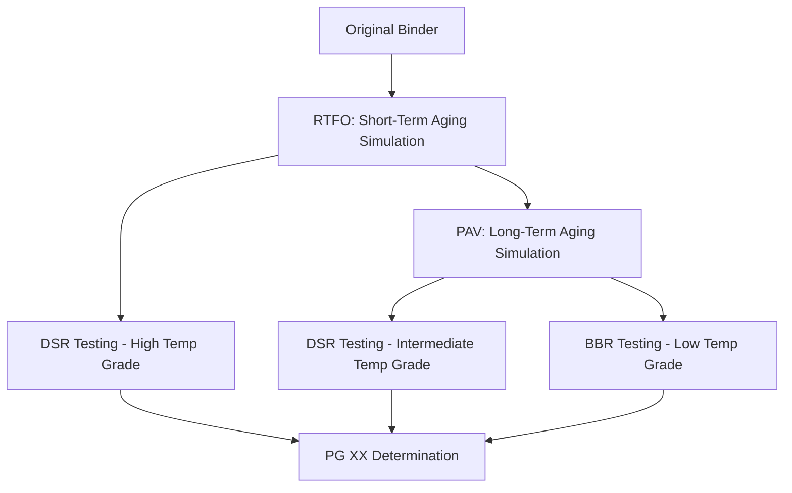

## Pavement Material Testing

### Overview

Pavement material testing encompasses the laboratory and field procedures used to characterize aggregates, asphalt binders, asphalt mixtures, and Portland cement concrete for use in pavement structures. Testing supports mix design, quality control/quality assurance (QC/QA), forensic investigation, and long-term performance prediction. Standards are primarily governed by AASHTO, ASTM, and, in some jurisdictions, national or regional equivalents (e.g., EN standards in Europe).

### Key Points

- Testing is divided into three broad categories: **aggregate testing**, **asphalt binder testing**, and **mixture testing** (with a parallel track for Portland cement concrete).
- Tests serve different purposes: mix design (establishing proportions), QC (verifying production consistency), QA (independent verification), and forensic/performance testing (diagnosing distress or predicting service life).
- Volumetric properties (density, air voids, specific gravity) underpin most acceptance criteria for asphalt mixtures.
- Performance-based testing (e.g., Superpave PG grading, Balanced Mix Design tests) has increasingly supplemented traditional empirical tests (e.g., Marshall stability, penetration).

### Aggregate Testing

**Gradation (Sieve Analysis)** — AASHTO T27 / ASTM C136

Determines particle size distribution by passing a sample through a stack of sieves with progressively smaller openings. Results are plotted on a semi-log gradation chart and compared against specification bands or the $0.45$ power gradation chart used in Superpave design.

**Los Angeles (LA) Abrasion Test** — AASHTO T96 / ASTM C131

Measures resistance to degradation from abrasion and impact by tumbling aggregate with steel spheres in a rotating drum. Percent loss is calculated as the mass passing a specified sieve after rotation, divided by original mass. Typical specification limits require loss values below $40\%$ for most highway applications. [Inference: exact thresholds vary by agency and application]

**Soundness Test** — AASHTO T104 / ASTM C88

Evaluates resistance to weathering (freeze-thaw simulation) by subjecting aggregate to repeated cycles of immersion in a saturated sodium or magnesium sulfate solution, which crystallizes within pores and simulates disintegration forces.

**Specific Gravity and Absorption** — AASHTO T84/T85 / ASTM C127/C128

Determines bulk specific gravity, bulk SSD (saturated surface-dry) specific gravity, apparent specific gravity, and water absorption of fine and coarse aggregate, essential inputs for volumetric mix design calculations.

**Flat and Elongated Particles** — ASTM D4791

Identifies particles whose length-to-thickness ratio exceeds a specified value (commonly $5:1$), since excessive flat/elongated particles reduce mixture stability and compaction quality.

**Fine Aggregate Angularity (FAA)** — AASHTO T304

Measures void content in loosely compacted fine aggregate as an indirect indicator of particle shape and surface texture, correlating with resistance to rutting.

**Coarse Aggregate Angularity (CAA)**

Determined by manually or automatically counting fractured faces on coarse aggregate particles, expressed as a percentage with at least one or two fractured faces.

**Sand Equivalent Test** — AASHTO T176 / ASTM D2419

Estimates the relative proportion of clay-like fines versus sand in fine aggregate using a graduated cylinder and flocculating solution.

### Asphalt Binder Testing

**Penetration Test** — ASTM D5 / AASHTO T49

Legacy empirical test measuring the depth (in tenths of a millimeter) a standard needle penetrates a binder sample under specified load, time, and temperature ($100\ g$, $5\ s$, $25°C$). Largely superseded by Superpave PG grading but still used in some regions for classification.

**Viscosity Testing** — ASTM D4402 (Rotational Viscometer)

Measures binder viscosity at $135°C$ to ensure pumpability and workability at mixing temperatures; Superpave specification requires viscosity below $3\ Pa\cdot s$ at this temperature.

**Dynamic Shear Rheometer (DSR)** — AASHTO T315

Central to Superpave PG grading; measures complex shear modulus ($G^*$) and phase angle ($\delta$) across a temperature range to characterize rutting resistance (via $G^*/\sin\delta$) and fatigue cracking resistance (via $G^* \times \sin\delta$).

$$Rutting\ Parameter = \frac{G^*}{\sin\delta} \geq 1.0\ kPa\ (unaged),\ \geq 2.2\ kPa\ (RTFO-aged)$$

**Bending Beam Rheometer (BBR)** — AASHTO T313

Evaluates low-temperature cracking susceptibility by measuring creep stiffness ($S$) and the rate of stiffness change ($m$-value) of a binder beam at low temperatures, typically down to $-36°C$ depending on grade.

**Rolling Thin Film Oven (RTFO) Test** — AASHTO T240 / ASTM D2872

Simulates short-term aging that occurs during plant mixing and construction by exposing binder film to heat ($163°C$) and airflow in a rotating bottle apparatus.

**Pressure Aging Vessel (PAV)** — AASHTO R28

Simulates long-term in-service aging (approximately $7$–$10$ years) by subjecting RTFO-aged binder to elevated pressure ($2.1\ MPa$) and temperature ($90$–$110°C$) for $20$ hours.

**Flash Point** — ASTM D92 (Cleveland Open Cup)

Determines the minimum temperature at which binder vapors ignite momentarily, an important safety parameter for handling and transport.

**Ductility Test** — ASTM D113

Measures the distance a standard briquette of binder can be stretched before breaking at a specified temperature and rate, historically used as an indicator of binder cohesion.

### Asphalt Mixture Testing

**Marshall Stability and Flow** — ASTM D6927

Legacy empirical test measuring maximum load resistance (stability) and corresponding deformation (flow) of compacted cylindrical specimens under a curved loading head at $60°C$. Largely replaced by Superpave methods in many jurisdictions but still used regionally.

**Superpave Gyratory Compactor (SGC)** — AASHTO T312

Compacts specimens using a gyratory kneading action under controlled angle, pressure, and number of gyrations ($N_{initial}$, $N_{design}$, $N_{maximum}$) to simulate field densification, producing specimens for volumetric analysis.

**Bulk Specific Gravity of Compacted Mixtures ($G_{mb}$)** — AASHTO T166 / ASTM D2726

Determined via the saturated surface-dry (SSD) method, used with theoretical maximum specific gravity to calculate air voids.

**Theoretical Maximum Specific Gravity ($G_{mm}$)** — AASHTO T209 / ASTM D2041 (Rice Test)

Measures the specific gravity of a loose (uncompacted) asphalt mixture sample under vacuum, representing the mixture at zero air voids; used as the denominator in percent compaction calculations.

$$G_{mm} = \frac{A}{A + D - E}$$

where $A$ = mass of dry sample in air, $D$ = mass of container with water, $E$ = mass of container with sample and water under vacuum conditions (values per test method specifics).

**Ignition Oven / Extraction Test** — AASHTO T308 / ASTM D6307

Determines asphalt binder content by burning off binder in a furnace and measuring mass loss, or via solvent extraction (AASHTO T164) in older methods.

**Moisture Susceptibility (Tensile Strength Ratio)** — AASHTO T283

Compares indirect tensile strength of moisture-conditioned versus unconditioned specimens to evaluate stripping potential.

**Hamburg Wheel-Tracking Test (HWTT)** — AASHTO T324

Evaluates rutting and moisture damage susceptibility by repeatedly rolling a loaded steel wheel over a submerged specimen, measuring rut depth versus number of passes; also identifies the "stripping inflection point."

**Ideal-CT (Cracking Test)** — ASTM D8225

An indirect tension test measuring the cracking tolerance index ($CT_{Index}$) of asphalt mixtures at intermediate temperature, part of the growing Balanced Mix Design (BMD) framework.

**Asphalt Pavement Analyzer (APA)**

Measures rutting susceptibility using a loaded wheel tracking device under repeated linear or rotational loading, often used as an alternative to HWTT.

**Indirect Tensile Asphalt Cracking Test (IDEAL-CT) and Semi-Circular Bend (SCB) Test** — ASTM D8044

Evaluates fracture energy and cracking resistance, increasingly incorporated into Balanced Mix Design specifications that pair a rutting test with a cracking test to avoid over-optimizing for one failure mode at the expense of the other.

### Balanced Mix Design (BMD) Framework

BMD represents a shift from purely volumetric or empirical mix design toward performance-verified design, typically requiring:

- One or more **rutting resistance tests** (e.g., HWTT, APA)
- One or more **cracking resistance tests** (e.g., IDEAL-CT, SCB, Disk-shaped Compact Tension)
- Volumetric criteria as secondary confirmation rather than sole acceptance criteria

This approach directly addresses the historical tension where mixtures optimized to resist rutting (via stiffer binders or lower asphalt content) become more susceptible to fatigue and thermal cracking, and vice versa.

### Portland Cement Concrete (PCC) Pavement Testing (Comparative Reference)

While asphalt dominates flexible pavement testing, rigid pavement testing includes parallel material characterization:

**Compressive Strength** — ASTM C39

Standard cylinder test measuring maximum compressive load at failure, typically at $7$ and $28$-day curing intervals.

**Flexural Strength (Modulus of Rupture)** — ASTM C78 / C293

Measures beam flexural capacity under third-point or center-point loading, directly relevant to rigid pavement slab design since PCC pavements primarily resist flexural (bending) stresses.

**Slump Test** — ASTM C143

Measures workability/consistency of fresh concrete.

**Air Content** — ASTM C231 (pressure method) / C173 (volumetric method)

Verifies entrained air content for freeze-thaw durability, typically targeting $5$–$8\%$ depending on exposure conditions and aggregate size.

### Field Testing Methods

**Nuclear Density Gauge** — AASHTO T310

Rapidly measures in-place density and moisture content of compacted materials using gamma radiation backscatter, requiring licensed operators due to radioactive source material.

**Non-Nuclear Density Gauges**

Alternative electromagnetic or dielectric-based devices that estimate density without radioactive sources, increasingly adopted due to regulatory and handling advantages. [Inference: correlation accuracy relative to nuclear gauges and core density can vary by mix type and requires local calibration]

**Core Sampling**

Physical extraction of cylindrical specimens from in-place pavement for laboratory determination of density, thickness, and layer bonding; considered the reference method against which non-destructive methods are calibrated.

**Falling Weight Deflectometer (FWD)**

Applies an impulse load to the pavement surface and measures resulting surface deflections at multiple sensor locations, used to back-calculate layer moduli and assess structural capacity or load-carrying deterioration.

**Ground Penetrating Radar (GPR)**

Non-destructive technique using electromagnetic pulses to estimate pavement layer thicknesses and detect subsurface anomalies such as voids or delamination.

**International Roughness Index (IRI) Measurement**

Quantifies pavement ride quality using laser profilometers mounted on vehicles, expressed in $m/km$ or $in/mi$, correlating with user comfort and maintenance need.

### Practical Example

A state DOT quality assurance laboratory receives asphalt mixture samples from a paving project. The QA process includes: extracting binder content via ignition oven (target $5.0\% \pm 0.3\%$), performing gradation analysis on recovered aggregate against JMF tolerances, compacting Superpave gyratory specimens to determine $G_{mb}$ and calculating air voids against the $4.0\%$ design target, and running Hamburg Wheel-Tracking Tests on a subset of specimens to verify rutting resistance below $12.5\ mm$ at $20{,}000$ passes per specification. Concurrently, field technicians use a non-nuclear density gauge calibrated against extracted cores to verify in-place compaction meets the $92\%\ G_{mm}$ minimum threshold before opening the lane to traffic.

### Conclusion

Pavement material testing spans a continuum from fundamental aggregate and binder characterization through mixture-level performance verification and field quality assurance. The field has progressively shifted from empirical index tests (penetration, Marshall stability) toward performance-based characterization (Superpave PG grading, Balanced Mix Design), driven by the need to directly predict field distress mechanisms such as rutting, fatigue cracking, thermal cracking, and moisture damage rather than relying solely on historically correlated surrogate measures.

**Related Topics**

- Superpave Mix Design Methodology
- Balanced Mix Design (BMD) Implementation and Specification Development
- Aggregate Gradation and the 0.45 Power Chart
- Pavement Distress Identification and Condition Surveys
- Nondestructive Testing Methods for Pavement Structural Evaluation
- Life-Cycle Cost Analysis for Pavement Material Selection
- Recycled Materials Testing (RAP, RAS, Ground Tire Rubber)