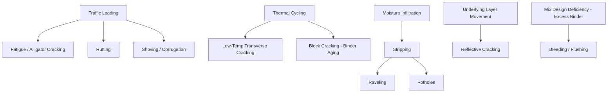

## Common Pavement Distress Mechanisms

### Overview

Pavement distress refers to observable deterioration in the surface, structural, or functional condition of a pavement, arising from traffic loading, environmental exposure, material deficiencies, or construction defects. Distress mechanisms are typically classified for flexible (asphalt) pavements and rigid (Portland cement concrete) pavements separately, since the underlying structural behavior differs fundamentally between the two pavement types. Distress identification underpins pavement management systems (PMS), maintenance and rehabilitation (M&R) prioritization, and forensic investigation.

### Key Points

- Distress mechanisms are generally categorized as **load-associated** (traffic-induced), **non-load-associated** (climate, material, or aging-induced), or a combination of both.
- Standardized distress catalogs, such as the Long-Term Pavement Performance (LTPP) Distress Identification Manual (FHWA) and ASTM D6433 (for Pavement Condition Index calculation), provide consistent terminology and severity/extent classification.
- Distress severity is generally rated as low, moderate, or high, and extent is quantified as percentage of area or length affected, feeding into composite indices like the Pavement Condition Index (PCI).
- Early detection and correct diagnosis of distress mechanism (not just symptom) is critical, since similar visual symptoms (e.g., cracking) can arise from entirely different root causes requiring different repair strategies.

### Flexible (Asphalt) Pavement Distresses

**Fatigue Cracking (Alligator Cracking)**

Interconnected cracks forming a pattern resembling alligator skin or chicken wire, caused by repeated traffic loading exceeding the fatigue life of the asphalt layer, typically initiating at the bottom of the asphalt layer (bottom-up cracking) where tensile strain is highest under wheel loads, and propagating upward. Associated with structural inadequacy, insufficient layer thickness, or binder aging/embrittlement over time.

$$N_f = k_1 \left(\frac{1}{\varepsilon_t}\right)^{k_2} \left(\frac{1}{E}\right)^{k_3}$$

where $N_f$ is the number of load cycles to fatigue failure, $\varepsilon_t$ is tensile strain at the bottom of the asphalt layer, $E$ is mixture stiffness modulus, and $k_1, k_2, k_3$ are calibration coefficients.

**Rutting (Permanent Deformation)**

Longitudinal surface depressions in wheel paths caused by cumulative permanent (plastic) deformation, which may originate in the asphalt layer, base/subbase layers, or subgrade. Asphalt-layer rutting is often linked to insufficient aggregate angularity, excessive asphalt content, or inadequate compaction, while subgrade rutting reflects weak or saturated foundation soils.

**Thermal (Low-Temperature) Cracking**

Transverse cracks perpendicular to the pavement centerline, caused by binder contraction and embrittlement at low temperatures, occurring when thermally induced tensile stress exceeds the binder's fracture strength. Governed largely by the binder's low-temperature PG grade and the BBR-measured creep stiffness and $m$-value.

**Block Cracking**

Interconnected cracks forming large rectangular blocks, typically $0.3$ to $3\ m$ across, caused by binder aging and shrinkage in non-traffic-loaded areas, distinguishing it from fatigue cracking since it is not load-associated and often appears uniformly across the pavement width, including areas outside wheel paths.

**Longitudinal and Transverse Cracking (Non-Wheel-Path)**

Cracks often related to poorly constructed paving joints, reflective cracking from underlying pavement layers or utility trenches, or asphalt layer shrinkage.

**Reflective Cracking**

Cracks that propagate upward through an asphalt overlay directly above joints or cracks present in the underlying pavement layer, common in composite pavements (asphalt overlay over jointed concrete) or asphalt overlays placed over previously cracked asphalt pavement.

**Raveling**

Progressive disintegration of the pavement surface from the top down, involving loss of aggregate particles due to binder aging/oxidation, inadequate compaction, insufficient binder content, or moisture damage (stripping) that weakens the binder-aggregate bond.

**Bleeding (Flushing)**

Excess asphalt binder migrating to the pavement surface, forming a shiny, sticky film, typically caused by excessive asphalt content in the mix design, inadequate air voids, or aggregate degradation reducing available void space under traffic densification and high temperatures.

**Stripping (Moisture-Induced Damage)**

Loss of adhesion between asphalt binder and aggregate due to moisture infiltration, often exacerbated by hydrophilic aggregate surfaces, inadequate coating during production, or freeze-thaw cycling; frequently manifests as subsurface delamination that later surfaces as raveling or potholes.

**Potholes**

Bowl-shaped cavities in the pavement surface resulting from progressive material loss, often initiated by moisture infiltration through cracks, followed by freeze-thaw expansion (in cold climates) and traffic-induced dislodgement of weakened material.

**Shoving and Corrugation**

Localized longitudinal displacement or wave-like surface deformation caused by unstable mixtures (excessive binder, insufficient aggregate interlock) under braking or turning traffic loads, typically near intersections or bus stops.

### Rigid (Portland Cement Concrete) Pavement Distresses

**Transverse and Longitudinal Cracking**

Cracks resulting from shrinkage, thermal gradients, load-induced stress, or improper joint spacing/sawing timing; if joints are not sawed early enough or spaced appropriately, uncontrolled cracking occurs elsewhere in the slab.

**Corner Breaks**

Cracks that intersect a transverse and longitudinal joint, isolating a triangular corner section, typically caused by heavy repeated loading near slab corners combined with loss of support (e.g., pumping-induced voids) beneath the corner.

**Faulting**

Vertical elevation difference across a transverse joint or crack, typically caused by pumping of fines from beneath the slab under repeated loading in the presence of free water, leading to progressive loss of support and differential settlement between adjacent slabs.

**Pumping**

Ejection of water and fine material through joints and cracks under traffic loading, indicating the presence of free water beneath the slab and erodible base/subbase material; a root cause contributing to faulting and corner breaks.

**Joint Spalling**

Cracking, breaking, or chipping of slab edges near joints, typically within $0.6\ m$ of the joint, caused by excessive stress concentration at the joint, poor joint construction, infiltration of incompressible materials into the joint, or reinforcing steel corrosion near the surface.

**Durability ("D") Cracking**

Pattern cracking, often initiating near joints and cracks and progressing inward, caused by freeze-thaw expansion of certain susceptible aggregate types that absorb water and expand upon freezing within the concrete matrix.

**Alkali-Silica Reaction (ASR)**

A chemical reaction between reactive silica minerals in certain aggregates and alkali hydroxides in the cement paste pore solution, producing an expansive gel that absorbs moisture and swells, generating internal stress that manifests as map/pattern cracking, often with characteristic gel exudation at crack faces.

**Blowups**

Localized upward shattering or buckling of the pavement at a joint or crack, occurring in hot weather when slab expansion is restrained by incompressible material accumulated in joints, generating compressive stresses that exceed the concrete's capacity.

**Scaling**

Progressive loss of the surface mortar layer, exposing coarse aggregate, typically caused by inadequate air entrainment relative to freeze-thaw exposure, improper finishing/curing, or de-icing chemical application before adequate strength gain.

**Punchouts** (specific to Continuously Reinforced Concrete Pavement, CRCP)

Localized area bounded by two closely spaced transverse cracks, a longitudinal crack, and the pavement edge, associated with loss of aggregate interlock and reinforcing steel corrosion in CRCP systems.

### Distress Severity and Extent Classification

Distress is systematically documented using standardized manuals (e.g., FHWA LTPP Distress Identification Manual, ASTM D6433 for Pavement Condition Index):

| Severity Level | General Description |
| --- | --- |
| Low (L) | Distress barely noticeable; minimal functional impact |
| Moderate (M) | Distress clearly visible; some functional impact, may require monitoring or minor maintenance |
| High (H) | Distress severe; significant functional/structural impact, often requiring immediate repair |

Extent is typically recorded as a percentage of sample unit area (for area-based distresses like cracking or rutting) or count/length per unit distance (for discrete distresses like potholes or joint spalls).

### Pavement Condition Index (PCI) — ASTM D6433

A composite numerical rating from $0$ (failed) to $100$ (excellent), calculated by identifying distress types, severities, and densities within sample units, applying deduct value curves for each distress/severity combination, and combining deduct values through a corrected deduct value (CDV) procedure to yield the final PCI score.

$$PCI = 100 - CDV$$

where $CDV$ is the corrected deduct value derived from the standardized deduct value curves and correction procedure specified in ASTM D6433.

### Root Cause Categories Summary

**Load-Associated Distresses**: Fatigue cracking, rutting (traffic-induced), corner breaks, faulting, punchouts.

**Climate/Environmental Distresses**: Thermal cracking, block cracking, D-cracking, blowups, scaling.

**Material/Mix Design Deficiencies**: Bleeding, shoving, stripping (partially), ASR.

**Construction Defects**: Segregation-related raveling, poor joint construction/timing, inadequate compaction, improper curing.

**Drainage-Related**: Pumping, faulting, moisture-induced stripping and base weakening.

### Practical Example

A pavement engineer conducting a condition survey on a 10-year-old asphalt arterial roadway observes: alligator cracking covering approximately $15\%$ of the wheel path area at moderate severity, transverse thermal cracks spaced roughly every $6\ m$ across the full pavement width, and localized rutting of $12\ mm$ depth in the outer lane wheel path. The engineer diagnoses the alligator cracking as a structural fatigue issue (likely inadequate original design thickness or accumulated heavy truck loading), the transverse cracking as a binder aging/low-temperature issue independent of loading, and the rutting as a mixture stability concern, potentially linked to insufficient aggregate angularity in the surface course. This differentiated diagnosis leads to a recommendation of a full-depth reclamation or structural overlay (addressing fatigue and rutting) rather than a simple crack-sealing treatment, which would only address the non-load-associated thermal cracking.

### Conclusion

Correctly distinguishing pavement distress mechanisms, rather than treating all cracking or deformation as equivalent, is essential to selecting appropriate and cost-effective maintenance and rehabilitation strategies. Flexible and rigid pavements exhibit fundamentally different distress modes due to their differing structural behavior (flexural beam action in rigid slabs versus layered elastic response in flexible pavements), and standardized distress identification protocols enable consistent condition assessment across agencies and over time, forming the foundation of modern pavement management systems.

**Related Topics**

- Pavement Management Systems (PMS) and Network-Level Decision Making
- Falling Weight Deflectometer (FWD) Testing and Structural Evaluation
- Pavement Rehabilitation Strategies: Overlays, Reclamation, and Reconstruction
- Alkali-Silica Reaction (ASR) Mechanisms and Mitigation
- Joint Design and Load Transfer in Rigid Pavements
- Mechanistic-Empirical Pavement Design Guide (MEPDG/AASHTOWare Pavement ME)
- Drainage Design for Pavement Structures