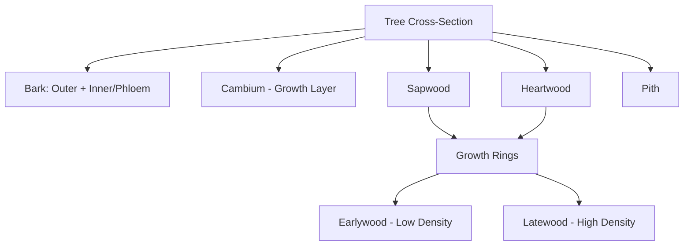

## Wood Structure and Anatomy

### Overview

Wood is a natural, anisotropic, cellular composite material produced by trees, composed primarily of cellulose, hemicellulose, and lignin arranged in a hierarchical structure ranging from molecular polymer chains to macroscopic growth rings. Understanding wood anatomy is fundamental to predicting mechanical behavior, moisture response, durability, and appropriate structural application, since nearly all engineering properties of wood are direct consequences of its cellular and molecular organization.

### Key Points

- Wood is **anisotropic and orthotropic**, exhibiting distinct mechanical and physical properties along three mutually perpendicular axes: longitudinal, radial, and tangential.
- The macroscopic distinction between **softwoods** (gymnosperms/conifers) and **hardwoods** (angiosperms) reflects fundamentally different cellular anatomy, not simply density or hardness.
- Wood's hierarchical structure spans multiple scales: chemical (cellulose microfibrils), cell wall (layered structure), cellular (tracheids, vessels, fibers), and macroscopic (growth rings, sapwood/heartwood).
- Moisture content and its interaction with cell wall structure governs dimensional stability, strength, and decay susceptibility.

### Macroscopic Structure

**Cross-Sectional Anatomy**

A tree trunk cross-section reveals, from outside to inside:

- **Bark**: Outer protective layer, comprising outer bark (dead, corky) and inner bark/phloem (living, conducts synthesized sugars downward).
- **Cambium**: A thin layer of actively dividing cells between bark and wood, responsible for producing new xylem (wood) cells inward and new phloem cells outward, driving radial growth.
- **Sapwood**: Outer, physiologically active wood containing living parenchyma cells that conduct water and store nutrients; generally lighter in color and less decay-resistant than heartwood.
- **Heartwood**: Inner, physiologically inactive wood formed as sapwood cells die and become infused with extractives (tannins, resins, phenolic compounds); typically darker and more decay-resistant due to these extractives.
- **Pith**: The small central core, representing the original first-year growth.

**Growth Rings (Annual Rings)**

In temperate climates, trees produce one growth increment per year, visible as concentric rings, each consisting of:

- **Earlywood (Springwood)**: Formed early in the growing season, characterized by larger-diameter, thinner-walled cells adapted for rapid water conduction; generally lower density.
- **Latewood (Summerwood)**: Formed later in the growing season, characterized by smaller-diameter, thicker-walled cells; generally higher density and darker in appearance, contributing disproportionately to strength.

The proportion of latewood to total ring width is a primary determinant of wood density and, consequently, mechanical strength within a given species.

### The Three Principal Anatomical Axes

Wood's orthotropic nature is defined relative to three mutually perpendicular directions, each with distinct mechanical properties:

- **Longitudinal (L)**: Parallel to the grain/fiber direction (parallel to the trunk axis); exhibits the highest strength and stiffness, since cellulose microfibrils in cell walls are oriented predominantly along this axis.
- **Radial (R)**: Perpendicular to growth rings, extending from pith to bark.
- **Tangential (T)**: Perpendicular to the radial direction, tangent to the growth rings.

Shrinkage, strength, and stiffness typically differ substantially across these three axes, with longitudinal properties far exceeding radial and tangential properties. Typical shrinkage ratios (tangential : radial : longitudinal) are approximately $2:1:0.05$, meaning tangential shrinkage is roughly twice radial shrinkage, while longitudinal shrinkage is comparatively negligible. [Inference: exact ratios vary considerably by species]

<svg xmlns="http://www.w3.org/2000/svg" viewBox="0 0 600 380" font-family="Arial, sans-serif">
<text x="300" y="24" text-anchor="middle" font-size="15" font-weight="bold" fill="#1a1a1a">Principal Anatomical Axes of Wood (svg_diagram)</text>
<ellipse cx="300" cy="230" rx="140" ry="140" fill="none" stroke="#8b5a2b" stroke-width="2" />
<ellipse cx="300" cy="230" rx="105" ry="105" fill="none" stroke="#a67c52" stroke-width="1.5" />
<ellipse cx="300" cy="230" rx="70" ry="70" fill="none" stroke="#c9a26d" stroke-width="1.5" />
<ellipse cx="300" cy="230" rx="35" ry="35" fill="none" stroke="#e0c090" stroke-width="1.5" />
<circle cx="300" cy="230" r="4" fill="#5a3a1a" />
<line x1="300" y1="230" x2="440" y2="230" stroke="#c0392b" stroke-width="2.5" marker-end="url(#arrowR)" />
<text x="450" y="235" font-size="12" fill="#c0392b">Radial (R)</text>
<line x1="300" y1="230" x2="230" y2="115" stroke="#2980b9" stroke-width="2.5" marker-end="url(#arrowT)" />
<text x="150" y="105" font-size="12" fill="#2980b9">Tangential (T)</text>
<line x1="300" y1="230" x2="300" y2="340" stroke="#27ae60" stroke-width="2.5" marker-end="url(#arrowL)" />
<text x="240" y="365" font-size="12" fill="#27ae60">Longitudinal (L) — out of ring plane</text>
</svg>

### Softwood (Coniferous) Anatomy

Softwoods (e.g., pine, fir, spruce, cedar) belong to the gymnosperm class and possess relatively simple, uniform cellular anatomy:

**Tracheids**

The dominant cell type, comprising $90$–$95\%$ of softwood volume, serving dual functions of water conduction and mechanical support. Tracheids are elongated, closed-ended cells typically $3$–$5\ mm$ long, aligned parallel to the longitudinal axis, connected to adjacent tracheids via **bordered pits** that allow lateral water movement while restricting air embolism spread.

**Rays**

Horizontal (radial) bands of parenchyma cells extending from near the pith toward the bark, functioning in lateral nutrient transport and storage; generally narrower and less conspicuous in softwoods than in many hardwoods.

**Resin Canals**

Tubular intercellular spaces lined with epithelial cells that secrete resin, present in certain softwood genera (e.g., pine, spruce, larch) as a defense mechanism against insects and decay organisms; absent in others (e.g., true firs, hemlock).

### Hardwood (Deciduous/Angiosperm) Anatomy

Hardwoods (e.g., oak, maple, cherry, ash) possess more complex and specialized cellular anatomy, with distinct cell types performing separated functions:

**Vessels (Pores)**

Specialized wide-diameter cells stacked end-to-end forming continuous tubes optimized for efficient water conduction; visible to the naked eye on cross-sections as "pores," from which the term "porous wood" derives. Vessel arrangement patterns define two key hardwood subclassifications:

- **Ring-porous**: Large vessels concentrated in earlywood, with smaller vessels in latewood, creating a distinct visible ring pattern (e.g., oak, ash, elm).
- **Diffuse-porous**: Vessels of relatively uniform size distributed evenly throughout the growth ring (e.g., maple, birch, poplar).

**Fibers**

Narrow, thick-walled cells providing the primary mechanical support function in hardwoods (a function performed by tracheids in softwoods); generally shorter than softwood tracheids, typically $1$–$2\ mm$.

**Parenchyma**

Living cells responsible for storage and lateral transport, occurring as axial parenchyma (parallel to grain) and ray parenchyma (radial bands), generally more abundant and visually conspicuous in hardwoods than softwoods.

**Rays**

Often wider and taller in hardwoods than softwoods, in some species (e.g., oak) forming prominent rays visible as flecks on quarter-sawn surfaces, valued for decorative appearance.

| Feature | Softwood | Hardwood |
| --- | --- | --- |
| Primary conducting cell | Tracheid | Vessel |
| Primary support cell | Tracheid (dual function) | Fiber |
| Botanical class | Gymnosperm | Angiosperm |
| Typical cell length | $3$–$5\ mm$ (tracheids) | $1$–$2\ mm$ (fibers) |
| Pore visibility | Not visible (no vessels) | Visible pores |
| Example species | Pine, spruce, fir, cedar | Oak, maple, cherry, ash |

### Cell Wall Structure

Each wood cell wall is a layered composite structure:

- **Middle Lamella (ML)**: Outermost layer, primarily lignin, bonding adjacent cells together.
- **Primary Wall (P)**: Thin outer layer with randomly oriented cellulose microfibrils.
- **Secondary Wall, Layer 1 (S1)**: Microfibrils oriented at a steep angle relative to the cell axis.
- **Secondary Wall, Layer 2 (S2)**: The thickest layer, dominating cell wall mechanical properties, with microfibrils oriented at a relatively small **microfibril angle (MFA)** nearly parallel to the cell axis; the MFA is a primary determinant of longitudinal stiffness and strength.
- **Secondary Wall, Layer 3 (S3)**: Innermost thin layer, microfibrils again oriented at a steeper angle.

$$E_{L} \propto \cos^2(MFA)$$

[Inference: this is a simplified conceptual relationship; actual micromechanical models (e.g., Cave's model, Hofstetter's model) incorporate additional matrix and lamella interaction effects]

Lower microfibril angles (more parallel to the cell axis) correlate with higher longitudinal stiffness, while juvenile wood (formed near the pith in a tree's early years) typically exhibits higher MFA and correspondingly lower stiffness than mature wood.

### Chemical Composition

Wood's cell walls are composed primarily of three polymeric constituents:

- **Cellulose** ($40$–$50\%$ dry weight): A linear polysaccharide of glucose units forming crystalline microfibrils, providing primary tensile strength along the fiber axis.
- **Hemicellulose** ($20$–$30\%$ dry weight): Branched, amorphous polysaccharides that bind cellulose microfibrils together and interact with lignin, contributing to moisture sorption behavior.
- **Lignin** ($20$–$30\%$ dry weight): A complex, amorphous phenolic polymer that fills space between cellulose and hemicellulose, acting as a rigid matrix analogous to the resin in a fiber-reinforced composite, providing compressive strength and resistance to microbial degradation.

Wood is often conceptually described as a natural fiber-reinforced composite, with cellulose microfibrils analogous to reinforcing fibers and the lignin-hemicellulose matrix analogous to the surrounding resin matrix in engineered composites.

### Moisture Relations and the Fiber Saturation Point

Water exists in wood in two forms: **free water** (in cell lumens/cavities) and **bound water** (chemically bound within cell walls via hydrogen bonding to hydroxyl groups in cellulose and hemicellulose). The **Fiber Saturation Point (FSP)** is the moisture content at which cell walls are fully saturated with bound water but no free water remains in the lumens, typically occurring around $28$–$30\%$ moisture content (oven-dry basis) for most species. Below the FSP, moisture content changes cause dimensional change (shrinkage/swelling) and strength property changes; above the FSP, additional moisture (free water) has negligible effect on dimension or most strength properties.

$$MC(\%) = \frac{W_{wet} - W_{oven-dry}}{W_{oven-dry}} \times 100$$

### Growth Characteristics Affecting Structural Properties

**Juvenile Wood**

Wood formed during a tree's first $5$–$20$ years (species-dependent), characterized by higher microfibril angle, lower density, higher longitudinal shrinkage, and correspondingly lower strength and stiffness compared to mature wood.

**Reaction Wood**

Abnormal wood formed in response to mechanical stress (e.g., leaning trunks, branch attachment points):

- **Compression wood** (softwoods): Forms on the underside of leaning stems/branches, characterized by higher lignin content, higher longitudinal shrinkage, and reduced strength.
- **Tension wood** (hardwoods): Forms on the upper side of leaning stems/branches, characterized by a gelatinous fiber layer, causing excessive longitudinal shrinkage and machining difficulties.

**Knots**

Sections of branch tissue embedded within the trunk's wood, representing localized grain discontinuity that disrupts fiber orientation around the knot, reducing tensile strength significantly (though effect on compressive strength is comparatively smaller) and serving as a primary basis for visual structural grading rules.

**Specific Gravity/Density**

Directly correlated with mechanical strength across nearly all properties, primarily governed by the proportion of latewood to earlywood and the relative cell wall thickness; used as a key input variable in most wood mechanics empirical strength equations.

### Practical Example

A structural engineer selecting lumber for a roof truss compares Douglas fir (a ring-porous... actually softwood, non-porous tracheid structure) against red oak (a ring-porous hardwood). Douglas fir is selected for the primary structural members due to its favorable strength-to-weight ratio, straight grain, and consistent tracheid-based structure that provides predictable longitudinal strength; the engineer also specifies a maximum knot size per visual grading rules, since knots near the tension face of a bending member (bottom chord) would disrupt fiber continuity precisely where tensile stress is highest. Red oak, despite superior hardness and decorative appeal from its prominent rays, is avoided for the primary structural members due to higher density-driven material cost and generally lower dimensional stability from its wider vessel structure and higher radial/tangential shrinkage differential.

### Conclusion

Wood's anatomical structure, from the molecular arrangement of cellulose microfibrils within layered cell walls to the macroscopic organization of growth rings, sapwood, and heartwood, directly governs its anisotropic mechanical behavior, moisture response, and durability characteristics. Recognizing the fundamental anatomical distinction between softwood tracheid-based structure and hardwood vessel/fiber-based structure, along with growth anomalies such as juvenile wood, reaction wood, and knots, provides the essential foundation for interpreting wood mechanical property data, structural grading systems, and appropriate material selection in civil and structural engineering applications.

**Related Topics**

- Wood Mechanical Properties and Orthotropic Elasticity
- Moisture Content, Shrinkage, and Dimensional Stability
- Visual and Mechanical (Machine Stress-Rated) Lumber Grading
- Wood Decay Mechanisms and Preservative Treatment
- Engineered Wood Products: Glulam, LVL, and Cross-Laminated Timber (CLT)
- Wood Species Selection for Structural Applications