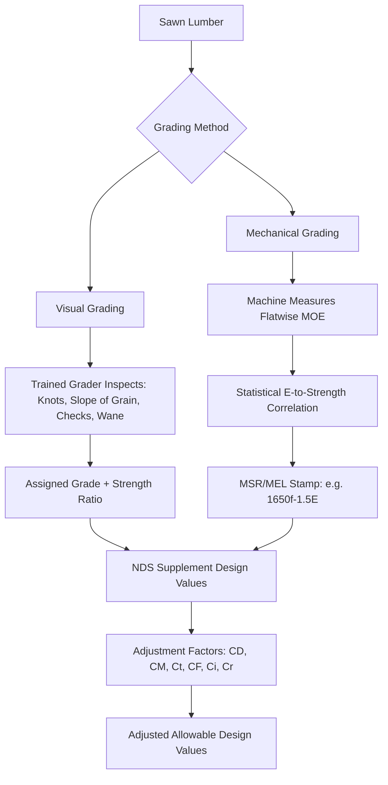

## Mechanical Properties and Grading of Lumber

### Overview

The mechanical properties of lumber govern its allowable use in structural design, while grading systems provide standardized methods to sort lumber into categories with predictable, statistically-derived design values. Because wood is a natural, variable, anisotropic material, structural design relies on grading (visual or mechanical) combined with statistically established design values, rather than treating lumber as a uniform engineered material with fixed properties.

### Key Points

- Wood mechanical properties are **orthotropic**, differing substantially in the longitudinal, radial, and tangential directions, with structural design values predominantly based on longitudinal (parallel-to-grain) properties.
- Grading systems exist in two principal forms: **visual grading** (based on appearance-limiting characteristics like knots, slope of grain, and checks) and **mechanical grading** (based on measured stiffness, e.g., Machine Stress-Rated, MSR, or Machine Evaluated Lumber, MEL).
- Published design values (in the US, primarily via the National Design Specification for Wood Construction, NDS, and ASTM D245/D1990) are derived from small clear specimen testing adjusted by strength ratios, or from full-size in-grade testing programs, then further adjusted for factors like moisture content, load duration, and size.
- Design values must be adjusted using multiple correction factors (load duration, wet service, temperature, size, flat use, incising, repetitive member, etc.) before use in allowable stress design (ASD) or converted for load and resistance factor design (LRFD).

### Fundamental Mechanical Properties

**Modulus of Elasticity (MOE, $E$)**

A measure of stiffness, representing the ratio of stress to strain within the elastic range under bending load, typically determined via a static bending test. Longitudinal MOE values for structural softwood lumber commonly range from approximately $6,\!000$ to $2,\!000,\!000\ psi$ depending on species and grade [Inference: exact ranges vary significantly; consult the applicable design value tables such as NDS Supplement for specific species/grade combinations].

$$E = \frac{\sigma}{\varepsilon} = \frac{PL^3}{48\Delta I}$$

for a simply supported beam under center-point loading, where $P$ = applied load, $L$ = span, $\Delta$ = midspan deflection, and $I$ = moment of inertia.

**Modulus of Rupture (MOR) / Bending Strength ($F_b$)**

The maximum bending stress a specimen can sustain before failure, calculated from the flexure formula at the point of rupture; serves as the basis for the allowable bending stress design value.

$$MOR = \frac{Mc}{I}$$

where $M$ is the maximum bending moment at failure, $c$ is the distance from the neutral axis to the extreme fiber, and $I$ is the moment of inertia of the cross-section.

**Compression Parallel to Grain ($F_c$)**

Maximum compressive stress resistance along the longitudinal axis, relevant to columns and truss compression members; failure typically occurs by fiber buckling or crushing.

**Compression Perpendicular to Grain ($F_{c\perp}$)**

Compressive resistance across the grain (radial/tangential direction), relevant to bearing conditions (e.g., beam supports on plates); this value is substantially lower than parallel-to-grain compression and is typically defined at a specified deformation limit (e.g., $0.04$ inch deformation) rather than ultimate failure, since perpendicular compression does not exhibit a distinct failure point.

**Tension Parallel to Grain ($F_t$)**

Tensile resistance along the grain, critical for truss bottom chords and tension members; highly sensitive to grain deviation (slope of grain) and the presence of knots, which disrupt fiber continuity.

**Shear Parallel to Grain ($F_v$)**

Resistance to horizontal shear stress that develops along the grain in bending members, historically a governing design consideration for short, heavily loaded beams; wood's shear strength perpendicular to grain differs substantially from shear parallel to grain due to fiber orientation effects.

**Specific Gravity (SG) and Density**

Directly correlated with nearly all strength properties; higher specific gravity generally indicates higher density and correspondingly higher strength and stiffness, primarily reflecting the proportion and thickness of latewood cell walls.

### Factors Affecting Mechanical Properties

**Grain Deviation (Slope of Grain)**

Deviation of fiber orientation from the long axis of a board, expressed as a ratio (e.g., 1 in 12), significantly reduces tensile and bending strength since applied stress develops a shear component along the inclined fiber direction; the primary reason lumber cannot simply be cut from any orientation within a log.

**Knots**

Localized grain discontinuities from embedded branch tissue; knots substantially reduce tensile and bending strength (especially when located on the tension face of a bending member or at mid-height on wide faces), while their effect on compressive strength is comparatively less severe, since compression is less sensitive to local stress concentration than tension.

**Moisture Content**

Strength generally increases as moisture content decreases below the fiber saturation point (approximately $28$–$30\%$), since the cell wall stiffens as bound water is removed and hydrogen bonding between cellulose microfibrils increases; design values are typically referenced to a standard moisture condition (e.g., $19\%$ maximum for "dry" dimension lumber in the US) with wet-service adjustment factors applied for higher in-service moisture conditions.

**Duration of Load**

Wood exhibits time-dependent strength behavior; it can sustain higher stress for short durations than for sustained (long-term) loading, captured through load duration factors (e.g., $C_D$ in the NDS) that adjust allowable stress based on the cumulative duration of the design load (e.g., higher factor for wind/seismic, lower factor for permanent dead load).

**Temperature**

Elevated sustained temperatures reduce strength and stiffness, particularly above approximately $150°F$ ($65°C$), addressed through temperature adjustment factors in design.

**Checks, Splits, and Shakes**

Separations along the grain (checks from seasoning, splits extending through the thickness, shakes following growth ring boundaries) that reduce effective shear capacity and cross-sectional integrity.

**Size Effect**

Larger cross-sections and longer lengths statistically exhibit lower unit strength than smaller specimens (a manifestation of Weibull weakest-link theory, since larger volumes have a higher probability of containing a critical strength-limiting defect), addressed via size factors ($C_F$) in design value adjustment.

### Visual Grading

Visual grading relies on trained graders inspecting each piece of lumber and assigning a grade based on standardized visual limiting characteristics defined in grading rules published by regional grading agencies (e.g., Western Wood Products Association, Southern Pine Inspection Bureau) under the American Lumber Standard Committee (ALSC) framework in the US.

**Key Visually-Assessed Characteristics:**

- Knot size and location (face knots vs. edge knots, and their position relative to board edges)
- Slope of grain
- Checks, splits, and shakes
- Wane (bark or missing wood along an edge)
- Density/rings per inch (indirect indicator of strength)
- Decay or stain presence

**Typical Visual Grade Categories** (dimension lumber, illustrative of a common regional grading system):

| Grade | General Description | Typical Application |
| --- | --- | --- |
| Select Structural | Highest strength ratio, minimal defects | High-stress structural members |
| No. 1 | High strength, some knots permitted | General structural framing |
| No. 2 | Moderate defects, most common structural grade | General structural framing |
| No. 3 | Larger defects permitted, lower strength | Light framing, non-critical members |
| Stud | Specific grade for wall studs | Vertical wall framing |
| Construction/Standard/Utility | Lower grades for non-structural or light use | Non-structural framing, blocking |

[Inference: exact grade names, strength ratios, and permitted characteristics vary by species group and grading agency; specific design values must be obtained from the applicable grading rules and NDS Supplement tables]

**Strength Ratio Concept**

Each visual grade is assigned a strength ratio, representing the estimated percentage of clear-wood strength retained after accounting for the maximum permitted size and location of defects for that grade, derived originally from ASTM D245 procedures relating clear-wood test data (ASTM D2555) to graded lumber design values.

### Mechanical Grading

**Machine Stress-Rated (MSR) Lumber**

Each piece is mechanically tested (typically via a non-destructive flatwise bending deflection test) as it passes through a grading machine, measuring stiffness (MOE) continuously along the board's length; bending strength is then statistically correlated with the measured MOE, since research and testing programs have established that stiffness correlates reasonably well with strength within a species. MSR lumber is typically stamped with both design values (e.g., "1650f-1.5E," indicating $F_b = 1650\ psi$ and $E = 1.5 \times 10^6\ psi$), rather than a grade name alone.

**Machine Evaluated Lumber (MEL)**

Similar concept to MSR, but incorporating additional visual override criteria alongside mechanical stiffness measurement.

**Quality Control Requirements**

MSR/MEL grading requires ongoing quality control testing (destructive sampling of a statistical proportion of production) to verify that the machine-measured stiffness-to-strength correlation remains valid over time, since the statistical relationship, not a direct strength measurement, underlies the assigned design values.

### Design Value Adjustment Factors (NDS Framework)

Reference design values from grading must be multiplied by applicable adjustment factors to obtain values suitable for a specific design condition:

$$F_b' = F_b \times C_D \times C_M \times C_t \times C_L \times C_F \times C_fu \times C_i \times C_r$$

Common adjustment factors include:

- $C_D$ — Load Duration Factor
- $C_M$ — Wet Service Factor
- $C_t$ — Temperature Factor
- $C_L$ — Beam Stability Factor
- $C_F$ — Size Factor
- $C_{fu}$ — Flat Use Factor
- $C_i$ — Incising Factor (for pressure treatment incisions)
- $C_r$ — Repetitive Member Factor

[Behavioral note: the specific factors applicable, and their formulas/tabulated values, differ depending on the property being adjusted (bending, tension, compression, shear) and the design code edition in force; the current NDS edition should always be consulted directly for governing formulas and applicability]

### In-Grade Testing Programs

Beginning in the 1980s, full-size lumber testing programs (as opposed to earlier small clear-specimen extrapolation methods per ASTM D245) were conducted across North America to directly measure the strength of actual dimension lumber at full size, incorporating real defect populations, leading to revised and generally more accurate design values published through ASTM D1990, reflecting a shift from theoretical clear-wood-based extrapolation toward empirically measured full-size lumber behavior.

### Practical Example

A truss designer selects lumber for the bottom chord of a residential roof truss, which will be subjected primarily to tension parallel to grain combined with bending from ceiling loads. Visual grade No. 2 Douglas Fir-Larch is specified, cross-referenced against NDS Supplement tables for reference design values including $F_t$ and $F_b$. Since the truss experiences dry, interior service conditions, the wet service factor ($C_M$) is not triggered (as it only applies above a moisture content threshold, typically $19\%$). A repetitive member factor ($C_r = 1.15$) is applied since the chord is one of several parallel, closely-spaced trusses sharing load, and a load duration factor appropriate to the governing load combination (e.g., snow load) is applied to determine the final adjusted allowable tensile and bending design values used in the truss analysis software.

### Conclusion

Lumber's mechanical properties and grading systems together translate the inherent natural variability of wood into a standardized framework suitable for engineering design. Visual grading remains the most widespread method, relying on trained inspection of strength-reducing characteristics correlated to clear-wood strength via strength ratios, while mechanical grading (MSR/MEL) offers more precise, individually-measured stiffness-based sorting. Regardless of grading method, published reference design values require systematic adjustment for service conditions, load duration, and member geometry before application in structural design, reflecting wood's fundamentally different behavior from more homogeneous engineered materials like steel or concrete.

**Related Topics**

- National Design Specification (NDS) for Wood Construction
- Allowable Stress Design (ASD) vs. Load and Resistance Factor Design (LRFD) for Wood
- Engineered Wood Products: Glulam, LVL, PSL, and CLT
- Connection Design in Wood Structures (Bolts, Nails, and Metal Plate Connectors)
- Wood Column and Beam Design (Buckling and Lateral-Torsional Stability)
- Preservative Treatment and Incising Effects on Strength