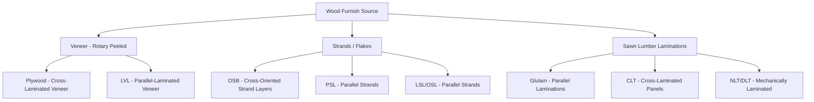

## Engineered Wood Products

### Overview

Engineered wood products (EWPs) are manufactured by bonding wood veneers, strands, particles, or lumber together with adhesives (or, in some systems, mechanical fasteners) under controlled conditions to produce structural members with more predictable, uniform properties than solid sawn lumber. EWPs address several inherent limitations of solid wood, natural variability, size constraints imposed by tree dimensions, and pronounced anisotropic shrinkage, by re-engineering wood fiber into composite products with tailored strength, stiffness, and dimensional stability characteristics.

### Key Points

- EWPs generally exhibit **more uniform and predictable properties** than solid sawn lumber because manufacturing processes average out localized natural defects (knots, grain deviation) across many veneers, strands, or laminations.
- EWPs are broadly divided into **panel products** (plywood, OSB, CLT), **structural composite lumber (SCL)** (LVL, PSL, LSL, OSL), and **glued-laminated timber (glulam)**, each with distinct manufacturing processes and applications.
- **Mass timber** products (CLT, NLT, DLT, glulam) have seen substantial market growth, driven by embodied-carbon reduction goals and building code updates permitting taller timber construction; recent industry data indicate the global mass timber market was valued at approximately $4$ billion in 2026, with continued double-digit compound annual growth projected through the early 2030s. [Unverified: market sizing figures vary across research firms depending on methodology and product scope]
- Building code recognition (e.g., the 2021 International Building Code introducing Type IV-A, IV-B, and IV-C construction categories) has been a major driver enabling taller mass timber buildings.

### Plywood

**Manufacturing Process**

Thin wood veneers (typically $1.5$–$4\ mm$ thick) are peeled from logs via a rotary lathe, dried, graded, and bonded together with adhesive in a hot press, with grain direction alternated $90°$ between successive layers (cross-lamination), always using an odd number of plies to maintain balanced construction and minimize warping.

**Key Properties**

- Cross-lamination substantially reduces the tangential/radial shrinkage differential present in solid wood, improving dimensional stability in the panel plane.
- Strength and stiffness are directionally dependent based on face grain orientation, though less severely anisotropic than solid sawn lumber.
- Available in structural grades (e.g., APA-rated sheathing) and appearance grades (varying face veneer quality, A through D or similar systems).

**Applications**: Roof, wall, and floor sheathing; structural diaphragms and shear walls; concrete formwork; furniture and cabinetry (appearance grades).

### Oriented Strand Board (OSB)

**Manufacturing Process**

Wood strands (typically $75$–$150\ mm$ long, sourced from fast-growing, lower-value species) are oriented in layers, cross-laminated similarly to plywood (surface layers oriented parallel to panel length, core layers oriented perpendicular), bonded with resin (typically phenol-formaldehyde or isocyanate-based adhesives), and consolidated under heat and pressure.

**Key Properties**

- Generally comparable structural performance to plywood for most sheathing applications, with somewhat different edge-swelling behavior upon moisture exposure.
- More efficient utilization of smaller-diameter, fast-growing timber resources compared to plywood's veneer-peeling process.

**Applications**: Wall, roof, and floor sheathing; web material for wood I-joists; increasingly dominant over plywood in North American residential sheathing applications due to cost efficiency.

### Structural Composite Lumber (SCL)

**Laminated Veneer Lumber (LVL)**

Thin wood veneers are bonded with adhesive under heat and pressure with **grain direction aligned parallel** in all layers (unlike plywood's cross-lamination), producing a product with high, uniform strength and stiffness along its length. Commonly used for headers, beams, rim board, and flanges of engineered wood I-joists.

**Parallel Strand Lumber (PSL)**

Long, thin wood strands (typically clipped veneer strands) are aligned parallel to the member's length and bonded under heat and pressure with microwave curing, producing very high strength and stiffness suited to heavily loaded beams and columns. Marketed under trade names such as Parallam.

**Laminated Strand Lumber (LSL) / Oriented Strand Lumber (OSL)**

Shorter wood strands than PSL, aligned predominantly parallel to member length and bonded under heat/pressure (often using steam injection pressing), yielding a product intermediate in strength between LVL/PSL and OSB, commonly used for studs, headers, and rim board.

### Glued-Laminated Timber (Glulam)

**Manufacturing Process**

Dimension lumber laminations (typically $25$–$50\ mm$ thick), individually graded and finger-jointed end-to-end to achieve required member length, are bonded face-to-face with structural adhesive under pressure, with lamination grain oriented parallel to the member's longitudinal axis.

**Key Properties**

- Higher-grade laminations are strategically placed at the outer tension and compression faces (where bending stress is greatest), while lower-grade laminations occupy the neutral-axis core, optimizing material efficiency, a technique not achievable with solid sawn timber.
- Available in various combination symbols denoting layup and species (e.g., 24F-V4, 24F-V8 in North American practice), where "24F" denotes a $2400\ psi$ allowable bending stress and the suffix denotes visually graded or E-rated lamination combinations.
- Can be manufactured with curvature (curved or cambered members), a capability unavailable in solid sawn timber.

**Applications**: Long-span beams, arches, curved structural members, columns, and increasingly as a primary structural material in mass timber buildings.

### Mass Timber Panel Products

**Cross-Laminated Timber (CLT)**

Solid-sawn or structural composite lumber laminations are stacked in alternating perpendicular layers (typically $3$, $5$, $7$, or more layers) and bonded with structural adhesive under pressure, producing large-format, dimensionally stable structural panels used for walls, floors, and roofs. Distinguished from traditional light-frame wood construction by their ability to form large-format panels, beams, and columns capable of supporting significant loads, enabling use in taller and larger buildings categorized under Type IV construction in U.S. building codes. The CLT segment continues to hold the largest share of the mass timber market, owing to its structural strength, load-bearing capacity, and increasing adoption in mid-rise and high-rise construction. [IndexBox](https://www.indexbox.io/store/united-states-mass-timber-construction-materials-market-analysis-forecast-size-trends-and-insights/)[Grand View Research](https://www.grandviewresearch.com/industry-analysis/cross-laminated-timber-market)

**Nail-Laminated Timber (NLT)**

Dimension lumber laminations are set on edge, side-by-side, and mechanically fastened together with nails (or occasionally screws) rather than adhesive, producing solid panels without requiring an adhesive press; a comparatively low-technology mass timber system suited to regional manufacturing with minimal capital investment.

**Dowel-Laminated Timber (DLT)**

Similar to NLT in laminated panel configuration, but laminations are joined using wood dowels (typically hardwood) driven through pre-drilled holes rather than nails or adhesive, producing an entirely wood-based, adhesive-free panel. This adhesive-free construction is driving increased demand for DLT, with the segment projected to register the fastest growth rate among mass timber products between 2026 and 2033, driven by demand for adhesive-free engineered wood and growing adoption of modular and prefabricated construction. [Data Bridge Market Research](https://www.databridgemarketresearch.com/reports/global-mass-timber-market)

**Market Context**: The CLT market alone was valued at approximately $2.44 billion in 2025 and is projected to reach $6.34 billion by 2035, reflecting roughly 10% compound annual growth, while U.S. mass timber construction has been growing at an estimated 20 to 30 percent per year, with more than 2,000 new mass timber projects reported in the U.S. design pipeline. Adoption has been aided by code changes: revisions to the International Building Code now permit timber buildings up to 18 stories in height. [Unverified: growth rate and project count figures originate from industry market research and trade publications rather than a single authoritative regulatory source, and should be cross-checked against current code editions and agency data for design use] [Cross Laminated Timber (CLT) Market Size & Forecast 2035 +2](https://www.omrglobal.com/industry-reports/cross-laminated-timber-clt-market)

### Wood I-Joists

**Manufacturing Process**

An "I" cross-sectional shape is formed by bonding LVL or solid sawn lumber flanges to a web of OSB or plywood, typically inserted into a routed groove in the flange and bonded with structural adhesive.

**Key Properties**

- Highly efficient material distribution, concentrating strength-providing material (flanges) at the extreme fibers where bending stress is greatest, while the web (primarily resisting shear) uses less material.
- Significant weight reduction compared to solid sawn joists of equivalent span capacity, though requiring attention to web stiffener requirements at supports and point loads, and blocking panels to prevent lateral buckling/rotation.

**Applications**: Floor and roof framing in residential and light commercial construction, particularly favored for long spans with reduced deflection compared to equivalent solid sawn lumber.

### Adhesive Systems in Engineered Wood Products

- **Phenol-Formaldehyde (PF)**: Durable, moisture-resistant adhesive commonly used in exterior-grade plywood and OSB.
- **Melamine-Urea-Formaldehyde (MUF)** and **Polyurethane (PUR/Emulsion Polymer Isocyanate, EPI)**: Common in glulam and CLT manufacturing, selected for structural bond strength, moisture durability, and (for PUR systems) reduced formaldehyde emissions.
- **Adhesive-free mechanical systems** (NLT, DLT): Eliminate adhesive-related considerations entirely, at the cost of somewhat different structural behavior (e.g., reduced diaphragm shear capacity compared to adhesive-bonded CLT in some applications). [Inference: relative performance comparisons depend on specific product testing and manufacturer data]

### Fire Performance Considerations

Mass timber products, despite being combustible, can achieve substantial fire resistance ratings through the **char layer mechanism**: exposed wood surfaces form an insulating layer of char during fire exposure, which slows the rate of heat penetration and strength loss in the underlying uncharred cross-section, allowing engineers to design members with a sacrificial char layer thickness beyond the structurally required cross-section. Recent industry developments continue to refine this: manufacturers have received building approvals for CLT elements with enhanced fire-resistance performance, supporting continued adoption in taller construction. Char rate is typically expressed in $mm/min$ and varies by species and product density. [Behavioral note: actual char rates and resulting fire-resistance ratings are product- and assembly-specific, and must be verified against current tested assembly listings and applicable building code provisions rather than assumed from generic char-rate values] [Omrglobal](https://www.omrglobal.com/industry-reports/cross-laminated-timber-clt-market)

### Comparative Summary

| Product | Primary Element | Lamination Orientation | Typical Application |
| --- | --- | --- | --- |
| Plywood | Veneer | Cross-laminated | Sheathing, formwork |
| OSB | Strands | Cross-oriented layers | Sheathing, I-joist webs |
| LVL | Veneer | Parallel | Beams, headers, flanges |
| PSL | Strands (long) | Parallel | Heavy beams, columns |
| LSL/OSL | Strands (short) | Parallel | Studs, headers, rim board |
| Glulam | Sawn lumber | Parallel | Long-span beams, arches |
| CLT | Sawn lumber/SCL | Cross-laminated (adhesive) | Wall, floor, roof panels |
| NLT | Sawn lumber | Edge-laminated (nailed) | Wall, floor, roof panels |
| DLT | Sawn lumber | Edge-laminated (doweled) | Wall, floor, roof panels |

### Practical Example

A design-build team planning a seven-story mixed-use building evaluates mass timber options under Type IV-B construction provisions. CLT is selected for floor and roof diaphragms due to its adhesive-bonded panel action providing reliable in-plane shear capacity for lateral load resistance, while glulam columns and beams form the primary gravity and moment frame due to their higher strength-to-weight ratio and ability to be manufactured with strategically placed high-grade outer laminations. LVL headers are specified at door and window openings within the CLT panels where concentrated point loads require locally higher capacity than the panel alone provides. The team documents required char layer thickness for each exposed member per the applicable fire design provisions to achieve the required fire-resistance rating without additional applied fire protection, consistent with the sector-wide trend toward exposed mass timber aesthetics in commercial development. This kind of specification reflects the broader shift already underway in the industry, where mass timber has moved from a niche experiment to mainstream adoption by major developers across commercial and institutional sectors. [Woodjobs](https://www.woodjobs.com/mass-timber-job-growth/)

### Conclusion

Engineered wood products systematically address the natural limitations of solid sawn lumber, dimensional constraints, variability, and pronounced anisotropy, through manufacturing processes that reorganize wood fiber (veneers, strands, or laminations) into composite forms with more predictable and often superior structural performance. The continuum spans from panel products (plywood, OSB) through structural composite lumber (LVL, PSL, LSL) to glulam and the rapidly growing mass timber category (CLT, NLT, DLT), the latter increasingly enabled by updated building codes and driven by embodied-carbon reduction goals in the construction sector. Selection among EWP types requires matching each product's characteristic strengths, panel shear capacity, beam bending efficiency, adhesive-free simplicity, or dimensional stability, to the specific structural function required.

**Related Topics**

- Mass Timber Building Code Provisions (IBC Type IV-A/B/C Construction)
- Fire Design of Exposed Timber Structures (Char Rate Methodology)
- Connection Design for Mass Timber (Concealed Steel Connectors, Self-Tapping Screws)
- Embodied Carbon Comparison: Mass Timber vs. Steel and Concrete
- Adhesive Chemistry and Formaldehyde Emission Standards in Wood Products
- Diaphragm and Shear Wall Design Using CLT Panels
- Wood Structure and Anatomy (Foundational Material Properties)