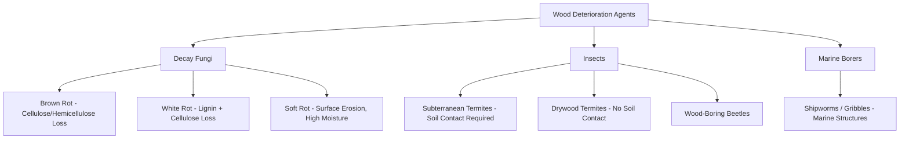

## Wood Preservation and Treatment

### Overview

Wood preservation and treatment encompasses the chemical and physical processes used to protect wood from biological deterioration (fungal decay, insect attack, marine borer damage) and, in some cases, fire. Because wood is an organic material susceptible to biodegradation under suitable moisture, temperature, and oxygen conditions, preservative treatment extends service life substantially in applications exposed to moisture, ground contact, or biological hazard, and is a critical consideration for structural durability in civil engineering applications such as utility poles, marine structures, foundations, and outdoor construction.

### Key Points

- Wood deterioration agents are primarily biological: **decay fungi**, **wood-boring insects** (termites, beetles), and **marine borers** (in marine environments), each requiring different preservative strategies.
- Preservative treatment methods are broadly divided into **pressure treatment** (preservative forced into wood cell structure under pressure) and **non-pressure treatment** (surface application, dipping, diffusion).
- Preservative chemistries have evolved significantly due to environmental and health regulations, most notably the phase-out of chromated copper arsenate (CCA) for most residential applications in the early 2000s in the US, replaced predominantly by copper-based alternatives such as alkaline copper quaternary (ACQ) and copper azole (CA).
- Treatment effectiveness depends heavily on **wood species treatability** (heartwood of many species resists preservative penetration far more than sapwood), retention level, and penetration depth, all of which are governed by use-category-based standards (e.g., AWPA standards in North America).

### Mechanisms of Wood Deterioration

**Decay Fungi**

Wood-decay fungi require four conditions to grow: adequate moisture (generally above $20\%$ MC, with optimal decay occurring near or above fiber saturation), suitable temperature (typically $10$–$38°C$, with optimal ranges species-dependent), oxygen, and a food source (the wood itself). Two principal decay types:

- **Brown rot**: Fungi that primarily decompose cellulose and hemicellulose, leaving a brittle, brown, cubically-cracked residue of largely lignin; associated with rapid strength loss even at relatively low mass loss percentages.
- **White rot**: Fungi that decompose both lignin and cellulose, often producing a stringy, bleached appearance; more common in hardwoods.
- **Soft rot**: Fungi active in very wet conditions (including some aquatic exposures) that erode cell wall surfaces, often significant in cooling tower timbers and similar constantly wet applications.

**Wood-Boring Insects**

- **Subterranean termites**: The most economically significant wood-destroying insect in many regions, requiring soil contact or constructed mud tubes to maintain moisture, capable of causing extensive hidden structural damage.
- **Drywood termites**: Do not require soil contact, capable of infesting seasoned wood directly, more prevalent in warmer coastal climates.
- **Wood-boring beetles** (e.g., powderpost beetles): Lay eggs in wood pores/checks; larvae tunnel through wood, particularly favoring starch-rich sapwood.

**Marine Borers**

Organisms such as shipworms (Teredo species) and gribbles (Limnoria species) that bore into submerged wood in marine environments, capable of rapidly destroying untreated timber piles and marine structures, requiring the highest preservative retention levels among standard use categories.

### Preservative Treatment Methods

**Pressure Treatment**

The dominant industrial method for structural and exterior applications, involving placement of wood in a sealed cylinder followed by application of vacuum and/or pressure cycles to force preservative solution into the wood's cellular structure.

- **Full-Cell Process (Bethell Process)**: An initial vacuum removes air from wood cells, preservative solution is introduced, pressure is applied to force maximum solution into the cell structure, followed by a final vacuum to remove excess surface solution; produces the highest preservative retention, typically specified for severe exposure applications (e.g., marine piling).
- **Empty-Cell Process (Rueping or Lowry Process)**: Air is trapped in the wood cells under initial pressure (Rueping method) or without initial air pressure (Lowry method) before preservative introduction, so that trapped air subsequently expands during the final vacuum step and expels excess preservative from cell cavities, leaving preservative primarily in the cell walls; results in adequate protection with more economical preservative usage, commonly used for above-ground structural lumber.

**Non-Pressure Treatment Methods**

- **Dip/Brush/Spray Application**: Surface application providing limited penetration, suitable only for low-hazard applications or supplemental field treatment of cut ends after pressure-treated lumber is field-cut.
- **Diffusion Processes**: Preservative (often in paste or concentrated solution form) applied to green (undried) wood, relying on the wood's natural moisture content to diffuse preservative inward over an extended period; used for certain preservatives (e.g., boron compounds) that are highly water-soluble.
- **Thermal (Hot-and-Cold Bath) Process**: Wood is submerged in hot preservative solution (expanding air within cells, driving some air out) followed by a cold bath (contracting remaining air, drawing preservative inward), a traditional non-pressure method still used in some applications.

### Common Preservative Chemistries

**Chromated Copper Arsenate (CCA)**

Historically the dominant waterborne preservative in North America for decades, combining chromium (fixing agent), copper (fungicide), and arsenic (insecticide); largely phased out for residential and consumer applications in the United States as of 2004 due to arsenic exposure concerns, though it remains permitted for certain industrial, agricultural, and marine applications in various jurisdictions. [Behavioral note: regulatory status and permitted use categories vary by country and have continued to evolve; current regulations should be verified against the applicable jurisdiction's environmental and consumer product agency]

**Alkaline Copper Quaternary (ACQ)**

A leading CCA replacement combining copper (fungicide/insecticide) with a quaternary ammonium compound (co-biocide, providing protection against copper-tolerant fungi); widely used in residential decking, framing, and general construction lumber.

**Copper Azole (CA / CBA-A / CA-B)**

Another major CCA replacement combining copper with azole co-biocides (tebuconazole or propiconazole), offering comparable protection to ACQ with somewhat different corrosion characteristics toward certain fastener metals.

**Corrosion Considerations with Copper-Based Preservatives**

Copper-based waterborne preservatives (ACQ, CA) are generally more corrosive to standard carbon steel fasteners and connectors than older CCA formulations or oil-borne preservatives, due to higher copper content; current guidance from preservative manufacturers and code bodies generally requires hot-dip galvanized (minimum G185 in many specifications) or stainless steel fasteners and connectors in contact with ACQ/CA-treated wood. [Inference: specific corrosion-resistant fastener requirements vary by preservative formulation, treatment retention level, and manufacturer guidance, and should be verified against current fastener compatibility documentation]

**Borates (Boron Compounds)**

Water-soluble compounds (e.g., disodium octaborate tetrahydrate, DOT) effective against decay fungi and wood-boring insects; highly effective but leach readily in wet conditions, generally restricting their use to protected applications (interior framing not exposed to weather, or applications with an effective moisture barrier) or as a supplemental treatment.

**Oil-Borne Preservatives**

- **Creosote**: A coal-tar-derived preservative historically dominant for railroad ties and utility poles, providing excellent decay and marine borer resistance; usage has declined in some markets due to health and environmental regulation, though it remains an approved and widely used preservative for heavy timber, poles, and marine applications in many jurisdictions.
- **Pentachlorophenol (Penta)**: An oil-borne preservative historically used for utility poles and structural timbers; usage has become more restricted in various jurisdictions due to toxicity concerns.
- **Copper Naphthenate**: An oil-borne alternative often used where creosote or penta are restricted, providing decay and insect resistance with generally lower toxicity concerns than penta.

### Fire-Retardant Treatment

Distinct from decay/insect preservation, fire-retardant treated (FRT) wood is impregnated with chemicals (commonly phosphate- and nitrogen-based compounds) that, upon exposure to fire, promote char formation and reduce flame spread and heat release compared to untreated wood, often specified where building codes require reduced flame spread ratings in wood construction (e.g., certain multi-family or commercial applications). FRT wood requires attention to potential long-term strength reduction from certain older-generation treatment chemistries under elevated temperature and humidity exposure (a documented historical concern with some FRT plywood roof sheathing products), which led to development of improved, more thermally stable treatment formulations and, in some cases, specific design value adjustment requirements for FRT lumber. [Unverified: applicability and magnitude of strength adjustment is product- and manufacturer-specific and governed by current code evaluation reports]

### Use Category System (AWPA Standards)

The American Wood Protection Association (AWPA) establishes a Use Category System (UCS) defining required preservative retention and treatment specifications based on exposure severity:

| Use Category | Exposure Condition | Example Application |
| --- | --- | --- |
| UC1 | Interior, dry, above ground | Interior framing (rarely treated) |
| UC2 | Interior, damp, above ground | Interior wood in high-humidity areas |
| UC3A/UC3B | Exterior, above ground | Deck boards, exterior framing |
| UC4A/UC4B/UC4C | Ground contact | Fence posts, deck posts, sill plates |
| UC5A/UC5B/UC5C | Marine/salt water exposure | Marine piling, bulkheads |

[Inference: specific retention values (expressed in $kg/m^3$ or $pcf$) differ by preservative type and use category, and must be obtained from the current AWPA UC standards for design and specification purposes]

### Quality Control and Verification

**Retention Testing**

Preservative retention is verified by boring core samples from treated wood and chemically assaying preservative concentration, expressed typically in $kg/m^3$ or pounds per cubic foot (pcf), compared against the minimum retention specified for the intended use category.

**Penetration Testing**

Penetration depth of preservative into the wood cross-section is assessed, often using chemical indicator sprays that produce a color change at the boundary of treated versus untreated wood, since adequate penetration (not just surface retention) is necessary for effective long-term protection, particularly important given that many species' heartwood strongly resists preservative penetration compared to sapwood.

**End-Cut Field Treatment**

Since pressure treatment penetration does not extend to freshly cut surfaces created during field fabrication (e.g., cutting a treated post to length), field application of a supplemental preservative (often copper naphthenate) to cut ends and drilled holes is recommended to maintain protection at these exposed, untreated surfaces.

### Practical Example

A civil engineer specifying wood retaining wall components for a project with the base embedded in soil (ground contact, UC4A minimum) selects ACQ-treated lumber for the buried and near-ground members. Because standard carbon steel fasteners are known to corrode more readily in contact with ACQ's higher copper content, the engineer specifies hot-dip galvanized structural screws and connector hardware rated for compatibility with ACQ-treated wood. For the wall's exposed cap boards where any field cutting to length is anticipated, the engineer's specification requires field application of an approved copper naphthenate end-cut preservative to all cut surfaces and bolt holes made after pressure treatment, ensuring the originally untreated core exposed by cutting is not left vulnerable to moisture-driven decay initiation.

### Conclusion

Wood preservation and treatment protects structural and construction timber against biological deterioration agents, decay fungi, insects, and marine borers, primarily through pressure treatment processes that force preservative chemicals into the wood's cellular structure. The preservative chemistry landscape has shifted substantially over recent decades, from arsenic-based CCA toward copper-based ACQ and copper azole formulations, driven by environmental and health regulation, introducing new considerations such as fastener corrosion compatibility. Effective specification requires matching preservative type and retention level to the applicable AWPA Use Category based on anticipated exposure severity, along with proper field detailing (end-cut treatment, fastener selection) to maintain the intended service life of treated wood components.

**Related Topics**

- Moisture Content and Dimensional Stability (Decay Risk Interaction)
- Fastener and Connector Corrosion Compatibility with Treated Wood
- Fire-Retardant Treated Wood and Char Rate Design
- AWPA Use Category System and Retention Specification
- Wood Structure and Anatomy (Heartwood/Sapwood Treatability)
- Durability Design for Wood in Ground Contact and Marine Applications