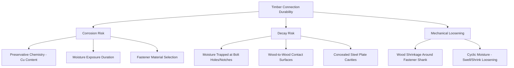

## Durability of Timber Connections

### Overview

The durability of timber connections concerns the long-term performance of mechanical fasteners, connectors, and adhesive joints under sustained environmental exposure, moisture cycling, and biological attack. Because connections concentrate stress at discrete points and often introduce dissimilar materials (steel fasteners in wood, adhesives at glue lines) into an otherwise homogeneous timber member, they frequently represent the weakest link and most failure-prone element in timber structures, even when the surrounding wood members themselves remain sound.

### Key Points

- Connection durability is governed by three interacting factors: **corrosion of metallic connectors**, **decay initiated or accelerated at connection locations**, and **loss of mechanical capacity from wood shrinkage/swelling around fasteners**.
- Preservative-treated wood (particularly modern copper-based formulations such as ACQ and copper azole) is generally more corrosive to standard carbon steel fasteners than untreated wood, requiring careful fastener material selection.
- Moisture accumulation at connections, whether from condensation, wood-to-wood contact, or inadequate detailing, is the single most common precursor to connection-related decay, since connections often create geometric moisture traps (bolt holes, notches, concealed steel plates).
- Modern mass timber connection systems (concealed steel plates, self-tapping screws) introduce durability considerations distinct from traditional bolted/nailed connections, particularly regarding moisture ingress at penetrations and long-term corrosion protection of concealed hardware.

### Corrosion Mechanisms in Timber Connections

**Galvanic and Electrochemical Corrosion**

Metal fasteners embedded in wood are exposed to an electrolyte environment when wood moisture content is elevated, since wood extractives and moisture create a mildly conductive medium capable of supporting electrochemical corrosion reactions at the metal surface.

**Preservative-Accelerated Corrosion**

Copper-based waterborne preservatives (ACQ, copper azole) contain substantially higher copper content than legacy CCA formulations, and copper is known to accelerate corrosion of standard (non-galvanized) carbon steel through galvanic action, since copper is more cathodic (noble) than steel, driving accelerated anodic dissolution of the steel fastener.

$$i_{corr} \propto \Delta E_{galvanic} \times \frac{A_{cathode}}{A_{anode}}$$

[Inference: this is a simplified conceptual representation of galvanic corrosion driving force; actual corrosion rates depend on preservative retention, moisture exposure duration, fastener alloy, and surface area ratios, and are typically characterized empirically per ASTM or manufacturer corrosion test protocols rather than calculated from first principles in practice]

**Fastener Material Selection Guidance**

- **Hot-dip galvanized steel** (commonly specified at G185 coating weight for ACQ/CA-treated lumber in exterior applications): Provides a sacrificial zinc coating that corrodes preferentially, protecting the underlying steel; adequate for most treated-wood exterior residential applications.
- **Stainless steel** (Type 304 or 316): Provides superior corrosion resistance, generally recommended for coastal/marine environments, direct ground contact, or where the highest durability is required, with Type 316 preferred in chloride-rich (coastal/marine) exposure.
- **Mechanically galvanized or electro-galvanized fasteners**: Generally provide thinner, less durable zinc coatings than hot-dip galvanizing, and are typically not recommended for direct contact with modern copper-based treated wood in exterior applications. [Behavioral note: specific coating weight and material requirements vary by preservative manufacturer, fastener manufacturer, and applicable building code evaluation reports, and should be verified against current compatibility documentation for the specific preservative and exposure condition]

**Untreated Wood Connections**

Corrosion is generally a lesser concern in connections to untreated, interior, dry-condition wood, though condensation-prone assemblies (e.g., unventilated roof/wall cavities) can still create localized moisture conditions sufficient to support corrosion over time.

### Decay Initiation at Connections

**Moisture Trap Geometry**

Bolted connections, particularly those using close-fitting bolts in pre-drilled holes, can trap moisture that enters via end grain or capillary action along the fastener shank, since the surrounding wood fibers are severed at the hole boundary, exposing more permeable end-grain-like surfaces directly to the fastener interface.

**Concealed Connection Hardware**

Modern engineered connections, particularly concealed steel plates in mass timber (used in glulam and CLT moment and shear connections), create enclosed cavities where any moisture ingress (from construction moisture, incomplete sealing, or later water intrusion) cannot readily evaporate, potentially sustaining decay-favorable conditions for extended periods without visible external indication.

**Wood-to-Wood Bearing Surfaces**

Contact surfaces between stacked or lapped timber members (e.g., sill plates on concrete foundations, built-up beams) can trap moisture at the interface even when both surfaces appear dry externally, a common decay initiation point in sill plate connections at foundation level.

**End Grain Exposure**

Cut ends of timber members exposed at connections (e.g., field-cut posts, beam ends bearing in metal hangers or pockets) present significantly higher moisture absorption rates than side-grain surfaces, since end grain provides direct access to the wood's longitudinal vascular pathways (vessels/tracheids), making these locations disproportionately vulnerable to decay initiation if not adequately protected or detailed with drainage.

### Mechanical Loosening from Moisture Cycling

Wood's dimensional response to moisture cycling (shrinkage upon drying, swelling upon wetting) directly affects connection performance over time:

- **Shrinkage around fastener shanks**: As wood dries after installation (particularly relevant for connections made with green or partially seasoned lumber), the wood shrinks around bolts, lag screws, and nails, potentially reducing bearing contact and connection stiffness, or in bolted connections, allowing the bolt to loosen within an enlarged hole.
- **Cross-grain connections**: Connections joining members with grain running in different directions (e.g., a ledger board bolted to a perpendicular rim joist) experience differential dimensional movement as each member responds independently to moisture changes, potentially inducing splitting or connector overstress if not detailed to accommodate this movement (e.g., slotted connections or details permitting differential movement).
- **Repeated wet-dry cycling**: Connections subject to repeated seasonal or daily wetting and drying (e.g., exterior deck ledger connections, exposed truss connections) experience progressive loosening more severely than connections maintained at a stable moisture condition, since each cycle incrementally degrades the tightness of the mechanical fit.

### Design and Detailing Strategies for Durable Connections

**Moisture Exclusion Detailing**

- Flashing at ledger-to-wall connections (critical at deck ledger attachments, historically a common failure point in residential deck collapses) to prevent water intrangression at the connection interface.
- Drip edges and sloped surfaces directing water away from connection points rather than allowing pooling at bolt heads, plates, or bearing surfaces.
- Elevated bearing details (e.g., post bases with a standoff gap above concrete or masonry) to prevent direct wood-to-concrete contact, which both traps moisture and exposes wood to potential moisture wicking from the concrete itself.

**Fastener and Hardware Selection**

- Matching fastener/connector material (galvanization level or stainless steel) to the specific preservative treatment chemistry and exposure category of the connected members.
- Specifying connector hardware (joist hangers, post bases, straps) with coatings rated for the intended exposure and treated-wood compatibility, since structural connector hardware faces the same galvanic corrosion concerns as fasteners.

**Ventilation and Drying Provisions**

- Avoiding fully sealed concealed connection cavities in exterior or moisture-prone applications where feasible, or ensuring robust moisture exclusion if concealment is structurally required (as in many mass timber moment connections).
- Providing airflow paths in built-up or multi-ply connections to allow any incidental moisture to dry rather than remain trapped indefinitely.

**Inspection and Maintenance Access**

- Designing connections, particularly in critical or high-consequence structures, to allow periodic visual inspection access where practical, since concealed connections that cannot be inspected rely entirely on the initial design and detailing remaining effective for the full service life without any opportunity for intermediate verification.

### Connection Durability in Mass Timber Systems

Mass timber structures (CLT, glulam) increasingly rely on concealed steel connectors (plates, brackets) engaged with self-tapping screws or specialized proprietary connector systems, raising durability considerations distinct from traditional light-frame connections:

- **Screw penetration sealing**: Self-tapping screw penetrations through exterior-exposed CLT or glulam surfaces require attention to sealing against moisture entry along the screw shank, particularly in exposed or partially exposed exterior mass timber applications.
- **Interior versus exterior exposure assumptions**: Many mass timber connection systems are engineered and tested primarily for interior, conditioned-space exposure; application in exterior or high-humidity conditions requires verification that the specific connector system and any associated corrosion protection have been evaluated for that exposure category. [Unverified: testing and certification scope varies by connector manufacturer and should be confirmed against current product evaluation reports for the intended exposure]
- **Fire and durability interaction**: Concealed steel connectors in mass timber must satisfy both fire protection requirements (adequate wood cover or intumescent protection to prevent premature heat transfer to the connector during fire exposure) and durability requirements simultaneously, since design choices addressing one consideration (e.g., wood cover depth for fire protection) also influence moisture exposure conditions at the connector.

### Practical Example

A structural engineer designs an exterior second-story deck ledger connection to an ACQ-treated wood-framed building. Recognizing that deck ledger connections have a well-documented history of failure from a combination of moisture intrusion and fastener corrosion, the engineer specifies: continuous flashing integrated with the building's water-resistive barrier directing water away from the ledger-to-wall interface; stainless steel lag screws (rather than standard hot-dip galvanized) given the ledger's continuous exterior exposure and the elevated copper content of the ACQ treatment; and a small gap maintained between the ledger and the exterior wall sheathing using washers, allowing incidental moisture that does penetrate the flashing detail to drain and evaporate rather than remain trapped against the building wall. This combination of moisture exclusion detailing and corrosion-appropriate fastener selection addresses both principal durability threats, decay initiation and connector corrosion, at what is recognized as one of the most durability-critical connection types in light-frame wood construction.

### Conclusion

Timber connection durability depends on the interaction of three distinct degradation mechanisms, metallic fastener corrosion (particularly accelerated by modern copper-based preservatives), decay initiated by moisture trapped at connection geometries, and mechanical loosening from wood's dimensional response to moisture cycling. Because connections concentrate structural demand at points where dissimilar materials meet and where geometric detailing often inadvertently creates moisture traps, durable connection design requires deliberate attention to fastener material compatibility, moisture exclusion detailing, and, where feasible, provisions for inspection, considerations that extend beyond the structural capacity calculations governing initial connection design.

**Related Topics**

- Wood Preservation and Treatment (Preservative Chemistry and Corrosion Interaction)
- Connection Design in Wood Structures (Bolts, Nails, and Metal Plate Connectors)
- Deck Ledger Connection Design and Failure Case Studies
- Mass Timber Connection Systems and Fire Protection of Concealed Hardware
- Moisture Content and Dimensional Stability (Cross-Grain Connection Movement)
- Building Envelope Detailing and Water-Resistive Barrier Integration