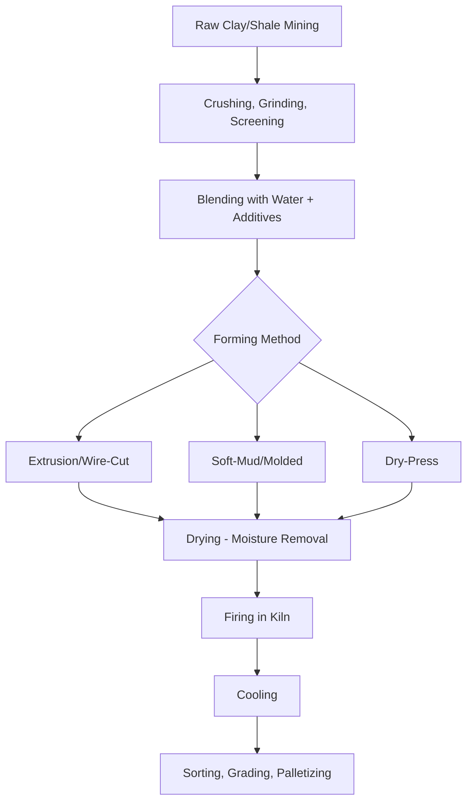

## Clay Brick Manufacturing and Properties

### Overview

Clay brick is one of the oldest manufactured construction materials, produced by shaping and firing natural clay to produce a durable, dimensionally stable masonry unit. Modern clay brick manufacturing combines traditional ceramic firing principles with industrial process control to achieve consistent strength, dimensional tolerance, and durability properties suitable for structural and veneer masonry applications in civil and architectural construction.

### Key Points

- Clay brick manufacturing proceeds through four principal stages: **raw material preparation**, **forming**, **drying**, and **firing**, with firing temperature and duration being the dominant factors controlling final strength, absorption, and durability.
- Brick properties are governed largely by **clay mineralogy** (proportions of kaolinite, illite, montmorillonite, and other clay minerals) and **firing temperature**, which together determine the degree of vitrification (glass-phase bonding) achieved in the fired product.
- Key performance properties for specification purposes include **compressive strength**, **water absorption**, **saturation coefficient**, and **efflorescence potential**, standardized through classification systems such as ASTM C216 (facing brick) and grading by weathering resistance (Severe Weathering, SW; Moderate Weathering, MW; Negligible Weathering, NW).
- Brick classification by manufacturing method also affects properties: **extruded (wire-cut) brick**, **molded brick**, and **dry-pressed brick** each yield characteristic surface textures, dimensional tolerances, and, to a lesser degree, structural properties.

### Raw Materials

**Clay and Shale**

The primary raw material, typically a blend of clays selected to balance plasticity (workability during forming) with appropriate shrinkage and firing behavior. Common clay minerals include:

- **Kaolinite**: Low plasticity, high firing temperature tolerance, contributes to lighter-colored fired products.
- **Illite**: Moderate plasticity, common in many commercial brick clays.
- **Montmorillonite**: High plasticity and high shrinkage, often blended in smaller proportions to control workability without introducing excessive drying/firing shrinkage.

**Additives**

- **Grog** (previously fired, crushed clay/brick): Reduces shrinkage and improves drying behavior by diluting plastic clay content.
- **Sand**: Reduces plasticity and shrinkage, improves drying characteristics.
- **Organic additives** (sawdust, combustible pore formers): Burn out during firing, creating controlled porosity for lighter-weight or improved-insulation brick products.
- **Barium carbonate**: Sometimes added to react with soluble sulfates in the clay, reducing efflorescence potential in the fired product.

### Manufacturing Process

**1. Raw Material Preparation**

Clay is mined, then processed through crushing, grinding, and screening to achieve consistent particle size, followed by blending with water and any additives to achieve a workable plastic consistency (typically $20$–$30\%$ moisture content by weight for the extrusion process).

**2. Forming**

Three principal forming methods produce distinct brick types:

- **Extrusion (Wire-Cut) Process**: The dominant modern method; plastic clay is forced through a die under pressure (via an auger extruder), producing a continuous column of clay in the brick's cross-sectional shape, which is then cut to length using taut wires, producing characteristic fine wire-drag marks on the cut faces.
- **Soft-Mud (Molded) Process**: Softer, wetter clay (typically $25$–$30\%$ moisture) is pressed into sand-lined or water-lined molds, producing brick with a distinctive textured surface (sand-struck or water-struck finish); historically the dominant method and still used for specialty/historic-appearance brick.
- **Dry-Press Process**: Relatively dry clay (typically $10$–$15\%$ moisture) is compressed into steel molds under high mechanical pressure, producing brick with sharp, precise edges and dimensions, generally used where tight dimensional tolerance is prioritized over the natural surface texture variation of extruded or molded brick.

**3. Drying**

Formed (green) brick contains substantial moisture that must be removed gradually before firing to prevent cracking from rapid, uneven shrinkage; typically performed in controlled-humidity dryer chambers using waste heat recovered from the kiln, over a period of approximately $24$ to $48$ hours depending on brick size and dryer technology. [Inference: exact drying schedules vary considerably by plant technology and product; the general principle of controlled, gradual moisture removal is well established]

**4. Firing**

The critical process step, typically conducted in a tunnel kiln where brick move slowly through progressively hotter zones, reaching peak firing temperatures typically in the range of $900$ to $1200°C$ depending on clay type and desired properties, held for a specified soak period, then gradually cooled to prevent thermal shock cracking.

During firing, several transformations occur:

- **Dehydroxylation**: Chemically bound water is driven off from clay mineral structures, typically beginning around $500$–$600°C$.
- **Vitrification**: At sufficiently high temperature, certain mineral components begin to melt and form a glassy bonding phase between clay particles, which is the primary mechanism producing the fired brick's strength and reduced porosity; higher firing temperatures generally produce higher vitrification, higher strength, lower absorption, and darker coloration (in many clay types).
- **Oxidation of Iron Compounds**: Iron oxide minerals present in most clays oxidize during firing, producing the characteristic red-to-brown coloration of common clay brick; firing atmosphere (oxidizing versus reducing) and iron content strongly influence final color.

### Fired Brick Properties

**Compressive Strength**

Governed primarily by the degree of vitrification achieved during firing; well-fired, highly vitrified brick can achieve compressive strengths exceeding $20{,}000\ psi$ ($138\ MPa$) in some premium products, while lower-fired or common brick typically ranges from approximately $2{,}500$ to $10{,}000\ psi$ ($17$–$70\ MPa$). [Inference: exact values are highly product- and manufacturer-specific; ASTM C216 specifies minimum average net-area compressive strength requirements by grade rather than typical ranges]

**Water Absorption**

Measured as the percentage weight gain when a brick specimen is submerged in water for a specified period (24-hour cold water absorption per ASTM C67), inversely related to the degree of vitrification, since more highly fired brick has fewer and smaller open pores available for water uptake.

$$Absorption(\%) = \frac{W_{sat} - W_{dry}}{W_{dry}} \times 100$$

where $W_{sat}$ is the saturated (soaked) specimen weight and $W_{dry}$ is the oven-dry specimen weight.

**Saturation Coefficient (C/B Ratio)**

The ratio of 24-hour cold water absorption to 5-hour boiling water absorption, used as an indicator of pore structure and freeze-thaw durability, since a lower saturation coefficient indicates a greater proportion of larger pores that remain available to accommodate ice expansion without generating excessive internal pressure, while brick with a high saturation coefficient (pores nearly filled even under mild absorption conditions) are considered more vulnerable to freeze-thaw damage.

$$C/B\ Ratio = \frac{24-hour\ cold\ water\ absorption}{5-hour\ boiling\ water\ absorption}$$

**Weathering Classification (ASTM C216)**

Brick intended for exterior facing applications are classified by weathering resistance based on a combination of compressive strength, water absorption, and saturation coefficient requirements:

| Weathering Grade | Application | General Exposure Suitability |
| --- | --- | --- |
| SW (Severe Weathering) | Freeze-thaw prone regions, contact with ground/water | Highest durability requirement |
| MW (Moderate Weathering) | Above-grade, limited freeze-thaw exposure | Moderate durability requirement |
| NW (Negligible Weathering) | Interior or protected applications | Lowest durability requirement |

**Efflorescence**

A white, powdery surface deposit formed when soluble salts (commonly sulfates) within the brick or mortar dissolve in absorbed moisture, migrate to the surface, and crystallize as the water evaporates; primarily a cosmetic concern but can indicate ongoing moisture movement through the masonry assembly. Efflorescence potential is influenced by raw clay mineralogy (soluble salt content), and can be mitigated through raw material selection (e.g., barium carbonate additive) or by controlling moisture exposure of the finished assembly.

**Initial Rate of Absorption (IRA) / Suction**

Measures how rapidly a brick absorbs water from fresh mortar upon contact (ASTM C67), critical to proper mortar bond development, since excessively high-suction brick can draw water out of fresh mortar too quickly, impairing proper cement hydration and reducing bond strength; brick with IRA exceeding approximately $30\ g/min/30\ in^2$ (per common industry guidance) are typically recommended to be wetted prior to laying to moderate suction. [Inference: specific IRA thresholds and pre-wetting recommendations vary by masonry design guide and mortar type]

### Brick Types and Classification

**By Application**

- **Facing Brick**: Selected for appearance and weathering performance in exposed exterior wythes (ASTM C216).
- **Building (Common) Brick**: Used where appearance is not a controlling factor, such as backup wythes or concealed structural masonry (ASTM C62).
- **Paving Brick**: Manufactured for higher abrasion resistance suited to pedestrian and vehicular paving applications (ASTM C902).
- **Hollow Brick**: Contains one or more core holes or cells, typically comprising a specified minimum percentage of net cross-sectional area as core void, reducing weight and material use while often improving thermal performance (ASTM C652).

**By Manufacturing Grade (Compressive Strength/Durability)**

Grading systems (e.g., Grade SW, MW, NW under ASTM C216) combine strength and absorption criteria as described above to designate appropriate exposure applications.

### Dimensional Considerations

Fired clay brick undergoes shrinkage during both drying and firing (typically several percent total, varying by clay composition and firing temperature), requiring manufacturers to oversize the forming die to compensate and achieve target finished dimensions; nominal brick dimensions in modular systems (e.g., $4 \times 2\frac{2}{3} \times 8$ inches nominal, accounting for standard mortar joint thickness) must account for this shrinkage variability, which is one reason dimensional tolerance (rather than absolute dimension alone) is a key specification parameter for facing brick appearance consistency.

### Practical Example

A specifier selecting facing brick for an exterior wall in a northern climate with significant freeze-thaw cycling specifies Grade SW brick per ASTM C216, requiring compliance with both minimum compressive strength and maximum water absorption/saturation coefficient limits appropriate for severe weathering exposure. During construction, the mason tests brick suction using a simple field method (or references manufacturer IRA data) and determines that the selected brick's high initial rate of absorption warrants pre-wetting before laying, ensuring adequate water retention in the mortar joint for proper cement hydration and bond development, since inadequate bond at the brick-mortar interface would compromise both the water-tightness and long-term durability performance the Grade SW specification was intended to achieve.

### Conclusion

Clay brick manufacturing transforms raw clay through forming, controlled drying, and high-temperature firing into a durable ceramic masonry unit whose final properties, strength, absorption, freeze-thaw resistance, and efflorescence potential, are fundamentally determined by clay mineralogy and the degree of vitrification achieved during firing. Standardized testing and classification systems (ASTM C216 and related standards) translate these underlying ceramic properties into practical specification criteria such as weathering grade, enabling appropriate brick selection matched to exposure conditions, structural demands, and aesthetic requirements in masonry construction.

**Related Topics**

- Mortar Types and Properties in Masonry Construction
- Masonry Wall Systems: Veneer, Cavity Wall, and Reinforced Masonry
- Concrete Masonry Units (CMU) Manufacturing and Properties
- Freeze-Thaw Durability Mechanisms in Porous Construction Materials
- Masonry Bond Patterns and Structural Behavior
- Efflorescence Diagnosis and Mitigation in Masonry Assemblies