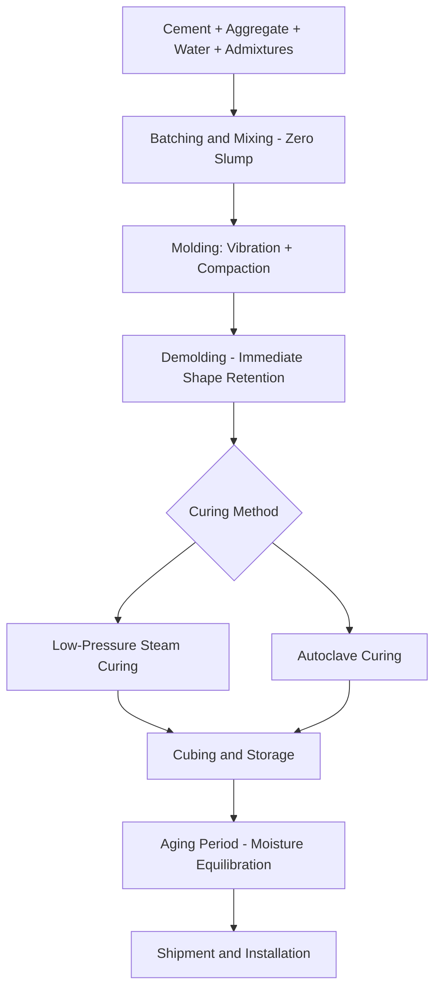

## Concrete Masonry Units

### Overview

Concrete Masonry Units (CMUs), commonly known as concrete blocks, are precast masonry units manufactured from a low-slump concrete mixture, molded and cured to produce standardized structural units used in load-bearing walls, foundations, retaining walls, and non-structural partitions. CMUs represent one of the most widely used structural masonry materials globally, valued for manufacturing consistency, dimensional standardization, and adaptability across a wide range of structural and architectural applications.

### Key Points

- CMUs are manufactured from a **zero-slump (dry-cast) concrete mixture**, molded under vibration and pressure, then cured, a fundamentally different process from cast-in-place or wet-cast precast concrete.
- Units are classified by density into **normal weight**, **medium weight**, and **lightweight** categories, governed by aggregate type, directly affecting unit weight, thermal performance, fire resistance, and compressive strength.
- Governing specifications include **ASTM C90** (hollow load-bearing concrete masonry units) in North America, establishing minimum compressive strength, density classification, and dimensional tolerance requirements.
- CMU wall systems can be designed as **unreinforced**, **partially reinforced**, or **fully grouted/reinforced** masonry, with reinforcement (vertical rebar in grouted cells, horizontal joint reinforcement) substantially expanding structural capacity and seismic performance beyond plain masonry.

### Raw Materials

**Portland Cement**

The primary binder, typically Type I or Type I/II Portland cement per ASTM C150, providing the hydraulic binding action that develops strength as the unit cures.

**Aggregates**

The dominant constituent by volume, selected based on target unit density classification:

- **Normal Weight Aggregate**: Natural sand, gravel, or crushed stone, producing units with oven-dry density typically at or above $125\ pcf$ ($2{,}000\ kg/m^3$).
- **Lightweight Aggregate**: Expanded shale, clay, slate, slag, pumice, or scoria, producing units with oven-dry density below approximately $105\ pcf$ ($1{,}680\ kg/m^3$), improving thermal insulation value and reducing unit weight for handling, at some tradeoff in compressive strength per unit volume.
- **Medium Weight Aggregate**: Blends of normal and lightweight aggregates, or certain naturally occurring aggregates of intermediate density, producing units between the normal and lightweight density thresholds.

**Water**

Added in carefully controlled, minimal quantity, since CMU production uses a zero-slump (essentially dry, no-slump) mixture rather than a flowable concrete consistency, distinguishing the manufacturing process fundamentally from typical cast-in-place concrete.

**Admixtures**

- **Integral water repellents**: Chemical admixtures reducing capillary water absorption in the finished unit, used in specifications requiring enhanced moisture resistance.
- **Pigments**: Integral color additives for architectural CMU (split-face, ground-face, or colored units).
- **Air-entraining admixtures**: Used in some products to improve freeze-thaw durability, similar in principle to air entrainment in structural concrete.

### Manufacturing Process

**1. Batching and Mixing**

Cement, aggregate, water, and any admixtures are batched by weight and mixed to produce a stiff, zero-slump concrete mixture with just enough moisture (typically around $6$ to $8\%$ by weight) to allow the mixture to hold its molded shape immediately upon compaction without slumping.

**2. Molding**

The mixture is fed into a block-forming machine where it is compacted into steel molds using a combination of vibration and mechanical pressure (via a vibrating table and compression head), which consolidates the mixture sufficiently to allow immediate demolding, the "green" (freshly molded) block must retain its shape as it exits the mold before curing has begun.

**3. Curing**

Freshly molded units are cured to develop strength, typically via one of two methods:

- **Low-Pressure Steam (Autoclave-Free) Curing**: Units are cured in a kiln at elevated temperature (typically around $60$–$80°C$) and high humidity for approximately $12$ to $24$ hours, accelerating cement hydration to achieve handling and shipping strength rapidly.
- **Autoclave Curing**: Units are cured under high-pressure steam (elevated temperature and pressure) for a shorter total cycle, producing certain property differences (generally reduced drying shrinkage) compared to atmospheric-pressure steam curing. [Inference: autoclave curing is less common for standard structural CMU compared to atmospheric steam curing in current North American practice, though usage varies by manufacturer and region]

**4. Cubing, Storage, and Aging**

Cured units are stacked ("cubed") for handling, then typically stored for an additional aging period before shipment, allowing continued strength gain and moisture equilibration, since units shipped and installed at excessive moisture content are more prone to subsequent drying shrinkage cracking in the finished wall.

### Physical and Mechanical Properties

**Compressive Strength**

Governed by cement content, aggregate type/gradation, degree of compaction during molding, and curing method; ASTM C90 specifies a minimum net-area compressive strength requirement (commonly $1{,}900\ psi$ average net area strength for standard structural units in current editions, though specific values should be confirmed against the current standard edition), tested per ASTM C140.

$$f'_m\ (masonry\ assembly\ strength) = f(f'_{block},\ mortar\ type,\ grout,\ construction\ quality)$$

[Inference: the relationship between individual unit strength and overall assembly compressive strength ($f'_m$) is established through unit strength method tables or prism testing per the applicable masonry design code, e.g., TMS 402/602 in the US, rather than a simple direct formula]

**Density Classification**

As established above (normal, medium, lightweight), directly affecting:

- Unit weight and structural dead load contribution
- Thermal resistance (R-value), with lightweight aggregate units generally providing improved insulating value
- Fire resistance rating, since lightweight aggregate units often achieve higher fire-resistance ratings per unit thickness due to the aggregate's inherently lower thermal conductivity and, in some cases, favorable high-temperature behavior

**Absorption and Moisture Movement**

CMUs, like fired clay brick, absorb moisture and can exhibit both reversible (moisture-related) and irreversible (initial drying shrinkage) dimensional movement; unlike clay brick (which expands slightly and permanently after firing due to rehydroxylation over time), CMUs undergo net drying shrinkage as residual manufacturing moisture and later carbonation-related moisture loss occur, making control joint spacing a critical design consideration to accommodate this shrinkage without uncontrolled cracking.

**Linear Shrinkage**

ASTM C90 specifies a maximum linear shrinkage limit (typically $0.065\%$ in current standard practice, though this should be verified against the current standard edition) as measured per ASTM C426, since excessive shrinkage potential correlates with greater risk of shrinkage cracking in the completed wall if control joints are inadequately spaced.

### CMU Types and Configurations

**By Core Configuration**

- **Hollow Units**: Contain one or more open cores, the dominant configuration for structural CMU, allowing vertical reinforcement bars and grout placement within cells for reinforced masonry construction.
- **Solid Units**: Minimal or no core voids (per ASTM definitions, solid units have net cross-sectional area equal to at least $75\%$ of gross area), used where higher fire rating, sound transmission resistance, or structural solidity is required without reinforcement.

**By Surface Finish/Application**

- **Standard (Utility) CMU**: Plain gray finish, typically used where appearance is not a controlling factor (concealed structural walls, foundation walls).
- **Split-Face CMU**: Manufactured as a double-wide unit that is mechanically split apart, exposing a rough, stone-like fractured aggregate texture on the split face, popular for exposed architectural applications.
- **Ground-Face (Burnished) CMU**: Surface mechanically ground and polished after curing, exposing the aggregate in a smooth, terrazzo-like architectural finish.
- **Scored CMU**: Manufactured with vertical grooves simulating smaller unit coursing patterns for architectural effect.

**Specialty Structural Units**

- **Bond Beam Units**: Units with a reduced-height web or a U-shaped (knock-out) cross-section allowing horizontal reinforcement and continuous grout placement to form a reinforced bond beam at specified wall heights (e.g., at floor/roof bearing lines).
- **Pilaster and Column Units**: Larger or specially configured units for reinforced masonry columns and wall pilasters.
- **Sash and Jamb Units**: Units with a formed groove or recess to receive door/window frames.

### Reinforced Masonry Construction

**Vertical Reinforcement**

Reinforcing bars placed within hollow cores, which are then filled with grout (a high-slump, fine-aggregate concrete mixture designed to flow into and fully consolidate within the cell cavity), bonding the reinforcement to the surrounding masonry to resist flexural and tensile stresses that plain (unreinforced) masonry cannot reliably resist.

**Horizontal (Joint) Reinforcement**

Prefabricated wire reinforcement (typically ladder or truss configuration) placed within horizontal mortar bed joints at specified vertical spacing, primarily to control shrinkage cracking and provide supplemental tensile capacity for out-of-plane and shear loading, distinct from bond beam reinforcement which is placed within grouted courses rather than mortar joints.

**Grout Types**

- **Fine Grout**: Used for narrower cells or reinforcement spacing where coarse aggregate could impede flow and consolidation.
- **Coarse Grout**: Used for larger cell dimensions, providing more economical grout placement where flow is not restricted by narrow clearances.

**Grouting Methods**

- **Low-Lift Grouting**: Grout placed in lifts corresponding to limited wall height increments (historically often $4$ feet or less) as the wall is constructed, allowing inspection and cleanout access at each lift.
- **High-Lift Grouting**: Grout placed in taller lifts (with appropriate cleanout provisions, consolidation requirements, and often a required curing/set period between lifts) after a greater height of masonry has been constructed, improving construction efficiency at the cost of reduced direct inspection access during placement.

### Practical Example

A structural engineer designs a single-story masonry warehouse with load-bearing CMU walls. Normal-weight hollow CMU (ASTM C90) is specified for the structural wythes, with vertical No. 5 reinforcing bars placed in grouted cells at $32$ inches on center per the structural design, calculated using the unit strength method to establish the required $f'_m$ for the wall's axial and flexural demand. Bond beam units with continuous horizontal reinforcement are specified at the top of the wall to distribute roof diaphragm loads and tie the wall together at the bearing elevation. Horizontal joint reinforcement is specified at $16$ inches on center vertically throughout the wall height to control shrinkage cracking between the primary structural reinforcement locations, addressing the CMU's inherent drying shrinkage tendency independent of the primary structural reinforcement design.

### Conclusion

Concrete Masonry Units are manufactured through a distinctive zero-slump, vibration-compacted molding process followed by accelerated curing, producing dimensionally standardized structural units whose density classification (normal, medium, lightweight) governs weight, thermal, and fire performance characteristics. CMU construction spans from simple unreinforced partition walls to fully engineered reinforced masonry systems incorporating vertical and horizontal reinforcement with grout, governed by standards such as ASTM C90 for unit properties and TMS 402/602 for structural design, making CMU one of the most versatile and widely applied structural masonry materials in contemporary construction.

**Related Topics**

- Reinforced Masonry Design per TMS 402/602
- Mortar Types and Grout Specification in Masonry Construction
- Clay Brick Manufacturing and Properties (Comparative Masonry Unit)
- Control Joint Design for Shrinkage Crack Mitigation in CMU Walls
- Masonry Wall Systems: Veneer, Cavity Wall, and Load-Bearing Configurations
- Seismic Design Considerations for Reinforced Masonry Structures