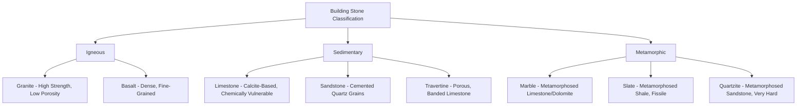

## Natural Stone as a Building Material

### Overview

Natural stone is a masonry material derived directly from quarried rock, used in construction for structural, architectural, and decorative purposes for millennia. Unlike manufactured masonry units (clay brick, CMU), natural stone properties are governed entirely by the geological formation processes of the parent rock, resulting in substantial property variation not only between rock types but within deposits of the same formation, requiring careful geological and engineering characterization for reliable structural application.

### Key Points

- Building stones are classified geologically into three fundamental origin categories: **igneous**, **sedimentary**, and **metamorphic**, each imparting characteristic mineral composition, texture, and durability behavior.
- Stone selection for construction depends on evaluating **compressive strength**, **porosity/absorption**, **durability (freeze-thaw and chemical weathering resistance)**, and **workability**, since these properties vary dramatically across and within stone types.
- Modern structural use of natural stone has declined relative to manufactured masonry and concrete, but natural stone remains widely used for **cladding/veneer**, **flooring**, **paving**, **dimension stone architectural elements**, and **riprap/erosion control**.
- Quarrying and finishing methods (dimension stone extraction versus crushed stone production) determine the form in which stone reaches construction use, dimension stone requiring intact block extraction while crushed/aggregate stone accepts fragmentation.

### Geological Classification of Building Stones

**Igneous Rocks**

Formed by the cooling and solidification of molten magma or lava, generally characterized by high strength, low porosity, and high durability, though workability can be challenging due to hardness.

- **Granite**: Coarse-grained, composed primarily of quartz, feldspar, and mica; widely used for structural applications, cladding, countertops, and paving due to its high compressive strength (commonly $15{,}000$–$50{,}000\ psi$, $100$–$345\ MPa$, depending on specific granite type) and excellent durability. [Inference: exact strength ranges vary substantially by specific granite source and should be verified through project-specific testing]
- **Basalt**: Fine-grained volcanic rock, dense and durable, though less commonly used as dimension stone compared to granite due to typically smaller usable block sizes and higher quarrying difficulty; more commonly processed as crushed aggregate.

**Sedimentary Rocks**

Formed by the deposition and lithification (compaction and cementation) of mineral or organic particles over geological time, generally exhibiting greater property variability and, in many cases, higher porosity than igneous rocks.

- **Limestone**: Composed primarily of calcium carbonate (calcite), widely used historically and currently for cladding, cut stone architectural elements, and aggregate; softer and more workable than granite, but more susceptible to chemical weathering from acidic environments (including acid rain) due to calcite's solubility in mildly acidic conditions.
- **Sandstone**: Composed of cemented sand-grain particles (predominantly quartz), with properties highly dependent on the cementing material (silica-cemented sandstone is generally more durable than calcite- or clay-cemented sandstone); historically significant as a building stone (e.g., brownstone) with moderate compressive strength and variable durability depending on cement type and porosity.
- **Travertine**: A specific type of limestone formed by rapid precipitation of calcium carbonate, often from hot springs, characterized by a distinctive porous, banded texture, popular for architectural cladding and flooring, often requiring pore-filling treatment for certain finishes.

**Metamorphic Rocks**

Formed by the transformation of pre-existing igneous, sedimentary, or other metamorphic rock under heat and pressure, generally exhibiting increased density, strength, and durability compared to their parent rock.

- **Marble**: Metamorphosed limestone or dolomite, prized for its aesthetic veining and polish capability, though it retains limestone's calcite-based chemical vulnerability to acidic weathering and generally lower abrasion resistance than granite, making exterior use in polluted or high-traffic environments a durability consideration.
- **Slate**: Metamorphosed shale/clay, characterized by excellent fissility (splitting into thin, flat sheets along cleavage planes), historically dominant for roofing shingles and, currently, flooring and cladding, valued for low water absorption and high durability.
- **Quartzite**: Metamorphosed sandstone, extremely hard and durable due to fused quartz grains, used for paving, cladding, and aggregate where high abrasion resistance is required.

### Key Physical and Mechanical Properties

**Compressive Strength**

Governed by mineral composition, grain interlocking, and porosity; igneous and dense metamorphic stones (granite, quartzite) generally exhibit the highest compressive strengths, while porous sedimentary stones (some limestones, sandstones) exhibit comparatively lower and more variable strength. Tested per standards such as ASTM C170 (compressive strength of dimension stone).

**Porosity and Water Absorption**

Highly variable across stone types, from dense, low-absorption stones (granite, slate, quartzite, typically below $0.5\%$ absorption) to more porous stones (some limestones and sandstones, which can exceed $10$–$15\%$ absorption in highly porous varieties); porosity directly influences freeze-thaw durability, staining susceptibility, and weight. Tested per ASTM C97.

**Freeze-Thaw Durability**

Governed by pore structure (similar in principle to the saturation coefficient concept in fired clay brick), since water absorbed into stone pores expands upon freezing, generating internal stress that can cause spalling or cracking over repeated freeze-thaw cycles; stones with higher porosity and larger interconnected pore networks are generally more vulnerable unless specifically evaluated and demonstrated durable for the intended climate exposure.

**Chemical Weathering Resistance**

Calcite-based stones (limestone, marble, travertine) are notably vulnerable to dissolution and surface etching from acidic exposure (acid rain, de-icing salts, certain cleaning chemicals), since calcium carbonate reacts readily with acids, while silica-based stones (granite, quartzite, sandstone with siliceous cement) are substantially more chemically resistant.

$$CaCO_3 + 2H^+ \rightarrow Ca^{2+} + H_2O + CO_2$$

This reaction represents the fundamental chemical vulnerability of calcite-based building stones to acidic environmental exposure.

**Abrasion Resistance**

Critical for flooring and paving applications, generally highest in dense, hard stones (granite, quartzite) and lowest in softer, more porous stones (some limestones, marbles), tested via standardized abrasion tests (e.g., ASTM C241, Abrasion Resistance of Stone Subjected to Foot Traffic).

**Workability**

Inversely related to hardness and mineral interlocking in many cases; softer stones (limestone, some sandstones) are generally easier to cut, carve, and finish than very hard stones (granite, quartzite), influencing both quarrying cost and the feasibility of intricate architectural detailing.

### Quarrying and Processing

**Dimension Stone Extraction**

Producing large, intact blocks suitable for cutting into architectural units requires specialized extraction methods that minimize fracturing:

- **Diamond wire sawing**: A continuous diamond-embedded wire cable used to cut large blocks from the quarry face with minimal vibration damage.
- **Channeling and wire sawing (historical/traditional)**: Older methods using channeling machines or plain wire with abrasive slurry.
- **Controlled blasting**: Used cautiously in some quarrying operations, requiring careful charge design to separate blocks without inducing microfracturing that would compromise later structural or aesthetic use.

**Crushed Stone Production**

For aggregate use (concrete aggregate, road base, riprap), stone is extracted via conventional blasting and mechanically crushed and screened to required gradation, without the intact-block extraction constraints governing dimension stone.

**Finishing Processes**

- **Polished finish**: Progressive fine abrasive polishing producing a reflective, smooth surface, common for granite and marble cladding/countertops.
- **Honed finish**: A smooth but matte (non-reflective) finish, achieved with less aggressive polishing than a full polish.
- **Flamed (thermal) finish**: Applying intense heat to the stone surface, causing differential thermal expansion of mineral grains that spalls off a thin surface layer, producing a rough, slip-resistant texture common for granite paving.
- **Sawn/sandblasted finishes**: Various mechanical finishing techniques producing textured, non-reflective surfaces for specific architectural effects.

### Applications in Civil and Structural Engineering

- **Cladding and Veneer**: Thin stone panels anchored to a structural backup wall system, the dominant modern application of dimension stone in commercial and institutional construction, where the stone provides an architectural, weather-resistant exterior surface without serving as the primary structural element.
- **Foundation and Retaining Wall Construction**: Historically significant structural application, largely superseded by concrete in contemporary practice but still used in specific rehabilitation, historic preservation, and select architectural contexts.
- **Riprap and Erosion Control**: Large, durable stone (typically crushed or quarried rock, not dimension stone) placed to protect shorelines, channels, and slopes from erosive water flow, selected primarily for size, durability, and specific gravity rather than aesthetic finish.
- **Paving**: Both dimension stone (cut pavers) and crushed aggregate applications, requiring attention to abrasion resistance and, for exterior pedestrian applications, slip resistance of the finished surface.
- **Aggregate**: Crushed stone serves as the dominant coarse and fine aggregate source for concrete and asphalt production, connecting natural stone properties directly to the mechanical performance of manufactured composite construction materials.

### Practical Example

An architect specifying exterior cladding for a building in a northern climate with significant freeze-thaw cycling and winter de-icing salt exposure evaluates both granite and a locally available limestone for a stone veneer system. Given the site's freeze-thaw severity and salt exposure, the architect selects granite over limestone, since granite's low porosity substantially reduces freeze-thaw spalling risk, and its silica-based mineral composition resists the chemical dissolution that calcite-based limestone would experience from repeated de-icing salt and acidic precipitation exposure. The stone panels are specified with a flamed finish at ground-level paving areas for slip resistance, while upper wall cladding panels receive a honed finish for a more refined architectural appearance, illustrating how finish selection is matched to functional exposure (foot traffic and weather) as well as aesthetic intent.

### Conclusion

Natural stone's building properties are inherited directly from its geological formation process, igneous, sedimentary, or metamorphic, resulting in fundamentally different strength, porosity, and chemical durability characteristics across and within stone categories. While natural stone's role as a primary structural material has diminished relative to concrete and manufactured masonry, it remains extensively used for cladding, flooring, paving, and aggregate applications, requiring careful matching of specific stone properties, particularly porosity-driven freeze-thaw durability and calcite-related chemical vulnerability, to the anticipated environmental exposure and functional demands of the application.

**Related Topics**

- Dimension Stone Cladding and Anchorage System Design
- Aggregate Properties for Concrete and Asphalt (Crushed Stone Sourcing)
- Freeze-Thaw Durability Mechanisms in Porous Construction Materials
- Historic Preservation and Stone Conservation Techniques
- Clay Brick Manufacturing and Properties (Comparative Masonry Material)
- Riprap Design for Erosion and Scour Protection