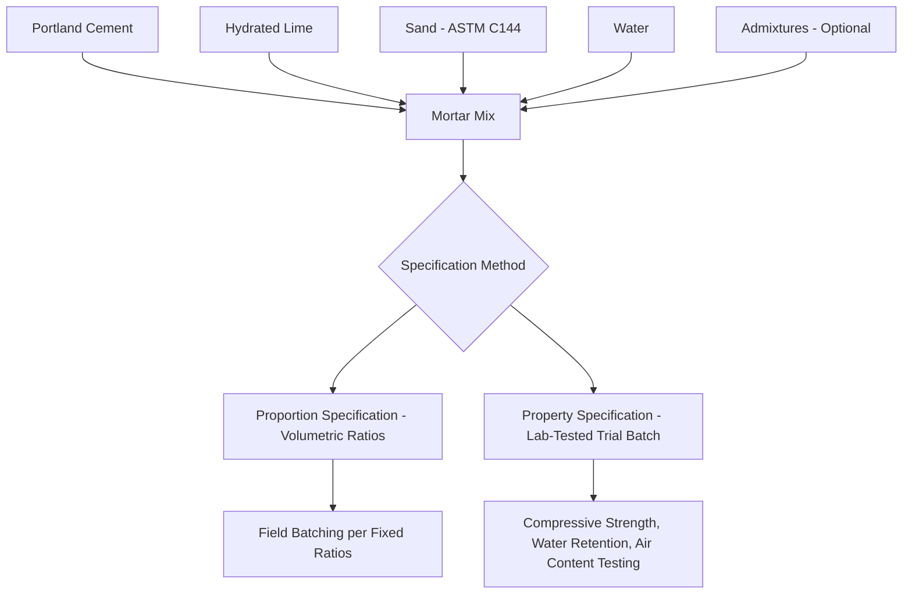

## Mortar Types and Composition

### Overview

Mortar is the bedding and jointing material used in masonry construction to bond individual units (brick, CMU, stone) into a continuous assembly, distribute loads uniformly across unit-to-unit contact surfaces, and provide the primary line of defense against water penetration at joint interfaces. Mortar composition and type selection significantly influence masonry assembly compressive strength, bond strength, flexibility, and durability, making mortar specification a critical, though sometimes underappreciated, structural and performance decision in masonry design.

### Key Points

- Mortar composition is governed in North America primarily by **ASTM C270**, which establishes proportion and property specifications for four principal mortar types: **M, S, N, and O**, differentiated by relative cement and lime content and resulting compressive strength.
- Mortar serves multiple simultaneous functions: **structural bonding and load transfer**, **water penetration resistance**, **accommodation of minor dimensional movement**, and **bond development with reinforcement/masonry units**, and these functions can be in tension with one another (e.g., higher-strength mortar is generally less flexible/more brittle).
- Mortar can be specified and tested via two methods under ASTM C270: the **Proportion Specification** (prescriptive volumetric ratios of cementitious materials to sand) and the **Property Specification** (performance-based, requiring laboratory testing of trial mortar batches to verify compressive strength, water retention, and air content).
- Mortar bond strength, not compressive strength, is frequently the governing factor in overall masonry assembly performance (particularly for water penetration resistance and flexural/tensile capacity), a consideration sometimes underweighted relative to the more commonly cited compressive strength value.

### Mortar Constituent Materials

**Portland Cement**

Provides the primary hydraulic binding action and governs compressive strength development, typically Type I, II, or III Portland cement conforming to ASTM C150, or blended hydraulic cements per ASTM C1157/C595.

**Hydrated Lime**

Improves workability, water retention, and long-term flexibility of the cured mortar, while contributing to a phenomenon known as **autogenous healing**, wherein free lime in the cured mortar can react with moisture and carbon dioxide to fill small shrinkage cracks over time; higher lime content generally produces softer, more flexible, more workable mortar with lower ultimate compressive strength.

**Masonry Cement and Mortar Cement**

Pre-blended proprietary products combining Portland cement, ground limestone or hydrated lime, and other performance-modifying additives (air-entraining agents, plasticizers), simplifying field batching by eliminating the need for separate lime addition; masonry cement (ASTM C91) and mortar cement (ASTM C1329) differ in that mortar cement includes minimum bond strength requirements not required for masonry cement, reflecting mortar cement's development to address masonry cement's historically variable bond performance.

**Aggregate (Sand)**

Typically natural or manufactured sand conforming to ASTM C144 gradation requirements, providing bulk volume and influencing workability, water demand, and shrinkage; well-graded sand within specification limits reduces void content and water demand compared to poorly graded or excessively fine sand.

**Water**

Clean, potable water (or water demonstrated suitable per ASTM C1602) used to achieve workable consistency and enable cement hydration; mortar water content is typically higher than would be used in structural concrete, since high water retention (rather than minimal water-cement ratio) is prioritized for workability and bond development at the time of laying.

**Admixtures**

- **Air-entraining agents**: Improve workability and freeze-thaw durability, common in masonry cement formulations.
- **Accelerators/retarders**: Adjust setting time for cold-weather or hot-weather construction conditions.
- **Water repellents/integral water-resisting admixtures**: Reduce capillary water penetration through the cured mortar joint.

### ASTM C270 Mortar Types

ASTM C270 establishes four mortar types, each intended for different structural and exposure applications, distinguished by relative Portland cement to lime proportion and corresponding compressive strength requirement:

| Mortar Type | Relative Cement:Lime Proportion | Min. Compressive Strength (Property Spec.) | Typical Application |
| --- | --- | --- | --- |
| Type M | Highest cement content | $2{,}500\ psi$ | Below-grade, heavy structural loads, high lateral loads (retaining walls, foundations) |
| Type S | High cement content | $1{,}800\ psi$ | General structural use, exterior above-grade, seismic/high-wind applications |
| Type N | Moderate/balanced cement-lime | $750\ psi$ | General-purpose exterior above-grade and interior applications, most common general-use mortar |
| Type O | High lime, low cement content | $350\ psi$ | Interior non-load-bearing, low-stress applications, historic restoration (softer, more compatible with older/softer masonry units) |

[Inference: specific numeric compressive strength thresholds are current as of common recent ASTM C270 editions but should always be verified against the applicable current standard edition for design and specification purposes, since values and requirements are periodically revised]

**Type N as the General-Purpose Standard**

Type N mortar is frequently specified as the default general-purpose mortar for above-grade exterior and interior masonry, balancing adequate strength with sufficient flexibility and workability for typical construction conditions, and is commonly recommended as a baseline unless specific structural or exposure conditions warrant Type S or Type M.

**Type O and Historic/Soft Masonry Compatibility**

Type O's low compressive strength and high flexibility make it particularly suited for restoration and repointing of historic masonry constructed with softer, more porous, and often weaker original units and mortars (common in older brick and stone masonry); using a modern high-strength mortar (Type S or M) to repoint historic masonry can be counterproductive or even damaging, since the harder repointing mortar can force differential stress concentration and cracking into the softer, weaker original masonry units rather than accommodating movement within the mortar joint itself as the original mortar was designed to do.

### Specification Methods under ASTM C270

**Proportion Specification**

A prescriptive method specifying mortar composition by volumetric ratio of cementitious materials (Portland cement, lime) to sand, without requiring laboratory compressive strength verification; widely used in field practice due to its simplicity, relying on the historical correlation between the specified proportions and expected performance rather than direct testing of each batch.

**Property Specification**

A performance-based method requiring laboratory testing of trial mortar batches (mixed at a flow consistency different from field consistency, per the standard's laboratory procedure) to verify compressive strength, water retention, and air content meet the specified type's minimum/maximum requirements; generally used when specific verified performance characteristics are required for the project, such as in engineered masonry design requiring documented material properties.

[Behavioral note: proportion-specified and property-specified mortars of the same "type" designation are not required to be batched identically, since the two specification methods represent independent qualification pathways rather than equivalent formulations, a distinction sometimes misunderstood in field practice]

### Mortar Bond Strength

**Factors Affecting Bond**

- **Unit Suction (Initial Rate of Absorption)**: Excessively high-suction masonry units draw water from the mortar too rapidly, impairing cement hydration at the bond interface and reducing bond strength; units with excessive IRA are typically recommended to be pre-wetted before laying.
- **Workmanship and Tooling**: Proper joint tooling (compacting and shaping the mortar joint surface after initial set) improves bond and water resistance compared to unfinished or poorly tooled joints.
- **Mortar Flow/Workability at Time of Laying**: Mortar that has begun to stiffen excessively before the unit is placed and adjusted develops substantially reduced bond compared to mortar used within its workable window (commonly informally referred to in the field as mortar that is still within its usable "board life" before initial set).
- **Cementitious Material Type**: Mortar cement generally provides more reliable, higher, and more consistent bond strength compared to masonry cement, reflecting mortar cement's specification development specifically to address bond strength requirements.

**Flexural Bond Strength Testing**

Assessed via standardized tests such as ASTM C1072 (measurement of masonry flexural bond strength) or through prism testing (ASTM C1314) that evaluates the combined masonry assembly (units, mortar, and grout if applicable) rather than mortar alone, since bond strength is fundamentally an interface property between mortar and the specific unit type, not a property of mortar in isolation.

### Grout Distinguished from Mortar

While related in composition, grout (used to fill reinforced masonry cells and cavities) is formulated with higher water content to achieve a flowable, pourable consistency capable of consolidating around reinforcement within confined cell spaces, in contrast to mortar's stiffer, more plastic consistency suited to holding shape and supporting units during bedding; grout is specified per ASTM C476, distinct from mortar's ASTM C270 governance.

### Practical Example

A structural engineer specifying a below-grade foundation retaining wall constructed of reinforced CMU selects Type M mortar (Property Specification) given the wall's exposure to below-grade moisture, lateral earth pressure, and the highest strength category's suitability for heavy structural loading and soil contact conditions. For the above-grade exterior veneer wythe of a separate residential project in a moderate seismic and wind zone, the same engineer specifies Type S mortar (Proportion Specification, simplifying field batching for the less critical application) to balance adequate lateral load resistance with standard field construction practice. When a historic preservation contractor later repoints a 100-year-old lime-mortar brick building nearby, they specifically avoid Type S or M mortar (recognizing that modern high-strength repointing mortar has historically caused accelerated deterioration of soft historic brick in similar restoration contexts) and instead specify a Type O or lime-based mortar formulated to closely match the original mortar's strength and flexibility characteristics.

### Conclusion

Mortar composition, governed primarily through ASTM C270's four-type classification system (M, S, N, O), balances competing performance demands: compressive strength, flexibility, workability, and bond development, that together determine overall masonry assembly performance. While compressive strength is the most commonly cited mortar property, bond strength between mortar and masonry unit frequently governs actual assembly performance, particularly for water penetration resistance and out-of-plane/flexural capacity, making unit suction control, proper workmanship, and appropriate cementitious material selection (masonry cement versus mortar cement) equally critical considerations alongside the basic mortar type designation.

**Related Topics**

- Grout Specification and Reinforced Masonry Grouting Methods (ASTM C476)
- Clay Brick Manufacturing and Properties (Initial Rate of Absorption and Bond)
- Concrete Masonry Units (Structural Assembly Design with Mortar and Grout)
- Masonry Prism Testing and Assembly Compressive Strength ($f'_m$)
- Historic Masonry Restoration and Compatible Repointing Mortar Selection
- Water Penetration Resistance in Masonry Wall Systems