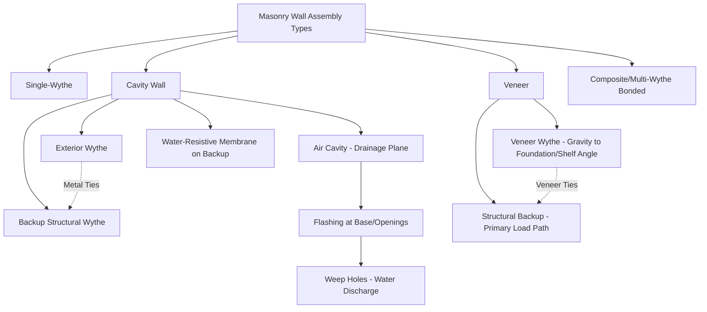

## Masonry Wall Assemblies and Reinforcement

### Overview

Masonry wall assemblies combine masonry units (clay brick, CMU, or stone), mortar, and, in reinforced systems, steel reinforcement and grout into structural and enclosure systems capable of resisting gravity, lateral (wind/seismic), and moisture management demands. Understanding the principal wall configurations and reinforcement strategies is essential to engineering masonry walls that perform structurally while managing water infiltration, a dual-function requirement that distinguishes masonry wall design from most other structural wall systems.

### Key Points

- Masonry wall systems are broadly classified as **single-wythe**, **cavity wall**, **veneer**, and **composite/multi-wythe bonded** assemblies, each with distinct structural behavior and moisture management strategy.
- Reinforcement approaches range from **unreinforced (plain) masonry**, relying entirely on the masonry's inherent compressive and limited flexural capacity, to **fully reinforced masonry**, incorporating vertical and horizontal steel reinforcement embedded in grout to resist flexural, tensile, and shear demands.
- The **cavity wall principle**, an air space (cavity) separating an exterior wythe from an interior structural or backup wythe, is the dominant modern strategy for managing water penetration in masonry construction, operating on a rain-screen drainage concept rather than relying solely on the exterior wythe's imperviousness.
- Structural design of masonry walls in the US is governed primarily by TMS 402/602 (Building Code Requirements and Specification for Masonry Structures), which provides both allowable stress design (ASD) and strength design (SD) provisions.

### Wall Assembly Configurations

**Single-Wythe Walls**

A wall constructed of a single thickness of masonry units (commonly CMU), which may serve as both the structural and weather-resistant element, or may rely on additional applied water-resistant coatings/treatments given the inherent vulnerability of a single masonry wythe to water penetration under sustained wind-driven rain exposure without a secondary drainage plane.

**Cavity Wall Systems**

Consist of an exterior masonry wythe (often brick or architectural CMU) separated by a continuous air cavity (typically $1$ to $4.5$ inches, per common design guidance, though specific cavity width should be verified against project-specific drainage and thermal design requirements) from an interior structural backup wythe (commonly CMU, concrete, or steel/wood stud framing), with the two wythes connected by corrosion-resistant metal ties that transfer lateral load between wythes while accommodating some differential movement.

The cavity wall system manages water through a **rain-screen drainage principle**: any water that penetrates the exterior wythe (an expected occurrence over the wall's service life, not a design failure) drains down the cavity face of the backup wythe (which must be protected by a continuous water-resistive membrane/flashing system), collects at flashing installed at the base of the cavity and above openings, and is directed out through weep holes at regular intervals, rather than relying on the exterior wythe alone to remain entirely impervious to water.

**Veneer Wall Systems**

A masonry wythe (typically brick, stone, or architectural CMU) attached to, but not structurally relied upon by, a structural backup wall (wood/steel stud framing, CMU, or concrete), where the veneer wythe carries only its own weight (transferred to the foundation or a structural shelf angle/relieving angle) and out-of-plane wind load transferred through veneer ties to the structural backup, rather than resisting the building's primary gravity or lateral load system. Anchored veneer systems are governed by specific code provisions (e.g., IBC Chapter 14 and TMS 402) addressing tie spacing, cavity width, and flashing/weep requirements similar in principle to cavity wall drainage design.

**Composite (Multi-Wythe Bonded) Walls**

Two or more masonry wythes bonded together (historically through masonry headers bridging wythes, or in modern practice through fully grouted collar joints with reinforcement, or through mortar-filled collar joints with wire ties) to act as a single structural composite unit resisting combined loads, a configuration more common in historical solid masonry construction than in current typical practice, which favors cavity wall or veneer systems for improved moisture management.

### Reinforcement Categories

**Unreinforced (Plain) Masonry**

Relies entirely on the inherent compressive strength of the masonry assembly and minimal tensile/flexural capacity from mortar bond strength alone; suitable for applications with predominantly compressive loading and limited seismic/wind demand, subject to code-imposed height, seismic design category, and slenderness limitations that restrict its use in higher-hazard regions or taller wall configurations.

**Horizontal (Joint) Reinforcement**

Prefabricated wire reinforcement (ladder-type or truss-type configuration) embedded within horizontal mortar bed joints at specified vertical spacing (commonly every second course, though spacing is design-dependent), serving primarily to control shrinkage/temperature cracking and provide modest supplemental horizontal tensile capacity, distinct from the heavier reinforcement placed within grouted bond beams.

**Vertical Reinforcement in Grouted Cells**

Deformed reinforcing bars placed within hollow CMU cores (or configured cavities in other masonry systems) and encased in grout, bonding the steel to the surrounding masonry assembly to resist flexural tension, axial tension, and contribute to shear capacity, fundamentally extending masonry's structural behavior from a purely compression-resisting material to one capable of resisting combined flexural and axial demand analogous in principle to reinforced concrete design.

**Bond Beams**

Horizontal courses of specially configured (often U-shaped or knock-out web) units, filled with grout and containing horizontal reinforcement, typically placed at the top of walls, at floor/roof diaphragm bearing elevations, and at intervals up the wall height, serving to distribute concentrated loads, tie the wall together horizontally, and provide a continuous load path for diaphragm shear transfer and out-of-plane wall anchorage forces.

**Fully Grouted vs. Partially Grouted Construction**

- **Fully Grouted**: All cells of hollow masonry units are filled with grout regardless of reinforcement presence, maximizing composite section properties, fire resistance, and sound transmission performance, at increased material cost and construction weight.
- **Partially Grouted**: Only cells containing reinforcement (plus bond beam courses) are grouted, leaving other cells hollow, a more economical approach appropriate where the structural design does not require full grouting for strength, fire rating, or other governing criteria.

### Structural Design Framework (TMS 402/602)

**Allowable Stress Design (ASD)**

A traditional design approach comparing calculated service-level stresses against code-specified allowable stress values for masonry and reinforcement, historically the dominant method for masonry design in the US.

**Strength Design (SD)**

A limit-states design approach using factored loads and strength reduction factors, conceptually paralleling strength design methods used in reinforced concrete (ACI 318), increasingly used particularly for higher-seismic-demand applications where strength design provisions may provide more direct ductility and capacity-based design provisions.

**Unit Strength Method vs. Prism Test Method**

Two pathways for establishing masonry assembly compressive strength ($f'_m$) for design purposes:

- **Unit Strength Method**: $f'_m$ is determined from tabulated values in the applicable code based on the individual masonry unit's net-area compressive strength and the specified mortar type, without requiring project-specific prism testing.
- **Prism Test Method**: Small masonry assemblies ("prisms," typically several units high, built with the project's specific units, mortar, and grout) are constructed and tested in compression per ASTM C1314, providing directly verified $f'_m$ values for the specific project materials rather than relying on tabulated generic values.

### Moisture Management Design Details

**Flashing**

Impermeable membrane material (metal, rubberized asphalt, or engineered composite flashing) installed at the base of cavity walls and veneer systems, above openings (lintels), and at other wall penetrations, designed to collect water that penetrates the exterior wythe and direct it back out of the wall assembly through weep holes rather than allowing it to continue migrating into the building interior or accumulate against the backup wall.

**Weep Holes**

Open or partially open vertical joints (or dedicated weep vents) spaced at regular intervals (commonly $24$ inches on center or per manufacturer/code guidance) immediately above flashing, allowing collected water to drain from the cavity to the building exterior.

**Through-Wall and Cavity Drainage Systems**

Some cavity wall designs incorporate proprietary drainage mesh or mortar-collection devices within the cavity to prevent mortar droppings from accumulating at the base of the cavity and blocking the intended drainage path, since obstructed cavity drainage is a common cause of water penetration performance failures even in properly designed cavity wall systems.

**Air Barrier and Insulation Integration**

Modern cavity wall and veneer assemblies typically integrate a continuous air barrier (often coincident with the water-resistive membrane on the backup wythe) and cavity insulation (rigid board insulation within the cavity space), requiring careful detailing coordination between structural tie penetrations, insulation continuity, and drainage plane integrity.

### Practical Example

A structural engineer designs an exterior wall for a three-story commercial building using a cavity wall system: a brick veneer exterior wythe separated by a $2$-inch drainage cavity (containing rigid insulation and a drainage mat) from a fully grouted, reinforced CMU backup wythe that serves as the primary structural wall resisting both gravity and lateral (wind) loads. Vertical reinforcement is placed in grouted CMU cells per the strength design calculation for out-of-plane wind demand, with bond beams incorporated at each floor diaphragm bearing elevation to transfer diaphragm shear into the wall system. Corrosion-resistant adjustable brick ties connect the veneer to the CMU backup at a specified spacing meeting code tie-spacing requirements, and continuous through-wall flashing with weep holes at $24$ inches on center is detailed at the base of the wall and above each window opening, ensuring that incidental water penetration through the brick veneer, rather than being treated as a defect to be entirely prevented, is properly managed and drained per the cavity wall's rain-screen design principle.

### Conclusion

Masonry wall assemblies span a spectrum from simple unreinforced single-wythe construction to sophisticated reinforced cavity wall systems that simultaneously satisfy structural demand and water penetration management. The cavity wall's rain-screen drainage principle, accepting that some water penetration through the exterior wythe is inevitable and providing a deliberate drainage path rather than relying on perfect imperviousness, represents the dominant modern strategy for durable masonry enclosure design, while reinforcement strategies ranging from horizontal joint reinforcement through fully grouted vertical steel systems extend masonry's structural capability well beyond plain masonry's inherent compression-dominated behavior, governed comprehensively by the TMS 402/602 structural design framework.

**Related Topics**

- Concrete Masonry Units (Grouting Methods and Structural Configuration)
- Mortar Types and Composition (Bond Strength and Water Resistance)
- TMS 402/602 Allowable Stress and Strength Design Provisions
- Seismic Design of Reinforced Masonry Shear Walls
- Building Envelope Air and Water Barrier Detailing
- Masonry Prism Testing and Assembly Compressive Strength Verification