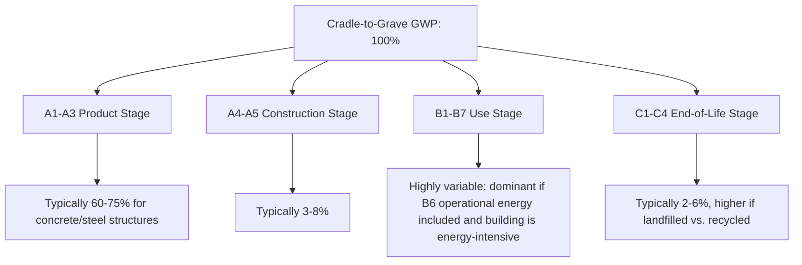

## Life Cycle Assessment of Construction Materials

### Definition and Purpose

Life Cycle Assessment (LCA) is a standardized methodology for quantifying the environmental impacts associated with all stages of a material's or product's life, from raw material extraction through processing, manufacturing, transportation, use, and end-of-life disposal or recycling. In construction, LCA provides a quantitative basis for comparing materials, structural systems, and design alternatives based on their environmental footprint rather than cost or performance alone.

The methodology is standardized internationally under **ISO 14040** (principles and framework) and **ISO 14044** (requirements and guidelines). For buildings specifically, **EN 15978** (European standard) and **ISO 21930** define how LCA principles apply to construction works, while **EN 15804** governs Environmental Product Declarations (EPDs) for construction products.

### The Four Phases of LCA (ISO 14040/14044)

**1. Goal and Scope Definition**

This phase establishes:

- The functional unit (the quantified basis for comparison, e.g., "1 m³ of structural concrete with 28-day compressive strength of 30 MPa sustaining a design life of 50 years")
- System boundaries (which life cycle stages are included)
- The intended application (design comparison, regulatory compliance, marketing/EPD)

The functional unit is critical: comparing materials by mass or volume alone is invalid unless they deliver equivalent performance. A steel beam and a timber beam must be compared based on equivalent structural capacity (load-bearing function), not equal mass.

**2. Life Cycle Inventory (LCI)**

This phase compiles a quantitative inventory of all inputs (raw materials, energy, water) and outputs (emissions to air/water/soil, solid waste) across every process in the system boundary. LCI data is typically sourced from databases such as **ecoinvent**, **GaBi**, or national databases (e.g., NREL's USLCI in the United States).

**3. Life Cycle Impact Assessment (LCIA)**

Inventory data is translated into impact category indicators using characterization factors. Common impact categories relevant to construction materials include:

| Impact Category | Unit | Typical Contributor |
| --- | --- | --- |
| Global Warming Potential (GWP) | kg CO₂-eq | Cement clinker production, fuel combustion |
| Acidification Potential | kg SO₂-eq | SO₂/NOₓ emissions from combustion |
| Eutrophication Potential | kg PO₄-eq | Nitrogen/phosphorus runoff |
| Ozone Depletion Potential | kg CFC-11-eq | Refrigerants, blowing agents (foams) |
| Photochemical Ozone Creation | kg C₂H₄-eq (ethene) | VOC emissions |
| Abiotic Depletion (minerals/fossil) | kg Sb-eq / MJ | Resource extraction |
| Primary Energy Demand | MJ | Cumulative energy across life cycle |

**4. Interpretation**

Results are analyzed for significance, sensitivity, and consistency with the goal and scope. This phase identifies which life cycle stages or processes dominate the environmental impact (**hotspot analysis**) and checks the robustness of conclusions against data uncertainty.

### Life Cycle Stages (EN 15978 Modular Framework)

Construction LCA uses standardized modules, denoted A–D, that partition the building life cycle:

**Key Points:**

- Modules **A1–A3** are collectively termed **"cradle-to-gate"** — this is the most commonly reported scope because it is the most controllable by manufacturers and the basis of most EPDs.
- **"Cradle-to-site"** extends to A4 (transport to the construction site).
- **"Cradle-to-grave"** covers A through C, representing the full life cycle.
- **"Cradle-to-cradle"** includes Module D, capturing benefits from recycling or reuse that extend beyond the building's own boundary (e.g., steel scrap displacing virgin ore in a future product).
- Module B6 (operational energy) frequently dominates whole-building LCA for conventional buildings, though as building envelopes and HVAC systems improve, embodied impacts (A1–A5) represent a growing share of total life cycle impact — a trend sometimes called the shift from operational carbon dominance to **embodied carbon** dominance.

### Embodied Carbon vs. Operational Carbon

$$GWP_{total} = GWP_{embodied} + GWP_{operational}$$

- **Embodied carbon**: GHG emissions associated with material extraction, manufacturing, transport, construction, maintenance, and end-of-life (Modules A, B1–B5, C). This is "locked in" at construction and cannot be reduced after the building is built.
- **Operational carbon**: GHG emissions from energy used to heat, cool, light, and power the building over its service life (Module B6).

As grid decarbonization and energy-efficient design reduce operational carbon, embodied carbon's relative share of whole-life emissions rises — a well-documented trend in green building literature, particularly for high-performance and net-zero-operational-energy buildings. [Inference: the exact crossover point where embodied carbon exceeds operational carbon is highly building- and region-specific, dependent on local grid carbon intensity and building service life assumptions.]

### Embodied Carbon Benchmarks by Material (Cradle-to-Gate, A1–A3)

Representative global average ranges commonly cited in LCA databases (values vary significantly by region, production route, and recycled content):

| Material | Typical GWP (kg CO₂-eq/kg) | Primary Emission Source |
| --- | --- | --- |
| Ordinary Portland Cement (OPC) | 0.83–0.95 | Calcination of limestone (CaCO₃ → CaO + CO₂) |
| Ready-mix concrete (30 MPa) | 0.10–0.17 | Cement content (dominant), aggregate, water |
| Structural steel (virgin, BOF route) | 2.0–2.8 | Iron ore reduction, coke combustion |
| Structural steel (recycled, EAF route) | 0.4–0.7 | Electricity for arc furnace |
| Aluminum (primary) | 8–12 | Electrolysis (Hall-Héroult process), electricity intensity |
| Aluminum (recycled) | 0.5–1.0 | Remelting energy only |
| Timber (sawn softwood, sequestration excluded) | 0.1–0.5 | Harvesting, processing, drying |
| Fired clay brick | 0.20–0.30 | Kiln firing |
| Glass (flat) | 0.85–1.4 | Furnace melting (high-temperature process) |
| Gypsum board | 0.25–0.40 | Calcination, drying |

[Unverified: exact figures depend heavily on the specific EPD, regional energy grid, and production technology; these ranges are illustrative order-of-magnitude figures rather than precise universal constants.]

### Worked Example: Cradle-to-Gate GWP of a Concrete Mix

Consider 1 m³ of concrete with the following mix design and cradle-to-gate emission factors:

| Constituent | Quantity (kg/m³) | Emission Factor (kg CO₂-eq/kg) | Contribution (kg CO₂-eq) |
| --- | --- | --- | --- |
| OPC (Portland cement) | 300 | 0.90 | 270.0 |
| Fly ash (SCM, replacing 20% OPC) | 60 | 0.02 | 1.2 |
| Coarse aggregate | 1100 | 0.005 | 5.5 |
| Fine aggregate (sand) | 700 | 0.005 | 3.5 |
| Water | 180 | 0.0003 | 0.05 |
| Admixtures | 3 | 1.5 | 4.5 |
| **Total** |  |  | **284.75 kg CO₂-eq/m³** |

**Key Points:**

- Cement is the dominant contributor even at relatively low mass fraction, because its emission factor is roughly two orders of magnitude higher than aggregate.
- Supplementary Cementitious Materials (SCMs) like **fly ash**, **ground granulated blast-furnace slag (GGBS)**, and **silica fume** reduce GWP by displacing clinker-intensive OPC. A 20% fly ash substitution in this example reduces total GWP by approximately 8–10% compared to a 100% OPC mix, and higher substitution rates (40–70% GGBS) can reduce embodied carbon substantially further, though at the cost of altered early-strength development and curing time requirements. [Inference: precise percentage reduction depends on the specific SCM reactivity and mix proportioning; this example is illustrative.]

### System Boundaries and Allocation Methods

A central methodological challenge in LCA is **allocation** — assigning environmental burdens when a single process produces multiple outputs (e.g., blast furnace slag as a byproduct of steelmaking, used as an SCM in concrete).

Three common approaches:

1. **Mass allocation**: Burdens divided proportionally by mass of co-products.
2. **Economic allocation**: Burdens divided proportionally by market value of co-products.
3. **System expansion / substitution**: The recycled/byproduct material is credited with avoiding the impact of the virgin material it displaces (this is the mechanism behind Module D benefits).

The choice of allocation method can significantly change reported results for byproduct-derived materials like slag cement or fly ash, and is a recognized source of variability between LCA studies. [Inference: the "correct" allocation method is context-dependent and remains a point of methodological debate in LCA literature rather than a settled consensus.]

### Environmental Product Declarations (EPDs)

An **EPD** is a standardized, third-party-verified document reporting the LCA results of a specific product, following **Product Category Rules (PCRs)** specific to that product type (e.g., PCR for concrete, PCR for structural steel). EPDs are governed by ISO 14025 (Type III environmental declarations) and EN 15804 (core PCR for construction products in Europe).

**Key Points:**

- EPDs enable apples-to-apples comparison between manufacturers' products because they follow identical PCR-defined system boundaries and functional units.
- Green building rating systems (LEED, BREEAM) award credits for using products with third-party-verified EPDs.
- An EPD reports LCA results but does not itself impose an environmental performance threshold — it is disclosure, not certification of superiority.

### Whole-Building LCA vs. Material-Level LCA

- **Material-level LCA** (cradle-to-gate) is used for material selection and procurement decisions, typically drawing on EPDs.
- **Whole-building LCA** aggregates the embodied impacts of all materials (via bill of quantities), construction processes, and often operational energy simulation, over the entire building life cycle. Common software tools include **Tally** (Revit plugin), **One Click LCA**, and **Athena Impact Estimator**.

Whole-building LCA requires combining:

1. A quantity takeoff (bill of materials) from architectural/structural drawings or BIM models
2. Matching each material to an appropriate EPD or generic LCI dataset
3. Aggregating across the functional/reference service life of the building, including replacement cycles for shorter-lived components (e.g., roofing membranes replaced every 20–25 years within a 60-year building life)

### Comparative LCA: Structural System Selection

**Example:** Comparing a steel-frame versus reinforced-concrete-frame structural system for an office building, per m² of floor area, cradle-to-gate:

| Consideration | Steel Frame | RC Frame |
| --- | --- | --- |
| Primary embodied carbon driver | Virgin steel production (if low recycled content) | Cement content in concrete |
| Recycled content sensitivity | High — EAF steel with high scrap content dramatically lowers GWP | Moderate — SCM substitution lowers GWP |
| End-of-life (Module D) potential | High — steel is highly recyclable, strong Module D credit | Moderate — concrete is typically downcycled (crushed aggregate), lower Module D credit than steel |
| Transport sensitivity (A4) | Lower mass, but often greater shipping distance for fabricated members | Higher mass, but often locally batched (ready-mix) |

**Conclusion:** Neither system is categorically "better" — the outcome is highly sensitive to regional steel recycled content, local cement SCM availability, and grid carbon intensity for concrete batching and steel manufacturing. Comparative claims require a full LCA rather than generic material assumptions. [Inference: framed as a general design consideration; the actual optimal system depends on project-specific factors including span requirements, local material sourcing, and regional grid mix.]

### Recycled and Emerging Materials in LCA Context

- **Recycled concrete aggregate (RCA)**: LCA studies generally show lower cradle-to-gate GWP than virgin aggregate due to avoided quarrying, though transport distances to crushing facilities can offset gains if recycling infrastructure is not local.
- **Geopolymer/alkali-activated binders**: Replace OPC with industrial byproducts (fly ash, slag) activated by alkaline solutions, potentially reducing calcination-related CO₂ substantially, though the alkaline activator (often sodium silicate) production itself carries a non-trivial embodied impact that must be included in a full LCA rather than assumed negligible.
- **Mass timber (CLT, glulam)**: LCA treatment of **biogenic carbon** (CO₂ sequestered in wood fiber during tree growth) is methodologically contested — some standards (e.g., PAS 2050) allow reporting biogenic carbon as a temporary credit, while others require reporting it separately from fossil-based emissions to avoid overstating benefits, particularly regarding end-of-life treatment (combustion vs. landfill vs. reuse) which determines whether sequestered carbon is eventually released.

### Illustration: Hotspot Analysis Diagram

**Key Points:** This distribution is illustrative and structure-dependent; a full whole-building LCA including operational energy (B6) for a conventional, non-optimized building often shows the use stage dominating overall life cycle GWP, whereas an embodied-carbon-only (cradle-to-grave excluding B6) study shows the product stage (A1–A3) as dominant. [Inference: proportions shown are indicative order-of-magnitude splits drawn from general LCA literature patterns, not a universal fixed ratio.]

### Uncertainty and Limitations of LCA

- **Data quality and regional representativeness**: Generic/secondary LCI datasets (e.g., ecoinvent) may not reflect local production technology, grid mix, or transport distances, introducing uncertainty when applied to a specific project.
- **Temporal boundary assumptions**: Long service-life assumptions (50–100 years) for buildings require projecting future maintenance/replacement cycles and future grid decarbonization trajectories, which are inherently uncertain.
- **Functional equivalence**: Comparing materials with different service lives or performance characteristics (e.g., a coating requiring reapplication every 5 years vs. one lasting 20 years) requires careful normalization to the same functional unit and reference study period.
- **Impact category selection**: A material can score well on GWP but poorly on other categories (e.g., water depletion, toxicity); single-indicator comparisons (GWP-only) risk **burden shifting** — improving one impact category while worsening another.

### Related Topics

- Environmental Product Declarations (EPD) and Product Category Rules (PCR)
- Supplementary Cementitious Materials (SCMs): Fly Ash, GGBS, Silica Fume
- Embodied Carbon vs. Operational Carbon in Green Building Design
- Biogenic Carbon Accounting and Mass Timber Construction
- Circular Economy Principles in Construction (Design for Disassembly, Material Passports)
- Geopolymer and Alkali-Activated Binder Chemistry
- Whole-Building LCA Software Tools (Tally, One Click LCA, Athena Impact Estimator)
- Green Building Rating Systems and LCA Integration (LEED, BREEAM, Envision)
- Recycled Concrete Aggregate (RCA) Performance and Specification
- Carbon Sequestration Potential of Bio-Based Building Materials