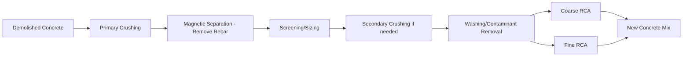
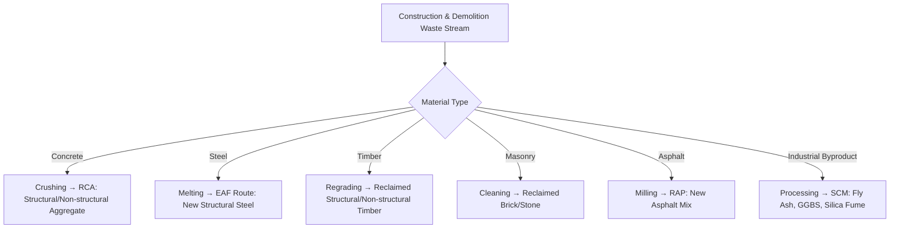

## Recycled and Reclaimed Materials

### Definition and Scope

Recycled and reclaimed materials in construction refer to two related but distinct categories:

- **Recycled materials**: Products manufactured from waste streams that have been reprocessed (mechanically or chemically altered) to serve as raw material inputs — e.g., crushed concrete converted into aggregate, or steel scrap remelted into new billets.
- **Reclaimed materials**: Products salvaged from a prior use in largely their original physical form, requiring minimal reprocessing — e.g., reclaimed structural timber beams, salvaged bricks, or reused steel sections.

This distinction matters for LCA purposes: reclaimed materials generally carry a much lower embodied impact than recycled materials, since reclamation avoids the energy-intensive reprocessing step (crushing, remelting, refining) entirely.

**Key Points:**

- Both categories reduce demand for virgin raw material extraction and divert waste from landfill.
- Recycling and reclamation are core strategies within the **circular economy** framework applied to the built environment, alongside reduction (using less material) and reuse (extending service life without disassembly).

### Recycled Concrete Aggregate (RCA)

**Production Process**

Demolished concrete is crushed, screened, and processed to remove contaminants (rebar, wood, other debris), producing:

- **Coarse RCA**: Replaces virgin coarse aggregate in new concrete.
- **Fine RCA**: Replaces virgin sand, though generally with more performance limitations due to higher absorbed cement paste content.

**Engineering Properties and Limitations**

RCA particles retain a layer of adhered old cement mortar/paste, which distinguishes their behavior from virgin aggregate:

| Property | Virgin Aggregate | Recycled Concrete Aggregate |
| --- | --- | --- |
| Water absorption | 0.5–1.5% | 3–8% (higher due to porous adhered mortar) |
| Density | 2600–2700 kg/m³ | 2200–2500 kg/m³ (lower) |
| Los Angeles abrasion loss | 15–30% | 25–45% (higher, weaker) |
| Compressive strength of resulting concrete (at 100% coarse RCA replacement) | Baseline | Typically 10–25% reduction, variable by source |

**Key Points:**

- Higher water absorption requires mix design adjustment (pre-soaking RCA or increasing mix water with corresponding cement/water ratio management) to maintain target workability.
- Most codes and guidelines (e.g., **ACI 555**, **RILEM recommendations**) limit coarse RCA replacement to 20–30% in structural concrete without extensive qualification testing, while non-structural applications (pavement subbase, backfill) can use up to 100% RCA.
- Fine RCA replacement is generally more restricted than coarse RCA due to greater strength and shrinkage impacts from the higher paste content in finer particles.

**Worked Example: RCA Replacement Effect on Compressive Strength**

For a base mix design targeting 30 MPa at 28 days with 100% virgin aggregate, empirical trends commonly reported in RCA literature show:

$$f'_{c,RCA} \approx f'_{c,virgin} \times (1 - k \cdot R)$$

where $R$ is the fractional coarse RCA replacement ratio and $k$ is an empirical reduction coefficient often cited in the range of 0.10–0.20 depending on RCA source quality.

For $R = 0.30$ (30% replacement) and $k = 0.15$:

$$f'_{c,RCA} \approx 30 \times (1 - 0.15 \times 0.30) = 30 \times 0.955 = 28.65 \text{ MPa}$$

[Inference: the coefficient $k$ is source- and study-specific rather than a universal constant; this equation is a simplified illustrative model, not a codified design formula. Actual mix qualification requires trial batching and testing per applicable standards.]

### Recycled Steel

**Production Routes**

| Route | Process | Typical Recycled Content |
| --- | --- | --- |
| Basic Oxygen Furnace (BOF) | Virgin iron ore + limited scrap (~15–30%) | Low |
| Electric Arc Furnace (EAF) | Predominantly scrap steel melted via electric arc | High (often 90%+) |

**Key Points:**

- Steel is one of the most recycled construction materials globally, and scrap steel can be recycled indefinitely without loss of inherent metallurgical properties, provided contaminant elements (notably copper from wiring) are controlled.
- EAF-route steel typically carries substantially lower embodied carbon than BOF-route steel (see comparative GWP figures under embodied carbon topics), since it avoids the energy-intensive reduction of iron ore.
- Structural steel sections, rebar, and metal decking are commonly specified with minimum recycled content requirements in green building certifications (LEED Materials & Resources credits).

### Reclaimed/Salvaged Structural Timber

**Sourcing and Assessment**

Reclaimed timber typically originates from deconstructed industrial buildings, barns, warehouses, or old-growth structures. Unlike newly harvested timber, reclaimed structural members often derive from slow-growth old-growth stock, yielding tighter grain and higher density.

**Key Points:**

- Reclaimed timber requires structural regrading, since its original grade stamp (if any) is no longer valid after removal from service; grading must assess current condition, including checks for rot, insect damage, and residual fastener holes.
- Non-destructive testing methods, including visual grading and **stress-wave/ultrasonic testing**, are used to re-establish an allowable design stress for reclaimed members.
- Common risks include embedded metal fasteners (nails, bolts) requiring detection (metal detectors) prior to machining, and legacy chemical treatments (e.g., older pentachlorophenol or creosote treatments) which may pose handling/disposal concerns.

### Reclaimed Masonry (Brick and Stone)

- Salvaged bricks from demolition are cleaned of residual mortar (typically manually or via mechanical brushing) and re-graded for reuse in non-structural or lightly-loaded structural applications.
- **Key Points:** Lime-mortar-era bricks (pre-20th century in many regions) are generally easier to clean and reclaim than modern bricks bonded with high-strength Portland cement mortar, because lime mortar bonds are weaker and more easily removed without damaging the brick face.
- Reclaimed stone (granite, limestone, sandstone) from demolished facades or infrastructure is often reused in cladding, paving, or landscape applications, retaining most of its original mechanical properties since stone is not chemically altered by prior use.

### Recycled Asphalt Pavement (RAP)

Reclaimed Asphalt Pavement is produced by milling or full-depth removal of existing asphalt pavement, then incorporating it into new asphalt mixes.

**Key Points:**

- RAP contains both aggregate and residual bitumen binder, both of which can be reused; the aged binder is typically softer/more oxidized than virgin binder, requiring **rejuvenating agents** or blending with softer virgin binder grades to restore target performance.
- Typical RAP content in new asphalt mixes ranges from 15–25% for standard applications, with high-RAP mixes (40%+) requiring more careful mix design and rejuvenator use to control cracking resistance.
- RAP recycling is one of the most successful large-scale construction material recycling programs by volume, widely used in highway resurfacing.

### Recycled Industrial Byproducts as SCMs

Certain industrial waste streams are reprocessed into Supplementary Cementitious Materials, displacing OPC clinker:

| Byproduct | Source Industry | Use |
| --- | --- | --- |
| Fly ash | Coal-fired power plants | Partial OPC replacement, improves workability, reduces heat of hydration |
| Ground Granulated Blast-furnace Slag (GGBS) | Iron/steel blast furnace | High-volume OPC replacement, improves durability and sulfate resistance |
| Silica fume | Silicon/ferrosilicon smelting | Pozzolanic reactivity, densifies microstructure, improves strength |

**Key Points:** As coal power generation and traditional blast-furnace steelmaking decline in some regions with the transition to renewable energy and EAF steel routes, future fly ash and slag supply availability is a recognized concern in the concrete industry, prompting research into alternative pozzolans (e.g., calcined clays, natural pozzolans). [Inference: the degree and timeline of future SCM supply constraint is regionally variable and speculative rather than an established fact.]

### Design for Disassembly (DfD) — Enabling Future Reclamation

Design for Disassembly is a design philosophy that anticipates future deconstruction, maximizing the recoverability of materials at end-of-life rather than assuming demolition.

**Key Points:**

- DfD favors **mechanical connections** (bolted, screwed) over adhesives, welds, or wet-cast concrete, since mechanical joints permit non-destructive disassembly.
- **Material passports** — digital records documenting the composition, origin, and condition of installed materials — are an emerging tool to support future recyclability assessments, allowing future demolition contractors to identify high-value reclaimable materials before demolition begins.
- Modular construction (prefabricated panels, mass timber panel systems) inherently supports DfD principles more readily than cast-in-place monolithic construction.

### Comparative Summary Diagram

### Regulatory and Certification Context

- **LEED (Materials & Resources category)**: Awards credits for recycled content, salvaged/reused materials, and construction waste diversion from landfill.
- **BREEAM**: Similarly credits responsible sourcing and use of recycled/reclaimed materials.
- **ASTM/ACI/RILEM standards**: Provide testing protocols and mix design guidance specifically for RCA and other recycled aggregates (e.g., ASTM C1761 for lightweight aggregate, though RCA-specific standards vary by jurisdiction).

**Note:** Specific credit thresholds, percentage requirements, and point allocations in rating systems are periodically revised between certification versions; current project teams should verify against the specific rating system version applicable to their project rather than relying on general figures, since these administrative details change independently of the underlying engineering principles. [Unverified: exact current credit thresholds are program-version-specific and outside the scope of stable technical fact.]

### Related Topics

- Life Cycle Assessment of Construction Materials
- Design for Disassembly (DfD) and Material Passports
- Circular Economy Principles in the Built Environment
- Recycled Concrete Aggregate Mix Design and Testing Protocols
- Supplementary Cementitious Materials: Fly Ash, GGBS, Silica Fume Chemistry
- Structural Grading and Assessment of Reclaimed Timber
- Recycled Asphalt Pavement (RAP) Mix Design and Rejuvenating Agents
- Green Building Certification Systems (LEED, BREEAM) Materials Credits
- Construction and Demolition (C&D) Waste Management Planning