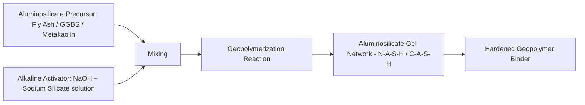

## Supplementary and Alternative Binders

### Definition and Motivation

Supplementary and alternative binders encompass materials that partially or fully replace ordinary Portland cement (OPC) as the reactive binding phase in concrete and mortar. The primary driver is reducing embodied carbon: OPC clinker production releases CO₂ both from fuel combustion and, more significantly, from the **calcination reaction** itself:

$$CaCO_3 \xrightarrow{\Delta, \sim1450°C} CaO + CO_2$$

This calcination reaction alone accounts for roughly 50–60% of cement production's process emissions, independent of fuel source, making it a structurally difficult emission to eliminate through energy efficiency or fuel switching alone. This has driven two parallel strategies: **Supplementary Cementitious Materials (SCMs)**, which partially replace OPC while retaining a cement-based system, and **Alternative Binders**, which replace the cement chemistry entirely.

### Category 1: Supplementary Cementitious Materials (SCMs)

SCMs are materials — typically industrial byproducts or natural pozzolans — that react with the calcium hydroxide (Ca(OH)₂) produced during OPC hydration, via the **pozzolanic reaction**, or that hydrate independently with latent hydraulic activity.

**Fly Ash (Class F and Class C)**

- **Source**: Byproduct of pulverized coal combustion in power plants.
- **Class F** (low-calcium, from bituminous/anthracite coal): Primarily pozzolanic; reacts with Ca(OH)₂ from cement hydration.
- **Class C** (high-calcium, from lignite/sub-bituminous coal): Contains some self-cementing (hydraulic) properties in addition to pozzolanic reactivity.

Pozzolanic reaction (simplified):

$$Ca(OH)_2 + SiO_2 (\text{reactive}) + H_2O \rightarrow C\text{-}S\text{-}H \text{ (calcium silicate hydrate)}$$

**Key Points:**

- Typical replacement levels: 15–35% by mass of cementitious material for Class F.
- Benefits: reduced heat of hydration (beneficial for mass concrete pours), improved long-term strength and durability, improved workability due to spherical fly ash particle morphology.
- Trade-offs: slower early strength gain, requiring extended curing time before formwork removal or load application; increased sensitivity to curing temperature.

**Ground Granulated Blast-furnace Slag (GGBS/GGBFS)**

- **Source**: Molten slag byproduct of iron production, rapidly quenched (granulated) then ground to cement fineness.
- **Reactivity**: Latent hydraulic — reacts with water when activated by the alkaline environment provided by OPC hydration (Ca(OH)₂ and alkalis).

**Key Points:**

- Can be used at much higher replacement levels than fly ash — commonly 30–50%, with high-GGBS mixes reaching 70%+ in specialized applications.
- Improves resistance to sulfate attack and chloride ion penetration, making it favored for marine and aggressive-exposure structures.
- Produces a lighter-colored concrete than OPC alone.
- Slower strength development at early ages, similar to fly ash, requiring adjusted construction scheduling.

**Silica Fume (Microsilica)**

- **Source**: Byproduct of silicon or ferrosilicon alloy production, captured as ultra-fine particles (roughly 100x finer than cement particles).
- **Mechanism**: Highly reactive pozzolan due to extremely high surface area and amorphous silica content; also provides significant particle-packing (micro-filler) benefit.

**Key Points:**

- Typical replacement levels are low, 5–10% by mass, due to high cost and water demand.
- Produces very high early and ultimate strength, and significantly reduced permeability — widely used in high-performance and high-strength concrete (60+ MPa).
- Requires superplasticizer/high-range water reducer to manage workability, since silica fume dramatically increases water demand due to surface area.

**Natural Pozzolans and Calcined Clays**

- Natural pozzolans (volcanic ash, pumice) have been used since Roman concrete construction; historically documented as a key durability factor in Roman maritime structures.
- **Calcined clay** (particularly metakaolin, from kaolinitic clay calcined at 650–800°C) is gaining prominence as fly ash and slag supplies face long-term availability concerns tied to declining coal power and blast-furnace steel production.
- **LC3 (Limestone Calcined Clay Cement)**: An emerging ternary blended system combining calcined clay, limestone, and reduced clinker content (as low as 50%), developed through research initiatives including work at EPFL Switzerland. LC3 has attracted interest for regions with abundant kaolinitic clay but limited fly ash/slag supply. [Inference: LC3 is an actively developing technology; specific performance figures and adoption rates continue to evolve, so readers should consult current research literature and pilot project data for the most current status.]

### Category 2: Alternative (Non-OPC) Binder Systems

**Geopolymer / Alkali-Activated Binders**

Geopolymers are formed by reacting an aluminosilicate precursor (commonly fly ash, GGBS, or metakaolin) with a strongly alkaline activator solution, producing a three-dimensional aluminosilicate polymer network rather than the calcium-silicate-hydrate (C-S-H) structure of OPC.

**Key Points:**

- Avoids the calcination step entirely, since precursors are already industrial byproducts, potentially reducing embodied carbon substantially compared to OPC — though the alkaline activator (particularly sodium silicate, produced via an energy-intensive process) carries a non-negligible embodied impact that must be included in any full LCA comparison rather than assumed negligible.
- Generally exhibits good acid resistance, fire resistance, and can achieve high early strength depending on formulation.
- Practical limitations include the corrosive/hazardous nature of concentrated alkaline activator solutions (handling and safety concerns on-site), less standardized mix design and curing guidance compared to mature OPC codes, and variability in raw precursor chemistry between fly ash sources affecting reproducibility.
- Ambient-cured geopolymers exist, but many higher-performance formulations historically required elevated-temperature curing, which limits some cast-in-place applications and favors precast production. [Inference: ambient-curing geopolymer formulations are an active research area with varying reported performance; generalized claims of full performance parity with heat-cured systems should be verified against the specific formulation.]

**Calcium Sulfoaluminate (CSA) Cement**

- Manufactured from a clinker with a different mineralogical composition than OPC (based on ye'elimite, $C_4A_3\bar{S}$), burned at lower kiln temperatures (~1200°C vs. ~1450°C for OPC) and typically requiring less limestone per unit of clinker.
- **Key Points:** Produces rapid strength gain and reduced drying shrinkage, useful in repair mortars and precast applications requiring fast turnaround; potential for lower CO₂ emissions per tonne of clinker due to lower kiln temperature and reduced limestone calcination, though CSA remains a niche/specialty cement rather than a general OPC replacement due to cost and more limited large-scale production infrastructure. [Unverified: precise CO₂ reduction percentages vary by source and production route.]

**Magnesium-based Binders (Magnesium Oxychloride/Oxysulfate, Reactive Magnesia Cement)**

- Based on magnesium oxide (MgO) rather than calcium-based chemistry; some formulations (reactive magnesia cements) are of research interest partly because MgO can be produced at lower calcination temperatures than CaO, and magnesium carbonation during curing/service life can partially reabsorb CO₂.
- **Key Points:** Remains largely in research and niche commercial application (e.g., magnesium oxychloride flooring products) rather than mainstream structural use; durability concerns (moisture sensitivity in some formulations) require careful application-specific evaluation. [Speculation: broader structural adoption of magnesium-based binders as a mainstream OPC alternative remains uncertain and dependent on further durability research and cost reduction.]

**Carbonation-Cured / CO₂-Cured Concrete**

- A category of processes (used by several commercial technology providers) where concrete is cured in a CO₂-rich chamber rather than or in addition to water curing, causing captured CO₂ to react with calcium-bearing phases and mineralize into calcium carbonate within the concrete matrix, both sequestering CO₂ and often accelerating early strength gain.
- **Key Points:** This is an active area of commercial development at the time of writing; because this is a rapidly evolving technology space with multiple competing proprietary processes, readers should consult current vendor documentation and peer-reviewed literature for up-to-date performance data and adoption status rather than relying on generalized claims. [Unverified: specific commercial process names, performance claims, and market maturity should be verified against current sources, as this space evolves quickly.]

### Comparative Overview

| Binder System | Clinker Content | Typical Early Strength | Key Advantage | Key Limitation |
| --- | --- | --- | --- | --- |
| OPC (baseline) | 100% | Fast | Mature codes, universal familiarity | Highest embodied carbon per tonne |
| Fly Ash blend | 65–85% | Slow | Workability, long-term durability | Slow early strength, supply concerns |
| GGBS blend | 50–70% (or lower) | Slow-moderate | Sulfate/chloride resistance | Slow early strength |
| Silica fume blend | 90–95% | Fast (high ultimate) | Very high strength/low permeability | High cost, high water demand |
| LC3 (calcined clay-limestone) | ~50% | Moderate | Uses abundant clay resource | Newer, less field history |
| Geopolymer | 0% (typically) | Variable/fast | Avoids calcination entirely | Handling hazards, less standardized |
| CSA cement | Different clinker chemistry | Very fast | Rapid strength, low shrinkage | Niche production, higher cost |

### Standards and Specification Context

- **ASTM C618** governs fly ash and natural pozzolan classification (Class F/C) for use in concrete.
- **ASTM C989 / C1073** cover GGBS specification.
- **ASTM C1240** covers silica fume.
- Alternative binders such as geopolymers generally lack the same depth of mature national/international structural design codes as OPC concrete, and code acceptance varies significantly by jurisdiction — engineers should verify current local code recognition before specifying alternative binders for structural applications. [Unverified: specific code acceptance status is jurisdiction- and version-dependent, and evolves over time.]

### Related Topics

- Life Cycle Assessment of Construction Materials
- Recycled and Reclaimed Materials (Fly Ash and GGBS as Recycled Industrial Byproducts)
- Cement Hydration Chemistry and Microstructure Development
- Concrete Durability: Sulfate Attack and Chloride Ion Penetration
- Mix Design Principles for Blended and Alternative Binder Concretes
- Carbon Capture and Mineralization Technologies in Concrete Curing
- High-Performance and Ultra-High-Performance Concrete (UHPC)
- Roman Concrete and Historical Use of Natural Pozzolans