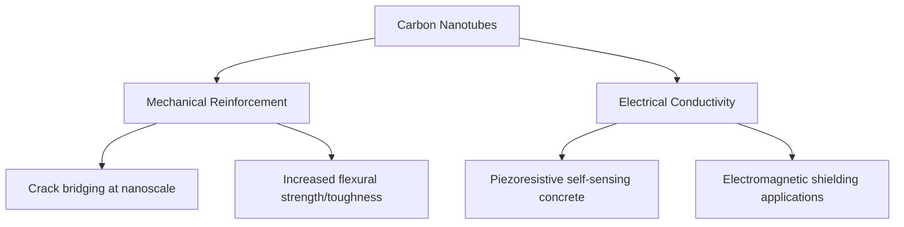

## Nanomaterials in Civil Engineering

### Definition and Scope

Nanomaterials in civil engineering refer to materials engineered or characterized at the nanoscale (conventionally, at least one dimension below 100 nm) that are incorporated into or applied to construction materials to modify their mechanical, durability, electrical, or functional properties at a fundamental microstructural level. Unlike conventional admixtures that act primarily through chemical or physical bulk effects, nanomaterials often exploit high surface-area-to-volume ratios and quantum/surface-scale phenomena to influence hydration chemistry, pore structure, and crack propagation at scales below what conventional additives can address.

**Key Points:**

- Nanomaterial integration spans nearly all major construction material categories: cementitious composites, steel, coatings/paints, and geotechnical applications (soil stabilization).
- Motivations include enhanced mechanical performance (strength, toughness), improved durability (reduced permeability, corrosion resistance), added functionality (self-sensing, self-cleaning, photocatalytic), and in some cases, reduced material consumption for equivalent performance.

### Nano-Silica (Nanoscale Silicon Dioxide)

Nano-silica (nano-SiO₂) is among the most widely studied nanomaterials for cementitious systems, distinguished from conventional silica fume primarily by its substantially smaller particle size (typically 10–100 nm vs. roughly 100–1000 nm for silica fume).

**Mechanism of Action**

- **Pozzolanic reactivity**: Nano-silica's extremely high surface area accelerates its reaction with calcium hydroxide (Ca(OH)₂) produced during cement hydration, consuming the weaker, more soluble Ca(OH)₂ phase and converting it into additional calcium-silicate-hydrate (C-S-H) gel — the primary strength-contributing phase in hydrated cement.
- **Nucleation/filler effect**: Nanoparticles act as nucleation sites for C-S-H formation, accelerating early hydration kinetics, and physically fill nanoscale pores, densifying the microstructure.

**Key Points:**

- Typical dosage is low, generally 1–5% by mass of cementitious binder, due to high cost and the risk of excessive water demand and agglomeration at higher dosages.
- Reported effects in research literature commonly include accelerated early-age strength development and reduced permeability/chloride penetration compared to plain OPC systems, though the magnitude of improvement varies considerably with nano-silica source, dispersion quality, and dosage. [Unverified: specific percentage strength gains cited across different studies vary substantially due to differences in test methodology, dispersion technique, and mix design; consult primary research sources for figures relevant to a specific formulation.]
- **Dispersion** is a critical practical challenge: nanoparticles have a strong tendency to agglomerate due to high surface energy, and poor dispersion can create weak points (voids, stress concentrations) rather than the intended reinforcing effect. Achieving uniform dispersion typically requires ultrasonication and/or compatible superplasticizers during mixing.

### Carbon Nanotubes (CNTs) and Carbon Nanofibers (CNFs)

Carbon nanotubes are cylindrical carbon nanostructures (single-walled, SWCNT, or multi-walled, MWCNT) with exceptionally high tensile strength and elastic modulus relative to their mass, alongside notable electrical conductivity.

**Key Points:**

- At the nanoscale, CNTs can bridge nanocracks before they propagate into larger microcracks, contributing to improved toughness and crack resistance in cementitious composites.
- CNT-modified concrete has been investigated for **self-sensing** applications (see also Smart and Self-Healing Materials), exploiting the piezoresistive effect where electrical resistivity changes measurably under mechanical strain.
- Major practical barriers to widespread structural use include high production cost relative to conventional reinforcement, persistent dispersion challenges (CNTs bundle together via van der Waals forces), and the need for surface functionalization (chemical treatment) to improve compatibility and bonding with the cementitious matrix. [Inference: CNT use in mainstream structural concrete remains predominantly at research and specialized/niche application stage rather than widespread commercial structural practice, based on current cost and processing constraints.]

### Nano-Titanium Dioxide (Nano-TiO₂) — Photocatalytic Applications

Nano-TiO₂ is incorporated into surface coatings, cementitious renders, and paving materials to exploit its **photocatalytic** properties under ultraviolet (UV) light exposure.

**Mechanism**

Under UV irradiation, TiO₂ generates electron-hole pairs that drive strong oxidation reactions at the material surface, capable of decomposing organic pollutants and certain airborne nitrogen oxides (NOₓ).

$$TiO_2 + h\nu \rightarrow e^- + h^+$$

$$h^+ + H_2O \rightarrow OH^{\bullet} + H^+$$

The resulting hydroxyl radicals ($OH^{\bullet}$) oxidize adsorbed organic and NOₓ pollutants at the surface.

**Key Points:**

- Two principal functional benefits are commonly cited: **self-cleaning** surfaces (photocatalytic decomposition of organic staining/dirt, combined with the coating's photoinduced superhydrophilicity that helps rainwater sheet-wash decomposed residue) and **air-purifying pavements/facades** (NOₓ decomposition, relevant to urban air quality near high-traffic roadways).
- Photocatalytic efficiency depends on adequate UV exposure, meaning performance can be reduced on shaded surfaces or in climates with limited sunlight, and reported pollutant-reduction percentages vary substantially between field studies, likely reflecting differences in traffic density, surface orientation, and application method. [Unverified: pollutant reduction percentages reported in various pilot studies and field trials vary considerably; figures should be sourced from studies matching the specific application context rather than treated as universal performance guarantees.]

### Nano-Clay

Nano-clay materials (commonly montmorillonite-based) are layered aluminosilicate nanoparticles used to modify cementitious and polymeric construction materials.

**Key Points:**

- In cementitious systems, nano-clay can act as a viscosity-modifying agent, improving segregation resistance and rheological control, particularly relevant for self-consolidating concrete formulations.
- In polymer composites and geosynthetics, nano-clay incorporation can improve barrier properties (reduced gas/moisture permeability) and thermal stability, relevant to geomembrane and waterproofing applications.

### Graphene and Graphene Oxide

Graphene — a single-atom-thick sheet of carbon atoms arranged in a hexagonal lattice — and its oxidized derivative, graphene oxide (GO), have attracted significant research interest for cementitious composite reinforcement due to graphene's exceptional intrinsic mechanical strength and stiffness.

**Key Points:**

- Graphene oxide's oxygen-containing functional groups improve dispersibility in aqueous cementitious systems compared to pristine graphene, which is naturally hydrophobic and prone to agglomeration.
- Research literature commonly reports improvements in compressive and flexural strength alongside reduced porosity at low graphene oxide dosages (typically well below 1% by mass of binder), though — as with other nanomaterial additions — reported magnitude of improvement varies considerably across studies due to differences in graphene oxide quality, oxidation degree, and dispersion method. [Unverified: given active and rapidly evolving research in this area, specific performance figures should be verified against recent, application-matched literature rather than treated as settled, universal values.]
- Cost and large-scale production scalability remain significant barriers to widespread commercial structural adoption at the time of writing. [Inference: commercial-scale structural use remains limited primarily by production cost and scale-up challenges rather than fundamental performance limitations.]

### Nanomaterials in Steel and Metallic Systems

- **Nanostructured/microalloyed steels**: Controlled thermomechanical processing techniques can refine steel grain structure down to the nanoscale/ultrafine-grain regime, improving strength without proportional loss of ductility, relevant to high-strength structural steel development.
- **Nano-coatings for corrosion protection**: Nanoscale coating formulations (e.g., incorporating nano-silica, nano-zinc oxide, or graphene-based barrier layers) are used to enhance corrosion resistance of steel reinforcement and structural steel members, functioning primarily through improved barrier density at the nanoscale, reducing moisture/oxygen/chloride ion ingress to the metal substrate. [Inference: specific commercial nano-coating formulations and their comparative performance vary by manufacturer; general principles are well-established, but product-specific claims should be verified against current manufacturer data.]

### Nanomaterials in Geotechnical Applications

- **Nano-modified soil stabilization**: Nanoparticles (including nano-silica, nano-clay, and nano-lime) have been investigated as soil stabilization additives, aiming to improve strength, reduce permeability/swelling potential in expansive clays, or accelerate pozzolanic stabilization reactions compared to conventional lime/cement stabilization alone. [Inference: this remains predominantly a research and pilot-scale application area rather than standard geotechnical practice, based on current literature maturity relative to conventional stabilization methods.]

### Health, Safety, and Environmental Considerations

**Key Points:**

- Nanomaterial handling during manufacturing and on-site mixing raises occupational health considerations related to potential inhalation of loose nanoparticles (particularly relevant for dry powder forms of nano-silica, CNTs, and graphene-family materials), and appropriate personal protective equipment and dust control measures are recommended during handling of nanomaterial powders. [Speculation regarding specific long-term health effects: the long-term health and environmental impact profile of some engineered nanomaterials, particularly certain carbon nanotube morphologies, remains an active area of toxicological research, and readers should consult current occupational health and safety guidance and regulatory positions rather than assuming a settled consensus.]
- Life Cycle Assessment of nanomaterial-enhanced construction products should account for the often energy-intensive nanomaterial production/purification processes themselves, which can be a significant contributor to the overall embodied impact of the final product, potentially offsetting some in-service performance benefits depending on the specific application and service life extension achieved. [Inference: whether net lifecycle benefit is positive depends heavily on the specific nanomaterial production route, dosage, and the magnitude of durability/service-life improvement achieved — this is application-specific rather than a general rule.]

### Comparative Summary

| Nanomaterial | Primary Mechanism | Key Application | Maturity Level |
| --- | --- | --- | --- |
| Nano-silica | Enhanced pozzolanic reaction, pore filling | High-performance concrete, durability enhancement | Commercially available |
| Carbon nanotubes (CNTs) | Nanoscale crack bridging, conductivity | Toughness enhancement, self-sensing concrete | Research to niche pilot |
| Nano-TiO₂ | Photocatalysis under UV | Self-cleaning surfaces, air-purifying pavement/facade | Commercially available (select products) |
| Nano-clay | Rheology modification, barrier improvement | Self-consolidating concrete, waterproofing membranes | Commercially available |
| Graphene/graphene oxide | Nanoscale reinforcement, densification | High-performance cementitious composites | Research to early pilot |
| Nano-coatings (steel) | Barrier density enhancement | Corrosion protection | Commercially available (select products) |

### Related Topics

- Smart and Self-Healing Materials
- Life Cycle Assessment of Construction Materials
- High-Performance and Ultra-High-Performance Concrete (UHPC)
- Concrete Durability: Permeability, Chloride Penetration, and Corrosion of Reinforcement
- Supplementary and Alternative Binders
- Occupational Health and Safety in Materials Handling
- Structural Health Monitoring (SHM) via Self-Sensing Materials