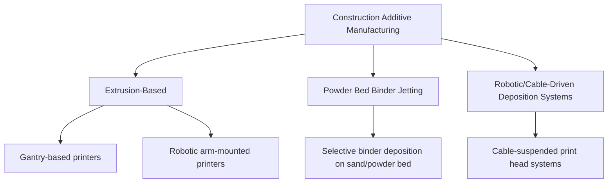

## Additive Manufacturing of Construction Materials

### Definition and Scope

Additive Manufacturing (AM) in construction — commonly termed **3D Concrete Printing (3DCP)** or **construction 3D printing** — refers to the layer-by-layer deposition of construction material (predominantly cementitious material, though also polymers, metals, and composites) directly from digital models, without the need for conventional formwork. This contrasts fundamentally with traditional cast-in-place or precast construction, which relies on temporary molds to shape fresh material until it gains sufficient early strength.

**Key Points:**

- The core value proposition includes formwork elimination (a significant cost and material-waste driver in conventional concrete construction), design freedom for complex/curved geometries difficult or costly to achieve with conventional formwork, and potential labor efficiency for certain construction tasks.
- Applications span structural walls, architectural facades and formwork-free complex geometry, affordable/rapid housing construction, infrastructure components, and increasingly, large-format precast elements produced off-site.

### Core Process Categories

**Extrusion-Based Printing**

The dominant approach for structural/architectural concrete printing: a specialized mortar or concrete mix is pumped through a nozzle mounted on a gantry system or robotic arm, depositing continuous material beads in successive layers that build up the final geometry.

**Powder Bed / Binder Jetting**

A layer of dry granular material (commonly sand or a cementitious powder blend) is spread across a bed, and a liquid binder is selectively jetted onto the areas corresponding to the cross-section of the desired part; unbound powder in each layer provides temporary support for overhanging features, and is removed after printing completes. This approach is more common for smaller-format architectural components and research applications than for full-scale structural walls.

### Printable Concrete Mix Design Requirements

Conventional concrete mix design principles (targeting slump, workability, and final strength) are insufficient for 3D printing; printable mixes must simultaneously satisfy competing rheological requirements across the printing timeline:

| Property | Requirement | Why |
| --- | --- | --- |
| **Pumpability** | Sufficiently fluid to flow through delivery hoses/pump without segregation or blockage | Material must reach the print head reliably |
| **Extrudability** | Consistent flow through the nozzle at controlled rate | Ensures uniform bead geometry |
| **Buildability** | Sufficient stiffness/green strength immediately after deposition to support its own weight and subsequent layers without slumping or collapsing | Enables multi-layer stacking without formwork |
| **Open time** | Long enough working window before the mix stiffens beyond extrudability, but short enough to gain buildability quickly | Balances practical print duration against structural stability during printing |
| **Interlayer bond strength** | Adequate adhesion between successively deposited layers | Prevents the printed layer interfaces from becoming structural weak planes |

**Key Points:**

- These requirements are frequently in direct tension: increasing early stiffness (buildability) too aggressively can compromise pumpability and extrudability, while a highly fluid, easily pumped mix may lack sufficient green strength to support upper layers without slumping — mix design for 3DCP is fundamentally a rheology optimization problem rather than a conventional strength-and-workability optimization.
- Printable mixes commonly rely on fine aggregate (rather than conventional coarse aggregate) due to nozzle diameter constraints, along with accelerating admixtures to promote rapid early stiffening, viscosity-modifying admixtures (VMAs) to control flow behavior, and often SCMs (see Supplementary and Alternative Binders) to fine-tune rheology and reduce embodied carbon.
- **Interlayer bond strength** is a widely documented concern in 3DCP research: because successive layers are deposited without the continuous consolidation of cast concrete, the interface between layers can represent a plane of reduced strength (particularly reduced tensile/interlaminar shear strength) compared to the bulk printed material — an important structural design consideration analogous to anisotropy in other additive manufacturing processes (e.g., polymer 3D printing). [Inference: the magnitude of interlayer strength reduction is highly process- and mix-specific — dependent on time gap between layers, surface treatment between layers, and print speed — rather than a fixed universal penalty.]

### Reinforcement Strategies in 3D Printed Concrete

Because conventional steel rebar cages are difficult to place within a continuously extruded printing process, alternative reinforcement approaches are commonly employed or under active development:

- **Fiber reinforcement**: Steel, polymer (e.g., PVA, polypropylene), or glass fibers mixed directly into the printable mortar, providing distributed reinforcement and improved toughness/crack control analogous to fiber-reinforced concrete generally.
- **In-process reinforcement placement**: Some systems incorporate automated wire/cable feeding or entrainment during the print process, embedding continuous reinforcement within the deposited layers as printing progresses.
- **Post-print reinforcement**: Printed wall geometries can be designed with internal voids or cavities (exploiting the geometric freedom of AM) into which conventional reinforcing bars are placed after printing, followed by grouting/infill — analogous conceptually to reinforced masonry construction.
- **Hybrid systems**: Combining a 3D-printed permanent formwork shell (serving as both formwork and outer structural/architectural finish) with conventional cast-in-place reinforced concrete infill.

**Key Points:** Structural design codes for reinforced 3D-printed concrete remain less mature than for conventional reinforced concrete, and code recognition/acceptance varies significantly by jurisdiction at the time of writing — engineers should verify current local code status and any required special structural qualification testing before specifying 3DCP for load-bearing structural applications. [Unverified: specific code acceptance status is jurisdiction- and time-dependent, and continues to evolve rapidly as the technology matures.]

### Sustainability Considerations

**Key Points:**

- Formwork elimination directly reduces the material consumption and waste associated with temporary formwork systems (commonly timber or steel formwork in conventional construction), which represents a meaningful embodied-material and waste-stream reduction over a building's construction phase (Module A5 in LCA terms).
- 3DCP's geometric freedom enables **topology-optimized** structural forms — material placed only where structurally necessary, following stress-flow-optimized shapes — potentially reducing total material volume compared to conventional prismatic/rectilinear cast concrete elements designed for constructability with formwork rather than pure structural efficiency. [Inference: realized material savings from topology optimization are design- and application-specific; general design freedom does not automatically guarantee material reduction without deliberate optimization effort in each specific project.]
- Some 3DCP mix designs specifically incorporate high SCM content or alternative binders (see Supplementary and Alternative Binders) to reduce embodied carbon, compounding the sustainability benefit — though the accelerating admixtures commonly required for print buildability can sometimes work against SCM-heavy mixes, since many SCMs slow early strength development, requiring careful mix optimization to balance both objectives simultaneously.
- A full LCA comparison between 3D-printed and conventionally cast concrete structures must also account for energy consumption of the printing equipment itself and, for large gantry-based systems, potential embodied impact of the printing infrastructure amortized across its service life — a consideration sometimes omitted in simplified sustainability claims for the technology. [Unverified: comprehensive, standardized whole-system LCA comparisons between 3DCP and conventional construction remain relatively limited in published literature at this time; readers should consult current, project-specific LCA studies rather than generalized industry claims.]

### Beyond Concrete: Other Additive Manufacturing Materials in Construction

- **Polymer and composite 3D printing**: Used for architectural formwork elements, facade components, and increasingly for permanent lightweight structural/non-structural components using fiber-reinforced polymer feedstocks.
- **Metal additive manufacturing**: Applied predominantly to specialized structural connection nodes (complex joint geometries in space-frame or nodal structures) and custom structural components, typically via powder bed fusion or directed energy deposition processes adapted from broader metal AM industry practice, rather than bulk structural members.
- **Earth-based/geopolymer printable mixes**: Research and pilot projects have explored 3D printing with rammed-earth-like or geopolymer-based feedstocks (see Supplementary and Alternative Binders) as a lower-embodied-carbon alternative to OPC-based printable mixes, particularly relevant for low-cost/emergency housing applications in regions with suitable local soil resources. [Inference: earth-based and geopolymer 3D printing remains predominantly at research, demonstration, and early pilot-project stage rather than widespread commercial practice, based on current published project examples.]

### Comparative Summary

| Process/Material | Primary Application | Reinforcement Approach | Maturity Level |
| --- | --- | --- | --- |
| Extrusion-based cementitious 3DCP | Structural/architectural walls, housing | Fiber, post-print rebar, hybrid systems | Commercial pilot to early adoption |
| Powder bed binder jetting | Small architectural components, research | Typically unreinforced or fiber | Research to niche application |
| Polymer/composite AM | Facade elements, formwork, non-structural components | Fiber-reinforced feedstock | Commercially available (select applications) |
| Metal AM structural nodes | Complex structural connections | N/A (monolithic printed component) | Niche commercial/specialized projects |
| Earth-based/geopolymer printable mixes | Low-carbon housing, emergency shelter | Fiber, minimal conventional reinforcement | Research/pilot stage |

### Related Topics

- Supplementary and Alternative Binders
- Smart and Self-Healing Materials
- Life Cycle Assessment of Construction Materials
- Fiber-Reinforced Cementitious Composites
- Topology Optimization in Structural Design
- Robotics and Automation in Construction
- Structural Design Codes for Novel/Non-Conventional Construction Methods