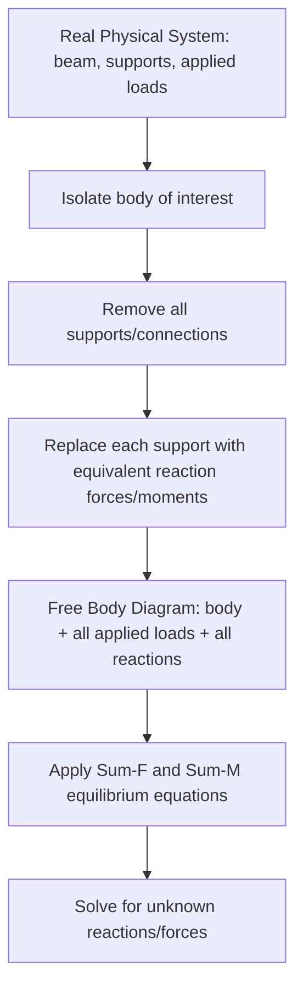

## Equilibrium of Particles and Rigid Bodies

### Definition and Scope

Equilibrium describes the state of a body at rest (static equilibrium) or moving with constant velocity, in which the net effect of all applied forces and moments is zero. Statics is, in essence, the study of equilibrium conditions and their application to determine unknown forces, reactions, and internal member loads in structures and mechanical systems. The topic divides naturally into two conceptually distinct cases: **particles** (where all forces are concurrent, so rotational effects do not arise) and **rigid bodies** (where forces may be non-concurrent, requiring both force and moment balance).

### Equilibrium of a Particle

A **particle** in mechanics is an idealization where the body's physical size and shape are neglected, and all forces acting on it are treated as concurrent (passing through a single point). This idealization is valid whenever rotational tendency need not be considered — for example, analyzing forces at a single joint of a truss or the forces acting at a knot where multiple cables meet.

**Condition of Equilibrium**

For a particle to be in equilibrium, the vector sum of all forces acting on it must equal zero:

$$\sum \vec{F} = 0$$

In component form (2D):

$$\sum F_x = 0, \quad \sum F_y = 0$$

In component form (3D):

$$\sum F_x = 0, \quad \sum F_y = 0, \quad \sum F_z = 0$$

**Key Points:**

- These represent 2 independent scalar equations in 2D (or 3 in 3D), meaning a maximum of 2 (or 3) unknowns can be solved for at a single particle/joint in a single equilibrium analysis.
- This is the fundamental basis of the **method of joints** in truss analysis (see Analysis of Structures topic), where each joint is treated as a particle in equilibrium.

**Worked Example: Two-Cable Support**

A weight $W = 500$ N hangs from a point supported by two cables: cable $AB$ at $30°$ from horizontal and cable $AC$ at $60°$ from horizontal, on opposite sides of the load point.

Free body diagram at the load point gives:

$$\sum F_x = 0: \quad -T_{AB}\cos(30°) + T_{AC}\cos(60°) = 0$$

$$\sum F_y = 0: \quad T_{AB}\sin(30°) + T_{AC}\sin(60°) - 500 = 0$$

From the first equation: $T_{AC} = T_{AB}\dfrac{\cos(30°)}{\cos(60°)} = T_{AB} \times 1.732$

Substituting into the second equation:

$$T_{AB}(0.5) + (1.732 \, T_{AB})(0.866) = 500$$

$$0.5\,T_{AB} + 1.5\,T_{AB} = 500 \implies 2.0\,T_{AB} = 500$$

$$T_{AB} = 250 \text{ N}, \quad T_{AC} = 433.0 \text{ N}$$

### Equilibrium of a Rigid Body

A **rigid body** retains its physical dimensions and shape (no deformation under load, an idealization valid for statics purposes), meaning applied forces need not be concurrent, and the body can experience rotational tendency in addition to translational tendency. Full equilibrium therefore requires both force and moment balance.

**Conditions of Equilibrium (2D)**

$$\sum F_x = 0, \quad \sum F_y = 0, \quad \sum M_O = 0$$

where $\sum M_O$ is the sum of moments about any chosen point $O$ (the choice of point is arbitrary for a body in true equilibrium, but strategic point selection — typically at an unknown reaction — can eliminate unknowns from the moment equation, simplifying solution).

**Conditions of Equilibrium (3D)**

$$\sum F_x = 0, \quad \sum F_y = 0, \quad \sum F_z = 0$$

$$\sum M_x = 0, \quad \sum M_y = 0, \quad \sum M_z = 0$$

Six independent scalar equations, permitting solution for up to 6 unknowns per rigid body.

**Key Points:**

- Alternative equivalent equation sets exist for 2D equilibrium: two moment equations plus one force equation ($\sum M_A = 0, \sum M_B = 0, \sum F_x = 0$, provided line $AB$ is not perpendicular to the x-axis), or three moment equations about three non-collinear points ($\sum M_A = 0, \sum M_B = 0, \sum M_C = 0$). These alternative sets are mathematically equivalent but can simplify algebra for specific geometries.

### Free Body Diagrams (FBDs)

The essential first step for any equilibrium problem: isolating the body of interest and replacing all physical connections/contacts/supports with their equivalent reaction forces and moments.

**Standard Support/Reaction Conventions (2D)**

| Support Type | Reactions Provided | Unknowns |
| --- | --- | --- |
| Roller / rocker | Single force perpendicular to the rolling surface | 1 |
| Pin / hinge | Force in two perpendicular directions (magnitude and direction, or $R_x$, $R_y$) | 2 |
| Fixed support | Force in two directions plus a reaction moment | 3 |
| Cable/link (two-force member) | Single force along the cable/link axis | 1 |
| Smooth surface contact | Single force normal to the surface | 1 |

**Key Points:**

- Correctly identifying support type and its corresponding reactions is often the single most common source of error in equilibrium problems; a pin connection resists translation in any direction but not rotation, while a fixed/built-in support resists both translation and rotation.
- **Two-force members** (members loaded only at exactly two points, with no other loads along their length) carry force purely along the line connecting those two points — a critical simplification exploited extensively in truss analysis and frame/machine analysis.

### Illustration: Free Body Diagram Concept

### Statical Determinacy

Before attempting to solve an equilibrium problem, the number of unknowns must be compared against the number of independent equilibrium equations available:

$$r = \text{number of unknown reaction components}, \quad e = \text{number of independent equilibrium equations (3 for 2D rigid body, 6 for 3D)}$$

- If $r = e$: the body is **statically determinate** — all unknowns can be solved using equilibrium equations alone.
- If $r > e$: the body is **statically indeterminate** — equilibrium equations alone are insufficient; additional compatibility (deformation-based) equations are required, which falls outside the scope of statics and into mechanics of materials/structural analysis.
- If $r < e$: the body is **partially constrained** or unstable — insufficient reactions exist to maintain equilibrium under general loading, and the structure is not stable as configured.

**Key Points:**

- A common related check is **improper constraint**, where $r = e$ numerically but the reactions are arranged such that they cannot resist certain loading directions (e.g., all reaction lines of action are parallel, or all reactions pass through a single common point) — in these cases the structure is unstable despite having the "correct" number of reactions.

### Worked Example: Simply Supported Beam

A simply supported beam, span $L = 6$ m, with a pin support at $A$ (left end) and a roller support at $B$ (right end), carries a point load $P = 10$ kN at $4$ m from $A$.

**Free Body Diagram**: Reactions $A_x$, $A_y$ at the pin, $B_y$ at the roller (roller resists only vertical, assuming a horizontal beam on a vertical-reaction roller).

$$\sum F_x = 0: \quad A_x = 0 \quad (\text{no horizontal applied loads})$$

$$\sum M_A = 0: \quad -P(4) + B_y(6) = 0 \implies B_y = \frac{10 \times 4}{6} = 6.67 \text{ kN}$$

$$\sum F_y = 0: \quad A_y + B_y - P = 0 \implies A_y = 10 - 6.67 = 3.33 \text{ kN}$$

**Verification** (using a second moment equation, about point $B$, as a check):

$$\sum M_B = 0: \quad -A_y(6) + P(2) = 0 \implies A_y = \frac{10 \times 2}{6} = 3.33 \text{ kN} \checkmark$$

The consistent result across both moment-equation approaches confirms the solution.

### Worked Example: 3D Equilibrium — Plate Supported by Three Cables

[Illustrative structure of problem type, not full numeric solution]: A horizontal rigid plate is supported by three vertical cables at known plan coordinates, with a known applied load (force and/or moment) acting on the plate. Because cable tensions are unknowns acting only in the vertical ($z$) direction at three known $(x,y)$ locations, the problem is solved using:

$$\sum F_z = 0: \quad T_1 + T_2 + T_3 - W = 0$$

$$\sum M_x = 0: \quad \text{(moments of cable tensions and load about the x-axis)} = 0$$

$$\sum M_y = 0: \quad \text{(moments of cable tensions and load about the y-axis)} = 0$$

**Key Points:** This configuration (three parallel, non-concurrent, non-collinear vertical reactions) is a classic example of a determinate 3D support system for out-of-plane loading, since 3 unknowns ($T_1, T_2, T_3$) match exactly the 3 independent equilibrium equations relevant to this specific loading case ($\sum F_z$, $\sum M_x$, $\sum M_y$) — the remaining three global equilibrium equations ($\sum F_x, \sum F_y, \sum M_z$) are automatically satisfied since all reactions and the load are purely vertical with no in-plane components.

### Two- and Three-Force Members

**Two-force member**: A rigid body acted upon by forces at exactly two points only (no moments, no distributed load). Equilibrium requires the two forces be equal in magnitude, opposite in direction, and collinear along the line connecting the two points of application — regardless of the member's actual physical shape.

**Three-force member**: A rigid body acted upon by forces at exactly three points. For equilibrium, the three forces must either be **concurrent** (all lines of action intersect at a single common point) or **parallel** — a powerful graphical/geometric solution technique for certain frame and machine problems, often faster than writing out full algebraic equilibrium equations.

**Key Points:** Recognizing two-force and three-force members is a critical simplification technique in the analysis of frames and machines (structures containing multi-force members connected by pins), allowing significant reduction in the complexity of the required free body diagrams and equations compared to treating every member with generic, undetermined force directions at each connection.

### Illustration: Two-Force Member Principle

<svg xmlns="http://www.w3.org/2000/svg" viewBox="0 0 500 200">
<title>Two-Force Member Equilibrium (svg_diagram)</title>
<rect width="500" height="200" fill="#ffffff" />
<line x1="80" y1="100" x2="420" y2="60" stroke="#555" stroke-width="10" stroke-linecap="round" />
<circle cx="80" cy="100" r="8" fill="#333" />
<circle cx="420" cy="60" r="8" fill="#333" />
<line x1="80" y1="100" x2="30" y2="100" stroke="#c81e1e" stroke-width="3" />
<polygon points="30,100 48,94 48,106" fill="#c81e1e" />
<line x1="420" y1="60" x2="470" y2="60" stroke="#c81e1e" stroke-width="3" />
<polygon points="470,60 452,54 452,66" fill="#c81e1e" />
<text x="200" y="130" fill="#333" font-size="15" font-family="sans-serif">Forces equal, opposite, and collinear along line joining the two pins</text>
</svg>

### Related Topics

- Force Systems and Vector Operations
- Moments of a Force and the Varignon Theorem
- Equivalent Force-Couple Systems
- Analysis of Structures: Trusses, Frames, and Machines
- Friction (Static and Kinetic) in Equilibrium Problems
- Centroids and Centers of Gravity
- Statically Indeterminate Structures (introductory concept)