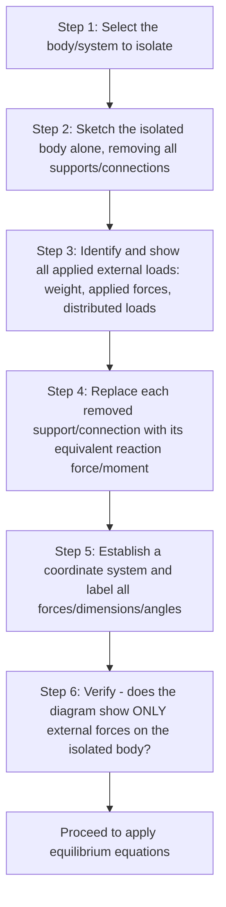

## Free Body Diagrams

### Definition and Purpose

A Free Body Diagram (FBD) is a simplified diagrammatic representation of an isolated body (or a chosen isolated system of bodies) showing every external force and moment acting on it, with all physical supports, connections, and contacts removed and replaced by their statically equivalent reaction forces/moments. The FBD is the indispensable first step in essentially every statics (and later, dynamics and mechanics of materials) problem — it translates a physical situation into a form directly amenable to the equilibrium equations $\sum F = 0$ and $\sum M = 0$.

**Key Points:**

- The FBD is not merely a sketch — it is the complete statement of the mechanics problem. Errors in the FBD (a missing force, an incorrectly assumed reaction direction, or a misidentified support type) propagate directly into an incorrect solution, regardless of how correctly the subsequent algebra is performed.
- Constructing an accurate FBD requires clearly defining the **system boundary** — precisely which body or group of bodies is being isolated — since this choice determines which forces are "external" (shown on the FBD) versus "internal" (not shown, as they act between components within the isolated system and cancel by Newton's third law).

### Systematic Procedure for Constructing an FBD

**Step-by-step guidance:**

1. **Select the isolation boundary.** Decide precisely which body, or connected assembly of bodies, is being analyzed. This choice is problem-dependent and strategic — isolating the whole structure first often reveals overall (support) reactions, while isolating an individual member or joint later reveals internal member forces.
2. **Sketch the body in isolation**, removing it conceptually from everything it touches or connects to (supports, other bodies, the ground, cables, etc.). The sketch need not be to scale but should preserve the correct relative geometry (angles, points of load application).
3. **Show all applied loads**: the body's own weight (acting at its center of gravity, unless explicitly stated to be neglected), any externally applied point loads, distributed loads, or applied moments/torques given in the problem statement.
4. **Replace every removed support or connection with its equivalent reaction(s)**, following standard support conventions (see table below). This is the step most prone to error — each support type provides a specific, limited set of reaction types corresponding to the motions it actually restrains.
5. **Label the diagram completely**: assign symbols to all unknown reactions, note all known applied force magnitudes/directions, and mark all relevant dimensions and angles needed for subsequent moment calculations.
6. **Verify completeness**: confirm no forces have been omitted (a common oversight is neglecting self-weight or an applied moment) and no internal forces have been erroneously included.

### Standard Support and Connection Reactions (2D)

| Support/Connection Type | Physical Restraint | Reactions Shown on FBD | Number of Unknowns |
| --- | --- | --- | --- |
| Roller / rocker / smooth surface | Prevents motion perpendicular to the surface only | Single force, perpendicular to the contact surface | 1 |
| Pin / hinge | Prevents translation in any direction; allows free rotation | Two force components (or one force of unknown magnitude and direction) | 2 |
| Fixed / built-in support | Prevents translation and rotation entirely | Two force components plus one reaction moment | 3 |
| Cable / cord / rope | Can only pull (tension), never push, along its own axis | Single force directed along the cable, away from the body (tension) | 1 |
| Link / two-force member | Carries force only along the line connecting its two end connections | Single force along the member's axis (tension or compression) | 1 |
| Smooth pin in a slot | Prevents translation perpendicular to the slot only | Single force perpendicular to the slot direction | 1 |
| Collar on smooth rod (frictionless) | Prevents translation perpendicular to the rod; may resist moment if collar is rigidly fixed to a body extending beyond the rod | Force perpendicular to rod (plus moment, if applicable to the specific collar configuration) | 1 (or 2 if moment-resisting) |

**Key Points:**

- A support can only exert a reaction in a direction it actually restrains — a roller cannot resist motion along the rolling surface, so no friction/tangential reaction is shown for an idealized frictionless roller.
- Cables and ropes are unilateral constraints: they can only be shown pulling (tension) on the FBD, never pushing, since a flexible cable cannot support compressive load — if analysis yields a negative tension, this signals the physical assumption (that the cable remains taut) has been violated, not simply a sign convention artifact.

### Self-Weight and Distributed Loads on FBDs

**Key Points:**

- A body's own weight $W = mg$ acts as a single concentrated force at the body's **center of gravity**, directed vertically downward — this must be included on the FBD unless the problem explicitly states the body is weightless or that self-weight is to be neglected (common for idealized truss members or lightweight elements in simplified textbook problems).
- Distributed loads (e.g., a uniform load per unit length $w$ along a beam) are typically replaced, for the purposes of computing overall support reactions, by an equivalent concentrated resultant force equal to the total load (area under the load diagram), acting through the centroid of the distributed load's geometric shape (see Centroids and Centers of Gravity). This equivalence is valid for determining external reactions but the original distributed load must be retained (not replaced) when subsequently computing internal shear and moment diagrams along the member.

### Sign Convention and Assumed Directions

**Key Points:**

- When a reaction's actual direction is not obvious from the physical situation, it is standard practice to **assume a direction** (commonly positive along a chosen coordinate axis) and let the equilibrium equations' solution determine the correct sense.
- A **negative** numerical result for an assumed reaction simply indicates the actual direction is opposite to the one assumed on the FBD — this is a valid, expected outcome of the method and does not represent an error, provided the assumed direction was clearly and consistently defined at the outset.

### FBDs of Systems vs. FBDs of Individual Members

A critical strategic decision in more complex structural problems (frames, machines, multi-body systems) is choosing the appropriate scope for the FBD:

**Key Points:**

- **Whole-system FBD**: Isolates the entire structure/assembly, showing only external applied loads and external support reactions. Internal forces between connected members (e.g., pin forces between two frame members) do not appear, since they are internal to the isolated system and occur in equal-and-opposite pairs that cancel when the whole system is considered together. This FBD is typically solved first to determine unknown external support reactions, when statically possible.
- **Member/component FBD**: Isolates a single member or sub-component from within a larger assembly. Forces at each connection point where the member was attached to the rest of the structure (previously internal, now external to this smaller isolated body) must now be shown explicitly, including at pin connections between members — and by Newton's third law, the force one member exerts on another must be drawn equal and opposite to the force that member exerts back.
- This progression — whole-system FBD first, then successive member FBDs — is the standard solution strategy for frames and machines, and mirrors the method-of-joints/method-of-sections strategic choice in truss analysis.

### Illustration: Whole-System vs. Member FBD Distinction

<svg xmlns="http://www.w3.org/2000/svg" viewBox="0 0 560 260">
<title>Whole-System FBD vs Individual Member FBD (svg_diagram)</title>
<rect width="560" height="260" fill="#ffffff" />
<text x="20" y="25" fill="#333" font-size="15" font-family="sans-serif" font-weight="bold">Whole-System FBD</text>
<line x1="40" y1="120" x2="160" y2="70" stroke="#555" stroke-width="8" stroke-linecap="round" />
<line x1="160" y1="70" x2="240" y2="140" stroke="#555" stroke-width="8" stroke-linecap="round" />
<circle cx="40" cy="120" r="6" fill="#333" />
<circle cx="240" cy="140" r="6" fill="#333" />
<line x1="40" y1="120" x2="40" y2="170" stroke="#c81e1e" stroke-width="2" />
<polygon points="40,170 34,155 46,155" fill="#c81e1e" />
<text x="10" y="190" fill="#c81e1e" font-size="12" font-family="sans-serif">Support reaction (external only)</text>
<line x1="280" y1="130" x2="280" y2="130" stroke="none" />
<text x="330" y="25" fill="#333" font-size="15" font-family="sans-serif" font-weight="bold">Individual Member FBD</text>
<line x1="360" y1="120" x2="480" y2="70" stroke="#555" stroke-width="8" stroke-linecap="round" />
<circle cx="360" cy="120" r="6" fill="#333" />
<circle cx="480" cy="70" r="6" fill="#333" />
<line x1="480" y1="70" x2="520" y2="40" stroke="#1a56db" stroke-width="2" />
<polygon points="520,40 502,44 510,54" fill="#1a56db" />
<text x="440" y="35" fill="#1a56db" font-size="12" font-family="sans-serif">Pin force from other member (now external)</text>
<line x1="360" y1="120" x2="360" y2="170" stroke="#c81e1e" stroke-width="2" />
<polygon points="360,170 354,155 366,155" fill="#c81e1e" />
</svg>

### Worked Example: FBD Construction for an L-Shaped Bracket

An L-shaped bracket is bolted to a wall via a fixed connection at point $A$, and carries a vertical downward force $P$ applied at its free end, a horizontal distance $d$ from $A$.

**Constructing the FBD:**

1. Isolate the bracket from the wall.
2. The bolted connection at $A$ is a fixed support (prevents both translation and rotation) → show reactions $A_x$, $A_y$, and reaction moment $M_A$.
3. Show the applied load $P$ at its correct location, a distance $d$ from $A$, directed downward.
4. Include the bracket's self-weight $W_{bracket}$ at its own center of gravity, if given/non-negligible.

Resulting equilibrium equations (with the bracket assumed weightless for simplicity):

$$\sum F_x = 0: \quad A_x = 0$$

$$\sum F_y = 0: \quad A_y - P = 0 \implies A_y = P$$

$$\sum M_A = 0: \quad M_A - P \cdot d = 0 \implies M_A = P \cdot d$$

**Key Points:** This example illustrates why a fixed support requires three reaction unknowns: it must resist the applied vertical force ($A_y$), have zero net horizontal reaction needed here ($A_x = 0$, though it must still be included on the FBD as an unknown until solved), and resist the tendency of the applied offset load to rotate the bracket about $A$ (reaction moment $M_A$).

### Common Errors in FBD Construction

**Key Points:**

- **Omitting self-weight** when it is not explicitly negligible, particularly for heavier structural members in problems that focus attention on applied loads.
- **Showing internal forces** on a whole-system FBD (forces between members that are internal to the isolated system and should cancel, not appear).
- **Incorrect reaction type for the support** — most commonly, treating a pin connection as if it were a fixed support (incorrectly adding a reaction moment where none exists) or vice versa.
- **Inconsistent or missing direction assumptions** — failing to clearly commit to an assumed positive direction for each unknown reaction before writing equilibrium equations, which leads to sign errors during solution and interpretation.
- **Neglecting that cables/ropes can only pull**, potentially showing a cable reaction in a compressive (pushing) sense, which is physically invalid for a flexible cable.

### Related Topics

- Force Systems and Vector Operations
- Equilibrium of Particles and Rigid Bodies
- Moments of a Force and the Varignon Theorem
- Analysis of Structures: Trusses, Frames, and Machines
- Centroids and Centers of Gravity
- Shear Force and Bending Moment Diagrams (Mechanics of Materials)
- Statical Determinacy and Stability of Structures